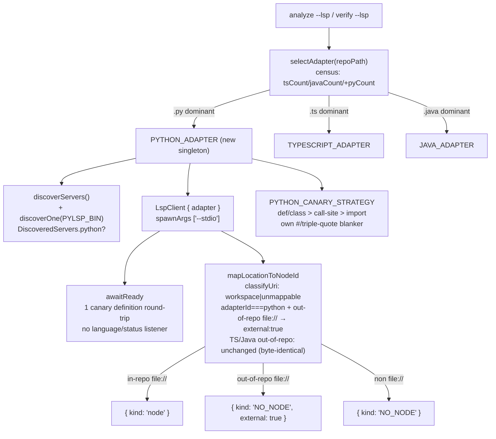
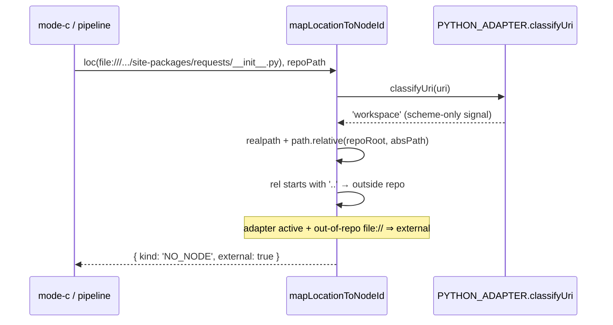

# ADR-001: Python/pylsp support in the LSP-augmentation stack (#159 P5)

**Status**: Proposed
**Date**: 2026-06-14
**Deciders**: arch (autonomous synthesis), repository maintainers
**Related**: `docs/designs/159-p32-java-jdtls.md` (Java slice — the direct precedent), `docs/designs/159-lsp-readonly-foundation.md`

## Context

The LSP-augmentation stack shipped TS-first, then grew a Java/`jdtls` adapter (P3.2). Both languages route through one `LanguageAdapter` value-object selected once per run by `selectAdapter()` (extension census) and threaded through four DI seams: `discoverServers`, `LspClient`, the canary sampler, and `mapLocationToNodeId`. GitNexus already indexes Python via tree-sitter, so heuristic Python CALLS exist in the graph — but they never receive the LSP confidence promotion (0.70 → 0.90) or Mode-C measurement. P5 closes that gap by adding `PYTHON_ADAPTER` + `PYTHON_CANARY_STRATEGY` + three constant widenings.

`pylsp` differs from both prior servers in ways that are forces on this design:

1. **Fast startup, no JVM.** Unlike `jdtls` (which needs a `-data` dir, a JDK, and emits a `language/status`/`ServiceReady` notification after slow background indexing — the #172 race), `pylsp` starts in <1s, needs no metadata dir, and emits no readiness notification. Spawn args are `['--stdio']` only.
2. **No special URI scheme for external defs.** `jdtls` returns `jdt://` for decompiled stdlib/jar definitions — a scheme the adapter can pattern-match. Python stdlib and `site-packages` definitions land as ordinary `file://` URIs that are byte-identical in shape to workspace files; they differ *only* by their absolute path falling outside the workspace root. There is no scheme to key off.
3. **Comment/string syntax the shared canary blanker does not handle.** `blankUnsafeLines()` tracks `/* */`, `//`, and backtick template literals. Python uses `#` line comments and `"""`/`'''` triple-quoted strings — none of which the shared blanker recognises. Java safely *reuses* `blankUnsafeLines` because Java shares C-style comments; Python cannot.

Force #2 is the load-bearing constraint. The EARS spec requires that out-of-workspace Python defs bucket as **external-refusal** — `{ kind: 'NO_NODE', external: true }` — so the Mode-C verifier can distinguish "stdlib/site-packages symbol we correctly refuse" from "workspace symbol we haven't indexed yet" (a recall miss). The `external: true` flag is what separates those two buckets in the measurement funnel.

## Decision

Add `PYTHON_ADAPTER` as a **module-level singleton constant** (NOT a factory), mirroring `TYPESCRIPT_ADAPTER` and `JAVA_ADAPTER`. Close the external-refusal gap by **teaching the location-mapper's existing containment guard to set `external: true`**, NOT by changing the `LanguageAdapter.classifyUri` signature.

Concretely:

- **`classifyUri` stays `(uri: string) => 'workspace' | 'external' | 'unmappable'` — unchanged.** `PYTHON_ADAPTER.classifyUri` returns `'workspace'` for every `file://` URI (it cannot see the workspace root, and per the existing interface contract `'workspace'` is *explicitly a scheme-only signal* — callers already perform containment), and `'unmappable'` for any non-`file://` scheme.
- **The out-of-repo `external: true` verdict moves into `location-mapper.ts`**, where `resolvedDeps.repoPath` is *already in scope* and the realpath + `path.relative` containment check *already exists* (lines ~451–510). Today that guard returns bare `{ kind: 'NO_NODE' }` when a `file://` path resolves outside the repo. We extend it so that, **when `adapterId === 'python'` and the path resolves outside the repo, it returns `{ kind: 'NO_NODE', external: true }`** — the out-of-repo `file://` is by definition stdlib/site-packages/venv, i.e. an external refusal. The TS and Java paths are byte-identical: `pipeline.ts:868` binds `classifyUri` for every adapter (TS/Java included), so gating on `classifyUri`-presence alone would set `external:true` for out-of-repo TS/Java defs and break their I-1 byte-identical goldens. The gate MUST be adapter identity, not adapter presence. The KD-3 block for TS/Java is unmodified (ruling #1, BLOCKER). Known limitation: `jdt://` URIs from jdtls are already routed to `'unmappable'` by `JAVA_ADAPTER.classifyUri`; the Python-specific `file://`-outside-repo case is the only path that reaches the new flag. Guardrail: do not relocate this containment check into `classifyUri` — that would re-introduce the interface-widening of Option B (R2-13).
- **`awaitReady` does one canary `textDocument/definition` round-trip** (open file via `didOpen` first, as `jdtls` requires), capped at a short deadline (~10s). No `language/status` listener is registered (pylsp emits none). This is the Java backstop "path B" with the notification-wait stripped out.
- **`PYTHON_CANARY_STRATEGY` ships its own Python comment/string pre-pass** (blank `#` line comments and `"""`/`'''` triple-quoted regions) instead of reusing `blankUnsafeLines`. Priority order mirrors Java verbatim: `def`/`class` declaration name FIRST, call-site identifier SECOND, `import`/`from x import` LAST-RESORT (pylsp, like jdtls, returns `[]` for definition requests on import tokens).
- **Three additive constant widenings:** `LanguageAdapter.id` union `+'python'`; `censusExtensions` return shape `+pyCount` (internal); `DiscoveredServers` `+python?` (optional key, expand-contract). `SKIP_DIRS` and `EXCLUDED_DIRS` both gain Python venv/package dirs.

## Options Considered

### The `external:true` seam (the one load-bearing decision)

| Option | Pros | Cons |
|--------|------|------|
| **A. classifyUri returns `'workspace'` for all `file://`, rely on existing guard untouched** | Zero new code; smallest diff | **FAILS the EARS spec** — the existing guard returns `{ kind: 'NO_NODE' }` with no `external` flag. Mode-C cannot distinguish external-refusal from recall-miss. Non-conformant. |
| **B (brief's pick). Widen `classifyUri(uri, ctx?: {workspaceRoot})` interface-wide; PYTHON_ADAPTER does its own containment** | external:true is set inside the adapter | Touches the `LanguageAdapter` interface + `MapperDeps.classifyUri` type + all 3 wire sites; **duplicates** realpath/relative logic the mapper already owns; mode-c-verifier wire site (`mode-c-verifier.ts:755`) passes NO `repoPath` in its deps bag, so it would also need a workspaceRoot plumbed in — a second, separate change. Two implementations of "is this path in the repo" drift apart. |
| **C (CHOSEN). classifyUri unchanged; the mapper's existing containment guard sets `external:true` for out-of-repo `file://` when `adapterId === 'python'`** | Single source of truth for containment (it already exists, is realpath/symlink-safe, and is tested); `LanguageAdapter` interface untouched; PYTHON_ADAPTER stays a singleton constant like its siblings; reuses `resolvedDeps.repoPath` already in scope at the mapper; TS/Java bytes identical (ruling #1) | The mapper gains ~3 lines of conditional in its out-of-repo branch. `MapperDeps` gains an optional `adapterId?` field (2 wire sites). mode-c-verifier's deps bag must carry `adapterId` (BLOCKER — verified in R2-5). |

**Why C over B:** B duplicates a containment check the mapper already performs, in a second location, against a *different* deps bag that lacks `repoPath`. C threads the verdict through the one guard that already realpath-resolves both the repo root and the candidate path. Data gravity: the workspace-root containment knowledge already lives in the mapper; move the small flag-setting to where the data is, don't move the data (workspaceRoot) into a new interface parameter on every adapter. C is also strictly *more* reversible — it adds an optional flag to an existing branch; B is an interface change that all three adapters and all wire sites must absorb.

### Adapter shape: singleton vs factory

| Option | Pros | Cons |
|--------|------|------|
| **Factory `createPythonAdapter(workspaceRoot)`** (scout's lean under Option B) | classifyUri can close over workspaceRoot | Only needed *if* Option B is chosen. Breaks the singleton symmetry with TS/Java; `selectAdapter` must construct per-run; every test constructs instead of importing a constant. |
| **Singleton constant `PYTHON_ADAPTER`** (CHOSEN, enabled by Option C) | Symmetric with `TYPESCRIPT_ADAPTER`/`JAVA_ADAPTER`; `selectAdapter` returns it directly; tests import it | none under Option C |

Choosing seam-Option-C **dissolves** the factory requirement entirely. This is the key simplification over the brief: the brief accepted a factory/interface-change because it assumed the adapter had to own containment. It does not — the mapper already does.

### awaitReady strategy

| Option | Pros | Cons |
|--------|------|------|
| No-op return `true` (like TS) | Simplest | Skips responsiveness verification; EARS requires one canary round-trip |
| `language/status` wait (like Java) | Proven path | pylsp emits no such notification — would always hit the deadline backstop, wasting ~the full deadline every run |
| **One canary definition round-trip, short deadline, no notification listener (CHOSEN)** | Verifies responsiveness; fast; matches EARS | Slightly more than a no-op |

## Consequences

**Positive**
- Python CALLS get the 0.70 → 0.90 LSP confidence promotion and Mode-C measurement, same as TS/Java.
- `LanguageAdapter` interface is untouched — the value-object contract that all three languages share stays stable. Future Go/Ruby slices follow the same singleton pattern.
- The containment-guard enhancement is language-neutral: it makes *any* future adapter's out-of-repo `file://` defs bucket correctly without further interface work.

**Negative / debt introduced**
- A second comment-blanking implementation now exists (the TS/Java `blankUnsafeLines` + a Python-specific pre-pass). They are not unified. Accepted: Python's comment/string syntax genuinely differs; a unified multi-language blanker is over-abstraction for two call sites. Flagged for a future consolidation only if a third comment dialect appears.
- The location-mapper's out-of-repo branch now has a conditional gated on `adapterId === 'python'`. This couples the mapper's external-flag behaviour to adapter identity, not adapter presence — the distinction matters because TS/Java also supply `classifyUri` (verified: `pipeline.ts:868`). Documented inline; the guard MUST NOT be refactored to test `classifyUri` presence (R2-13 guardrail).

**Risks mitigated**
- The #172 "answers `initialize` but isn't ready" race does not apply to pylsp (no background indexing), but the canary round-trip in `awaitReady` still guards against a server that initialised but cannot resolve.
- Census inflation from a local `.venv`/`site-packages` is mitigated by extending both `SKIP_DIRS` (census) and `EXCLUDED_DIRS` (canary walk) — two *separate* sets that must both be updated (the canary set currently has neither `__pycache__` nor `.venv`).

## Fitness Functions

- **Byte-identical TS/Java funnels:** existing `language-adapter.test.ts` golden assertions for `selectAdapter` returning `TYPESCRIPT_ADAPTER`/`JAVA_ADAPTER` stay green with zero edits; TS/Java integration funnels produce zero diff vs pre-change baseline. (Regression alarm if they don't.)
- **External-refusal correctness:** integration test asserts a real pylsp site-packages/stdlib `file://` URI maps through `mapLocationToNodeId` to `{ kind: 'NO_NODE', external: true }`, and a workspace URI maps to a node — mis-map count is 0.
- **Canary priority lock:** unit test asserts a `def`-bearing file samples the `def` name (not an import line), and an import-only file falls back to the import token — mirroring the Java canary regression lock.
- **Census isolation:** unit test asserts `.py` files under `site-packages`/`.tox`/`eggs`/`.eggs`/`dist-packages` are NOT counted toward `pyCount`.
- **End-to-end signal:** `analyze --lsp` against crawl4ai yields confirm+correct augmentation count > 0 and external-refusal count > 0. (If either is 0, the adapter is wired but inert — alarm.)

## C4 Component View — where Python plugs in

## Sequence — external-refusal path (the load-bearing flow)

