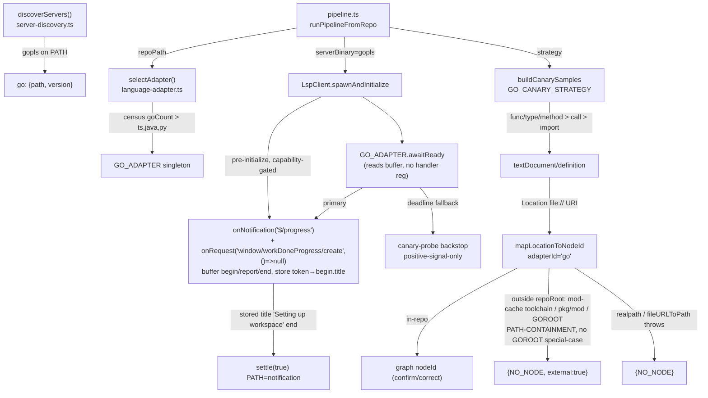

# ADR-002: Go (gopls) LSP Adapter for Mode-A Augmentation

**Status**: Accepted — WI-SPIKE run against gopls v0.22.0 + gin fixture; wire contract frozen; R2-1/R2-2 BLOCKERs resolved
**Date**: 2026-06-14
**Deciders**: arch (autonomous synthesis, 159-p4-go-gopls)
**Supersedes**: none · **Related**: ADR-001 (Python/pylsp adapter — the structural template this ADR mirrors)

## Context

GitNexus's LSP-augmentation stack (issue #159) adds language servers behind a single `LanguageAdapter` value-object that is selected once per run and threaded through every downstream seam: census → discovery → spawn → `awaitReady` → canary Mode-A → location mapping. P1–P3 shipped TypeScript and Java; P5 shipped Python (ADR-001). **P4 adds Go via `gopls`.**

The forces at play:

1. **Zero-regression mandate.** TS, Java, and Python funnels must stay byte-identical to their pre-P4 baselines — three golden suites and three discovery suites must pass unchanged. Any change that is not strictly additive or a provably-invisible extension is out of bounds.
2. **gopls is a background-loading server.** Unlike `tsserver` (ready immediately) and like `jdtls` (loads a workspace before it can answer), gopls loads `go/packages` on startup and emits `$/progress` (`begin`/`report`/`end`) notifications during the load — the readiness signal is the generic `$/progress` notification, NOT `window/workDoneProgress` (which is only the server→client `create` REQUEST). Firing `textDocument/definition` before the load completes returns empty results — the **#172 class of bug**. The readiness gate is the single highest-correctness-risk element of P4. **WI-SPIKE confirmed** the workspace-load `begin.value.title = "Setting up workspace"` (stable; the `end` carries an EMPTY title), and that the `begin` and the `create` request arrive at `sinceInitialized = 0ms` — so the handler must be registered **before `initialize`**, not inside `awaitReady`.
3. **Out-of-repo definitions are path-contained, not GOROOT-bound.** gopls resolves `definition` into the dependency cache (`$GOPATH/pkg/mod/...`) and stdlib — but **WI-SPIKE found stdlib resolves to the mod-cache toolchain** (`~/go/pkg/mod/golang.org/toolchain@…/src/...`) when the workspace `go.mod` declares a newer Go (gin: `go 1.25.0`), NOT system GOROOT. All are outside the repo root and must be counted as deliberate external-refusals (`{NO_NODE, external:true}`), exactly as Python's `site-packages` are. **The refusal test is path-containment (`!uri.startsWith(realpath(repoRoot))`), NOT a GOROOT-specific check** — a GOROOT-only check would mis-classify mod-cache stdlib as in-repo.
4. **Three edits are not additive (corrected from one).** `location-mapper.ts` `const isPythonAdapter = adapterId === 'python'` (the sole behavioral branch that must widen to admit Go), PLUS the WI-0 pre-`initialize` `$/progress`/`create` handler seam, PLUS the WI-0 `ClientCapabilities` type authoring + `InitializeParams.capabilities` widening (the `as const` `TS_SERVER_CAPABILITIES` literal `false` rejects the `workDoneProgress:true` override — R2-1). Everything else (union member, optional discovery key, new constants, new singleton, new strategy) is purely additive.

## Decision

Add a `GO_ADAPTER` singleton plus a `GO_CANARY_STRATEGY`, register `gopls` discovery, add the WI-0 `ClientCapabilities` + pre-`initialize` handler seam, and **extend (not abstract)** the single external-refusal gate to admit `adapterId === 'go'`. Three edits are non-additive (gate rename, WI-0 handler seam, WI-0 capabilities-type widening); every other change is additive. Concretely:

- **Selection**: strict dominance — `GO_ADAPTER` wins only when `goCount > tsCount && goCount > javaCount && goCount > pyCount`. Ties revert to TypeScript (the safest existing adapter). The Python branch is widened to `pyCount > goCount` so a go==py tie does not silently resolve Python (R2-9). Mirrors Python exactly.
- **Readiness (SPIKE-confirmed, committed)**: `GO_ADAPTER.awaitReady` is a notification-wait on `$/progress` (NOT `language/status`, NOT `window/workDoneProgress`, NOT the Python canary-only pattern). Because the workspace-load `begin` and the `window/workDoneProgress/create` request both arrive at `sinceInitialized = 0ms`, the `onNotification('$/progress')` listener AND the `onRequest('window/workDoneProgress/create', () => null)` responder are registered **pre-`initialize`** in `lsp-client.ts` (WI-0, R2-2), capability-gated, buffering begin/report/end into shared token-correlation state that `awaitReady` READS. It resolves on the `end` of the token whose STORED `begin.value.title === "Setting up workspace"` — the `end` carries an empty title, so the match is read from stored state, never from `end.title`. A hard deadline (`ctx.deadlineMs ?? GOPLS_READY_DEADLINE_MS`, `30_000`) triggers the canary-probe backstop. The timer branch NEVER resolves `true` without a positive probe signal. No first-end-token fallback; no canary-only branch (the spike confirmed a stable title).
- **Capabilities + type widen (R2-1)**: author a `ClientCapabilities` structural type with non-literal members and retype `InitializeParams.capabilities: ClientCapabilities`; the `as const` `TS_SERVER_CAPABILITIES` stays assignable (non-Go byte-identical); `GO_ADAPTER` supplies `{window:{workDoneProgress:true}}`. `tsc`-clean with the override present is a WI-0 acceptance gate.
- **spawnArgs**: `[]` (bare gopls). **SPIKE-CONFIRMED**: `start()`→`initialize` reaches a serving state with empty args (init response +87ms); `['serve']` NOT required. WI-7 keeps a fail-loud assertion as a defensive check.
- **Containment**: extend the `isPythonAdapter` gate to `isExternalRefusalAdapter = adapterId === 'python' || adapterId === 'go'`, keeping the existing realpath + `path.relative` **path-containment** decision — NO GOROOT-specific branch. mod-cache toolchain stdlib, third-party `pkg/mod`, and GOROOT `file://` URIs all → `{NO_NODE, external:true}` uniformly. `realpathSync`/`fileURLToPath` throw → bare `{NO_NODE}` (ruling I-9 — no in/out-of-repo signal means no `external:true` tag).
- **Version**: `gopls --version` (the discovery probe's flag) is rejected by the binary (exit 2, no semver); only `gopls version` subcommand emits the banner. So discovery records `version:'unknown'` (R2-3) — acceptable; the binary is launchable so the funnel proceeds (jdtls slow/odd-version tolerance). No `versionArgs` seam.
- **Canary priority**: `func`/`type`/method declaration names (priority 1) > call-site identifiers (priority 2) > import declarations (last-resort only — gopls returns `[]` for import tokens, the Java/Python lesson). Reuse `blankUnsafeLines` (Go uses `//` and `/* */`; no template literals). Add `vendor` to `EXCLUDED_DIRS`.

## Options Considered

| Option | Pros | Cons |
|--------|------|------|
| **A — Mirror the per-language adapter pattern (CHOSEN)**: new `GO_ADAPTER` + `GO_CANARY_STRATEGY`, extend the one gate, everything else additive | Zero-regression by construction (existing funnels untouched); team already fluent in the pattern (4th application); each change reviewable in isolation; reversible (delete the singleton + 1-line gate revert) | One non-additive line (gate widening); modest duplication across adapter singletons (accepted — see below) |
| **B — Generic "non-TS/Java refusal" predicate**: replace the enumerated gate with `adapterId !== 'typescript' && adapterId !== 'java'` | Future adapters need no gate edit | Changes behavior for *unknown future* adapter ids implicitly (a one-way door — any new adapter silently inherits external-refusal); breaks the explicit-enumeration audit trail ADR-001 established; higher blast radius for a speculative benefit (astronaut architecture) |
| **C — Abstract `awaitReady` into a shared "background-load notification waiter"** parameterized by notification method + token matcher | Removes the jdtls/gopls structural duplication | Premature abstraction over N=2; the matchers differ (`ServiceReady` flat string vs `$/progress` stored-token+title correlation, plus gopls's pre-`initialize` registration + `create`-request answer); refactoring Java's proven `awaitReady` risks its zero-diff golden — violates force #1 for no near-term payoff |

## Decision Rationale (tradeoffs named)

- **A vs B (the gate)**: B trades a one-line future edit for an implicit, irreversible behavior change to every not-yet-written adapter. Per the two-way-door heuristic, the enumerated disjunction keeps the door open: each future adapter explicitly opts into external-refusal on the record. The duplication B removes is one boolean expression — not worth the blast radius. **Chosen A.**
- **A vs C (awaitReady)**: C is the textbook "rule of three" violation — abstracting at N=2 when the two cases differ in their match predicate (`ServiceReady` flat string vs `$/progress` stored-token+title correlation with pre-`initialize` registration and a `create`-request answer). Touching `JAVA_ADAPTER.awaitReady` to extract a base also jeopardizes the Java golden (force #1). The duplicated `settle()`/timer/`dispose()` skeleton is ~20 lines copied verbatim — cheap, and each adapter's readiness logic stays independently debuggable at 3am. **Chosen A; revisit C at P6+ if a 3rd notification-wait adapter lands.**
- **Strict dominance vs ties-to-Go**: Go repos frequently carry generated `.js` shims (protobuf, wasm); a `>=` rule would mis-select on a Go repo with an equal `.js` count. Strict `>` with ties-to-TS is the conservative, already-proven Python rule.

## Consequences

**Positive**:
- Go repos (starting with gin) gain Mode-A definition augmentation with correct stdlib/module-cache refusal accounting.
- The 4th application of the adapter pattern validates it as the stable extension seam for #159 P6+ languages.
- Reversible: the entire feature is one singleton + one strategy + one 5-site gate rename; revert is mechanical.

**Negative**:
- Adapter-singleton duplication grows (4th copy of the `spawnArgs:[] / initializationOptions:{} / classifyUri` shape). Accepted as the cost of zero-regression isolation; flagged for a possible P6 consolidation once the pattern is N≥5 and fully stable.
- WI-0 reclassifies `lsp-client.ts` as a d1 blast-radius file and introduces the first server→client `onRequest` handler and the first pre-`initialize` notification listener in that file. Contained by capability-gating (non-Go adapters register nothing) and the R2-7 direct zero-diff/no-handler assertion.

**Risks mitigated**:
- **#172 (premature definition)**: the pre-`initialize` `$/progress` notification-wait + positive-probe-only resolution eliminates the empty-result-on-cold-workspace failure that a no-op, a canary-only `awaitReady`, or a too-late (inside-`awaitReady`) handler registration would reintroduce. **WI-SPIKE confirmed the `begin`/`create` arrive at `sinceInitialized = 0ms`, making the pre-`initialize` registration load-bearing.** The token-title match was resolved empirically (`"Setting up workspace"`, stable) — no runtime-shaped fallback remains.
- **Type-unsoundness (R2-1)**: authoring `ClientCapabilities` and widening `InitializeParams.capabilities` lets the `workDoneProgress:true` override `tsc` while keeping `TS_SERVER_CAPABILITIES` (`as const`) assignable — TS/Java/Python payloads byte-identical. `tsc`-clean is a WI-0 gate, not deferred to WI-V.
- **Wrong-node guessing**: the path-containment external-refusal gate ensures mod-cache/GOROOT resolutions refuse cleanly (`external:true`) instead of mapping to a bogus in-repo node — and a GOROOT-only check (which would mis-classify gin's mod-cache toolchain stdlib) is explicitly avoided.
- **Vendor inflation**: adding `vendor` to `EXCLUDED_DIRS` prevents the canary sampler from probing thousands of vendored `.go` files instead of workspace source.

## Fitness Functions

1. **Zero-regression invariant** (CI gate): TS golden, Java golden, Python pylsp real-binary suite — all pass with zero diffs vs pre-P4 baseline on every P4 commit. If any diffs, the additive-only contract is broken.
2. **Readiness-before-definition** (unit + integration): `awaitReady` resolves `true` only after the `$/progress` end token for the STORED-title-matched workspace-load token OR a positive canary probe — asserted by the FakeMessageConnection test (the `$/progress`/`create` handlers MUST be registered pre-`initialize`; a `begin` delivered before `awaitReady` still resolves on the matching `end`) and the real-binary ordering assertion (PATH = notification, not backstop).
3. **External-refusal accounting** (gin E2E): `analyze --lsp --force` on gin yields non-zero Go confirm+correct, mod-cache toolchain/`pkg/mod`/GOROOT URIs counted as external-refusals via path-containment (non-zero for BOTH stdlib-toolchain AND third-party pkg/mod — R2-8 vacuous-pass guard), and **mis-map count === 0**. A non-zero mis-map count means the containment gate regressed.
4. **Real-binary AC gate** (mandatory, not a skip-stub): the gopls integration test exercises discovery→spawn→awaitReady(load-complete)→definition→external-refusal when gopls is present; exits skip-clean only when gopls is absent.
5. **Selection strict-dominance** (unit): the three acceptance cases (10/2/0 → Go; 5/5 → TS; 5/3/6 → Java) lock the dominance rule.

## Diagram — Container/Component (C4 L3, Go-adapter dataflow)



## Sequence — awaitReady readiness gate

```mermaid
sequenceDiagram
    participant C as LspClient
    participant B as pre-init $/progress buffer (WI-0)
    participant A as GO_ADAPTER.awaitReady
    participant G as gopls
    Note over C,B: WI-0: register onNotification('$/progress') + onRequest('window/workDoneProgress/create',()=>null)<br/>BEFORE sendRequest('initialize'), capability-gated
    C->>G: initialize / initialized
    G-->>C: window/workDoneProgress/create {token}
    C->>G: response null
    G-->>B: $/progress begin {token, title:'Setting up workspace'}  (sinceInitialized=0ms)
    B->>B: store token → begin.title
    G-->>B: $/progress report (loading packages...)
    G-->>B: $/progress end {token, title:''}  (empty title)
    C->>A: awaitReady(ctx)  (reads buffer; registers NO handler)
    A->>A: arm hard-deadline timer (ctx.deadlineMs ?? 30_000, .unref)
    alt a buffered token's STORED title === 'Setting up workspace' has its end (now or already buffered)
        A->>C: settle(true)  PATH = notification (no first-end-token fallback)
    else deadline fires first
        A->>A: backstopProbe() canary round-trip
        alt probe returns non-empty
            A->>C: settle(true)  PATH = backstop
        else probe empty
            A->>C: settle(false)
        end
    end
```
