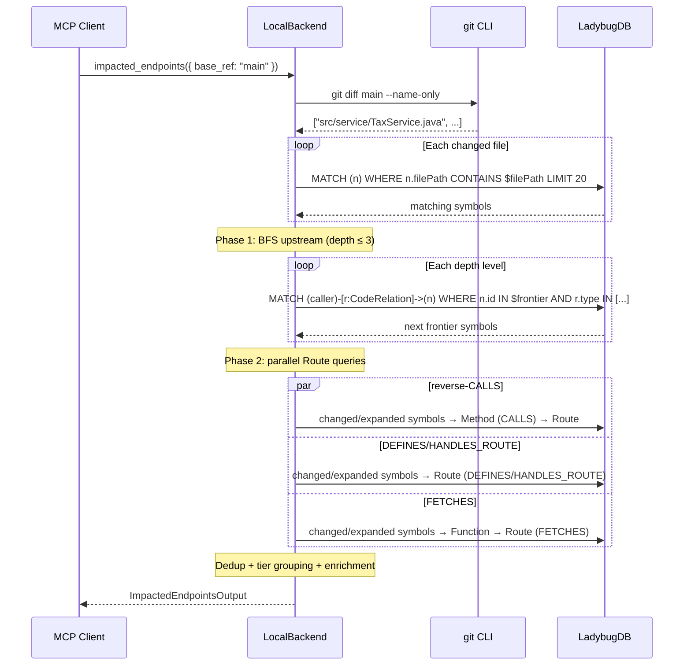
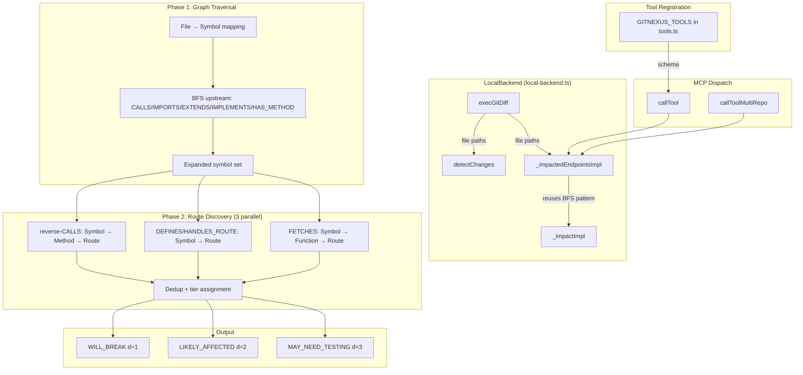
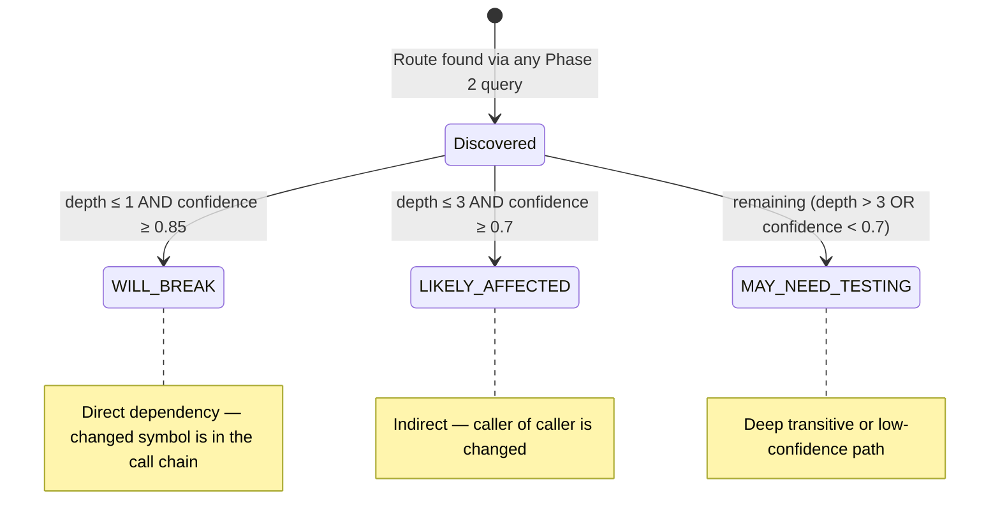

# impacted_endpoints (MCP Tool)

**Service:** GitNexus MCP server (local backend)
**File:** `gitnexus/src/mcp/local/local-backend.ts`
**Status:** Draft

## Summary

Given a git base_ref, identifies which HTTP endpoints (Route nodes) are impacted by code changes. Traverses the knowledge graph upstream from changed symbols through a Phase 1 BFS, then resolves endpoints via three parallel Route-discovery queries, grouping results into severity tiers.

---

## Request

### Parameters

| Parameter | Type | Required | Default | Description |
|-----------|------|----------|---------|-------------|
| scope | string | No | `"unstaged"` | What to analyze: `"unstaged"`, `"staged"`, `"all"`, or `"compare"` |
| base_ref | string | No (yes if scope=`"compare"`) | — | Branch/commit to diff against. Required when scope is `"compare"` |
| max_depth | integer | No | `3` | Max BFS traversal depth for Phase 1 |
| min_confidence | number | No | `0.7` | Minimum edge confidence threshold (0–1) |
| repo | string | No | — | Repository name or path. Omit if only one repo is indexed. |
| repos | string[] | No | — | Multi-repo. When provided, runs across all listed repos in parallel with `_repoId` attribution on each output entity. |

---

## Response

### Success — structured JSON

```json
{
  "summary": {
    "changed_files": 14,
    "changed_symbols": 37,
    "impacted_endpoints": 12,
    "risk_level": "MEDIUM"
  },
  "changed_symbols": [
    {
      "id": "node-123",
      "name": "calculateTax",
      "type": "Method",
      "file_path": "src/service/TaxService.java",
      "change_type": "Modified"
    }
  ],
  "impacted_endpoints": {
    "WILL_BREAK": [
      {
        "method": "POST",
        "path": "/api/orders",
        "controller": "OrderController",
        "handler": "createOrder",
        "file_path": "src/controller/OrderController.java",
        "line": 42,
        "impact_depth": 1,
        "confidence": 0.95,
        "risk": "HIGH",
        "affected_by": [
          {
            "name": "calculateTax",
            "file_path": "src/service/TaxService.java",
            "depth": 1
          }
        ]
      }
    ],
    "LIKELY_AFFECTED": [
      {
        "method": "GET",
        "path": "/api/invoices/{id}",
        "controller": "InvoiceController",
        "handler": "getInvoice",
        "file_path": "src/controller/InvoiceController.java",
        "line": 68,
        "impact_depth": 2,
        "confidence": 0.90,
        "risk": "MEDIUM",
        "affected_by": [
          {
            "name": "TaxReportBuilder",
            "file_path": "src/controller/InvoiceController.java",
            "depth": 2
          }
        ]
      }
    ],
    "MAY_NEED_TESTING": [
      {
        "method": "GET",
        "path": "/api/dashboard",
        "controller": "DashboardController",
        "handler": "summary",
        "file_path": "src/controller/DashboardController.java",
        "line": 105,
        "impact_depth": 3,
        "confidence": 0.70,
        "risk": "LOW",
        "affected_by": [
          {
            "name": "SummaryRenderer",
            "file_path": "src/controller/DashboardController.java",
            "depth": 3
          }
        ]
      }
    ]
  },
  "affected_processes": [
    {
      "name": "OrderFulfillment",
      "total_hits": 5,
      "broken_at_step": 2,
      "step_count": 8
    }
  ],
  "affected_modules": [
    {
      "name": "Billing",
      "hits": 8,
      "impact": "direct"
    }
  ],
  "traversal_complete": true
}
```

### Multi-repo output

Each impacted endpoint includes a `_repoId` field. Top-level summary aggregates across all repos:

```json
{
  "summary": {
    "changed_files": { "repo-a": 14, "repo-b": 3 },
    "impacted_endpoints": { "repo-a": 12, "repo-b": 1 },
    "risk_level": "HIGH"
  },
  "impacted_endpoints": {
    "WILL_BREAK": [
      { "method": "POST", "path": "/api/orders", "_repoId": "repo-a", "..." }
    ]
  },
  "errors": [
    { "repoId": "repo-c", "error": "Git diff failed: ..." }
  ]
}
```

### Error responses

| Error | Description |
|-------|-------------|
| `{ error: "base_ref is required for \"compare\" scope" }` | scope is `"compare"` but no `base_ref` provided |
| `{ error: "Git diff failed: <message>" }` | `git diff` command failed (invalid ref, not a git repo, etc.) |
| `{ error: "No changes detected." }` | `git diff` produced zero changed files; returned in summary with `risk_level: "none"` |

No HTTP status codes — this is an MCP tool call, not an HTTP endpoint. Errors are returned inline in the JSON response.

---

## Data Flow



---

## Architecture



---

## Tier Assignment Rules



Each Route appears in exactly one tier. If a Route is discovered via multiple paths (e.g., both reverse-CALLS at depth 2 and FETCHES at depth 3), the shallowest depth wins. Confidence is the minimum edge confidence along the shortest path.

---

## Phase 2: Route Discovery Queries

Three parallel parameterized Cypher queries run against the expanded symbol set (original changed symbols + BFS-discovered symbols).

### Query 1: reverse-CALLS (handler methods)

Traverses `CALLS` edges in reverse to find Method nodes that call changed/expanded symbols, then follows the Route→Method `CALLS` edge to find the owning Route.

```cypher
MATCH (m:Method)-[c:CodeRelation {type: 'CALLS'}]->(s)
WHERE s.id IN $expandedIds AND c.confidence >= $minConfidence
MATCH (r:Route)-[rc:CodeRelation {type: 'CALLS'}]->(m)
RETURN r.routePath AS path, r.httpMethod AS method,
       r.filePath AS file_path, r.lineNumber AS line,
       r.controllerName AS controller, r.methodName AS handler,
       s.name AS affected_name, s.id AS affected_id,
       c.type AS relation, 'reverse-CALLS' AS discovery_path
```

### Query 2: DEFINES / HANDLES_ROUTE (direct ownership)

Finds Route nodes where a changed/expanded symbol is the direct handler or is defined as the route's entry point.

```cypher
MATCH (s)-[d:CodeRelation]->(r:Route)
WHERE s.id IN $expandedIds
  AND d.type IN ['DEFINES', 'HANDLES_ROUTE']
  AND d.confidence >= $minConfidence
RETURN r.routePath AS path, r.httpMethod AS method,
       r.filePath AS file_path, r.lineNumber AS line,
       r.controllerName AS controller, r.methodName AS handler,
       s.name AS affected_name, s.id AS affected_id,
       d.type AS relation, 'DEFINES/HANDLES_ROUTE' AS discovery_path
```

### Query 3: FETCHES (API consumers)

Finds Functions that FETCH a Route, where the Function is in the expanded symbol set.

```cypher
MATCH (s:Function)-[f:CodeRelation {type: 'FETCHES'}]->(r:Route)
WHERE s.id IN $expandedIds AND f.confidence >= $minConfidence
RETURN r.routePath AS path, r.httpMethod AS method,
       r.filePath AS file_path, r.lineNumber AS line,
       r.controllerName AS controller, r.methodName AS handler,
       s.name AS affected_name, s.id AS affected_id,
       f.type AS relation, 'FETCHES' AS discovery_path
```

---

## Refactoring: `execGitDiff` Extraction

The git diff logic is extracted from `detectChanges` (lines 1414-1442 in `local-backend.ts`) into a private method shared by both `detectChanges` and `_impactedEndpointsImpl`.

```typescript
private async execGitDiff(
  scope: string,
  baseRef: string | undefined,
  cwd: string
): Promise<string[] | { error: string }> {
  const { execFileSync } = await import('child_process');

  let diffArgs: string[];
  switch (scope) {
    case 'staged':
      diffArgs = ['diff', '--staged', '--name-only'];
      break;
    case 'all':
      diffArgs = ['diff', 'HEAD', '--name-only'];
      break;
    case 'compare':
      if (!baseRef) return { error: 'base_ref is required for "compare" scope' };
      diffArgs = ['diff', baseRef, '--name-only'];
      break;
    case 'unstaged':
    default:
      diffArgs = ['diff', '--name-only'];
      break;
  }

  const output = execFileSync('git', diffArgs, { cwd, encoding: 'utf-8' });
  return output.trim().split('\n').filter(f => f.length > 0);
}
```

**Contract:** Identical logic, identical signature (scope, baseRef, cwd), identical behavior. `detectChanges` calls `this.execGitDiff(scope, params.base_ref, repo.repoPath)` instead of inlining the block. The error-return convention is preserved — `detectChanges` checks for an object with an `error` property.

---

## BFS Traversal (Phase 1)

Follows the same iterative single-hop pattern as `_impactImpl` (lines 2062-2108):

- **Direction:** upstream only (callers of changed symbols)
- **Edge types:** `CALLS`, `IMPORTS`, `EXTENDS`, `IMPLEMENTS`, `HAS_METHOD`
- **Depth:** 1 to `max_depth` (default 3)
- **Confidence filter:** `r.confidence >= min_confidence`
- **Test exclusion:** Symbols in test files (`isTestFilePath`) are filtered out
- **Frontier batching:** Frontier node IDs joined into a single `WHERE n.id IN [...]` clause per depth level
- **NO VAR_LENGTH:** Each depth level is a separate query (same as `_impactImpl`)

Symbols discovered during BFS are tracked with their `depth` and `relationType` for use in Phase 2 and for the `affected_via` field in the output.

### Constraints

| Constraint | Value | Behavior |
|-----------|-------|----------|
| max_expanded_nodes | 10,000 | Hard cap. If the visited set reaches this size, traversal stops and `traversal_complete` is set to `false`. |
| IMPACT_MAX_CHUNKS | env var (default unlimited) | Caps the number of chunks processed during enrichment queries. If hit, `traversal_complete` is set to `false`. |
| CHUNK_SIZE | 100 | Batch size for parameterized queries during enrichment (processes, modules). |

---

## Risk Scoring

Reuses the same thresholds as `_impactImpl` (lines 2287-2296):

| Risk | Condition |
|------|-----------|
| CRITICAL | impacted endpoints >= 30 OR affected processes >= 5 OR affected modules >= 5 OR expanded symbols >= 200 |
| HIGH | impacted endpoints >= 15 OR affected processes >= 3 OR affected modules >= 3 OR expanded symbols >= 100 |
| MEDIUM | impacted endpoints >= 5 OR expanded symbols >= 30 |
| LOW | none of the above |

Risk is computed across all tiers combined, not per tier.

---

## Registration Points (3 locations)

### 1. `callTool` dispatch — `local-backend.ts` line ~374

Add before the `default` clause:

```typescript
case 'impacted_endpoints':
  return this._impactedEndpointsImpl(repo, params) as T;
```

### 2. `callToolMultiRepo` dispatch — `local-backend.ts` line ~543

Add before the `default` clause:

```typescript
case 'impacted_endpoints': {
  const results = await Promise.all(
    repoIds.map(async (repoId) => {
      try {
        const handle = await this.resolveRepo(repoId);
        const result = await this._impactedEndpointsImpl(handle, params);
        return { repoId, result, error: null };
      } catch (err: any) {
        return { repoId, result: null, error: err.message };
      }
    })
  );

  const aggregated = {
    summary: { changed_files: {} as Record<string, number>, impacted_endpoints: {} as Record<string, number> },
    tiers: { WILL_BREAK: [], LIKELY_AFFECTED: [], MAY_NEED_TESTING: [] },
    affected_processes: [],
    affected_modules: [],
    errors: [] as { repoId: string; error: string }[],
  };

  for (const { repoId, result, error } of results) {
    if (error) {
      aggregated.errors.push({ repoId, error });
    } else if (result) {
      aggregated.summary.changed_files[repoId] = result.summary?.changed_files ?? 0;
      aggregated.summary.impacted_endpoints[repoId] = result.summary?.impacted_endpoints ?? 0;
      if (result.tiers) {
        for (const tier of ['WILL_BREAK', 'LIKELY_AFFECTED', 'MAY_NEED_TESTING'] as const) {
          aggregated.tiers[tier].push(...(result.tiers[tier] || []).map((e: any) => ({ ...e, _repoId: repoId })));
        }
      }
      aggregated.affected_processes.push(...(result.affected_processes || []).map((p: any) => ({ ...p, _repoId: repoId })));
      aggregated.affected_modules.push(...(result.affected_modules || []).map((m: any) => ({ ...m, _repoId: repoId })));
    }
  }

  aggregated.summary.risk = this.calculateAggregateRisk(results.map(r => r.result));
  return aggregated;
}
```

### 3. `GITNEXUS_TOOLS` — `tools.ts` line ~279

Add before the closing `]` of the array:

```typescript
{
  name: 'impacted_endpoints',
  description: `Find which HTTP endpoints are impacted by code changes in a git diff.

Runs git diff against a base ref, maps changed files to graph symbols, then traverses the
knowledge graph to discover all affected API endpoints.

WHEN TO USE: Before committing or merging — understand what API endpoints your changes affect.
Especially useful for PR review, release planning, and regression risk assessment.

AFTER THIS: Use document-endpoint on high-risk routes for full documentation with downstream
dependencies.

Output includes:
- tiers: WILL_BREAK (d=1, direct), LIKELY_AFFECTED (d=2, indirect), MAY_NEED_TESTING (d=3, transitive)
- affected_processes: execution flows broken and at which step
- affected_modules: functional areas hit (direct vs indirect)
- risk: LOW / MEDIUM / HIGH / CRITICAL

Each endpoint appears in exactly one tier (shallowest discovered path wins).

CROSS-REPO: Use 'repos' parameter with multiple repo IDs to analyze across repositories.
Results from multi-repo queries include '_repoId' attribution.`,
  inputSchema: {
    type: 'object',
    properties: {
      scope: {
        type: 'string',
        description: 'What to analyze: "unstaged" (default), "staged", "all", or "compare"',
        enum: ['unstaged', 'staged', 'all', 'compare'],
        default: 'unstaged',
      },
      base_ref: {
        type: 'string',
        description: 'Branch/commit for "compare" scope (e.g., "main")',
      },
      max_depth: {
        type: 'number',
        description: 'Max BFS traversal depth (default: 3)',
        default: 3,
      },
      min_confidence: {
        type: 'number',
        description: 'Minimum edge confidence 0-1 (default: 0.7)',
      },
      repo: {
        type: 'string',
        description: 'Repository name or path. Omit if only one repo is indexed.',
      },
      repos: {
        type: 'array',
        items: { type: 'string' },
        description: 'Multiple repos for cross-repo queries. When provided, analyzes across all listed repos in parallel with _repoId attribution.',
      },
    },
    required: [],
  },
}
```

---

## Business Rules

- **Zero modification to existing methods.** `detectChanges` behavior is unchanged — only its git-diff block is extracted into `execGitDiff`. The original method body at lines 1414-1442 is replaced with a call to `this.execGitDiff(...)`.
- **Single-hop queries only.** Do not use `VAR_LENGTH` or variable-length path patterns. Each depth level is its own parameterized query (same pattern as `_impactImpl`).
- **Route uniqueness.** If a Route is discovered via multiple Phase 2 queries, it appears once in the output at the shallowest depth tier.
- **Test file exclusion.** `isTestFilePath` is checked on every discovered symbol during BFS and enrichment. Test-only routes are excluded from output tiers.
- **Error resilience.** If any Phase 1 or Phase 2 query fails, the error is logged via `logQueryError` and the method continues with partial results. `traversal_complete` is set to `false` if any query is truncated.
- **Changed files with zero mapped symbols** still produce a valid output (`changed_symbols: []`, no impacted endpoints) — not an error.
- **Multi-repo parallel execution.** When `repos` is provided, all repos are analyzed in parallel. Individual repo failures are captured in the `errors` array and do not block other repos.
- **Graceful degradation.** If `ensureInitialized` fails for a repo, the error is returned for that repo only. Other repos continue unaffected.

## Notes

- The `execGitDiff` extraction is a pure refactor — the method signature mirrors the inline code exactly. It returns either `string[]` (success) or `{ error: string }` (failure). Callers check for the `.error` property to distinguish.
- The BFS traversal reuses the same iterative loop structure, `isTestFilePath` filter, `logQueryError` pattern, and `IMPACT_MAX_CHUNKS` / `CHUNK_SIZE` constants as `_impactImpl`.
- Route node schema (from `endpoint-query.ts`): `Route { httpMethod, routePath, controllerName, methodName, filePath, lineNumber }` with `CALLS` edge to `Method` node.
- Confidence floors per relation type are defined in `IMPACT_RELATION_CONFidence` (line 66). When a stored graph confidence is unavailable, the floor value is used.
