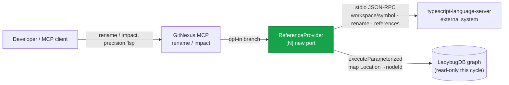

<!--
AI-READERS — load only the sections your task needs.

| Task          | Sections (skip if absent)                   |
|---------------|---------------------------------------------|
| implement     | ## Components, ## Contracts, ## Invariants   |
| code-review   | ## Invariants, ## KeyDecisions, ## Contracts |
| qa            | ## Flows, ## EdgeCases                       |
| scope-impact  | ## BlastRadius, ## CrossCutting, ## Non-Goals |

House style: markdown + Mermaid only (no .likec4/.html build — matches docs/designs/* convention).
This is P2 of #159, building on the verified P0+P1 read-only foundation. Later phases (P3 Mode A index-time
augmentation + `source` column, P4 GA/Go, P5 Python) are explicit Non-Goals — see ## Non-Goals.
-->

# Solution Design: LSP-backed Mode B — `rename` + `impact precision:'lsp'` (P2 of #159)

**Blast** d1=`local-backend.ts` (`rename` ~3309-3627 + `_impactImpl` ~3661-4112 gain an opt-in branch) + `tools.ts` (+1 optional `precision` param on 2 tools) + 1 new file `core/ingestion/lsp/reference-provider.ts` · d2=the `callTool` switch (`:456`) routes both tools (unchanged signatures) · d3=existing `rename`/`impact` suites (must pass unchanged with no `precision`) + `gitnexus-web/` (must be untouched) + the verified P0/P1 `LspClient` (touched only by KD-3b case ii, additively + regression-guarded)

## Problem & Approach

**Why.** `rename` is the weakest MCP tool today: it derives edits from the heuristic reverse-CALLS graph plus a ripgrep `\boldName\b` **text-search fallback** tagged `"text_search"` / "manual review". That fallback blanket-matches every token — shadowed locals, same-named-different-symbol, hits in strings and comments. P0+P1 shipped and **verified** a read-only LSP foundation (`LspClient`, `location-mapper`, `readiness-probe`, `server-discovery`, Mode C verifier). P2 cashes it in for the **highest user-facing value at zero graph-write risk**.

**Solution (this cycle = P2, read-only graph, TypeScript only).** A new **`ReferenceProvider`** port on the existing `LspClient` plus two opt-in MCP wirings:
- `rename(precision:'lsp')` → `workspace/symbol` (pin the identifier position) → `textDocument/rename` (ground-truth `WorkspaceEdit`), applied by a **precise per-edit applier** (never the legacy file-global regex).
- `impact(precision:'lsp', direction:'upstream')` → `textDocument/references` → d=1 provenance annotation (`source ∈ {lsp,heuristic,both}`) with **union seeding** of LSP-only callers into the BFS.

The property that makes this slice safe is the same **total isolation** P0/P1 established, extended with a **top-of-function opt-in branch**: when `precision` is omitted or LSP refuses, the existing heuristic body runs **byte-identically**. The graph is read exclusively through the write-guarded `executeParameterized` API; **no graph edge, node, or column is written** — the `source` annotation is computed at query time and never persisted (that provenance-column commitment is P3).


*C1 — system context. The new `ReferenceProvider` talks to the already-integrated language server; the graph stays read-only.*

## KeyDecisions

- **KD-1 — Two-method LSP path, refuse-wholesale.** `rename` LSP path = `workspace/symbol` → `textDocument/rename`. Any `null` / empty / ambiguous / unmappable result discards the **entire** LSP attempt and falls through to the heuristic path byte-identically. No merged/partial edit sets (maintainer-chosen: strict refuse-over-guess).

- **KD-2 — Precise per-edit applier (the load-bearing correction).** The existing apply block (`local-backend.ts:3604-3615`) does a **file-global `\boldName\b` regex replace** and ignores `edits[]`. Reusing it for LSP edits would re-introduce exactly the false positives LSP removes. P2 adds `applyPreciseEdits(changes)`: per file, sort edits **descending by (line, character)** and splice `newText` into exact ranges, write once. Used **only** by the LSP branch; the legacy regex apply stays untouched for the default path.

- **KD-3 — Explicit `didOpen`; foundation logic untouched.** `LspClient`'s auto-`didOpen` is wired only for `textDocument/definition`. `ReferenceProvider` calls the public `client.didOpen(uri, content)` itself before references/rename. No new method is special-cased inside `LspClient`.

- **KD-3b — LSP capability advertisement (feasibility-gated).** `TS_SERVER_CAPABILITIES` (`lsp-client.ts:100-120`) advertises only `textDocument.synchronization` + `publishDiagnostics` — **not** `references`/`rename`/`workspace.symbol`. Per LSP spec a server *may* refuse an unadvertised request. **WI-1 opens with a feasibility spike** against the real server: (i) if `typescript-language-server` honors these under the current handshake (it is typically lenient, keying off server capabilities) → document the reliance, **no foundation change** (KD-3/Inv-7 intact); (ii) if not → make the single additive, behavior-preserving capability declaration, guarded by a regression test asserting the definition/probe path is unchanged.

- **KD-4 — `workspace/symbol` resolves the identifier position.** `textDocument/rename`/`references` need an exact `(uri, position)` *on the identifier* — `sym.startLine` alone may land on a decorator/signature/comment line. Resolve via `workspace/symbol`, filter by the graph node's `filePath` hint, require exactly one match else refuse, and verify the resolved position lands on `oldName` else refuse.

- **KD-5 — `impact` provenance + union seeding at the depth-1 boundary.** `impact(precision:'lsp', upstream)` resolves `textDocument/references(includeDeclaration:false)` → nodeIds **before/at BFS entry**. At the **depth-1 iteration**, caller set = graph callers ∪ lsp-only callers: lsp-only ids are unioned into the depth-1 `impacted[]` (`{depth:1, source:'lsp'}`), into `visited`, and into the depth-1 `nextFrontier`, so the existing loop machinery expands their transitive dependents at depth-2+. Tagging: graph∩lsp→`both`, graph-only→`heuristic`. **Critical:** the union must occur *inside* the loop at the depth-1 boundary — appending to `visited`/`nextFrontier` after the loop exits (`:3981`) is a no-op. No entries dropped (no recall regression). Downstream + `precision:'lsp'` = graph no-op (references is upstream-only).

- **KD-6 — `source` is a query-time annotation, never persisted.** No schema change, no `source` column (that is P3). The per-edit `confidence` string tag gains a `'lsp'` value; tools surface `source` in output. Zero graph writes.

- **KD-7 — WorkspaceEdit safety refusals.** The adapter refuses the whole attempt if any edit resolves under `node_modules`/`.d.ts` (reuse `isUnindexablePath` — never edit library code), resolves outside `repo.repoPath` (own `path.resolve` containment check — `rename`'s `assertSafePath` is a local closure, not importable), is a multi-line range it can't represent, or is a non-text `documentChanges` op (file create/rename/delete).

## Components

| Component | File | Responsibility |
|---|---|---|
| **ReferenceProvider** *(new)* | `core/ingestion/lsp/reference-provider.ts` | `resolveSymbol(name,fileHint)` via `workspace/symbol`; `references(loc)` via `textDocument/references`; `rename(loc,newName)` via `textDocument/rename`. Built on `LspClient.request<T>` (T\|null) + explicit `didOpen`. Any null = refuse. |
| **withReferenceProvider** *(new)* | `reference-provider.ts` (or `mode-b-session.ts`) | Lifecycle funnel: `discoverServers`→spawn→`probeWorkspaceReadiness`→`fn(provider)` in try / `stop()` in finally. Returns null on any gate failure. Single refuse funnel for both wirings. |
| **WorkspaceEdit adapter + applyPreciseEdits** *(new)* | `reference-provider.ts` + applier used in `local-backend.ts` | Convert `WorkspaceEdit`→`changes` shape (KD-7 refusals, KD-2 precise apply, +1 line convention). |
| **rename wiring** *(edit)* | `local-backend.ts` `rename` ~3309-3627 | Top-of-fn `precision:'lsp'` branch; success → `source:'lsp'` + precise apply; null → heuristic fallthrough. |
| **impact wiring** *(edit)* | `local-backend.ts` `_impactImpl` ~3661-4112 | Depth-1 provenance + union seeding (KD-5). |
| **tool schemas** *(edit)* | `mcp/tools.ts` rename ~170-192 / impact ~194-235 | Additive optional `precision` enum (no `required` change). |

**Reuse (verified on disk):** `LspClient.request<T>`/`didOpen()`/`stop()`/`start()`, `pathToFileUri`/`fileUriToPath` (`lsp-client.ts`); `mapLocationToNodeId` + `MapperResult` + `isUnindexablePath` (`location-mapper.ts`); `probeWorkspaceReadiness` (`workspace-readiness-probe.ts`); `discoverServers` (`server-discovery.ts`); read-only `executeParameterized` + `assertNoGraphWriteImports` (`mode-c-verifier.ts`, `lbug-adapter.ts`); `rename` symbol lookup `context()` @ `:3336`; `normalizeFilePath` (`lib/utils.ts`).

## Contracts

**`rename` (MCP) — additive param + output field**
```
params:  { ..., precision?: 'lsp' }              // additive; required unchanged
return:  { status, old_name, new_name, files_affected, total_edits,
           changes:[{ file_path, edits:[{ line, old_text, new_text, confidence:'graph'|'text_search'|'lsp' }] }],
           applied, source: 'lsp'|'heuristic'|'both', lsp_status? }   // source + lsp_status added
```
- `precision:'lsp'` + LSP-ready + fully-mapped, in-repo WorkspaceEdit ⇒ `source:'lsp'`, edits `confidence:'lsp'`, `applied = !dry_run` (via `applyPreciseEdits`).
- Any refuse ⇒ `source:'heuristic'` + `lsp_status` notice; `changes` **byte-identical** to a no-`precision` call.

**`impact` (MCP) — additive param + optional entry field**
```
params:  { ..., precision?: 'lsp' }              // additive; required unchanged
byDepth entry: { ..., source?: 'lsp'|'heuristic'|'both' }   // present only when precision:'lsp' && upstream
```
- `precision:'lsp'` && `direction:'upstream'` && LSP-ready ⇒ d=1 entries tagged; lsp-only callers seeded into BFS.
- Refuse / downstream / no precision ⇒ graph result unchanged (no `source` field).

**`ReferenceProvider` (internal)**
```
resolveSymbol(name: string, fileHint?: string): Promise<Location | null>   // null = 0/>1/off-identifier
references(loc: Location): Promise<Location[] | null>                       // includeDeclaration:false
rename(loc: Location, newName: string): Promise<WorkspaceEdit | null>
withReferenceProvider<T>(repo, fn: (p: ReferenceProvider) => Promise<T>): Promise<T | null>
```

## Invariants

- **Inv-1** Zero graph writes on any `precision:'lsp'` path — sole DB access is read-only `executeParameterized`; `assertNoGraphWriteImports` self-check covers `reference-provider.ts`, **plus** a reverse-subset guard (`actual ⊆ LSP_FILES`) so a new untracked `lsp/*.ts` cannot silently escape.
- **Inv-2** `precision` omitted ⇒ `rename`/`impact` bytes execute unchanged (branch never entered). *Fitness:* default-path suites pass untouched.
- **Inv-3** Refuse-over-guess is **wholesale** — no server / probe-not-ready / workspace-symbol miss/ambiguous / off-identifier / unmappable / out-of-repo / non-text op ⇒ `null` ⇒ heuristic fallback. Never partial.
- **Inv-4** `probeWorkspaceReadiness` is the **sole** LSP authorization gate (inherited P0/P1 Invariant 4).
- **Inv-5** Every Mode B `LspClient` is `stop()`-ed in `finally`; serialized, one warm server; spawn bounded per call.
- **Inv-6** Line convention: LSP 0-indexed positions → emitted `{line}` is **+1** (1-indexed), matching existing edits.
- **Inv-7** Total isolation of new logic: `reference-provider.ts` has zero imports from the analyze/ingestion write pipeline. The only permitted foundation touch is KD-3b case (ii), additive + regression-guarded.
- **Inv-8** Never propose/apply edits to `node_modules`, `.d.ts`, or outside the repo root.
- **Inv-9** `gitnexus-web/` untouched (scope guard).

## Flows

### Flow — `rename(precision:'lsp')`
```mermaid
sequenceDiagram
    participant T as rename() tool
    participant W as withReferenceProvider
    participant D as discoverServers
    participant C as LspClient
    participant P as readiness probe
    participant R as ReferenceProvider
    participant A as adapter+applyPreciseEdits
    T->>T: lookup target (context @:3336); oldName===new_name guard
    alt precision:'lsp'
        T->>W: withReferenceProvider(repo, fn)
        W->>D: discoverServers()
        D-->>W: {typescript:null} ⇒ refuse → null
        W->>C: start() + didOpen(targetUri)
        W->>P: probeWorkspaceReadiness
        P-->>W: not ready ⇒ refuse → null
        W->>R: resolveSymbol(name,fileHint) [workspace/symbol]
        R-->>W: 0 or >1 / off-identifier ⇒ refuse → null
        W->>R: rename(loc,new_name) [textDocument/rename]
        R->>A: WorkspaceEdit → changes (refuse node_modules/multiline/non-text)
        A-->>T: changes(source:'lsp'); applyPreciseEdits if !dry_run; return
    end
    T->>T: (null/refuse) heuristic path UNCHANGED + source:'heuristic' notice
```

### Flow — `impact(precision:'lsp', upstream)`
```mermaid
sequenceDiagram
    participant I as _impactImpl
    participant W as withReferenceProvider
    participant R as ReferenceProvider
    participant M as mapLocationToNodeId
    I->>I: resolve target sym; run graph BFS
    alt precision:'lsp' && direction==='upstream'
        I->>W: withReferenceProvider(repo, fn)
        W->>R: references(loc, includeDeclaration:false)
        R-->>W: Location[] | null
        loop each Location
            W->>M: map → node|NO_NODE|AMBIGUOUS
        end
        W-->>I: lspIds:Set (node only)
        I->>I: at depth-1 boundary: union lsp-only → impacted[]+visited+nextFrontier; tag both/heuristic (NOT post-loop)
    end
    I->>I: (null/refuse) graph result UNCHANGED
```

## EdgeCases

- Server installed but workspace not built (no `tsconfig`/`node_modules`) → probe not-ready → fallback + notice.
- `workspace/symbol` 0 matches (comment/string/dynamic) or >1 after fileHint filter → refuse.
- `textDocument/rename` returns edits in `node_modules`/`.d.ts` → symbol is external → refuse whole (KD-7).
- `WorkspaceEdit.documentChanges` with file create/rename/delete ops → refuse (KD-7).
- Multi-line range / same-line multiple edits → applier handles right-to-left; preview keys on `(line,character)`.
- `dry_run` unchanged: `true`=preview, `false`=apply via `applyPreciseEdits`.
- `references(includeDeclaration:false)` so the target's own decl isn't counted as a caller.
- Index staleness vs live LSP: a `source` disagreement may reflect uncommitted edits, not graph error — label honestly.
- `impact` lsp-only ids flow into process/module enrichment + risk → `risk` may legitimately differ from default (intended; not asserted-equal).

## BlastRadius

- **d1 (will-break / must-update):** `local-backend.ts` `rename` + `_impactImpl` (opt-in branches; signatures unchanged via optional param) · `tools.ts` (2 additive schema params) · new `reference-provider.ts`.
- **d2 (likely-affected / should-test):** `callTool` switch (`:456`) — routes both tools, no change · the precise applier shares the file-write surface with the legacy apply (kept separate).
- **d3 (may-need-testing):** existing `rename`/`impact`/`impacted_endpoints` suites (must pass unchanged, no `precision`) · `gitnexus-web/` (scope guard) · P0/P1 `LspClient` (untouched unless KD-3b case ii).

**Confirmed non-impact:** `_impactedEndpointsImpl` (`:2082-2985`) does **not** call `_impactImpl` (`:3661-4112`) — separate BFS, zero shared state — so WI-5 cannot perturb the strict `impacted-endpoints-impl.test.ts` fixtures.

## CrossCutting

| Layer | Affected? | Notes |
|---|---|---|
| MCP server | **YES** | `rename` + `impact` gain opt-in `precision:'lsp'` (additive) |
| Ingestion pipeline | no | `pipeline.ts` / `parsing-processor.ts` do not import `lsp/` — isolation invariant holds |
| Graph schema | no | no node/edge/column change; the `source` **column** is P3 |
| Database (LadybugDB) | read-only | `executeParameterized` (write-guarded); no writes |
| CLI | no | no new command (Mode B is MCP-side); golden test may shell `rename --dry-run --precision=lsp` |
| Frontend (`gitnexus-web/`) | no | out of scope; scope-guard asserts no changes |
| Dependencies | no | reuses P0/P1 `vscode-jsonrpc` stack; no new dep |

- **Contract mismatches?** None — single stack.
- **Deployment order?** N/A — additive optional param; default behavior unchanged.

## Non-Goals

- **P3 Mode A** index-time augmentation, the `source` **schema column**, reconciliation at the two CALLS emission sites — none of P2 writes the graph.
- **jdtls / gopls / pyright** and Java/Go/Python — P2 is `typescript-language-server` only.
- Bundling/auto-installing a server (BYO inherited from P0/P1).
- `context precision:'lsp'`, `analyze --lsp`, downstream LSP refinement.
- Per-repo warm-server reuse across calls (noted follow-up; P2 spawns + shuts down per call).
