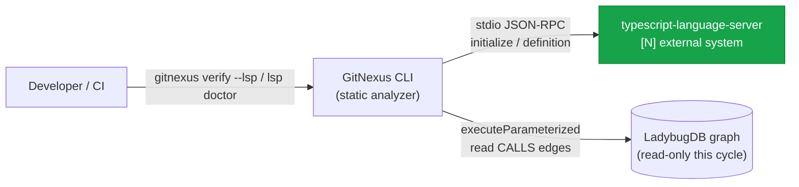
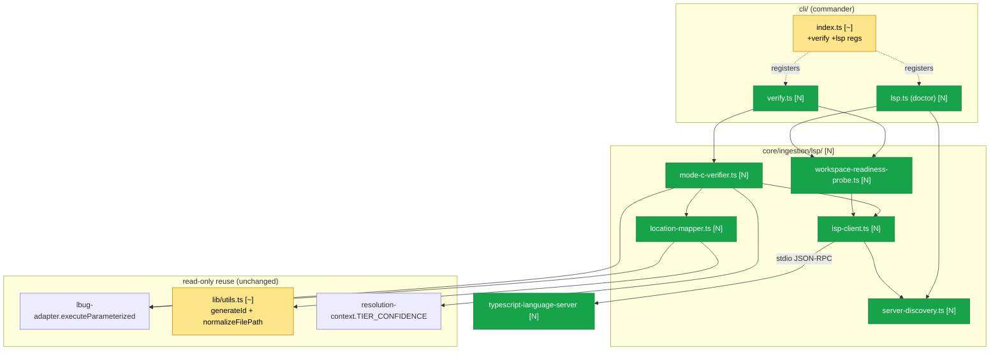
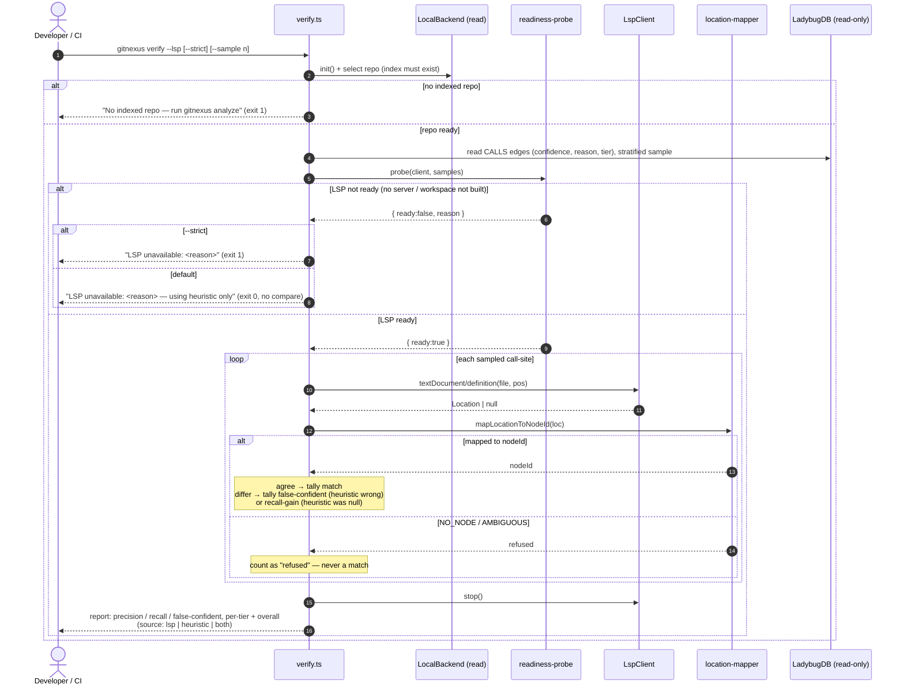
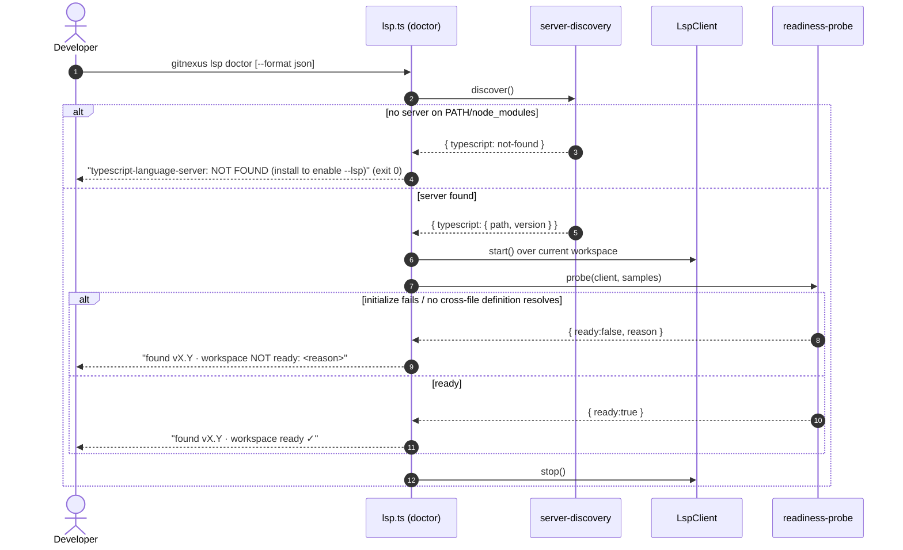
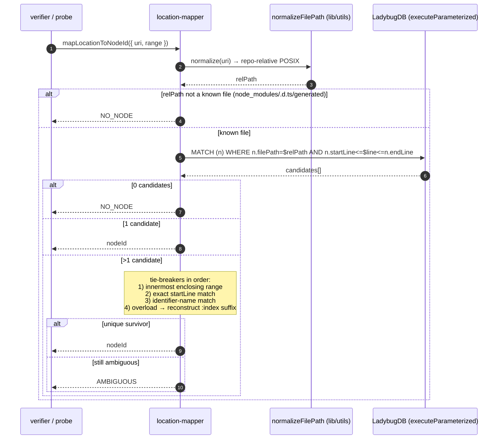
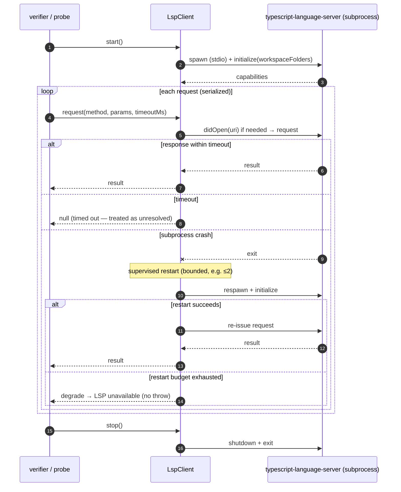

<!--
AI-READERS — load only the sections your task needs.

| Task          | Sections (skip if absent)                   |
|---------------|---------------------------------------------|
| implement     | ## Components, ## Contracts, ## Invariants   |
| code-review   | ## Invariants, ## KeyDecisions, ## Contracts |
| qa            | ## Flows, ## EdgeCases                       |
| scope-impact  | ## BlastRadius, ## CrossCutting, ## Non-Goals |

House style: markdown + Mermaid only (no .likec4/.html build — matches docs/designs/* convention).
This is P0+P1 of #159. Later phases (Mode B rename, Mode A index-time augmentation, multi-language)
are explicit Non-Goals — see ## Non-Goals.
-->

# Solution Design: LSP Read-Only Foundation (P0+P1 of #159)

**Blast** d1=8 new files + `lib/utils.ts` (add `normalizeFilePath`) + `cli/index.ts` (+2 command regs) + `local-backend.ts` (swap 1 inline normalizer call) + `package.json` (+2 deps) · d2=`rename` text-search path (uses the normalizer — must stay byte-identical) · d3=existing E2E suite (must pass unchanged with LSP **off**) + `gitnexus-web/` (must be untouched)

## Problem & Approach

**Why.** GitNexus resolution is 100% heuristic — a 5-tier name matcher (`resolution-context.ts:37-42`) plus receiver-type inference. Recent commit history (Go cross-file IMPLEMENTS, Spring interface→impl, FastAPI/Go CALLS, overload disambiguation) *is* the symptom: a structural accuracy ceiling that further heuristic patching cannot remove. A language server (gopls, jdtls, pyright, `typescript-language-server`) computes these natively and exactly — but only over a **built/resolved workspace**, which GitNexus deliberately does not require.

**Solution (this cycle = P0 + P1, read-only).** Build the *foundation* for opt-in LSP augmentation **without touching the analyze pipeline and without writing a single graph edge**:
- a supervised `typescript-language-server` lifecycle (**`LspClient`**),
- the highest-bug-density component — the **Location→nodeId mapper** — built standalone and tested against a fixture matrix,
- a **workspace-readiness probe** (the core "detect-my-own-LSP-unavailability" competency),
- **`gitnexus verify --lsp`** (Mode C): runs LSP over a sample, compares to the existing heuristic CALLS edges, and emits precision / recall / **false-confident-rate** — read-only,
- **`gitnexus lsp doctor`**: detects installed servers + per-language readiness.

The architectural property that makes this slice safe: **total isolation**. Everything new lives in a new `core/ingestion/lsp/` module reached only by the two new CLI commands and by tests. The graph is read exclusively through the write-guarded `executeParameterized` API. When the server is absent or the workspace isn't ready, the commands degrade to a deterministic "LSP unavailable" report and change nothing. This is the *safest, fully-reversible* subset of RFC ADR-001 — it defers the one near-irreversible commitment (the `source`-column graph-provenance model) to a later cycle (P3).

*C1 — system context. The language server is a **new** external system GitNexus talks to over stdio; the graph is read-only here.*

## KeyDecisions

| # | Decision | Options considered | Choice | Rationale |
|---|----------|--------------------|--------|-----------|
| KD-1 | Coupling into `analyze` | (A) hook mapper into pipeline; (B) isolated module, called only by `verify`/tests | **B — isolated** | Guarantees the zero-config byte-stability invariant *structurally*, not by testing. `analyze --lsp` (Mode A) is P3, out of scope. No pipeline file imports `lsp/`. |
| KD-2 | LSP stdio transport | (A) `vscode-jsonrpc` + `vscode-languageserver-protocol`; (B) hand-rolled JSON-RPC framing | **A — `vscode-jsonrpc@8`** | Maintained by the VS Code team; handles Content-Length framing, chunking, shutdown handshake. Hand-rolling duplicates mature code and risks protocol subtleties. The one notable additive dependency. |
| KD-3 | Server distribution | (A) bring-your-own + `lsp doctor` detection; (B) auto-install/bundle | **A — BYO** | Honors RFC §9 "opt-in only; never required" and keeps zero-config sacred. `lsp doctor` detects + reports; never installs. *(Stage-1 assumption, confirm at gate.)* |
| KD-4 | Client lifecycle/pooling | (A) per-file spawn; (B) per-workspace warm singleton, serialized | **B — warm singleton** | One server per run, `didOpen` on demand, requests serialized to bound memory. Mirrors `eval-server.ts` / `LocalBackend` warm lifecycle. Supervised restart on crash, then degrade. |
| KD-5 | Mapper ambiguity policy | (A) pick best candidate; (B) refuse (return AMBIGUOUS/NO_NODE) | **B — refuse over guess** | A wrong nodeId silently corrupts every downstream comparison. Mirrors `resolveCallTarget`'s refuse-on-ambiguous (`call-processor.ts:847`). |
| KD-6 | `normalizeFilePath` home | (A) duplicate in mapper; (B) extract from `local-backend.ts:3580` into `lib/utils.ts` and reuse | **B — extract + reuse** | The mapper **must** normalize identically to how the graph stored paths, or lookups silently miss. Co-locates with `generateId` (the mapper's other primitive). One byte-identical call-site swap, impact-checked. |
| KD-7 | `lsp doctor` shape | (A) daemon (idle-timer/SIGINT like eval-server); (B) one-shot status check | **B — one-shot** | It detects + reports, then exits. The daemon-style lifecycle only applies *within* a single `verify` run. |
| KD-8 | Mode C primary metric source | (A) compare CALLS + IMPLEMENTS; (B) CALLS-first (carry confidence+reason+tier), IMPLEMENTS secondary | **B — CALLS-first** | Only CALLS edges carry `confidence`/`reason` and a resolvable tier, enabling stratified sampling + a meaningful false-confident-rate. Keeps P1 tractable. |

## Architecture (C2)

Within the GitNexus CLI app, this cycle adds one new ingestion sub-module and two new CLI commands; every existing container is either **read-only** or gains an **additive** registration. Nothing in the `analyze` pipeline changes.

- **`core/ingestion/lsp/`** `[N]` — new module: client, discovery, mapper, readiness probe, Mode C verifier.
- **`cli/verify.ts`**, **`cli/lsp.ts`** `[N]` — new commands.
- **`cli/index.ts`** `[~]` — +2 `createLazyAction` registrations (additive).
- **`lib/utils.ts`** `[~]` — +`normalizeFilePath` (extracted).
- **`mcp/core/lbug-adapter.ts`**, **`mcp/local/local-backend.ts`** — read-only consumers (reuse `executeParameterized`; one normalizer call-site swap).
- **`core/ingestion/pipeline.ts` / `parsing-processor.ts`** — **untouched** (the invariant that keeps `analyze` byte-stable).

*C2 — green = new `[N]`, yellow = updated `[~]`, uncolored = unchanged read-only reuse.*

## Components

### Container: `core/ingestion/lsp/` (new module)

| Component | Phase | Responsibility |
|-----------|-------|----------------|
| `lsp-client.ts` | P0 | Supervised `typescript-language-server` over stdio JSON-RPC (`vscode-jsonrpc`): `start` (spawn → `initialize` with `workspaceFolders`) → `didOpen` on demand → `request(method, params, timeoutMs)` → supervised `restart` (bounded) → `stop` (`shutdown`/`exit`). Per-workspace warm singleton, **serialized** requests. |
| `server-discovery.ts` | P0 | Resolve the `typescript-language-server` binary (node_modules/.bin → PATH → npx), report path + version. Used by both the client (spawn) and `lsp doctor`. |
| `location-mapper.ts` | P0 | `mapLocationToNodeId(loc)` — the §3 algorithm. Normalize `file://` → repo-relative POSIX (`normalizeFilePath`), query node tables by `(filePath, line-containment)` via `executeParameterized`, apply tie-breakers, **refuse** on ambiguity. |
| `workspace-readiness-probe.ts` | P0 | `probe(client, samples)` — ready **iff** `initialize` succeeded **and** a sampled cross-file `textDocument/definition` resolves to a real Location. The "is the workspace actually built/resolved" gate. |
| `mode-c-verifier.ts` | P1 | `runModeCVerify(opts)` — read CALLS edges (stratified by `TIER_CONFIDENCE`), ask LSP `definition` per sampled call-site, map → compare to the heuristic target, tally precision / recall / false-confident-rate. Read-only. |

### Container: `cli/` (new commands)

| Component | Phase | Responsibility |
|-----------|-------|----------------|
| `verify.ts` (`verifyCommand`) | P1 | `--lsp` runs Mode C; `--strict` exits non-zero when LSP is unavailable instead of degrading; `--sample <n>`, `--repo <name>`. Renders the text report (eval-server formatter pattern + next-step hint). |
| `lsp.ts` (`lspCommand`) | P1 | `doctor` subcommand: discover servers + per-language readiness, `--format text\|json`. One-shot. |

#### Sequence: `verify --lsp` (Mode C) {#sd-verify-mode-c}

#### Sequence: `lsp doctor` {#sd-lsp-doctor}

#### Sequence: Location→nodeId mapping (the §3 algorithm) {#sd-location-mapper}

#### Sequence: `LspClient` lifecycle + supervised restart {#sd-lsp-client}

## Contracts

**CLI — `gitnexus verify --lsp`**
- Flags: `--lsp` (run Mode C), `--strict` (exit ≠0 when LSP unavailable), `--sample <n>` (sample size; default stratified-by-tier), `--repo <name>` (multi-repo selector).
- Preconditions: an indexed repo must exist (reuses `LocalBackend.init()`); absent → "run gitnexus analyze" + exit 1.
- Output (text): per-tier and overall **precision / recall / false-confident-rate**, sample size, server version, and a `source: lsp | heuristic | both` label. Writes nothing to the graph.
- Exit: 0 normally (incl. degraded "LSP unavailable" in non-strict); 1 on `--strict` + unavailable, or no index.

**CLI — `gitnexus lsp doctor`**
- Flags: `--format text|json` (default text).
- Output: per language — server found? (path, version) + workspace-ready? (+ reason if not).
- Exit: 0 (informational; "not found" is a normal report, not an error).

**Internal APIs**
- `LspClient`: `start(): Promise<void>` · `request<T>(method: string, params, timeoutMs): Promise<T | null>` · `didOpen(uri): Promise<void>` · `restart(): Promise<boolean>` · `stop(): Promise<void>`. Per-workspace singleton; requests serialized.
- `mapLocationToNodeId(loc: { uri, range }): { kind: 'node', nodeId } | { kind: 'NO_NODE' } | { kind: 'AMBIGUOUS' }`.
- `probeWorkspaceReadiness(client, samples): Promise<{ ready: boolean, reason?: string }>`.
- `discoverServers(): Promise<Record<'typescript', { path: string, version: string } | null>>`.
- `normalizeFilePath(p: string): string` — `p.replace(/\\/g,'/').replace(/^\.\//,'')` (extracted from `local-backend.ts:3580`, byte-identical).
- `runModeCVerify(opts): Promise<VerifyReport>` where `VerifyReport = { perTier: Record<Tier, Metrics>, overall: Metrics, sampleSize, serverVersion }`, `Metrics = { precision, recall, falseConfidentRate, n }`.

## Invariants

1. **No graph writes.** No module under `core/ingestion/lsp/` imports any write API (`addRelationship`, write-mode cypher, schema mutators). All DB access goes through read-only `executeParameterized` (guarded by `CYPHER_WRITE_RE`). *Mechanically testable: assert no write-API symbol is imported in `lsp/`.*
2. **No pipeline coupling.** `core/ingestion/pipeline.ts` and `parsing-processor.ts` import nothing from `lsp/`. `analyze` (no `--lsp`) produces byte-identical `.gitnexus/meta.json` node/edge counts vs the pre-change baseline. There is no `analyze --lsp` this cycle.
3. **Refuse over guess.** The mapper returns `NO_NODE`/`AMBIGUOUS` rather than a wrong nodeId; the verifier counts a refusal as "refused", never as a match.
4. **Trust-aware LSP.** Mode C attributes an LSP verdict **only** when the readiness probe passed; if it failed, `verify` refuses to compare (strict: exit 1; default: degrade + report). No LSP result is ever recorded against an unready workspace.
5. **Exact node identity.** The mapper reproduces the stored id shape — `generateId(label, \`${filePath}:${name}\`)` with the 0-indexed line convention and the per-file overload `:index` suffix — so a Location resolves to the same nodeId the analyzer wrote.
6. **Single-source path normalization.** The mapper and `local-backend` use the *same* `normalizeFilePath`, so `file://` URIs map to graph paths identically (no silent miss from path-format drift).
7. **Deterministic report.** Given a fixed sample seed + same repo + same server version, `verify --lsp` numbers are identical across runs (stable, seeded sampling — required by the report-stability fitness function).
8. **Scope isolation.** No file under `gitnexus-web/` changes.

## Flows

| UC | Use case | Type | Covered by |
|----|----------|------|------------|
| UC-1 | Measure heuristic precision vs LSP | happy | `#sd-verify-mode-c` (LSP-ready branch) |
| UC-2 | LSP unavailable → degrade (default) | edge | `#sd-verify-mode-c` (not-ready / default) |
| UC-3 | LSP unavailable → fail loud (CI) | edge | `#sd-verify-mode-c` (not-ready / `--strict`) |
| UC-4 | Diagnose server install + readiness | happy | `#sd-lsp-doctor` |
| UC-5 | Map an LSP Location to a graph node | happy | `#sd-location-mapper` (1-candidate / tie-break) |
| UC-6 | Location is ambiguous / external | edge | `#sd-location-mapper` (NO_NODE / AMBIGUOUS) |
| UC-7 | Server crashes mid-run | edge | `#sd-lsp-client` (supervised restart → degrade) |

## EdgeCases

1. **Server absent** → `discover()` returns not-found; `verify --lsp` degrades (default) or exits 1 (`--strict`); `lsp doctor` reports "NOT FOUND".
2. **Server present but workspace not built/resolved** (no cross-file `definition` resolves) → probe returns `ready:false`; same degrade/strict handling. This is the RFC's core "silently-degraded high-confidence answer" trap — defused.
3. **Location in `node_modules` / `.d.ts` / generated** → normalizes to a non-known file → `NO_NODE`, edge dropped cleanly.
4. **Overloaded methods on the same start line** → mapper applies name + arity + overload-index tie-breakers; if still >1, `AMBIGUOUS` (never a guess).
5. **Multiple symbols on one line** (`const a=1,b=2;`, inline arrows) → tie-break by innermost range / identifier name; else `AMBIGUOUS`.
6. **Line-index off-by-one** → both tree-sitter storage and LSP are 0-indexed (verified); the mapper pins this with an explicit asserted invariant + a fixture case (guards against future drift, e.g. the `i+1` used on the rename surface).
7. **LSP crash mid-run** → bounded supervised restart; on exhaustion, degrade to "LSP unavailable" (no throw, no partial write).
8. **Empty graph / no CALLS edges** → verifier reports "nothing to compare" (0 sample) rather than dividing by zero.
9. **Large repo** → sample is capped; the cap is **logged** (no silent truncation — per the fitness-function discipline).
10. **Windows paths** → `normalizeFilePath` collapses backslashes; case-insensitive FS handled by the same normalizer the graph used.

## CrossCutting

- **Reliability.** The whole slice is failure-first: every LSP path has a defined degraded state (`null`/`NO_NODE`/`AMBIGUOUS`/`ready:false`) and never throws into the CLI. Supervised restart bounds subprocess flakiness. "Everything fails all the time" — the design assumes the server is frequently unavailable and makes that the *normal* path.
- **Performance.** One warm server per run; `didOpen` only files actually queried; requests serialized to bound memory; sampling (not whole-repo sweep) bounds request count. No impact on `analyze` (the hot path) — it never touches `lsp/`.
- **Security.** No new network surface (stdio subprocess only); BYO server (no auto-download); read-only DB access via the write-guarded API.
- **Memory links.** `[[db-is-ladybugdb]]` — read path uses the Kùzu `executeParameterized` API, not Neo4j. `[[stale-index-zero-results]]` — Mode C precision numbers are only meaningful against a fresh index; `verify` should note index staleness. `[[route-fix-regression]]` — not relevant (no route/ingestion-pipeline change this cycle), but the isolation invariant (#2) is the structural guarantee that this cycle cannot regress route output.

## BlastRadius

| Tier | Files / areas | Impact |
|------|---------------|--------|
| **d1 (new)** | `core/ingestion/lsp/{lsp-client,server-discovery,location-mapper,workspace-readiness-probe,mode-c-verifier}.ts`, `cli/{verify,lsp}.ts` | new — no existing behavior |
| **d1 (edit)** | `lib/utils.ts` (+`normalizeFilePath`), `cli/index.ts` (+2 regs), `local-backend.ts` (swap 1 normalizer call to the extracted fn), `package.json` (+`vscode-jsonrpc`, +`vscode-languageserver-protocol`) | additive / byte-identical |
| **d2** | `rename` text-search path in `local-backend.ts` (consumes the normalizer) — must stay byte-identical; CLI `--help` (+2 commands) | regression-gated by existing rename tests |
| **d3** | existing E2E suite (must pass unchanged with LSP **off**); `gitnexus-web/` (must be untouched) | regression / scope gates |

*The only edit touching a hot file is the one `normalizeFilePath` call-site swap in `local-backend.ts` — impact-checked, gated by the existing `rename` tests.*

## Non-Goals (this cycle — deferred to later #159 cycles)

- **Mode A** — `gitnexus analyze --lsp`, index-time CALLS/IMPLEMENTS augmentation, the `source STRING` column + schema migration, conflict/reconciliation at the two CALLS emission sites, and the CALLS-id `lineNumber` fix. *(P3 — the one near-irreversible commitment; not started here.)*
- **Mode B** — LSP-backed `rename` and `impact precision:'lsp'`. *(P2.)*
- **Java/jdtls, Go/gopls, Python/pyright.** TypeScript beachhead only. *(P3–P5.)*
- **Auto-install/bundling** of language servers (BYO only).
- **HTTP route/framework extraction, semantic tokens, `document-endpoint` LSP typing.**
- **Any graph write or schema change.** Zero mutation this cycle.

## DownstreamDocs

None. This repo keeps design rationale in `docs/designs/*.md` + plan in `docs/plans/*.md` (no `docs/architecture/` tree exists). The plan doc (Stage 5) carries the per-WI test contract, blast radius, and cross-stack checklist.

## ADRs

Originating decision: **RFC ADR-001** (issue #159) — LSP as opt-in augmentation/verification, not replacement. This cycle implements its *read-only, fully-reversible subset* (Modes C + the P0 foundation). No new standalone ADR file (house style keeps decisions inline; see `## KeyDecisions`). The provenance/conflict model (the part of ADR-001 worth "agonizing over") is explicitly **not** decided here — it lands with Mode A (P3).
