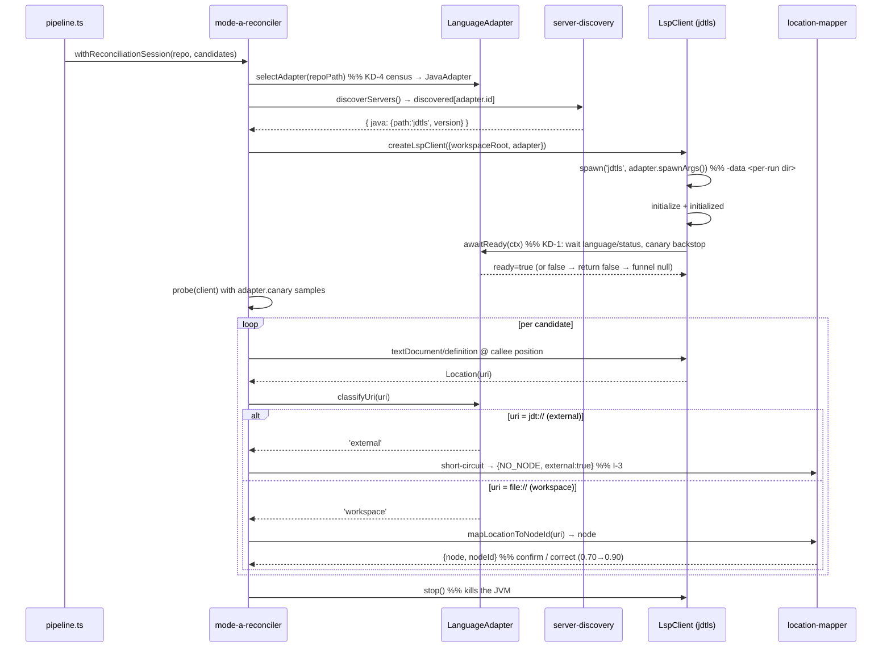

# Design — #159 P3.2: Java/jdtls support in the LSP-augmentation stack

This design holds the durable architecture rationale for adding Java/`jdtls` to the TS-first LSP-augmentation stack (Mode A index-time augmentation + Mode C verify). The plan (`docs/plans/159-p32-java-jdtls.md`) carries the executable work items; this doc carries the *why*.

## Problem & Approach

The LSP stack shipped TS-first. Five core files encode `typescript-language-server` assumptions: `server-discovery.ts` (single hardcoded binary), `lsp-client.ts` (languageId/spawn-args/init-opts/readiness), `canary-sampler.ts` (TS syntax), `location-mapper.ts` (`file://`-only URIs), and the reconciler/pipeline (which already delegate via DI). GitNexus already indexes Java via tree-sitter, so the heuristic resolver covers Java CALLS — but they never get the LSP confidence promotion (0.70→0.90) or Mode-C measurement.

`jdtls` differs from `typescript-language-server` in four load-bearing ways, each a force on the design: (1) requires a `-data <workspace-dir>` spawn arg; (2) needs a JDK 17+ to run; (3) slow async startup + mandatory background indexing → the #172 "answers `initialize` but isn't ready" race; (4) returns `jdt://` URIs for decompiled jar/stdlib definitions.

**Approach:** a single `LanguageAdapter` value-object (config bag + two strategy methods — `canary`, `awaitReady`, plus `classifyUri`) carries every per-language delta, selected once per run by extension census, threaded through the **existing** `deps.discoverServers` / `deps.createLspClient` / `deps.probe` indirections in `mode-a-reconciler.ts` and the `binaryPath`/`opts`-bag seam in `LspClient`. No new orchestration, no inheritance hierarchy. The TS adapter reproduces today's literals, so the TS path is unchanged by construction.

**Why a value-object, not a class hierarchy:** the languages share *shape*, not *behavior*. A `BaseAdapter` with overridable methods would be abstraction without reuse. The adapter is data + two small strategies where behavior genuinely differs.

**Tradeoff named:** a polyglot monorepo LSP-augments only its dominant indexed language this slice. Two-way door — a future slice runs the funnel once per adapter. We do not pay that complexity now.

## Contracts

```ts
// new: src/core/ingestion/lsp/language-adapter.ts
export interface LanguageAdapter {
  readonly id: 'typescript' | 'java';            // closed union; grows for go/python
  readonly serverBinary: string;                 // 'typescript-language-server' | 'jdtls'
  readonly languageId: string;                   // didOpen languageId
  spawnArgs(ctx: { workspaceRoot: string }): string[];   // TS: ['--stdio']; Java: ['-data', metadataDir]
  readonly initializationOptions: unknown;
  awaitReady(ctx: AdapterReadyCtx): Promise<boolean>;    // post-`initialized` warm-up gate (KD-1)
  readonly canary: LanguageCanaryStrategy;       // isCandidateFile + tryExtractSample
  classifyUri(uri: string): 'workspace' | 'external' | 'unmappable';  // KD-3
}

export interface LanguageCanaryStrategy {
  isCandidateFile(name: string): boolean;
  tryExtractSample(absPath: string, content: string): Sample | null;
}

// location-mapper result gains an optional flag (3-state shape preserved):
type MapperResult =
  | { kind: 'node'; nodeId: string }
  | { kind: 'NO_NODE'; external?: boolean }     // external:true ⇒ jdt:// / decompiled (KD-3)
  | { kind: 'AMBIGUOUS' };
```

**Key decisions** (full option tables in the plan's `## Specs`, KD-1..KD-5):
- **KD-1 (readiness, #172 class):** wait for jdtls `language/status`/`ServiceReady`, canary-probe backstop, hard deadline. Probe stays the authorization gate; `awaitReady` is the warm-up gate. TS = no-op.
- **KD-2 (spawn/JDK/`-data`):** `jdtls` wrapper with `-data <per-run dir>` under per-fork `GITNEXUS_HOME` (reuse `5b34e6d`/#175). JDK absence degrades through the existing spawn-fail → funnel-null path.
- **KD-3 (`jdt://`):** `classifyUri` + one early branch → `{kind:'NO_NODE', external:true}`.
- **KD-4 (selection):** extension census, dominant language wins, deterministic.
- **KD-5 (canary):** extract TS logic behind `LanguageCanaryStrategy`; `JavaCanaryStrategy` drops backticks, swaps regexes.

## Invariants

- **I-1 (TS-path invariance):** with the default TS adapter, every existing TS golden suite is byte-identical. The adapter default reproduces today's literals.
- **I-2 (no pre-ready publish, #172):** a Java definition requested before `awaitReady` resolves is never published.
- **I-3 (refuse-over-guess):** every `jdt://`/external URI buckets as external-refusal (`{kind:'NO_NODE', external:true}`), never a node.
- **I-4 (graceful degradation):** missing jdtls/JDK skips-clean (funnel refuses to null), identical to a missing TS server.
- **I-5 (no shared `-data`):** the jdtls metadata dir is per-run under the per-fork `GITNEXUS_HOME` — never shared (the #175 contention class).

## Flows



## BlastRadius

- **d1 (will-break / must-update):** `lsp-client.ts` spawn/init site (`:405,612,673,703,889`); `mode-a-reconciler.ts` defaults (`:292,376-381`); `canary-sampler.ts:243` signature; `location-mapper.ts:386` early URI check; `pipeline.ts:798-801`. Every d=1 edit is default-preserving (TS adapter reproduces today's literals).
- **d2 (likely-affected / should-test):** the Mode-A funnel exercised for the first time on Java; `impacted_endpoints` BFS for Java edges (under `--lsp` only).
- **d3 (may-need-testing):** existing TS golden suites — must stay GREEN, unchanged (I-1 lock).
- **Confirmed non-impact:** Lane-B files (`call-processor.ts` etc.), heritage processor (Java heritage stays gated off), `detect_changes`/`context`/`rename`, `gitnexus-web/`.

## Evolution path (Go P4, Python P5)

A new language is: a new `LanguageAdapter` constant + a `LanguageCanaryStrategy` + a discovery entry — zero edits to `lsp-client.ts`, `location-mapper.ts`, the reconciler, or the pipeline. `gopls`/`pyright` readiness and their external-URI schemes (`go://`, stdlib paths) slot into `awaitReady`/`classifyUri`. Java validates every method of the interface, proving the seam.
