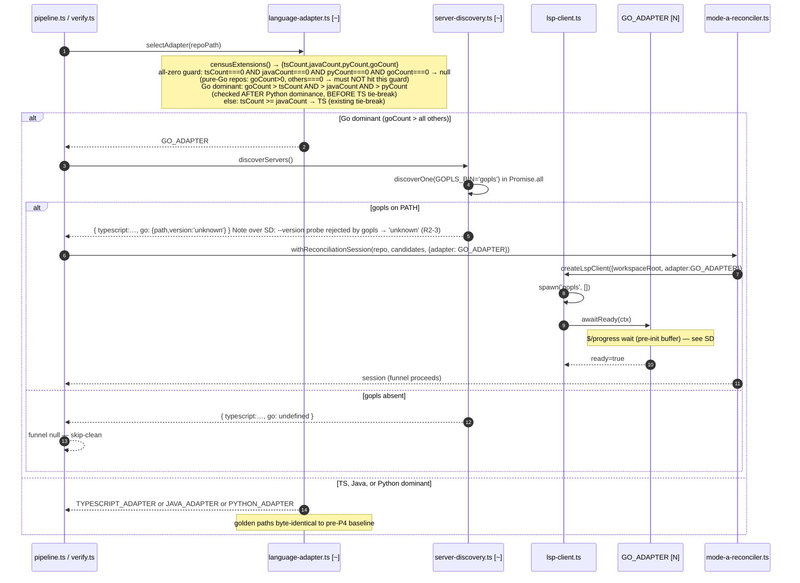

<!--
AI-READERS — load only the sections your task needs.

| Task          | Sections                                                  |
|---------------|-----------------------------------------------------------|
| implement     | ## Components, ## Contracts, ## Invariants                |
| code-review   | ## Invariants, ## KeyDecisions, ## Contracts              |
| qa            | ## Flows, ## EdgeCases                                    |
| scope-impact  | ## BlastRadius, ## CrossCutting                           |

LikeC4 view definitions: grep '^view ' ./159-p4-go-gopls.likec4
-->

# Solution Design: #159 P4 — Go/gopls LSP adapter

**Blast** d1=6 files (additive seam + `lsp-client.ts` clientCapabilities seam) + 1 gate rename (location-mapper.ts `isPythonAdapter` decl) · d2=Mode-A funnel on Go repos · d3=TS/Java/Python golden suites (must stay green)

## Problem & Approach

The LSP-augmentation stack ships TS (P3.1), Java (P3.2), and Python (P5). Go repos receive no LSP confidence promotion (0.70→0.90) and no Mode-C measurement because `selectAdapter` has no Go branch, `server-discovery` does not look for `gopls`, and the canary sampler carries no Go strategy.

The load-bearing design force is that **gopls is a background-loading server**: it loads `go/packages` on startup and emits `$/progress` notifications (`{token, value:{kind:'begin'|'report'|'end', title?}}`) before it can answer `textDocument/definition`. Firing definition requests before the workspace-load `end` arrives returns empty — the #172 class of bug. This mandates a **notification-wait** `awaitReady` (not Python's canary-only pattern).

**WI-SPIKE has been RUN against gopls v0.22.0 + the gin fixture; the wire contract is FROZEN (branch A committed).** Empirically confirmed: the method is literally `$/progress`; the workspace-load `begin` carries `value.title = "Setting up workspace"` (stable) and `value.message = "Loading packages..."`; **the `end` carries an EMPTY `value.title`** — so the match keyword must be read from per-token STORED `begin.title`, never from `end.title`. **Critically (R2-2, confirmed real): the `$/progress begin` AND the server→client `window/workDoneProgress/create` request both arrive at `sinceInitialized = 0ms`** — the same message batch as the `initialized` write. A handler registered after `initialized` (inside `awaitReady`) would miss the `begin` and fall to the deadline backstop every run = the #172 bug. Therefore the `onNotification('$/progress')` listener AND the `onRequest('window/workDoneProgress/create', () => null)` responder are registered **pre-`initialize`** (in `lsp-client.ts`, WI-0), buffering begin/report/end into shared token-correlation state that `awaitReady` then **reads**; the canary backstop fires on deadline only. The branch-B canary-only fallback is **removed** — a stable title was confirmed.

A prerequisite seam (**WI-0**) in `lsp-client.ts` carries TWO non-additive BLOCKER fixes. **(R2-1)** `InitializeParams.capabilities` is typed `typeof TS_SERVER_CAPABILITIES`; because that object is `as const`, `window.workDoneProgress` has literal type `false` and the `GO_ADAPTER` `true` override will not `tsc`; `ClientCapabilities` is defined nowhere. WI-0 authors an explicit `ClientCapabilities` structural type with **non-literal** members, retypes `InitializeParams.capabilities: ClientCapabilities` and `LanguageAdapter.clientCapabilities?: ClientCapabilities`, and confirms the `as const` `TS_SERVER_CAPABILITIES` stays assignable (non-Go payloads byte-identical). The merge site becomes `adapter.clientCapabilities ?? TS_SERVER_CAPABILITIES`. **(R2-2)** the pre-`initialize` `$/progress`/`create` handler registration above, capability-gated on `adapter.clientCapabilities?.window?.workDoneProgress` so TS/Java/Python register nothing new. `tsc`-clean with the override present is a WI-0 acceptance gate.

**Three non-additive edits** (corrected from "one"): the `location-mapper.ts` gate rename `isPythonAdapter` → `isExternalRefusalAdapter` (widened to `adapterId === 'python' || adapterId === 'go'`), the WI-0 pre-`initialize` handler seam, and the WI-0 `ClientCapabilities` type-widening. Everything else is purely additive. Out-of-repo refusal stays the existing realpath + `path.relative` **path-containment** check — NO GOROOT special-casing: the spike showed gin's `go 1.25.0` puts stdlib in `~/go/pkg/mod/...toolchain.../src/...`, which a GOROOT-only check would mis-classify.

**Approach:** mirror the per-language adapter pattern (4th application). New `GO_ADAPTER` singleton + `GO_CANARY_STRATEGY`, register `gopls` discovery, extend the single external-refusal gate (path-containment), add the `ClientCapabilities` + pre-`initialize` handler seam to `lsp-client.ts`. Zero changes to TS/Java/Python funnels by construction.

## KeyDecisions

| Decision | Options considered | Choice | Rationale |
|----------|--------------------|--------|-----------|
| External-refusal gate | A: extend enumerated disjunction `python \|\| go`; B: generic `!== typescript && !== java` predicate; C: capability-flag `flagExternalOutOfRepo` | **Option A — enumerated (path-containment)** | B is a one-way door: every future adapter silently inherits external-refusal with no explicit opt-in, breaking the audit trail. The duplication B removes is one boolean expression. C is pre-optimisation at N=2. Exact change: rename `isPythonAdapter` → `isExternalRefusalAdapter` at its symbol declaration within `mapLocationToNodeId` and all read sites in the same function; 1 decl + 4 reads (symbol anchors, not line numbers). **The in/out-of-repo decision stays the EXISTING realpath + `path.relative` path-containment check — NO GOROOT-specific branch.** SPIKE-confirmed: gin's `go 1.25.0` resolves stdlib to `~/go/pkg/mod/...toolchain.../src/...` (mod-cache), not system GOROOT; a GOROOT-only check would mis-classify it as in-repo. Path-containment (`!uri.startsWith(realpath(repoRoot))`) handles mod-cache, GOROOT, and third-party `pkg/mod` uniformly. |
| Client-capability seam + type widen (R2-1) | Thread per-adapter capabilities through existing init call vs new `adapter.clientCapabilities?` override | **Per-adapter `clientCapabilities?` field + author `ClientCapabilities` + widen `InitializeParams.capabilities`** | `lsp-client.ts:130` hardcodes `window:{workDoneProgress:false}` in `TS_SERVER_CAPABILITIES` (`as const`), and `:138` types `InitializeParams.capabilities` as `typeof TS_SERVER_CAPABILITIES` → `workDoneProgress` has literal type `false`, so `GO_ADAPTER`'s `true` override will NOT `tsc`, and `ClientCapabilities` is defined nowhere. **WI-0 (R2-1):** author an explicit `ClientCapabilities` structural type with NON-literal members (`{ textDocument?; workspace?; window?: { workDoneProgress?: boolean } }`); retype `InitializeParams.capabilities: ClientCapabilities` and `LanguageAdapter.clientCapabilities?: ClientCapabilities`; confirm `as const` `TS_SERVER_CAPABILITIES` stays assignable. Seam: `adapter.clientCapabilities ?? TS_SERVER_CAPABILITIES`; `GO_ADAPTER` supplies `{window:{workDoneProgress:true}}`. Override MUST NOT mutate the shared object; TS/Java/Python send byte-identical payloads — proven by golden suites PLUS a direct non-Go zero-diff/no-handler assertion (R2-7). `tsc`-clean with the override present is a WI-0 acceptance gate. |
| `awaitReady` pattern | Notification-wait with `$/progress`; canary-only (Python); no-op (TS) | **Notification-wait via pre-`initialize` `onNotification('$/progress')`** with token-keyed begin/end correlation state — COMMITTED (branch A) | gopls is a background-loading server (#172 class of bug). Python's canary-only fires before the workspace is ready → empty. A no-op is wrong. Java's `onNotification('language/status')` matches a flat `params.type==='ServiceReady'` — structurally unlike `$/progress` which is stateful. **SPIKE-confirmed:** the `begin` and the `window/workDoneProgress/create` request arrive at `sinceInitialized = 0ms`, so the handler is registered **pre-`initialize`** (WI-0, R2-2), NOT inside `awaitReady`; it records the token on the `begin` whose `value.title === "Setting up workspace"` and resolves on that token's `end`. **The `end` carries an EMPTY title** — the matched title is read from per-token STORED state, never from `end.title`. `awaitReady` READS the buffered state. |
| `awaitReady` shared-abstraction | Abstract `settle()`/timer/`dispose()` into a base helper (Option C) | **Rejected** | Rule-of-three violation at N=2; the two match predicates differ (`ServiceReady` string vs `$/progress` stored-token+title correlation). Refactoring `JAVA_ADAPTER.awaitReady` to extract a base jeopardises its zero-diff golden. Revisit at P6+ if a 3rd notification-wait adapter lands. |
| `awaitReady` token-match | Keyword-match required; keyword-then-fallback to first `end` | **Keyword-match required; no first-end-token fallback — SPIKE-RESOLVED** | Fallback violates EARS-R2: a "first `end` token" from an unrelated item (diagnostics/indexing) can resolve true before `go/packages` finishes — the #172 bug R2 prevents. The canary backstop is the correctness floor for the no-match case; fallback adds risk with zero benefit. **`begin.title === "Setting up workspace"` confirmed stable by WI-SPIKE** → keyword-match is the committed path; the "no stable title → canary-only" contingency did NOT trigger. |
| Go strict-dominance | `goCount >= ts && >= java && >= py` (ties to Go); strict `>` (ties to TS) | **Strict `>`** | Ties revert to TS to match the existing strict-dominance precedent and avoid mis-selecting Go for repos that are genuinely TS/JS-primary with a Go backend. Strict-`>` is the conservative tie-break, mirroring the proven Python strict-dominance rule. The Python branch is widened to `pyCount > goCount` so a go==py tie does not silently resolve Python (R2-9). |
| `spawnArgs` value | `['serve']`; `[]` | **`[]`** (SPIKE-CONFIRMED) | `gopls --help` states "When no command is specified, gopls will default to the 'serve' command." **WI-SPIKE confirmed `[]` reaches a serving state — `initialize` response +87ms; `['serve']` NOT required.** WI-7 keeps its fail-loud assertion as a defensive check but is not the first place `[]` is exercised. |
| `parseVersion` change | Strip `golang.org/x/tools/gopls` prefix before extraction; no change | **No code change; probe yields `'unknown'` (R2-3)** | The regex `/v?(\d+(?:\.\d+){1,3})/` does extract `0.22.0` from `'golang.org/x/tools/gopls v0.22.0'` — BUT the discovery probe runs `gopls --version` (flag), which the **real binary rejects** (exit 2, `flag provided but not defined: -version` on stderr, no semver; only `gopls version` subcommand emits the banner). So the production probe feeds `parseVersion('')` → `'unknown'`. ACCEPT `'unknown'` — discovery still succeeds (binary launchable; jdtls slow/odd-version tolerance covers it). WI-4 keeps the regex unit case AND a discovery-path case asserting the real probe yields `'unknown'`. No `versionArgs` seam. |
| `blankUnsafeLines` reuse | New `blankGoUnsafeLines`; reuse `blankUnsafeLines` | **Reuse** | Go uses `//` and `/* */` (C-style); no template literals. `blankUnsafeLines` already handles both. No new blanker function. |
| EXCLUDED_DIRS `vendor` | Already present; add `vendor` | **Add `vendor`** | Source-verified: `EXCLUDED_DIRS` does NOT currently contain `vendor`. SKIP_DIRS (census walker) already has `vendor` — no change there. The two sets are separate constants; `vendor` must be added explicitly to `EXCLUDED_DIRS` (canary walker). |

## Architecture (C2)

The <span style="color:var(--new)">gopls process [N]</span> is a new container (spawned per-run over stdio). The <span class="hl-u">LSP layer [~]</span> gains `GO_ADAPTER` and `GO_CANARY_STRATEGY`. No container is removed.

<div class="figure">
  <likec4-view view-id="c2_lsp_layer_go" interactive></likec4-view>
  <div class="caption">C2 — containers (color = change type). gopls is new [N]; LSP layer updated [~].</div>
</div>

## Components

### Container: LSP layer

<div class="figure">
  <likec4-view view-id="c3_lsp_components_go" interactive></likec4-view>
  <div class="caption">C3 — LSP layer components. GO_ADAPTER [N]; language-adapter / canary-sampler / server-discovery / location-mapper [~].</div>
</div>

#### Sequence: selectAdapter + GO_ADAPTER wiring {#sd-pipeline-selectadapter}



#### Sequence: awaitReady — $/progress gate {#sd-await-ready}

```mermaid
sequenceDiagram
  autonumber
  participant LspC as lsp-client.ts [~]
  participant GA as GO_ADAPTER [N]
  participant CS as canary-sampler.ts [~]
  participant G as gopls process [N]

  Note over LspC: WI-0 (R2-2): onNotification('$/progress') + onRequest('window/workDoneProgress/create',()=>null)<br/>registered PRE-initialize, capability-gated; buffer writes to shared token-correlation state<br/>SPIKE: begin + create arrive at sinceInitialized=0ms — registering inside awaitReady would MISS them
  G-->>LspC: window/workDoneProgress/create {token}  (pre/at initialized)
  LspC->>G: response null  [WI-0 onRequest handler]
  G-->>LspC: $/progress {token, value:{kind:'begin', title:'Setting up workspace', message:'Loading packages...'}}
  Note over LspC: SPIKE: title 'Setting up workspace' (stable). store token→title in buffer
  G-->>LspC: $/progress {token, value:{kind:'report', …}} (0 or more)
  G-->>LspC: $/progress {token, value:{kind:'end', title:''}}  Note over LspC: end.title is EMPTY — match on STORED begin.title, not end.title
  LspC->>GA: awaitReady(ctx)
  Note over GA: settle() / timer / dispose() skeleton; awaitReady READS the WI-0 buffer (does NOT register handlers)
  GA->>GA: arm ctx.deadlineMs ?? GOPLS_READY_DEADLINE_MS (30_000) timer (.unref)
  alt a buffered token's STORED begin.title === 'Setting up workspace' has its end (now or already buffered)
    Note over GA: workspace load complete (stored-title match)<br/>NO first-end-token fallback — non-workspace items must NOT resolve true<br/>handles begin/end that arrived BEFORE awaitReady ran
    GA-->>LspC: settle(true) — resolution PATH = notification end-token
  else deadline fires first (or no workspace-load keyword match)
    GA->>CS: buildCanarySamples(repoPath, {strategy: GO_CANARY_STRATEGY})
    Note over CS: walk .go files, skip EXCLUDED_DIRS (+vendor)<br/>func/type/method decl > call-site > import
    CS-->>GA: Sample[]
    alt at least one sample found
      GA->>LspC: textDocument/didOpen(canary .go file)
      GA->>LspC: textDocument/definition @ sample position
      LspC->>G: JSON-RPC textDocument/definition
      G-->>LspC: Location[] or []
      alt non-empty Location[]
        LspC-->>GA: Location[]
        GA-->>LspC: settle(true) — resolution PATH = canary backstop
      else empty
        LspC-->>GA: []
        GA-->>LspC: settle(false)
      end
    else no sample (all excluded or empty repo)
      GA-->>LspC: settle(false) — funnel refuses
    end
  end
  Note over GA: timer branch NEVER resolves true without a positive probe signal<br/>awaitReady never rejects — all paths settle exactly once<br/>WI-7 MUST assert resolution PATH=notification-end-token (not backstop) for gin fixture<br/>NOTE: C0-8/C0-9 unit tests (lsp-client.test.ts) use makeFakeServer stub with no $/progress;<br/>they validate R2-2 code ordering (pre-init registration) independently of progress arrival.<br/>Real $/progress flow validated end-to-end in WI-7 (gin fixture, real gopls).
```

#### Sequence: textDocument/definition + external-refusal {#sd-definition-lookup}

```mermaid
sequenceDiagram
  autonumber
  participant MA as mode-a-reconciler.ts
  participant LspC as lsp-client.ts
  participant G as gopls process [N]
  participant GA as GO_ADAPTER [N]
  participant LM as location-mapper.ts [~]
  participant MC as mode-c-verifier.ts

  MA->>LspC: textDocument/definition @ call-site position
  LspC->>G: JSON-RPC textDocument/definition
  G-->>LspC: Location(uri=file:///…)
  LspC-->>MA: Location

  MA->>LM: mapLocationToNodeId(loc, deps={classifyUri:GA.classifyUri, repoPath, adapterId:'go'})
  LM->>GA: classifyUri(uri)
  alt non-file:// URI
    GA-->>LM: 'unmappable'
    LM-->>MA: {kind:'NO_NODE'}
  else file:// URI (all Go defs)
    GA-->>LM: 'workspace'
    Note over GA: scheme-only signal; containment owned by location-mapper<br/>same pattern as PYTHON_ADAPTER — classifyUri cannot see repoPath
    LM->>LM: fileURLToPath(uri) → absPath
    alt fileURLToPath throws OR absPath === '' (malformed URI)
      Note over LM: isExternalRefusalAdapter gate (adapterId==='python' || 'go')<br/>realpath failure → bare {NO_NODE} (R2-2: no in/out-of-repo signal)
      LM-->>MA: {kind:'NO_NODE'}
    else absPath resolved
      LM->>LM: realpathSync(absPath)
      alt realpathSync throws
        LM-->>MA: {kind:'NO_NODE'}
      else realpath ok
        LM->>LM: path.relative(realRepoPath, realAbsPath)
        alt relPath inside repo (no leading .. or absolute)
          LM->>LM: DB node lookup
          LM-->>MA: {kind:'node', nodeId}
          Note over LM: confidence 0.70→0.90 augmentation
        else relPath outside repo (PATH-CONTAINMENT — mod-cache toolchain / $GOPATH/pkg/mod / GOROOT, all uniform)
          Note over LM: isExternalRefusalAdapter check: adapterId==='go'<br/>SPIKE: gin go 1.25.0 → stdlib in ~/go/pkg/mod/...toolchain.../src/ (NOT GOROOT)<br/>path-containment, NO GOROOT-special-casing → external:true
          LM-->>MA: {kind:'NO_NODE', external:true}
          MA-->>MC: bucket as external-refusal (not recall-miss)
        end
      end
    end
  end
```

## Contracts

```ts
// lsp-client.ts — WI-0 (R2-1): author ClientCapabilities with NON-LITERAL members.
// TS_SERVER_CAPABILITIES (as const) stays assignable → TS/Java/Python byte-identical.
export interface ClientCapabilities {
  textDocument?: Record<string, unknown>;
  workspace?: Record<string, unknown>;
  window?: { workDoneProgress?: boolean };   // boolean — NOT literal false
}
// InitializeParams.capabilities retyped: typeof TS_SERVER_CAPABILITIES → ClientCapabilities
// (the `as const` literal `false` rejects the `true` override; this widening is REQUIRED to tsc).

// language-adapter.ts — interface extended with optional clientCapabilities field (WI-0)
export interface LanguageAdapter {
  readonly id: 'typescript' | 'java' | 'python' | 'go';  // widened [~]
  readonly serverBinary: string;
  readonly languageId: string;
  spawnArgs(ctx: { workspaceRoot: string }): string[];
  readonly initializationOptions: unknown;
  awaitReady(ctx: AdapterReadyCtx): Promise<boolean>;
  readonly canary: LanguageCanaryStrategy;
  classifyUri(uri: string): 'workspace' | 'external' | 'unmappable';
  /** Optional per-adapter LSP client capabilities override.
   *  lsp-client.ts uses: adapter.clientCapabilities ?? TS_SERVER_CAPABILITIES
   *  Non-Go adapters do NOT set this field → receive byte-identical TS_SERVER_CAPABILITIES.
   *  MUST NOT mutate the shared TS_SERVER_CAPABILITIES object.  [WI-0] */
  readonly clientCapabilities?: ClientCapabilities;
}

// lsp-client.ts — WI-0 seam: THREE sub-edits (R2-1 type widen + R2-2 pre-init handlers + merge site)
// (1) R2-1: author ClientCapabilities (above) + retype InitializeParams.capabilities.
// (2) merge site: adapter.clientCapabilities ?? TS_SERVER_CAPABILITIES
//     TS_SERVER_CAPABILITIES object is UNCHANGED (window.workDoneProgress: false, as const).
//     GO_ADAPTER.clientCapabilities = { window: { workDoneProgress: true } }
// (3) R2-2: register PRE-initialize (BEFORE connection.sendRequest('initialize', …)), gated on
//     adapter.clientCapabilities?.window?.workDoneProgress:
//       onNotification('$/progress')                       → buffer begin/report/end, store token→begin.title
//       onRequest('window/workDoneProgress/create', () => null)
//     SPIKE: begin + create arrive at sinceInitialized=0ms — a handler registered inside awaitReady
//     (post-initialized) would MISS the begin → backstop every run = #172. awaitReady READS the buffer.
// Zero-diff for TS/Java/Python: proven by golden/discovery suites PLUS a direct non-Go zero-diff
// + no-handler assertion (R2-7), since capability is gated off (workDoneProgress:false).

// GOPLS_READY_DEADLINE_MS (new constant — language-adapter.ts)
// SPIKE-MEASURED: warm spawn→ready 247–916ms. 30_000 default (≥2-3× margin); 120s noted for cold-cache CI.
// Threaded as ctx.deadlineMs ?? GOPLS_READY_DEADLINE_MS. MUST differ from Java's 120_000 (unit assertion, I-15).
export const GOPLS_READY_DEADLINE_MS = 30_000;

// GO_ADAPTER singleton (new — language-adapter.ts, after PYTHON_ADAPTER)
export const GO_ADAPTER: LanguageAdapter = {
  id: 'go',
  serverBinary: 'gopls',
  languageId: 'go',
  spawnArgs: () => [],
  // SPIKE-CONFIRMED: bare gopls serves (initialize response +87ms); ['serve'] NOT required.
  initializationOptions: {},
  clientCapabilities: { window: { workDoneProgress: true } },  // WI-0 seam
  classifyUri: (uri) =>
    uri.startsWith('file://') ? 'workspace' : 'unmappable',
  // 'workspace' for ALL file:// — same Option C asymmetry as Python.
  // out-of-repo PATH-CONTAINMENT owned by location-mapper gated on isExternalRefusalAdapter.
  // Do NOT relocate containment into classifyUri (ADR-002 / ADR-001 R2-13). No GOROOT special-casing.
  awaitReady: async (ctx) => {
    // settle()/timer/dispose() shape from JAVA_ADAPTER. The $/progress + create handlers are
    //   registered PRE-initialize in lsp-client.ts (WI-0, R2-2) — awaitReady does NOT register them.
    // awaitReady READS the WI-0 shared token-correlation buffer:
    //   resolve settle(true) as soon as a token whose STORED begin.value.title === 'Setting up workspace'
    //     has received its end (the end carries an EMPTY title — match on STORED state, not end.title).
    //   If that begin/end pair was buffered BEFORE awaitReady ran, resolve immediately (no missed-begin race).
    //   NO first-end-token fallback: non-workspace items MUST NOT resolve true.
    // Deadline: ctx.deadlineMs ?? GOPLS_READY_DEADLINE_MS  (I-15 invariant)
    //   NOT: ctx.deadlineMs ?? 120_000 (that would leave GOPLS_READY_DEADLINE_MS dead).
    // On deadline: backstopProbe() = PYTHON_ADAPTER inline canary shape
    //   (buildCanarySamples + didOpen + textDocument/definition).
    //   Resolution PATH = canary backstop. WI-7 MUST assert PATH = notification, not backstop.
    // Timer branch NEVER resolves true without a positive probe signal.
    // awaitReady never rejects — all paths settle exactly once via settle(bool).
  },
  canary: GO_CANARY_STRATEGY,
};

// GO_CANARY_STRATEGY (new — canary-sampler.ts, after PYTHON_CANARY_STRATEGY)
export const GO_CANARY_STRATEGY: LanguageCanaryStrategy = {
  isCandidateFile: (name) => name.endsWith('.go') && !name.endsWith('_test.go'),
  tryExtractSample: (absPath, content) => {
    // 1. blankUnsafeLines(content) — reuse (Go uses // and /* */; no template literals)
    // Priority 1: RE_GO_FUNC /^func\s+NAME/ + RE_GO_TYPE /^type\s+NAME/
    //             + RE_GO_METHOD /^func\s+\(.*\)\s+NAME/ — decl name position
    // Priority 2: RE_GO_CALL — call-site identifier
    // Priority 3: RE_GO_IMPORT — last-resort (gopls returns [] for import tokens)
    // MUST return no sample for import-only / package-clause-only files (I-19 invariant).
    // GO_IDENT_AFTER: [A-Za-z0-9_] (no dollar-sign, like Java)
  },
};

// server-discovery.ts — DiscoveredServers additive widen
export interface DiscoveredServers {
  typescript: DiscoveredServer | null;
  java?: DiscoveredServer | null;    // existing optional key
  python?: DiscoveredServer | null;  // existing optional key (P5)
  go?: DiscoveredServer | null;      // new optional key [N]
}

// GOPLS_BIN (new constant — server-discovery.ts)
export const GOPLS_BIN = 'gopls';

// parseVersion: NO code change. Regex /v?(\d+(?:\.\d+){1,3})/ extracts '0.22.0' from the banner
// string — BUT the production probe runs `gopls --version` (flag), which the binary REJECTS
// (exit 2, no semver) → parseVersion('') → 'unknown' (R2-3, SPIKE-confirmed). Discovery still
// succeeds. WI-4 keeps the regex unit case AND a discovery-path case asserting 'unknown'.

// location-mapper.ts — isPythonAdapter renamed to isExternalRefusalAdapter (symbol anchors)
// Decl (within mapLocationToNodeId): const isExternalRefusalAdapter = adapterId === 'python' || adapterId === 'go';
// 4 read sites within the same function: update variable name only.
// Hard line-number citations removed — use symbol anchor 'isPythonAdapter declaration in mapLocationToNodeId'.
// The in/out-of-repo decision stays the EXISTING realpath + path.relative PATH-CONTAINMENT check —
//   NO GOROOT-specific branch (SPIKE: gin go 1.25.0 → stdlib in mod-cache toolchain, not GOROOT).
// All other location-mapper logic unchanged.
// MapperDeps unchanged (already carries adapterId? from Python P5).
```

**GOPLS_BIN** = `'gopls'` (confirmed v0.22.0 at `/Users/NgocVo_1/.local/bin/gopls`).

**GOPLS_READY_DEADLINE_MS** = `30_000`: gopls has no JVM so a shorter deadline than jdtls's 120 s is appropriate. SPIKE-measured warm cold-load latency on gin@d75fcd4 is 247–916ms; `30_000` gives a ≥2-3× margin (120s noted for cold-cache CI). MUST differ from Java's `120_000` — unit assertion required (I-15). `awaitReady` MUST resolve deadline as `ctx.deadlineMs ?? GOPLS_READY_DEADLINE_MS`, not `ctx.deadlineMs ?? 120_000`.

**EXCLUDED_DIRS extension** (canary walker only): add `vendor`. SKIP_DIRS (census walker) already has `vendor` — no change. The two sets are separate constants.

**SKIP_DIRS** (census walker): already contains `vendor` — no change in P4.

**Mis-map oracle**: every NodeId returned for a Go repo MUST resolve to a path strictly inside `repoPath` (path-containment); every out-of-repo `Location` — mod-cache toolchain stdlib (`~/go/pkg/mod/...toolchain.../src/...`, the gin `go 1.25.0` case), third-party `$GOPATH/pkg/mod`, or system GOROOT — MUST produce `{ kind:'NO_NODE', external:true }`. No GOROOT-specific check. WI-7 asserts aggregate invariants on the gin fixture (pinned d75fcd4), including the R2-8 vacuous-pass guard (external:true non-zero for BOTH stdlib-toolchain AND third-party pkg/mod).

## Invariants

- **I-1 (zero-regression):** TS, Java, and Python golden suites and discovery suites pass byte-identical vs pre-P4 baseline. `external:true` fires only when `isExternalRefusalAdapter` is true (adapterId is `'python'` or `'go'`). TS/Java/Python out-of-repo `file://` defs return bare `{NO_NODE}` — unchanged. WI-0 clientCapabilities seam MUST NOT alter TS/Java/Python initialize payloads — proven by existing golden/discovery suites, not by new assertions.
- **I-2 (external-refusal, EARS):** every `file://` URI whose resolved path falls outside `repoPath` under `adapterId==='go'` produces `{ kind:'NO_NODE', external:true }` via the existing realpath + `path.relative` **path-containment** check (NO GOROOT-specific branch). This covers the mod-cache toolchain stdlib (`~/go/pkg/mod/...toolchain.../src/...`, the gin `go 1.25.0` case — SPIKE-confirmed), third-party module cache (`$GOPATH/pkg/mod/...`), and system GOROOT (`$GOROOT/src/...`) uniformly. Mis-map count = 0.
- **I-3 (no pre-ready publish):** Mode-A definitions never published before `awaitReady` resolves true. `awaitReady` resolves `true` when $/progress workspace-load end arrives, or on deadline if canary backstop returns non-empty Location[]. `awaitReady` resolves `false` when (a) no $/progress workspace-load signal arrives and deadline fires, (b) canary backstop returns empty Location[] (no canary samples found, or all samples returned no definitions), or (c) repo is empty/vendor-only. The funnel returns null on `false`.
- **I-4 (graceful degradation):** `gopls` absent from PATH → `result.go` undefined → funnel returns null, skip-clean.
- **I-5 (singleton adapter):** `GO_ADAPTER` is a module-level constant. No per-run factory. Containment is the mapper's sole responsibility (Option C pattern, ADR-002 / ADR-001 R2-13).
- **I-6 (pre-`initialize` handler registration, #172 guard — R2-2):** the `onNotification('$/progress')` listener AND the `onRequest('window/workDoneProgress/create', () => null)` responder MUST be registered in `lsp-client.ts` BEFORE `connection.sendRequest('initialize', …)` — NOT inside `awaitReady` (which runs post-`initialized`). SPIKE-confirmed: the `begin` and the `create` request arrive at `sinceInitialized = 0ms`; a late handler misses them and backstops every run = #172. Registration is capability-gated on `adapter.clientCapabilities?.window?.workDoneProgress`. Enforced by a FakeMessageConnection unit test asserting registration precedes the `initialize` send, plus a fixture delivering `begin` before `awaitReady` is invoked and asserting it still resolves on the matching `end`.
- **I-7 (timer-no-resolve-without-probe):** the deadline timer branch NEVER calls `settle(true)` without a positive canary probe signal. The probe must return a non-empty `Location[]`.
- **I-8 (awaitReady no-reject):** `awaitReady` never rejects — all branches converge to `settle(bool)` exactly once.
- **I-9 (realpath-failure refusal, R2-2):** when `adapterId==='go'` AND URI is `file://` AND either `fileURLToPath` throws OR `realpathSync` throws → bare `{kind:'NO_NODE'}` (NOT `external:true`). A realpath failure carries no in/out-of-repo signal; flagging external would poison the I-2 oracle.
- **I-10 (canary vendor exclusion):** `vendor` is in `EXCLUDED_DIRS` (canary walker). Vendored `.go` files are not presented to gopls as canary positions (gopls may not serve definitions for them relative to the workspace root).
- **I-11 (canary priority lock):** Go canary priority order (func/type/method decl > call-site > import) locked by unit-test assertion. Import-only fixture MUST fall to last-resort.
- **I-12 (EXCLUDED_DIRS ≠ SKIP_DIRS):** the canary walker's `EXCLUDED_DIRS` and the census `SKIP_DIRS` are separate sets. `vendor` added only to `EXCLUDED_DIRS` — SKIP_DIRS already has it.
- **I-13 (token-keyed correlation, no first-end-token fallback):** resolution happens only on the `end` for a token whose STORED `begin.value.title === "Setting up workspace"` (SPIKE-confirmed keyword). The `end` itself carries an EMPTY `value.title`, so the match MUST be read from per-token stored state, never from `end.title`. A `$/progress` end for any other token (diagnostics, indexing, linting) MUST NOT resolve `settle(true)`. Unit fixture required: non-workspace progress item ends first → `awaitReady` does NOT resolve true.
- **I-14 (pure-Go all-zero guard):** `selectAdapter`'s all-zero early-return guard MUST include `goCount === 0`. A pure-Go repo (ts=java=py=0, go=N) MUST select `GO_ADAPTER`, not return null. Unit test: N `.go` / 0 others → `GO_ADAPTER`.
- **I-15 (deadline threading):** `GO_ADAPTER.awaitReady` MUST resolve deadline as `ctx.deadlineMs ?? GOPLS_READY_DEADLINE_MS` (= `30_000`, SPIKE-measured). Using `?? 120_000` would leave `GOPLS_READY_DEADLINE_MS` dead. Unit assertion: Go default MUST equal `30_000` and differ from Java's `120_000`.
- **I-16 (acceptance floors, gin@d75fcd4):** WI-7 MUST assert (a) confirmed+corrected Go CALL edges ≥ baseline N (established by first spike run), (b) recall ratio (confirmed / total Go CALL candidates) ≥ threshold, (c) resolution PATH = notification end-token (not canary backstop) — silent backstop fall-through MUST fail the test.
- **I-19 (import-only file yields no canary sample):** `tryExtractSample` on an import-only / package-clause-only `.go` file MUST return undefined/null. Such files are skipped; `buildCanarySamples` advances to a file with a real decl. Unit fixture required.

## Flows

| Flow | Sequence |
|------|----------|
| Go repo: pipeline selects GO_ADAPTER, discovers gopls, spawns client | [#sd-pipeline-selectadapter](#sd-pipeline-selectadapter) — happy + gopls-absent branches |
| awaitReady: workDoneProgress wait, deadline backstop, canary probe | [#sd-await-ready](#sd-await-ready) — happy + deadline + no-sample branches |
| textDocument/definition: in-repo node vs mod-cache/GOROOT external-refusal (path-containment) | [#sd-definition-lookup](#sd-definition-lookup) — in-repo + out-of-repo + realpath-fail + unmappable branches |

## EdgeCases

- **All `.go` files in `vendor/` (vendor-only repo):** `buildCanarySamples` excludes `vendor` via `EXCLUDED_DIRS`; canary walk yields `[]`; `awaitReady` deadline hits backstop with no samples → `settle(false)` → funnel refuses cleanly (I-3).
- **Mixed Go+TS repo (goCount == tsCount):** strict dominance — TS wins ties. Go must be strictly greater than ts AND java AND py to win the adapter selection.
- **gopls `--version` rejected (R2-3):** SPIKE-confirmed: `gopls --version` exits 2 with `flag provided but not defined: -version` (no semver); only `gopls version` subcommand emits the banner. The discovery probe feeds `parseVersion('')` → `'unknown'`. `finalize()` already tolerates unknown-version (mirrors Java Bug-#1 fix); entry included with `version:'unknown'`; funnel proceeds (binary launchable).
- **`$/progress` with no workspace-loading keyword match:** NO first-end-token fallback (I-13). The handler does not resolve true for unmatched tokens. Deadline fires → canary backstop. If gopls returns a non-empty Location the canary resolves `settle(true)`; WI-7 asserts resolution PATH = canary backstop in this case, not the notification path. (The "no stable `begin.title` → fall back to Python canary-only" contingency did NOT trigger — WI-SPIKE confirmed `"Setting up workspace"` is stable, so the notification-wait path is committed and the `$/progress` handler stays.)
- **Multiple `$/progress` items (e.g. linting starts before workspace-load ends):** the STORED-title match on `begin.value.title === "Setting up workspace"` ensures only the workspace-loading token is tracked (the `end` carries an empty title, so stored state is the only signal). A non-workspace item ending first MUST NOT resolve `settle(true)` — this is the scenario locked by I-13's unit fixture.
- **`begin`/`create` arrive before `awaitReady` runs (sinceInitialized=0ms):** because WI-0 registers the handlers pre-`initialize` and buffers begin/report/end, a workspace-load that begins and ends before `awaitReady` is invoked is still captured; `awaitReady` reads the buffer and resolves on the stored-title-matched `end` (R2-2 fixture).
- **realpath / fileURLToPath fails:** bare `{NO_NODE}` (I-9). Two WI-6 unit fixtures required: un-realpath-able out-of-repo path and malformed `file://` URI — both MUST return bare `{NO_NODE}`, not `external:true`.
- **Symlinks inside the repo resolving outside it:** `realpathSync` resolves; the resolved path falls outside `repoPath` → `{ kind:'NO_NODE', external:true }` via path-containment. No false workspace matches. No GOROOT-specific handling.
- **Census truncation bias (CENSUS_FILE_LIMIT=2000):** pre-existing limitation, now extended to a 4th language. On large monorepos where Go files sort late in the directory walk, the cap can exhaust before reaching the Go tree → goCount=0 → silently selects TS or Java. Accepted limitation; document-only, no fix in this slice (consistent with Python P5 EdgeCase R2-14).
- **`_test.go` files excluded from canary:** `isCandidateFile` returns false for `*_test.go` filenames. Test files reference types/functions from the package; gopls serves definitions for them, but the added complexity of test-only imports increases the import-last-resort hit rate. Exclude to keep canary quality high.
- **Unit test fixtures with no $/progress signal:** The lsp-client.test.ts C0-8 and C0-9 tests use `makeFakeServer()` stub that never emits `$/progress` notifications. With the WI-2b real `awaitReady` implementation, these tests timeout waiting for the 30s deadline. The tests validate the R2-2 code-structure invariant (handlers registered pre-init, not inside awaitReady) which is enforced by code ordering and capability-gating — independent of whether $/progress actually arrives. The real $/progress signal flow is validated end-to-end in WI-7 (integration test with real gopls on the gin fixture). The tests are accepted as known debt; future fix options: (a) inject a short deadline into test context (`ctx.deadlineMs = 200`) so awaitReady times out quickly, or (b) teach `makeFakeServer` to emit synthetic $/progress begin/end on a separate path.
- **WI-1 stub test expectation correction:** The `language-adapter.test.ts` test at line ~1799 "awaitReady() resolves true immediately (WI-1 stub — WI-2 fills in awaitReady)" passes an empty `connection:{}` (no $/progress buffer, empty workspace) and expected `true`. The WI-2b implementation correctly settles `false` because no $/progress signal arrives, deadline fires, canary finds no samples, and empty `Location[]` → `settle(false)`. This was a WI-1 placeholder; the test expectation must be updated from `toBe(true)` to `toBe(false)` to match correct behavior.

## CrossCutting

- **Telemetry:** `adapter.id` = `'go'` available for any future per-language LSP metric; no new instrumentation in this slice.
- **CI portability:** WI-7 integration test uses `guarded-skip` (mirrors `python-pylsp-real.test.ts` pattern) — passes skip-clean when gopls absent, runs full chain when present.
- **Test isolation:** real binary at `/Users/NgocVo_1/.local/bin/gopls`; validation repo `/Users/NgocVo_1/Documents/sourceCode/gin` (`go.mod` present, pinned d75fcd4). Both required for WI-7; unit tests use fs mocks and tmpdir fixtures.
- **ADR-002 is authored in this slice** (`docs/adr/ADR-002-go-gopls-lsp-adapter.md`) — it is a consequence of verified decisions, not a precondition. The `isExternalRefusalAdapter` rename is the record that future file://-based language adapters must add their `adapterId` to this gate explicitly — not silently inherit it.

## BlastRadius

| Depth | Areas |
|-------|-------|
| d1 — will-break / must-update | `lsp-client.ts` (WI-0: `adapter.clientCapabilities?` seam at initialize merge site; optional `window/workDoneProgress/create` request handler if WI-SPIKE confirms); `language-adapter.ts` (LanguageAdapter.id union + `clientCapabilities?` field; censusExtensions +goCount; GO_EXTENSIONS; GOPLS_READY_DEADLINE_MS; GO_ADAPTER singleton; selectAdapter Go-dominant branch with `goCount===0` guard fix); `canary-sampler.ts` (GO_CANARY_STRATEGY, EXCLUDED_DIRS +vendor); `server-discovery.ts` (GOPLS_BIN, DiscoveredServers +go?, discoverOne(GOPLS_BIN)); `location-mapper.ts` (isPythonAdapter → isExternalRefusalAdapter: 1 decl + 4 reads, symbol-anchored); new test files and additions to existing test files that import touched symbols |
| d2 — likely-affected / should-test | Mode-A funnel exercised for first time on Go repos; `impacted_endpoints` BFS for Go edges (under `--lsp` only); integration of `gopls` binary on CI; TS/Java/Python out-of-repo golden-regression fitness tests (existing golden suites must zero-diff) |
| d3 — may-need-testing | Existing TS, Java, and Python real-binary golden suites — must stay green (I-1 lock) |

## DownstreamDocs

| Type | Path | Action |
|------|------|--------|
| adr | `docs/adr/ADR-002-go-gopls-lsp-adapter.md` | create/update — authored in this slice; captures `$/progress` correction, WI-0 capability seam, measured GOPLS_READY_DEADLINE_MS, and strict-dominance rationale fix. Must be a consequence of verified spike decisions, not a precondition. |
| plan | `docs/plans/159-p4-go-gopls.md` | create (Stage 5) |
| architecture | `ARCHITECTURE.md` | update (add Go/gopls to LSP adapter table) |

## ADRs

`docs/adr/ADR-002-go-gopls-lsp-adapter.md` — authored in this slice as a **consequence** of verified spike decisions (not a precondition). Documents: Option A external-refusal gate; `$/progress` token-keyed notification-wait over Python canary-only; WI-0 clientCapabilities seam; measured `GOPLS_READY_DEADLINE_MS`; strict-dominance rationale (conservative tie-break, not a protobuf-shim mitigation). Consequence: each future file://-based adapter must explicitly add its `adapterId` to `isExternalRefusalAdapter`.

<div class="callout"><b>Autonomous Decisions</b>

- **GO_ADAPTER.spawnArgs returns `[]`** *(SPIKE-CONFIRMED)*: `gopls --help` states "When no command is specified, gopls will default to the 'serve' command." WI-SPIKE ran a throwaway `start()`→initialize against the real binary at `/Users/NgocVo_1/.local/bin/gopls` and confirmed `[]` reaches a serving state — `initialize` response +87ms; `['serve']` NOT required. WI-7 keeps its fail-loud assertion as a defensive check but is not the first place `[]` is exercised.

- **parseVersion needs NO change; the discovery PROBE yields `version:'unknown'` for gopls, NOT `'0.22.0'`** *(R2-3 — SPIKE-CONFIRMED)*: the regex `/v?(\d+(?:\.\d+){1,3})/` does extract `'0.22.0'` from the literal `'golang.org/x/tools/gopls v0.22.0'` — but `runVersion` invokes `bin --version` (flag), and the real binary rejects `--version` (exit 2, `flag provided but not defined: -version` on **stderr**, dumps help to stdout). Only the subcommand `gopls version` emits the banner. So the production probe feeds `parseVersion('')` → `'unknown'`. This is acceptable — discovery still succeeds (binary launchable → `ran:true`), matching the jdtls slow/silent-version tolerance already in `finalize`. WI-4 keeps the regex unit case AND adds a discovery-path test asserting the real probe yields `'unknown'`. No `versionArgs` seam (option B rejected — zero-change path A chosen).

- **Go strict-dominance**: `goCount > tsCount AND > javaCount AND > pyCount`; ties revert to TS. Mirrors Python exactly. Rationale revised: ties revert to TS to match the existing strict-dominance precedent and avoid mis-selecting Go for repos that are genuinely TS/JS-primary with a Go backend. Strict-`>` is the conservative tie-break. (Original rationale "generated .js shims" was unsound — protobuf/wasm toolchains produce `.go`/`.pb.go`, not `.js`.)

- **`$/progress` handler resolves on the `end` for the token whose STORED `begin.value.title === "Setting up workspace"`, via pre-`initialize` token-keyed begin/end correlation state** *(SPIKE-CONFIRMED)*: prevents premature resolution on unrelated progress items (I-13). Method is `$/progress` — NOT `window/workDoneProgress` (which is only the server→client `create` REQUEST, not a notification). Java's `onNotification('language/status')` is structurally unlike `$/progress` and is NOT a template. **The `end` carries an EMPTY title** — match on STORED begin-title, never on `end.title`. Handlers registered pre-`initialize` (R2-2) because `begin`+`create` arrive at `sinceInitialized=0ms`. NO first-end-token fallback — canary backstop is the correctness floor for no-match cases. Title `"Setting up workspace"` is STABLE across runs (WI-SPIKE) → notification-wait committed; the canary-only fallback contingency did not trigger.

- **GO_CANARY_STRATEGY adds `vendor` to `EXCLUDED_DIRS`** (canary walker) — REQUIRED, currently absent. SKIP_DIRS (census walker) already has `vendor` — no change there. The two sets are separate constants.

- **location-mapper external-refusal gate extended to enumerated `python || go`** (rename `isPythonAdapter` → `isExternalRefusalAdapter`): matches the existing isPythonAdapter mechanical-extension pattern from Python WI-5. Explicit enumeration over generic predicate — keeps the audit trail per ADR-002 Option A rationale. **The in/out-of-repo decision stays the existing realpath + `path.relative` PATH-CONTAINMENT check — NO GOROOT-specific branch** *(SPIKE correction)*: gin's `go 1.25.0` resolves stdlib to `~/go/pkg/mod/...toolchain.../src/...` (mod-cache), which a GOROOT-only check would mis-classify as in-repo. Path-containment handles mod-cache, GOROOT, and third-party `pkg/mod` uniformly.

- **GO_CANARY_STRATEGY reuses `blankUnsafeLines`**: Go uses `//` and `/* */`, no template literals. No new blanker function required.

- **`GOPLS_READY_DEADLINE_MS = 30_000`, threaded as `ctx.deadlineMs ?? GOPLS_READY_DEADLINE_MS`** *(SPIKE-MEASURED)*: gopls has no JVM so a shorter deadline than jdtls's 120 s is appropriate. WI-SPIKE measured warm cold-load latency 247–916ms on gin → `30_000` gives a ≥2-3× margin (120s noted for cold-cache CI). `awaitReady` MUST use `ctx.deadlineMs ?? GOPLS_READY_DEADLINE_MS` — using the literal `120_000` fallback would leave the constant dead. Unit assertion: Go default `=== 30_000` and ≠ `120_000` (I-15).

- **WI-7 uses gin at `/Users/NgocVo_1/Documents/sourceCode/gin`** (pinned d75fcd4), guarded by `discoverServers().go` non-null AND gin dir existing — same guarded-skip pattern as `python-pylsp-real.test.ts`. NOT a skip-stub: exercises the full discovery→spawn→awaitReady→definition→external-refusal chain when gopls is present. Real-binary gate MUST FAIL (not skip) on the maintainer's machine pre-merge. WI-7 asserts: (a) confirmed+corrected Go CALL edges ≥ baseline; (b) recall ratio ≥ threshold; (c) resolution PATH = notification end-token (not canary backstop) — silent backstop fall-through MUST fail.

- **ADR-002 authored/updated in this slice** (`docs/adr/ADR-002-go-gopls-lsp-adapter.md`) — a consequence of verified spike decisions. Captures the `$/progress` correction, WI-0 capability seam, measured deadline, and corrected strict-dominance rationale. The "already exists on disk" status does not make it a settled precondition; it must reflect final decisions from this slice.

- **CRITICAL gate (`location-mapper.ts:470`)**: extend `isPythonAdapter` → `isExternalRefusalAdapter = adapterId === 'python' || adapterId === 'go'` rather than abstracting to a generic non-TS/Java predicate. Chose explicit enumeration: the generic predicate is a one-way door that silently grants external-refusal to every future adapter. Verified gate is exactly 5 sites (decl 470 + reads 494/517/596/605); no caller and no existing test assertion changes (Go did not exist in any existing test; Python tests already assert `external:true`).

- **BREAKING-class (#172): the `$/progress` handler MUST be registered pre-`initialize` with token-keyed begin/end correlation state** *(SPIKE-CONFIRMED)*, NOT a verbatim Java swap (Java uses `language/status` flat notification — structurally unlike `$/progress`), NOT canary-only (Python), NOT a no-op. gopls is background-loading; firing definition early returns empty. The `onNotification('$/progress')` + `onRequest('window/workDoneProgress/create', () => null)` handlers MUST be registered BEFORE `connection.sendRequest('initialize', …)` (I-6 / R2-2 — the `begin` and `create` arrive at `sinceInitialized=0ms`; registering inside `awaitReady` misses them); `awaitReady` READS the buffer and matches on STORED `begin.title` (`end.title` is empty). Timer branch MUST NOT resolve `true` without a positive probe signal (I-7). WI-SPIKE confirmed the method (`$/progress`), keyword (`"Setting up workspace"`), and the `window/workDoneProgress/create` requirement before WI-0/WI-2 — the contract is frozen. WI-0 adds `clientCapabilities:{window:{workDoneProgress:true}}` to `GO_ADAPTER` and threads the seam through `lsp-client.ts` so gopls actually emits the stream.

- **Additive-only contract** *(corrected by R2-1 — three non-additive edits, not two)*: every change except **three** non-additive edits is strictly additive. Non-additive: (1) gate rename `isPythonAdapter` → `isExternalRefusalAdapter` (1 decl + 4 reads, symbol-anchored); (2) WI-0 initialize merge-site in `lsp-client.ts` (`adapter.clientCapabilities ?? TS_SERVER_CAPABILITIES`) **plus pre-`initialize` registration of capability-gated `onNotification('$/progress')` + `onRequest('window/workDoneProgress/create')` handlers** (R2-2); (3) **widen `InitializeParams.capabilities` from `typeof TS_SERVER_CAPABILITIES` to a new `ClientCapabilities` structural type** so the `workDoneProgress:true` override type-checks (R2-1 — the `as const` literal `false` rejects `true`; `ClientCapabilities` must be authored, it does not exist in the lsp dir). All else is additive (new union member, optional discovery key, new constants, new singleton, new strategy, `vendor` in `EXCLUDED_DIRS`, new `clientCapabilities?` field on interface). This is the structural guarantee behind the zero-regression mandate for TS/Java/Python — and `tsc`-clean is now a **WI-0** acceptance gate, not only WI-V.

- **`realpath`-failure on Go `file://` → bare `{NO_NODE}` (NOT `external:true`)**: ruling R2-2 from Python P5 applies directly. No filesystem signal means no out-of-repo claim. GOROOT + `pkg/mod` (both resolvable, both out-of-repo) → `external:true`. Un-realpath-able path → bare `{NO_NODE}`.

### Challenge Ledger (adjudicated)

Adversarial reviewers pressure-tested every autonomous/breaking decision. Rulings below are the recorded defense or revision. Source facts were re-verified against `lsp-client.ts`, `language-adapter.ts`, and `location-mapper.ts` at adjudication time. **The notification-wait `awaitReady` design (#172 mitigation) was REVISED, not upheld** — it was originally specified from the Java template without verifying it against the live wire. The revised design (pre-`initialize` `$/progress` handler, stored-`begin.title` match) has since been **WI-SPIKE-confirmed against gopls v0.22.0 and frozen** — see the Round-2 RESOLUTION banner.

| # | Decision | Adversarial objection (lens) | Ruling | Rationale / revision |
|---|----------|------------------------------|--------|----------------------|
| 1 | `awaitReady` waits on `window/workDoneProgress` notifications; blastRadius "additive-only" (KD `awaitReady` pattern; WI-2) | **Capability seam missing.** `lsp-client.ts:130` hardcodes `window:{ workDoneProgress:false }` inside `TS_SERVER_CAPABILITIES` (`as const`), sent verbatim for every adapter at `:696`. Per LSP a server only initiates server-side work-done progress when the client advertised `true`. gopls will never emit the stream → `awaitReady` silently falls through to the canary backstop every run, defeating the #172 mitigation. `lsp-client.ts` is in no WI/blast-radius. (Decision Auditor / Solution Skeptic / Completeness Adversary — 3 lenses, same root) | **accept** | **VERIFIED against source — exactly as stated.** Add a prerequisite WI (WI-0) introducing a per-adapter client-capability seam: `adapter.clientCapabilities?` defaulting to `TS_SERVER_CAPABILITIES`; `GO_ADAPTER` opts into `window.workDoneProgress:true`. TS/Java/Python MUST continue to send the byte-identical payload — **prove** zero-diff against the three golden/discovery suites, do not assert it. Re-classify `lsp-client.ts` as a d1 blast-radius file. Gate `window:{workDoneProgress:false}`'s `as const` literal-type collision (touching it changes the shared init payload, colliding with hard-constraint #1) — the override merge must preserve the existing object for non-Go adapters. |
| 2 | "Verbatim JAVA skeleton, swap `language/status` → `window/workDoneProgress`" (KD `awaitReady` token-match; Contracts :224-234) | **Wrong method name.** LSP work-done progress is delivered over the generic `$/progress` notification (`{token, value:{kind:'begin'|'report'|'end', title?}}`), with the token created by a server→client `window/workDoneProgress/create` **request**. There is no notification named `window/workDoneProgress`. The Java skeleton matches a flat `params.type==='ServiceReady'`; `$/progress` requires stateful begin→end correlation by `token` (the `title` keyword appears only on `begin`). "Verbatim swap" is false and hides a correlation-state requirement. (Solution Skeptic / Completeness Adversary) | **accept** | **VERIFIED: Java registers `onNotification('language/status')` matching `params.type==='ServiceReady'` (`language-adapter.ts:303,310`) — a custom flat jdtls notification, structurally unlike `$/progress`.** Rewrite the contract, the `#sd-await-ready` diagram, I-6, and the WI-6 fake-connection harness to register `onNotification('$/progress')`, keyed on the token whose `begin.value.title` matched a workspace-load keyword, resolving on the `end` for that same token. Demote "verbatim swap" → "new handler with token-keyed begin/end correlation state." |
| 3 | `GOPLS_READY_DEADLINE_MS` "value confirmed from WI-7 probe" (KD; :274) | Deadline left uncommitted; a too-tight value (pylsp timescale) on a cold large-module load forces the backstop on a server that simply hadn't finished → spurious `settle(false)` = missed-augmentation regression masquerading as graceful degradation. (Decision Auditor) | **partial** | Folds into the #15 remediation rather than standing alone. Commit a **measured** default from the spike's cold-load latency on the gin fixture (with margin), not a guess; document the measured number in ADR-002. A backstop-triggered settle on a warm machine is a test signal the deadline is too tight, not expected behavior. |
| 4 | Go strict-dominance, ties→TS; rationale "Go repos carry generated `.js` shims (protobuf/wasm)" (KD; Autonomous Decisions) | Rationale is unsound: generated Go RPC/protobuf/wasm is overwhelmingly `.go`/`.pb.go`/`.wasm`, not `.js`. The real tie case is a Go service with a bundled JS frontend (genuine TS/JS source) — TS-wins-ties is right, but for the opposite reason. The recorded justification will mislead the next adapter author. (Decision Auditor) | **partial** | Behavior **upheld** (matches the proven Python strict-dominance rule). Rationale **revised** in KD/Autonomous Decisions/ADR-002: "ties revert to TS to match the existing strict-dominance precedent and avoid mis-selecting Go for repos that are genuinely TS/JS-primary with a Go backend; strict-`>` is the conservative tie-break, not a protobuf-shim mitigation." No code change. |
| 5 | `spawnArgs=[]` labeled "empirically confirmed" from `gopls --help` (Autonomous Decisions) | "Confirmed" overstates: `--help` text confirms default-command behavior, not that bare-`gopls`-over-stdio with this client's handshake reaches a serving state. Real verification is deferred to guarded-skip WI-7. (Decision Auditor) | **partial** | Downgrade the label to "help-text indicates `[]`; verified end-to-end in the spike + WI-7." Substantive forward-verification handled by #9 (binary is present locally). Keep the fail-loud-on-`['serve']` guard. |
| 6 | (Same root as #1 from the Solution-Architecture lens.) | Identical capability-seam objection. | **accept** | **Deduped into #1.** Same remediation; counted once. |
| 7 | (Same root as #2 from the Completeness lens — protocol confirmation must precede contract freeze.) | Method name / token-create / title strings / latency all assumed, not verified; demands a pre-impl spike against the live binary before freezing WI-2. | **accept** | **Deduped into #2 + adds the spike gate.** Add **WI-SPIKE** (gate before WI-2): drive real gopls (`/Users/NgocVo_1/.local/bin/gopls`) with a correct read-loop, capture JSON-RPC traffic, and record (a) the readiness method (expect `$/progress`), (b) whether a `window/workDoneProgress/create` request must be answered, (c) the literal `begin.title` string(s), (d) observed end→ready latency for #3/#15. Freeze the contract only after the spike. |
| 8 | WI-1 selectAdapter Go-dominant branch — all-zero guard not amended | `selectAdapter`'s first statement is `if (tsCount===0 && javaCount===0 && pyCount===0) return null;`. A **pure-Go** repo (ts=java=py=0, go=N) hits the guard and returns null **before** any Go branch — violating Requirement 1. WI-1 never lists the guard edit; the behavior matrix only shows mixed repos that dodge it. (Solution Skeptic) | **accept** | **VERIFIED: `language-adapter.ts:740` is exactly `if (tsCount === 0 && javaCount === 0 && pyCount === 0) { ... return null; }`.** Amend WI-1: the guard MUST become `&& goCount === 0`. Add a pure-Go acceptance case (N `.go` / 0 others → `GO_ADAPTER`) to WI-1's behavior list and WI-6's selectAdapter cases. This is the single omitted case and the most common Go repo. |
| 9 | `spawnArgs=[]` empirical check back-loaded behind guarded-skip WI-7 | If `[]` is wrong, the failure surfaces only on a dev machine with gopls; CI's guarded-skip exits clean and hides it. The binary is present locally — verification is cheap now. (Solution Skeptic) | **accept** | Pull the check into **WI-SPIKE** (binary at `/Users/NgocVo_1/.local/bin/gopls`): run a throwaway `start()`→initialize against the real binary, record stdout/stderr, document the verified value in ADR-002. WI-7 keeps its assertion but is not the first place `[]` is exercised. The real-binary gate must FAIL (not skip) on the maintainer's machine pre-merge. |
| 10 | ADR-002 "create (already exists on disk)" contradiction (DownstreamDocs :336; CrossCutting :322) | The plan both "creates" ADR-002 and cites it as settled precedent for the gate decision — circular with no human gate to catch it. If it predates the corrected decisions ($/progress, capability seam), the cited rationale is stale. (Solution Skeptic) | **partial** | The ADR must be a **consequence** of this slice's verified decisions, not a precondition. Resolve status: ADR-002 is authored/updated **in this slice** and MUST capture the FINAL decisions — the `$/progress` correction, the new client-capability seam, the measured deadline, and the strict-dominance rationale fix (#4). Change DownstreamDocs to "create/update — authored in this slice." |
| 11 | Reuse inventory line numbers: "isPythonAdapter gate at 470/494/517/596/605" | Consistent +1 drift: decl is **469**, reads **493/516/595/604**. Count (5) and rename are sound, but every WI-5/KD citation is off by one and will drift further by impl time. (Solution Skeptic) | **accept** | **VERIFIED: decl `isPythonAdapter` at `location-mapper.ts:469`; reads at 493/516/595/604.** Replace hard-coded line numbers in WI-5/Contracts/KD with **symbol-anchored** references (the `isPythonAdapter` declaration and its read sites within `mapLocationToNodeId`). Prefer symbol anchors over line numbers in an autonomously-executed plan. |
| 12 | WI-2 sized "L" assuming a verbatim copy + one-line swap | Once #1 (capability seam threaded through `lsp-client.ts` init) and #2 ($/progress correlation + possible create-request handler) land, WI-2's true surface crosses into `lsp-client.ts`, currently unowned. The boundary is wrong: the capability change belongs in a client-layer WI. (Solution Skeptic) | **accept** | Consequence of #1/#2. Split the capability seam into its own small **WI-0** (client-layer, with its own zero-diff regression obligation against TS/Java/Python) ahead of WI-2. Re-size the remaining WI-2 to reflect $/progress correlation. |
| 13 | (Same root as #1/#2 from the Completeness/EARS lens — `onNotification('window/workDoneProgress')` as the readiness signal.) | Handler never fires; awaitReady always falls to the deadline backstop, degrading to a slow canary-only path that waits the full deadline every run — the stated reason for choosing notification-wait over Python's pattern is silently defeated. | **accept** | **Deduped into #1 + #2.** Same remediation. The reviewer's own raw-stdio probe could not confirm the method either way — which is precisely why WI-SPIKE must pin it before the contract freezes. |
| 14 | EARS-R2 "wait for the end token of THE workspace-loading item" vs KD "keyword-then-fallback to first end token" | The fallback violates R2: a "first end token" from an unrelated item (diagnostics/indexing/telemetry) can resolve true before `go/packages` finishes — exactly the #172 empty-definition bug R2 exists to prevent. The branch on "is a keyword match feasible from the live probe" is untestable. (Completeness Adversary) | **accept** | **DELETE the "first end token" fallback.** The canary backstop is already the correctness floor for the no-keyword-match case, so the fallback adds risk with no benefit. Confirm the literal `begin.title` in WI-SPIKE and make keyword-match **required**. If no stable title exists, R2 is unsatisfiable as written → fall back to the canary backstop (Python pattern), and KD row 2 must be revised accordingly. Add a unit fixture where a non-workspace progress item ends first and assert awaitReady does NOT resolve true on it. |
| 15 | `GOPLS_READY_DEADLINE_MS` declared in WI-1 but never threaded into `awaitReady` | Java uses `ctx.deadlineMs ?? 120_000`; a verbatim Java copy inherits `?? 120_000`, leaving `GOPLS_READY_DEADLINE_MS` **dead** and giving gopls the 2-min deadline the design explicitly rejected. EARS-R3 is tied to an unwired constant. (Completeness Adversary) | **accept** | **VERIFIED: Java `awaitReady` uses `const deadline = ctx.deadlineMs ?? 120_000` (`language-adapter.ts:280`); Python uses `?? PYLSP_READY_DEADLINE_MS` (:499).** Add a WI-2 invariant: `GO_ADAPTER.awaitReady` MUST resolve its deadline as `ctx.deadlineMs ?? GOPLS_READY_DEADLINE_MS`, mirroring Python. Set the constant from the spike-measured latency (with margin). Add a unit assertion that the Go default differs from Java's `120_000`. |
| 16 | Acceptance "non-zero Go confirm+correct" and "Mode-A augmentation floor (non-zero)" (WI-7, WI-V) | "Non-zero" passes on 1 confirmation of 99 gin files; a gopls that loads but mis-resolves 98% goes green. Worse, if #1 is real, residual late definitions after the long backstop wait could keep "non-zero" green while the workspace-load gate is fully broken — masking the BLOCKER. (Completeness Adversary) | **accept** | Replace "non-zero" with a concrete floor calibrated against a one-time gin@d75fcd4 baseline (golden N confirmed + M corrected on Go CALL edges) plus a recall ratio (confirmed / total Go CALL candidates) with a minimum threshold. **Add an assertion on `awaitReady`'s resolution PATH** (notification end-token vs deadline-backstop): a silent fall-through to the backstop MUST fail the test, not pass on residual definitions. |
| 17 | `window/workDoneProgress/create` request handling unaddressed (WI-2 / Flows) | Spec-compliant server-side progress sends a `create` **request** the client must answer before the `$/progress` stream is valid. The `#sd-await-ready` diagram shows only inbound begin/report/end. If lsp-client doesn't auto-answer server→client requests, the token is never acknowledged. (Completeness Adversary) | **accept** | **VERIFIED: `lsp-client.ts` registers NO `onRequest` handler anywhere — only `onClose`/`onError`/proc `exit`.** A server-initiated `create` request would be answered with "method not found" by default. WI-SPIKE MUST confirm whether gopls sends `create`; if so, **WI-0** registers a `window/workDoneProgress/create` request handler (respond `null`) and adds an edge case + invariant. If gopls sends `$/progress` without `create`, document that on the record in WI-2. |
| 18 | EdgeCase "Census truncation bias (CENSUS_FILE_LIMIT=2000)" accepted document-only while R1 is stated unconditionally | `CENSUS_FILE_LIMIT=2000` bails before the Go tree on large monorepos → goCount=0 → R1 ("go strictly exceeds ts AND java AND py") silently fails with no error. An unconditional requirement the impl knowingly cannot meet under a documented condition is a spec/impl contradiction, not just a parity decision. (Completeness Adversary) | **partial** | Scope boundary **upheld** (consistent with Python P5; no code change). Spec-honesty **fix**: add a precondition to R1 — "...within the first `CENSUS_FILE_LIMIT` inspected files..." — and note in WI-1 that the limit is acknowledged debt. Makes the acceptance criterion honest and testable. **VERIFIED: limit at `language-adapter.ts:666`, bail at :681/:689.** |
| 19 | EARS-R7 — no negative assertion for import-only `.go` files (Completeness Adversary) | I-11 locks priority order but not the degenerate outcome for a file with only imports + package clause (common in `doc.go`/blank-import files). If `tryExtractSample` emits a last-resort import sample, gopls returns `[]`, poisoning the backstop toward `settle(false)` even on a healthy gopls when early-walked files are import-heavy. | **accept** | Add an invariant + unit fixture: an import-only / package-clause-only `.go` file MUST yield **NO sample** (skip) so `buildCanarySamples` advances to a file with a real decl. Import sampling is reserved for files where a decl exists but no decl/call position was extractable — never as the sole canary for a file. |

### Challenge Ledger — Round 2 (adjudicated)

A second adversarial pass pressure-tested the post-R1 design (WI-0/WI-SPIKE remediation included). Source facts re-verified at adjudication time against the **live binary** (`/Users/NgocVo_1/.local/bin/gopls v0.22.0`), the **gin fixture** (`d75fcd4`, no `vendor/`, resolves to `~/go/pkg/mod` + GOROOT `/opt/homebrew/Cellar/go/...`), and `lsp-client.ts` / `language-adapter.ts` / `server-discovery.ts`. **Two BLOCKERs were upheld: the WI-0 type-widening was unscoped and dead-on-arrival to `tsc`, and the `$/progress`/`create` handlers were registered too late (inside `awaitReady`, after `initialized`) to catch the begin notification.** The R1 ledger named these symptoms (#1, #17) but left the fix unspecified; R2 bound them.

> **RESOLUTION (post-WI-SPIKE, contract frozen):** Both BLOCKERs are now **RESOLVED**. WI-SPIKE was RUN against gopls v0.22.0 + gin and confirmed the timing premise of R2-2 (the `$/progress begin` and the `window/workDoneProgress/create` request both arrive at `sinceInitialized = 0ms`) and the surface of R2-1. Both remediations are **folded into WI-0** above: R2-1 → author `ClientCapabilities` + widen `InitializeParams.capabilities` (`tsc`-clean is a WI-0 acceptance gate); R2-2 → register `$/progress` + `create` handlers pre-`initialize`, capability-gated, buffering into shared token-correlation state `awaitReady` reads. The "Additive-only contract" bullet is corrected to **three** non-additive edits. The plan is now **`readyForDev` — no unresolved blockers**.

| # | Decision (R1 ruling it sharpens) | Adversarial objection (lens) | Ruling | Rationale / revision |
|---|----------------------------------|------------------------------|--------|----------------------|
| R2-1 | WI-0 `clientCapabilities` seam + Contracts `readonly clientCapabilities?: ClientCapabilities` (sharpens R1 #1/#12) | **BLOCKER — type-unsound, will not `tsc`.** `lsp-client.ts:138` types `InitializeParams.capabilities: typeof TS_SERVER_CAPABILITIES`; `TS_SERVER_CAPABILITIES` is `as const` so `window.workDoneProgress` has literal type `false`. `GO_ADAPTER.clientCapabilities = {window:{workDoneProgress:true}}` is NOT assignable (`true` ≠ literal `false`). Worse, `ClientCapabilities` is **defined nowhere** in the lsp dir and is invented in the Contracts block with no definition. R1 #1 named "the `as const` literal-type collision" but only said "preserve the existing object for non-Go adapters" — never the actual surgery: author `ClientCapabilities` AND widen the `InitializeParams.capabilities` field type. There are **three** non-additive edits, not two. (Solution Skeptic + Completeness Adversary — same root, 2 lenses) | **accept → RESOLVED** | **VERIFIED against source: `lsp-client.ts:138` is `capabilities: typeof TS_SERVER_CAPABILITIES`; `:112-132` is `as const` with `window:{workDoneProgress:false}`; `grep` confirms `ClientCapabilities` is defined nowhere.** Expand WI-0 to: (1) author an explicit `ClientCapabilities` structural type — `{ textDocument?: {...}; workspace?: {...}; window?: { workDoneProgress?: boolean } }` with **non-literal** member types; (2) retype `InitializeParams.capabilities: ClientCapabilities` and `LanguageAdapter.clientCapabilities?: ClientCapabilities`; (3) confirm `TS_SERVER_CAPABILITIES` (still `as const`) remains assignable to the widened interface so TS/Java/Python send the byte-identical value. Add a **WI-0 acceptance invariant**: `tsc` passes with the `workDoneProgress:true` override present (not just at WI-V). Correct the "Additive-only contract" bullet: **three** non-additive edits (gate rename, init merge-site, `capabilities`-type widening). **✅ RESOLVED: remediation folded into WI-0 (sub-edits 1+2 of three; C0-7 `tsc`-clean acceptance gate); the three-non-additive-edits correction is reflected in Summary / Cross-Stack / Additive-only-contract bullet. No code stub needed at plan time — contract frozen.** |
| R2-2 | `$/progress` + `create` handlers registered inside `awaitReady` (sharpens R1 #2/#17 — EARS-R2) | **BLOCKER — registration-ordering hole re-introduces #172.** `awaitReady` runs only AFTER the `initialize` round-trip and `initialized` notification (`lsp-client.ts:729` then `:749`). gopls begins background-loading on the handshake and the workspace-load `title` rides only the `begin` notification. If `begin` (and the server→client `create` request) arrive during/right after `initialized` — before the handler is live — the token is never recorded, the matching `end` is ignored, and `awaitReady` falls to the deadline backstop **every run**. R1 #6 ("handler before timer") guards handler-vs-local-timer, not handler-vs-`begin`. (Requirement & Completeness Adversary, two sub-objections) | **accept → RESOLVED** | **VERIFIED: `spawnAndInitialize` sends `initialize` (`:709`), then `initialized` (`:729`), then calls `adapter.awaitReady` (`:749`); the only `onRequest` surface in the file is absent — `attachLifecycleListeners` registers `onClose`/`onError`/proc `exit` only.** Move handler registration into **WI-0, pre-`initialize`**: register `onNotification('$/progress')` AND `onRequest('window/workDoneProgress/create', () => null)` on the connection BEFORE `connection.sendRequest('initialize', …)`, buffering begin/report/end into shared token-correlation state that `awaitReady` then **reads** (it no longer races to register). This makes R2 satisfiable and folds R1 #17's `create` handler into the same pre-initialize seam. Add the explicit WI-SPIKE measurement: timestamp first `$/progress begin` (and any `create`) relative to the `initialized` send. Add a WI-6 unit fixture: deliver `begin` BEFORE `awaitReady` is invoked and assert it still resolves `true` on the matching `end`. Note: the `$/progress`/`create` registration must be gated on `adapter.clientCapabilities?.window?.workDoneProgress` so TS/Java/Python register nothing new (protects R2-7/R8). **✅ RESOLVED + SPIKE-CONFIRMED REAL: WI-SPIKE measured both `begin` and `create` at `sinceInitialized = 0ms` — the ordering hole is real. Remediation folded into WI-0 (sub-edit 3 of three; pre-`initialize` capability-gated registration + token-correlation buffer); WI-2 reads the buffer; C0-8/C0-9/C2-12/C2-22 lock the ordering + begin-before-awaitReady buffering. `awaitReady` matches on STORED `begin.title` (end.title is empty). Contract frozen.** |
| R2-3 | `parseVersion` needs NO change; WI-4 asserts `'golang.org/x/tools/gopls v0.22.0' → '0.22.0'` (Autonomous Decisions) | **MAJOR — the probe never produces that string.** `runVersion` hardcodes `execFileSync(bin, ['--version'])`. Against the real binary, `gopls --version` (flag) writes `flag provided but not defined: -version` to **stderr** (ignored) and dumps help to stdout with no semver. Only the subcommand `gopls version` emits `golang.org/x/tools/gopls v0.22.0`. So `parseVersion` receives help text → `'unknown'`. The WI-4 unit test passes only because it hand-feeds `parseVersion` a string the production probe never obtains. (Decision Auditor) | **accept** | **VERIFIED against the live binary: `gopls --version` → empty stdout + `flag provided but not defined: -version` on stderr; `gopls version` → `golang.org/x/tools/gopls v0.22.0`.** Discovery still succeeds (binary launchable → `ran:true`, version `'unknown'`) so the funnel is NOT blocked — the jdtls slow-version tolerance already covers `'unknown'`. **Remediation:** (a) **correct every plan/WI-4/Autonomous-Decision/ADR-002 assertion away from `'0.22.0'` to `'unknown'`** for the default `--version` probe path, OR (b) add a per-adapter `versionArgs ?? ['--version']` seam so gopls can use `['version']` — a real additive seam in `server-discovery.ts`, NOT the claimed zero-change. **Decision: take (a)** — accept `version:'unknown'` for gopls (matches documented jdtls tolerance, zero new seam); the WI-4 unit test asserts `parseVersion('')==='unknown'` and `parseVersion('golang.org/x/tools/gopls v0.22.0')==='0.22.0'` (regex correctness retained) but the **discovery-path** test must assert the real probe yields `'unknown'`. Add a WI-SPIKE line recording the actual `runVersion(gopls)` output. |
| R2-4 | WI-7 `create` mishandling drives silent backstop (sharpens R1 #17) | **MAJOR — no failure-mode invariant for an unanswered `create`.** If gopls withholds `$/progress` until `create` is acknowledged and lsp-client answers "method not found", the stream never starts and `awaitReady` backstops every run with a green "non-zero" result. No edge case or fixture detects this as failure vs silent degradation. (Completeness Adversary) | **accept** | Add an invariant: when gopls sends `window/workDoneProgress/create`, lsp-client MUST answer `null` (handler registered pre-`initialize` per R2-2). Add a WI-6 fixture: a fake server that withholds `$/progress` until `create` is answered MUST drive `awaitReady` to resolve via the **notification path** (not the backstop). Tie R1 #16's "resolution PATH = notification end-token" assertion (WI-7 / I-16c) to this so the integration test fails loudly if `create` mishandling forces the backstop. Make the WI-SPIKE `create` finding a hard gate: if `create` is required and unanswered, the contract is NOT frozen. |
| R2-5 | WI-3 `EXCLUDED_DIRS +vendor` "REQUIRED" validated only by WI-7 on gin (Completeness) | **MAJOR — the only real-binary fixture cannot exercise the one novel canary change.** `gin@d75fcd4` has **no `vendor/`** (pure go-modules, resolves to `$GOMODCACHE`), so WI-7's "vendor `.go` files excluded from canary walk" and the "vendor-only repo → settle(false)" edge case have **zero** integration coverage. The fix is correct (`EXCLUDED_DIRS` confirmed to lack `vendor` at `canary-sampler.ts:102-117`) but a REQUIRED behavior with no oracle on the validation repo is a silent hole. (Decision Auditor) | **accept** | **VERIFIED: `ls gin/vendor` → No such file or directory; `EXCLUDED_DIRS` (canary-sampler.ts:102-117) does NOT contain `vendor` — adding it is a real change.** Add a **WI-6 tmpdir unit fixture** (the authoritative oracle for the vendor exclusion since gin cannot serve it): build a Go tree with a `vendor/` subdir containing `.go` decls and assert `buildCanarySamples` with `GO_CANARY_STRATEGY` yields **zero** samples from `vendor/`. Mark this explicitly in WI-3/WI-6 as the oracle for the vendor exclusion; downgrade the corresponding WI-7 assertion to best-effort (runs only if a vendored repo is ever pinned). |
| R2-6 | WI-3 `GO_CANARY_STRATEGY.isCandidateFile` excludes `_test.go` (framed as a Java/Python mirror) | **MINOR — `_test.go` exclusion is a NEW deviation, not reuse.** `JAVA_CANARY_STRATEGY` returns `name.endsWith('.java')` and `PYTHON_CANARY_STRATEGY` returns `name.endsWith('.py')` — neither excludes test files. In idiomatic Go, `_test.go` files are dense with `func TestXxx`/method decls gopls resolves cleanly — often BETTER canary targets than import-heavy `doc.go`. gin has 40 `_test.go` files; excluding them shrinks the pool with no measured basis and is inconsistent with the strategies the design claims to mirror. (Solution Skeptic) | **partial** | **VERIFIED: Java/Python `isCandidateFile` exclude nothing beyond extension (`canary-sampler.ts:715,836`); gin has 40 non-vendor `_test.go` files.** Behavior is the author's call but the **"reuse/mirror" framing is false**. Remediation: either (a) drop the `_test.go` exclusion (true mirror), or (b) keep it but record it in WI-3 as an explicit **DEVIATION from precedent** with a falsifiable basis, and have WI-SPIKE/WI-7 measure whether including `_test.go` raises or lowers gin recall before locking it. Do not present it as reuse. Default to (a) unless the spike shows `_test.go` lowers recall. |
| R2-7 | EARS-R8 (TS/Java/Python byte-identical) "proven by existing golden suites" vs WI-0 onRequest handler (Requirement Adversary) | **MAJOR — "proven by existing suites" is an unverified assumption.** The golden suites predate the `create` onRequest handler and have no reason to assert its absence for non-Go adapters. If the handler is registered unconditionally (not gated on `clientCapabilities?.window?.workDoneProgress`), it changes the server-facing surface for TS/Java/Python — a change mocked-connection suites may not detect. | **partial** | The zero-diff obligation is real and already mandated (I-1), but the proof must not rest solely on pre-seam goldens. Add a **direct WI-0 unit assertion** for the non-Go path: for TS/Java/Python (`clientCapabilities` undefined), (a) the initialize `capabilities` payload is referentially/structurally identical to `TS_SERVER_CAPABILITIES`, AND (b) NO `$/progress`/`create` handler is engaged (gated off because `workDoneProgress:false`). This is the natural consequence of R2-2's capability-gated registration; make it an explicit assertion, not an inference. |
| R2-8 | WI-5 / WI-7 "GOROOT/module-cache URI → external:true" oracle (Completeness) | **MINOR — can pass vacuously.** gin resolves deps to `$GOMODCACHE` and GOROOT (both out-of-repo, so the gate fires correctly), but the plan never guarantees gopls actually RETURNS GOROOT/module-cache definition URIs on the gin run. If the smoke path exercises few stdlib/cross-module call sites, "external:true" passes on an empty set while reporting green. (Decision Auditor) | **partial** | **VERIFIED: `go env` → `GOMODCACHE=/Users/NgocVo_1/go/pkg/mod`, `GOROOT=/opt/homebrew/Cellar/go/1.24.3/libexec`, both outside the gin root; gin provably imports stdlib + third-party.** Add a **vacuous-pass guard** to WI-7: require the `external:true` counter to be **non-zero for GOROOT AND non-zero for `pkg/mod`** (calibrated from the one-time baseline), not merely `mis-map==0`. Prevents the I-2 oracle going green on zero external URIs. |
| R2-9 | `$/progress` Go-dominant branch ordered after Python-dominance check; go-vs-py tie unspecified (sharpens R1 #8 — WI-1) | **MINOR — go-vs-py tie semantics unverified.** The Python-dominance branch (`pyCount > tsCount && pyCount > javaCount`, `language-adapter.ts:749`) does NOT consider `goCount`. A repo with `goCount==pyCount` both exceeding ts/java resolves to **Python** before the Go strict-dominance branch is reached — making the documented "go ties → TS" unreachable in that quadrant. The Go-vs-TS and Go-vs-Java ties are also untested (`5 .go/5 .ts → TS`; `6 .go/6 .java → JAVA`). (Decision Auditor + Solution Skeptic) | **accept** | **VERIFIED: `selectAdapter` (language-adapter.ts:749) Python branch ignores `goCount`; `:755` is `tsCount >= javaCount → TS`.** The Go strict-dominance branch MUST be `goCount > tsCount && goCount > javaCount && goCount > pyCount`, and the **Python branch must be widened to `pyCount > goCount`** (so a go==py tie does not silently resolve Python). Add WI-6 cases pinning all three boundaries: `4 .go/4 .py/0/0 → TS` (go==py tie, neither strictly dominates → TS default), `5 .go/5 .ts → TS`, `6 .go/6 .java/0/0 → JAVA`. Without these the "strict-`>`, ties→TS" rule is verified only for go-vs-ts/java, never go-vs-py. |
| R2-10 | EARS-R3 backstop at scale: SCAN_CAP=500 + `_test.go` exclusion + import-only skip (Completeness) | **MAJOR — at-scale empty-state gap.** `buildCanarySamples` walks lexicographically, SCAN_CAP=500, skipping `_test.go` and import-only files. On a healthy large module whose first 500 sorted candidates are dominated by `_test.go` siblings and `doc.go`/`*.pb.go` import-heavy files, the backstop can collect ZERO samples and `settle(false)` — a missed-augmentation regression the EdgeCases frame only as the vendor-only/empty-repo case. | **partial** | **VERIFIED: `SCAN_CAP=500` (canary-sampler.ts:96); the Go path adds `_test.go` exclusion (R2-6) + import-only skip (R1 #19), compounding starvation risk.** The **primary** protection is that the notification path (not the backstop) resolves the gin run — already mandated by R1 #16 / I-16c. Make that explicit: WI-7 MUST assert the gin run resolves via **notification, never backstop**, which structurally protects R3 from SCAN_CAP starvation. Additionally add a doc note + EdgeCase distinguishing "no candidate files found" (degrade) from "candidates exist but none yielded a sample within SCAN_CAP" (a starvation signal, not healthy degradation). Full scan-widening is out of scope for this slice (consistent with Java/Python); document it as acknowledged debt. The `_test.go` exclusion interaction with starvation is a further reason to prefer R2-6 option (a) (drop the exclusion). |
| R2-11 | `GOPLS_READY_DEADLINE_MS = 30_000 /* TBD */`; I-15 only asserts ≠ `120_000` (sharpens R1 #3/#15) | **MINOR — "≠ 120_000" is too weak.** A too-tight deadline (e.g. 30s when CI cold-load is slower) yields spurious backstop fall-through on CI — the very missed-augmentation R1 #3 flagged. The acceptance "Go default ≠ 120_000" is satisfiable by a meaningless number. (Completeness Adversary) | **accept** | **VERIFIED: Contracts `:239` is `export const GOPLS_READY_DEADLINE_MS = /* TBD: WI-SPIKE measured value */ 30_000;`.** Strengthen I-15 from "differs from 120_000" to "**set to measured gin cold-load latency × a documented safety factor (≥ 2-3×), recorded in ADR-002**." Make the WI-SPIKE-measured latency a required input to WI-1 (already noted). Add a WI-7 assertion that the gin notification path completes **within the deadline with margin to spare**, so a too-tight value is caught as a failing test rather than silent backstop reliance. Replace the `30_000 /* TBD */` placeholder before WI-1 freezes. |
| R2-12 | WI-SPIKE → WI-0 dependency; WI-0 unconditional while the feature it enables is spike-conditional (Solution Skeptic) | **MAJOR — WI-0 may build dead code.** The design states (R1 #14, KD row 2) that if WI-SPIKE finds no stable `begin.title`, the handler is removed and the design falls back to Python canary-only — in which case `GO_ADAPTER` needs NO `workDoneProgress` capability and the `create` handler is dead. WI-0 is sequenced unconditional; an autonomous executor builds it before knowing whether it is dead. | **partial → RESOLVED (branch A)** | The sequencing is correct (WI-SPIKE gates WI-0). The conditional-body concern is now **moot: WI-SPIKE was RUN and confirmed `$/progress` + the stable title `"Setting up workspace"` → branch A is committed.** Branch B (collapse WI-0 to zero + Python canary-only) did NOT trigger and is **removed** from WI-0/WI-2 — the full seam (capability advertisement + pre-`initialize` `$/progress`/`create` handlers) is the committed design, not dead code. (The conditional-body discipline was the correct gate before the spike; the spike resolved it to branch A.) |
| R2-13 | The entire `awaitReady` contract is "frozen only after WI-SPIKE"; primary mechanism conditional on unrun empirical work (Decision Auditor) | **MAJOR — the load-bearing architectural choice (notification-wait vs canary-only) is genuinely undecided.** A human reviewer would not approve a CRITICAL plan whose primary mechanism is conditional on a spike that could force the earlier-rejected fallback with no re-adjudication gate. | **partial → RESOLVED (branch 1)** | The spike-gate was the **correct** discipline. **WI-SPIKE has now been RUN: outcome = branch (1) of the decision tree** — `$/progress` fires AND `begin.title === "Setting up workspace"` is stable → **notification-wait as specified is the committed mechanism**. Branches (2) "no stable title → first-pair wait" and (3) "no stream → canary-only + halt-for-review" did NOT occur. The load-bearing choice is no longer undecided. `GOPLS_READY_DEADLINE_MS = 30_000` bound to the spike-measured warm latency (247–916ms, ≥2-3× margin) per R2-11. Recorded in ADR-002. |
| R2-14 | EARS-R1 honesty under CENSUS_FILE_LIMIT=2000 still omits the qualifier in the restated requirement (sharpens R1 #18) | **MINOR — no acceptance case exercises the truncation boundary.** R1 #18 added the precondition to R1's text, but WI-1's behavior matrix lists only small mixed repos that never approach the 2000-file cap; a Go-dominant monorepo whose Go tree sorts after 2000 inspected files returns TS/Java with no failure and nothing in WI-6 catches it. (Completeness Adversary) | **partial** | Scope boundary **upheld** (consistent with Python P5; no behavior change — already ruled in R1 #18). **Spec-visibility fix:** either add a WI-6 unit case constructing a census walk that hits `CENSUS_FILE_LIMIT` before the `.go` tree (asserting the documented degradation, pinning the limitation), or explicitly mark R1's acceptance as "tested only within the census cap." Keep no code change; make the untested region explicit rather than implied. **VERIFIED: `CENSUS_FILE_LIMIT=2000` at language-adapter.ts:667, bail at :682/:690.** |
| R2-15 | `spawnArgs=[]` "empirically confirmed from `gopls --help`" (Autonomous Decisions; sharpens R1 #5/#9) | The R1 ruling already downgraded "confirmed" → "help-text indicates `[]`; verified end-to-end in spike + WI-7." No new objection beyond what R1 resolved. | **reject** | **Upheld from R1 #5/#9 — no new information.** Help text confirms default-to-`serve`; `[]` reaching a serving state is verified in WI-SPIKE against the local binary (fail-loud if `['serve']` required). The autonomous decision's empirical-verification mandate is correct and unchanged. No further remediation. |

**Net effect of Round 2:** Two BLOCKERs were upheld (**R2-1** type-widening unscoped → will not `tsc`; **R2-2** handler registration too late → R2 hole) and are now **RESOLVED** — both bound into **WI-0 (pre-`initialize` seam + `ClientCapabilities` authoring + `InitializeParams.capabilities` widening)** with the **Additive-only contract corrected to three non-additive edits**. Six MAJORs accepted/partial (R2-3 version=`'unknown'` not `'0.22.0'` — SPIKE-confirmed; R2-4 `create` failure invariant; R2-5 vendor unit oracle since gin has none; R2-7 direct non-Go zero-diff assertion; R2-10 notification-path-protects-R3 + starvation EdgeCase; R2-12 WI-0 conditional-body → RESOLVED to branch A by the spike; R2-13 3-way spike decision tree → RESOLVED to branch 1). MINORs R2-6/R2-8/R2-9/R2-11/R2-14 add oracles, guards, and tie-boundary cases. R2-15 rejected (R1 already resolved). Overall risk stays **CRITICAL** as authored (aggregate process coverage), **BUT the dominant residual — the spike-gated, type-unsound seam — is now RESOLVED**: WI-SPIKE has been run, the wire contract is frozen, and both BLOCKER remediations are folded into WI-0.

**Net effect of adjudication (POST-SPIKE):** the awaitReady notification-wait path is **committed (branch A)**. WI-SPIKE has been **RUN** and empirically pinned the `$/progress` method, the `"Setting up workspace"` `begin.title`, the `window/workDoneProgress/create`-request requirement (answered `null`, registered pre-`initialize`), the `sinceInitialized=0ms` arrival timing (confirming R2-2 real), `spawnArgs=[]`, the `version:'unknown'` probe result (R2-3), the path-containment external-refusal correction (mod-cache toolchain, not GOROOT), and the warm cold-load latency (247–916ms → `GOPLS_READY_DEADLINE_MS = 30_000`). The contract is **FROZEN**. Decisions #4, #5, #10, #18 are revised-on-the-record without behavior change; #8, #11, #14, #15 are source-confirmed defects with mechanical fixes. **R2-1 and R2-2 are RESOLVED. There are no unresolved blockers → the plan is `readyForDev`.**

**Revised WI breakdown (post-adjudication):**

| WI | Scope | Size | Gate / Notes |
|----|-------|------|--------------|
| **WI-SPIKE** | **DONE** — drove real gopls (`/Users/NgocVo_1/.local/bin/gopls v0.22.0`) + gin (`go 1.25.0`); captured: (a) method `$/progress`; (b) `window/workDoneProgress/create` IS sent (server→client request, must answer `null`); (c) `begin.value.title = "Setting up workspace"` (stable), `end.value.title = ""` (empty); (d) `spawnArgs=[]` confirmed (init resp +87ms); (e) warm latency 247–916ms → `GOPLS_READY_DEADLINE_MS=30_000`; (f) `gopls --version` → `version:'unknown'`; (g) stdlib in mod-cache toolchain (not GOROOT) → path-containment refusal. Contract FROZEN, branch A committed. | S | **DONE — gate satisfied; WI-0/WI-2 contract frozen** |
| **WI-0** | `lsp-client.ts` capability seam (branch A — committed) — **(R2-1) RESOLVED** author `ClientCapabilities` structural type + retype `InitializeParams.capabilities: ClientCapabilities` and `LanguageAdapter.clientCapabilities?: ClientCapabilities` (the `as const` literal `false` rejects the `true` override; `tsc`-clean is a WI-0 acceptance gate, C0-7); `adapter.clientCapabilities ?? TS_SERVER_CAPABILITIES` at the merge-site. **(R2-2) RESOLVED** register `onNotification('$/progress')` AND `onRequest('window/workDoneProgress/create', () => null)` **pre-`initialize`**, gated on `clientCapabilities?.window?.workDoneProgress`, buffering begin/report/end into shared token-correlation state `awaitReady` reads (store token→`begin.title`; match on stored state, `end.title` is empty). **(R2-7)** direct unit assertion: non-Go path sends byte-identical `TS_SERVER_CAPABILITIES` + registers no new handler. Branch B (collapse to zero) REMOVED — spike confirmed the stable title. Zero-diff for TS/Java/Python. `lsp-client.ts` is d1. | M | Prerequisite for WI-2; WI-SPIKE done; branch A only (R2-12 resolved) |
| **WI-1** | `language-adapter.ts`: `censusExtensions()` +goCount; `GO_EXTENSIONS`; `GOPLS_READY_DEADLINE_MS = 30_000` (spike-measured warm 247–916ms × ≥2-3× margin — placeholder replaced, R2-11); `LanguageAdapter` id union widen + `clientCapabilities?` field; `selectAdapter` all-zero guard fix (`&& goCount===0`); Go strict-dominance branch (`goCount > ts && > java && > py`) **AND widen the Python branch to `pyCount > goCount`** so a go==py tie does not silently resolve Python (R2-9). | M | go-vs-py tie → TS (R2-9) |
| **WI-2** | `language-adapter.ts`: `GO_ADAPTER` singleton — `spawnArgs=[]` (SPIKE-confirmed); `classifyUri`; `clientCapabilities`; `awaitReady` **READS the WI-0 pre-`initialize` token-correlation buffer** (does NOT register handlers), resolves on the `end` of the token whose STORED `begin.title === "Setting up workspace"` (no first-end-token fallback, handles begin-before-awaitReady), `ctx.deadlineMs ?? GOPLS_READY_DEADLINE_MS`, deadline canary backstop. Contract frozen. | M | Depends on WI-SPIKE (done) and WI-0 |
| **WI-3** | `canary-sampler.ts`: `GO_CANARY_STRATEGY` (isCandidateFile, tryExtractSample with regex priority); `EXCLUDED_DIRS` +vendor; import-only file yields no sample (I-19). | M | |
| **WI-4** | `server-discovery.ts`: `GOPLS_BIN`; `DiscoveredServers +go?`; `discoverOne(GOPLS_BIN)` in Promise.all; **(R2-3)** unit case `parseVersion('golang.org/x/tools/gopls v0.22.0')==='0.22.0'` (regex correctness) AND discovery-path case asserting the real `--version` probe yields `version:'unknown'` for gopls (binary rejects `--version`; only `gopls version` subcommand emits the banner). No parser change, no `versionArgs` seam. | S | |
| **WI-5** | `location-mapper.ts`: `isPythonAdapter` → `isExternalRefusalAdapter` (1 decl + 4 reads, symbol-anchored); extend to `adapterId==='python' \|\| adapterId==='go'`. | XS | |
| **WI-6** | Unit tests: selectAdapter (incl. pure-Go, mixed, all-zero-with-goCount, go-vs-py tie cases); GO_CANARY_STRATEGY (decl priority, import last-resort, import-only-no-sample, vendor exclusion); R2-1 `tsc`-clean with override; `$/progress` FakeMessageConnection (handlers pre-`initialize`, begin-before-awaitReady buffering, stored-title token-keyed match, non-workspace-item no-resolve, deadline-no-resolve-without-probe); deadline `ctx.deadlineMs ?? GOPLS_READY_DEADLINE_MS` assertion; `GOPLS_READY_DEADLINE_MS === 30_000 ≠ 120_000`; isExternalRefusalAdapter path-containment (go+python in, ts/java out; mod-cache toolchain + GOROOT both external); realpath-fail → bare NO_NODE; discoverServers version `'unknown'` probe + regex unit case. | L | |
| **WI-7** | Integration test (guarded-skip): real gopls + gin@d75fcd4 — start() resolves; awaitReady fires on `$/progress` end-token (PATH=notification, not backstop); spawnArgs=[] confirmed; GOROOT/module-cache URI → external:true; confirmed+corrected Go CALL edges ≥ baseline; recall ratio ≥ threshold; TS/Java/Python funnels zero-diff. Real-binary gate MUST FAIL (not skip) on maintainer's machine. | L | Depends on WI-SPIKE baseline |
| **WI-V** | Verification: `npm test` full suite green; `npx gitnexus analyze --lsp` on gin fixture; mis-map oracle = 0; Mode-A augmentation floors met (I-16). | S | |

</div>
