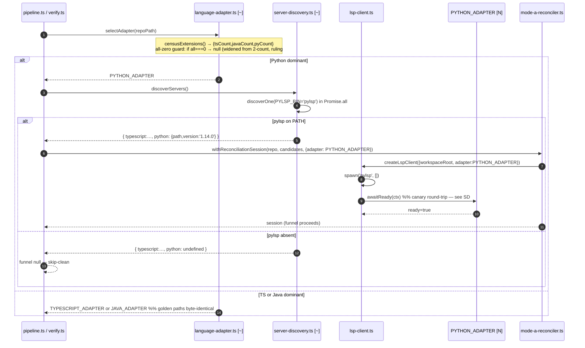

<!--
AI-READERS — load only the sections your task needs.

| Task          | Sections                                                  |
|---------------|-----------------------------------------------------------|
| implement     | ## Components, ## Contracts, ## Invariants                |
| code-review   | ## Invariants, ## KeyDecisions, ## Contracts              |
| qa            | ## Flows, ## EdgeCases                                    |
| scope-impact  | ## BlastRadius, ## CrossCutting                           |

LikeC4 view definitions: grep '^view ' ./159-p5-python-pylsp.likec4
-->

# Solution Design: #159 P5 — Python/pylsp LSP adapter

**Scope:** This design covers the FULL slice (WI-1…WI-7). Implementation may proceed in phases: **narrow scope (WI-1…WI-4)** proves the adapter pattern without the location-mapper seam; **full scope (adds WI-5…WI-7)** closes the external-refusal oracle and validates Mode-A augmentation. WI-V verification is BLOCKED on WI-5 + WI-7.

**Blast** d1=5 files (narrow) → 8 files (full with mapper seam) · d2=mode-A funnel on Python repos · d3=TS/Java golden suites (must stay green)

## Problem & Approach

The LSP-augmentation stack shipped TS-first (P3.1) then added Java/jdtls (P3.2). Python repos receive no LSP confidence promotions (0.70→0.90) and no Mode-C measurement because `selectAdapter` has no Python branch, `server-discovery` does not look for `pylsp`, and the canary sampler carries no Python strategy.

The load-bearing design force is that `pylsp` returns ordinary `file://` URIs for *all* definitions — including stdlib and site-packages — with no special scheme like Java's `jdt://`. The only signal distinguishing an in-repo definition from an external one is whether the resolved path falls outside the workspace root. The EARS spec requires external defs to bucket as `{ kind: 'NO_NODE', external: true }` so Mode-C can separate correct external-refusals from recall-misses.

**Approach:** extend, not invent — mirrors the Java P3.2 pattern exactly. All five LSP seam files gain additive-only changes. The single non-obvious call is closing the external-refusal gap directly in the location-mapper's existing realpath/containment guard (seam Option C) rather than widening the `classifyUri` interface, which keeps `PYTHON_ADAPTER` a module-level singleton symmetric with `TYPESCRIPT_ADAPTER` and `JAVA_ADAPTER`.

## KeyDecisions

| Decision | Options considered | Choice | Rationale |
|----------|--------------------|--------|-----------|
| External-refusal seam | A: rely on bare `{NO_NODE}` from existing guard; B: widen `classifyUri(uri, ctx?)` interface; **C: set `external:true` in mapper's existing out-of-repo branch** | Option C | Single source of truth for containment already in `location-mapper.ts:451-510`; `resolvedDeps.repoPath` already in scope; LanguageAdapter interface untouched; `PYTHON_ADAPTER` stays singleton. Option A fails EARS (no `external` flag → Mode-C cannot distinguish miss from refusal). Option B duplicates containment logic and requires interface + MapperDeps + 3 wire-site edits. **Note (reconciled with Challenge Ledger ruling #1 / R2-5):** Option C also extends `MapperDeps` with `adapterId?` and has 2 wire sites (pipeline + mode-c-verifier); the gate is `adapterId==='python'`, not classifyUri-presence — `pipeline.ts:868` binds classifyUri for TS/Java too, so presence-gating would break their byte-identical goldens. See Challenge Ledger for full ruling. |
| Adapter shape | Factory `createPythonAdapter(workspaceRoot)`; **singleton `PYTHON_ADAPTER`** | Singleton | Factory was only needed under Option B. Choosing seam Option C dissolves the requirement; singleton is symmetric with TS/Java siblings. |
| `awaitReady` | No-op (immediately true); `language/status` wait; **one canary `textDocument/definition` round-trip, ~10s deadline** | Canary round-trip | pylsp emits no `language/status` / `ServiceReady` notification so the notification-wait would always hit the full deadline. A no-op skips the EARS-required responsiveness check entirely. Canary probe is the Java "path B" backstop shape, stripped of the notification listener. |
| Comment blanker | Reuse `blankUnsafeLines`; **new Python-specific pre-pass** | New `blankPythonUnsafeLines` | Source-verified: `blankUnsafeLines` handles only `/* */`, `//`, and backtick template literals. Python `#` line comments and `"""` / `'''` triple-quoted strings are unhandled — regex matches inside docstrings would produce wrong canary samples. |
| Canary priority | import first; **def/class decl → call-site → import last-resort** | Decl first | Mirrors JAVA_CANARY_STRATEGY rationale: pylsp, like jdtls, returns `[]` for definition requests on import-declaration tokens. Declaration names give the highest-quality canary positions. |
| PYLSP_BIN value | `'pyls'` (deprecated); **`'pylsp'`** | `'pylsp'` | Confirmed: `/Users/NgocVo_1/.local/bin/pylsp --version` → `pylsp v1.14.0`. `pyls` is the deprecated PyPI predecessor. |

## Architecture (C2)

The <span style="color:var(--new)">pylsp process [N]</span> is a new container (spawned per-run over stdio). The <span class="hl-u">LSP layer [~]</span> gains `PYTHON_ADAPTER` and supporting strategy objects. No container is removed.

<div class="figure">
  <likec4-view view-id="c2_lsp_layer" interactive></likec4-view>
  <div class="caption">C2 — containers (color = change type). pylsp is new [N]; LSP layer updated [~].</div>
</div>

## Components

### Container: LSP layer

<div class="figure">
  <likec4-view view-id="c3_lsp_components" interactive></likec4-view>
  <div class="caption">C3 — LSP layer components. PYTHON_ADAPTER [N]; language-adapter / canary-sampler / server-discovery / location-mapper [~].</div>
</div>

#### Sequence: selectAdapter + PYTHON_ADAPTER wiring {#sd-pipeline-selectadapter}



#### Sequence: canary probe + awaitReady {#sd-canary-probe}

```mermaid
sequenceDiagram
  autonumber
  participant PA as PYTHON_ADAPTER [N]
  participant CS as canary-sampler.ts [~]
  participant LspC as lsp-client.ts
  participant Py as pylsp process [N]

  PA->>CS: buildCanarySamples(repoPath, {strategy: PYTHON_CANARY_STRATEGY})
  Note over CS: walk .py files, skip EXCLUDED_DIRS<br/>(+__pycache__,.venv,site-packages,dist-packages,.tox,eggs,.eggs)
  CS->>CS: blankPythonUnsafeLines(content)  %% # comments + triple-quoted strings → spaces
  Note over CS: Priority 1: def NAME( / class NAME<br/>Priority 2: bare call-site NAME(<br/>Priority 3: import x (last-resort)
  CS-->>PA: Sample[] (up to SCAN_CAP files)
  alt at least one sample found
    PA->>LspC: textDocument/didOpen(canary .py file)
    PA->>LspC: textDocument/definition @ sample position
    LspC->>Py: JSON-RPC textDocument/definition
    Py-->>LspC: Location[] or null
    alt non-empty Location[]
      LspC-->>PA: Location[]
      PA-->>PA: resolve true (ready)
    else empty / null
      LspC-->>PA: []
      PA-->>PA: try next sample
    end
  else no sample (empty repo / all excluded)
    PA-->>PA: resolve false — funnel refuses
  end
  Note over PA: deadline ~10s; resolves false on timeout (never rejects)<br/>NO language/status listener registered (pylsp emits none)
```

#### Sequence: textDocument/definition + external-refusal {#sd-definition-lookup}

```mermaid
sequenceDiagram
  autonumber
  participant MA as mode-a-reconciler.ts
  participant LspC as lsp-client.ts
  participant Py as pylsp process [N]
  participant PA as PYTHON_ADAPTER [N]
  participant LM as location-mapper.ts [~]
  participant MC as mode-c-verifier.ts

  MA->>LspC: textDocument/definition @ call-site position
  LspC->>Py: JSON-RPC textDocument/definition
  Py-->>LspC: Location(uri=file:///…)
  LspC-->>MA: Location

  MA->>LM: mapLocationToNodeId(loc, deps={classifyUri:PA.classifyUri, repoPath})
  LM->>PA: classifyUri(uri)
  alt non-file:// URI
    PA-->>LM: 'unmappable'
    LM-->>MA: {kind:'NO_NODE'}
  else file:// URI (all Python defs)
    PA-->>LM: 'workspace'  %% scheme-only signal; containment checked downstream
    LM->>LM: fileURLToPath(uri) → absPath
    LM->>LM: realpath(absPath) vs realpath(repoPath)
    alt absPath inside repo
      LM->>LM: path.relative → relPath (in-repo)
      LM-->>MA: {kind:'node', nodeId}  %% confidence 0.70→0.90
    else absPath outside repo (stdlib / site-packages)
      Note over LM: out-of-repo branch sets external:true<br/>ONLY when MapperDeps.adapterId === 'python' (seam Option C, ruling #1)<br/>TS/Java repos still return bare {NO_NODE} at this branch
      LM-->>MA: {kind:'NO_NODE', external:true}  %% correct external-refusal
      MA-->>MC: bucket as external-refusal (not recall-miss)
    else realpath/fileURLToPath fails (broken symlink / FS race / malformed URI) AND adapterId==='python'
      Note over LM: refuse-over-guess (ruling #10, REVISED R2-2): return BARE NO_NODE<br/>(NOT external:true — realpath failure has no in/out-of-repo signal)<br/>rather than fall through to normalizeLocationUri scheme-strip at :482
      LM-->>MA: {kind:'NO_NODE'}
    end
  end
```

## Contracts

```ts
// language-adapter.ts — interface UNCHANGED; id union widened additively
export interface LanguageAdapter {
  readonly id: 'typescript' | 'java' | 'python';  // widened; no switch/discriminant in prod
  readonly serverBinary: string;
  readonly languageId: string;
  spawnArgs(ctx: { workspaceRoot: string }): string[];
  readonly initializationOptions: unknown;
  awaitReady(ctx: AdapterReadyCtx): Promise<boolean>;
  readonly canary: LanguageCanaryStrategy;
  classifyUri(uri: string): 'workspace' | 'external' | 'unmappable';
}

// PYTHON_ADAPTER singleton (new — language-adapter.ts)
export const PYTHON_ADAPTER: LanguageAdapter = {
  id: 'python',
  serverBinary: 'pylsp',
  languageId: 'python',
  spawnArgs: () => [],   // no args; pylsp uses stdio transport by default
  initializationOptions: {},
  classifyUri: (uri) =>
    uri.startsWith('file://') ? 'workspace' : 'unmappable',
  // classifyUri returns 'workspace' for ALL file:// (Option C implementation detail, ruling #3).
  // Containment + external:true is the mapper's responsibility, gated on adapterId==='python'.
  awaitReady: async (ctx) => {
    // INLINE on ctx.connection (ruling #8 — Java path-B shape):
    //   1. buildCanarySamples(repoPath, {strategy: PYTHON_CANARY_STRATEGY})
    //   2. ctx.connection.sendNotification(textDocument/didOpen, canaryFile)
    //   3. ctx.connection.sendRequest(textDocument/definition, samplePos) → iterate Sample[]
    //      → resolve true on first non-empty Location[]; resolve false if ALL empty OR >10s
    // Unit test MUST assert a textDocument/definition request was issued (ruling #8).
  },
  canary: PYTHON_CANARY_STRATEGY,
};

// PYTHON_CANARY_STRATEGY (new — canary-sampler.ts)
export const PYTHON_CANARY_STRATEGY: LanguageCanaryStrategy = {
  isCandidateFile: (name) => name.endsWith('.py'),
  tryExtractSample: (absPath, content) => {
    // 1. blankPythonUnsafeLines(content) — blank # comments + """ / ''' blocks
    // Priority 1: /(async\s+)?def\s+(NAME)/ or /class\s+(NAME)/ — decl name position (ruling #12)
    // Priority 2: bare call-site /NAME\s*\(/ — function invocation
    // Priority 3: /import\s+(NAME)/ or /from .+ import .*(NAME)/ — last-resort
    // Fixtures required: async def, decorated def, multi-line sig, f-string with braces
  },
};

// server-discovery.ts — DiscoveredServers additive widen (expand-contract)
export interface DiscoveredServers {
  typescript: DiscoveredServer | null;
  java?: DiscoveredServer | null;   // existing optional key
  python?: DiscoveredServer | null; // new optional key [N]
}

// location-mapper.ts — MapperDeps gains adapterId signal (ruling #1, #2)
// MapperResult unchanged shape; external:true set only when adapterId==='python'
interface MapperDeps {
  classifyUri?: (uri: string) => 'workspace' | 'external' | 'unmappable';
  repoPath?: string;      // threaded from pipeline.ts:868, mode-c-verifier.ts:755 (ruling #2)
  adapterId?: string;     // 'python' gates external:true; absent → TS/Java bare {NO_NODE}
}
type MapperResult =
  | { kind: 'node'; nodeId: string }
  | { kind: 'NO_NODE'; external?: boolean }   // external:true only when adapterId==='python' + out-of-repo
  | { kind: 'AMBIGUOUS' };
```

**PYLSP_BIN** = `'pylsp'` (confirmed v1.14.0 at `/Users/NgocVo_1/.local/bin/pylsp`).

**awaitReady deadline**: ~10 s (vs Java's 120 s — pylsp starts in <1 s, no JVM).

**EXCLUDED_DIRS extension** (canary walker): `__pycache__`, `.venv`, `site-packages`, `dist-packages`, `.tox`, `eggs`, `.eggs` (separate from SKIP_DIRS used in census).

**SKIP_DIRS extension** (census): `site-packages`, `dist-packages`, `.tox`, `eggs`, `.eggs` (in addition to existing `__pycache__`, `.venv`).

**Mis-map oracle** (ruling #9 — label-free, no ground truth required): every NodeId returned by `mapLocationToNodeId` for a Python repo MUST resolve to a path strictly inside `repoPath`; every out-of-repo `Location` (stdlib / site-packages) MUST produce `{ kind:'NO_NODE', external:true }`. WI-7 integration test pins a fixed crawl4ai commit and asserts a minimum augmentation count + both invariants in aggregate — no individual URI spot-checks.

**Req #5 testable contract** (ruling #3): the testable outcome is `mapLocationToNodeId(outOfRepoLoc, deps) → {NO_NODE, external:true}`. `classifyUri` returning `'workspace'` for all `file://` is an Option C implementation detail, not a requirement. The "classifyUri SHALL return external" clause is withdrawn.

## Invariants

- **I-1 (TS-path invariance):** TS and Java golden suites byte-identical. ~~The `external:true` flag fires only when `classifyUri` is present.~~ **CORRECTED (ledger #1):** TS/Java repos DO pass `classifyUri` at the mapper (pipeline.ts:867-883), so classifyUri-presence is NOT a safe gate. The `external:true` flag fires only when the active adapter's id is `'python'` (mapper receives the adapter id via `MapperDeps`). TS/Java out-of-repo `file://` defs still return bare `{NO_NODE}` — guarded by a mandatory fitness test exercising the full pipeline deps bag (repoPath + classifyUri both present).
- **I-2 (external-refusal, EARS):** every `file://` URI whose resolved path falls outside `repoPath` (stdlib, site-packages) produces `{ kind:'NO_NODE', external:true }`. Mis-map count = 0.
- **I-3 (no pre-ready publish):** Mode-A definitions are never published before `awaitReady` resolves true. `awaitReady` resolves false on timeout; the funnel returns null on false.
- **I-4 (graceful degradation):** `pylsp` absent from PATH/node_modules/.bin/npx → `result.python` undefined → funnel returns null, skip-clean (no failure, no crash).
- **I-5 (singleton adapter):** `PYTHON_ADAPTER` is a module-level constant. No per-run factory, no capture of `workspaceRoot` inside the adapter. Containment is the mapper's sole responsibility.
- **I-6 (canary priority lock):** Python canary priority order (def/class > call-site > import) is locked by unit-test assertion. Import-only fixture MUST fall to last-resort. Priority-1 regex covers `(async\s+)?def NAME` and `class NAME` (ruling #12).
- **I-7 (EXCLUDED_DIRS ≠ SKIP_DIRS):** the canary walker's `EXCLUDED_DIRS` and the census `SKIP_DIRS` are separate sets — both must carry the venv/package dirs. A change to one does not propagate to the other.
- **I-8 (mis-map oracle, ruling #9):** for every Python-repo run, all returned NodeIds resolve to paths inside `repoPath`, and all out-of-repo Locations produce `{NO_NODE, external:true}`. WI-7 asserts these aggregate invariants on a fixed crawl4ai commit.
- **I-9 (realpath-failure refusal, ruling #10; REVISED R2-2/R2-3/R2-4):** when `adapterId==='python'` AND URI is `file://` AND either `fileURLToPath` throws (`absPath===''`) OR `realpathSync` throws, the mapper refuses with **bare `{kind:'NO_NODE'}` (NOT `external:true`)** rather than falling through to the `normalizeLocationUri` scheme-strip at location-mapper.ts:482. `external:true` is reserved for paths that successfully realpath OUTSIDE the repo (R2-2 — realpath failure carries no in/out-of-repo signal, so flagging external would poison the I-8 oracle). The refusal must be injected at the realpath/fileURLToPath try/catch + the `rebased===null`→scheme-strip fall-through (location-mapper.ts:434-483), distinct from the :488/:493 out-of-repo `external:true` tagging. Unit test fixtures (HARD WI-5 gates): (a) un-realpath-able out-of-repo path and (b) malformed `file://` URI — both MUST produce bare `{NO_NODE}` (not a wrong-node match, not external).

## Flows

| Flow | Sequence |
|------|----------|
| Python repo: pipeline selects PYTHON_ADAPTER, discovers pylsp, spawns client | [#sd-pipeline-selectadapter](#sd-pipeline-selectadapter) — happy + pylsp-absent branches |
| awaitReady: canary sample selection, pylsp round-trip, timeout | [#sd-canary-probe](#sd-canary-probe) — happy + no-sample + timeout branches |
| textDocument/definition: in-repo node vs site-packages external-refusal | [#sd-definition-lookup](#sd-definition-lookup) — in-repo + out-of-repo + unmappable branches |

## EdgeCases

- **All `.py` files excluded by EXCLUDED_DIRS** (venv-only repo): `buildCanarySamples` returns `[]`; `awaitReady` resolves `false`; funnel refuses cleanly (I-3).
- **pylsp `--version` hangs or exits non-zero**: `finalize()` tolerates unknown-version (mirrors Java Bug-#1 fix); entry is included with `version:'unknown'`; funnel proceeds if binary path is valid.
- **Mixed TS+Python repo** (pyCount == tsCount): existing `tsCount >= javaCount` tie-break semantics extended — Python wins only on strict dominance (`pyCount > tsCount AND > javaCount`). TS wins ties.
- **Symlinks to site-packages inside the repo**: `realpath` in the containment guard resolves the symlink; the resolved path falls outside `repoPath` → `{ kind:'NO_NODE', external:true }`. No false workspace matches.
- **realpath / fileURLToPath fails** (broken symlink, FS race, permission denied, malformed `file://` URI) when `adapterId==='python'`: mapper refuses with **bare `{kind:'NO_NODE'}`** (REVISED R2-2 — NOT `external:true`; realpath failure gives no in/out-of-repo signal, so flagging external would inflate the I-8 oracle) rather than falling through to scheme-strip at location-mapper.ts:482 (I-9). Two HARD WI-5 unit fixtures required: un-realpath-able path and malformed `file://` URI (rulings #10, R2-2/R2-3/R2-4).
- **Windows paths** (`path.relative` returns absolute on cross-drive): `adapterId==='python'` gate applies to BOTH the `relPath.startsWith('..')` branch AND the `isAbsolute(rel)` branch, so cross-drive site-packages buckets `external:true` correctly (ruling #15). Windows untested in this slice; POSIX-only CI.
- **Triple-quoted strings containing `def ` or `class `**: `blankPythonUnsafeLines` blanks these regions before regex matching — no spurious canary samples from docstrings.
- **`async def` / decorated def**: priority-1 regex `(async\s+)?def\s+NAME` matches both. Decorator line precedes the `def` line — regex lands on the `def`-name token, not the decorator. Multi-line signature and f-string brace content are fixtures in WI-6 (ruling #12).
- **Census truncation bias on large mixed monorepos** (`CENSUS_FILE_LIMIT=2000`): `buildLanguageCensus` caps the file walk at 2000 entries. In a large monorepo where Python files sort late in the directory traversal (e.g. all Python lives under a `services/` subtree that appears after a large `frontend/` TS tree), the census may count zero Python files and select TS or Java as dominant — even when Python is actually dominant. This is an accepted limitation of the current slice. R2-14 (Challenge Ledger ruling, partial/MINOR): no fix in this slice; callers requiring accurate adapter selection on repos above the census limit must either re-order directory traversal or raise `CENSUS_FILE_LIMIT`.

## CrossCutting

- **Telemetry:** `adapter.id` available for any future per-language LSP metric; no new instrumentation in this slice.
- **CI portability:** integration test uses `guarded-skip` (mirrors `java-jdtls-real.test.ts` pattern) — passes when `pylsp` absent (no binary skip-clean), runs when present.
- **Test isolation:** real binary at `/Users/NgocVo_1/.local/bin/pylsp`; validation repo `/Users/NgocVo_1/Documents/sourceCode/crawl4ai` (`pyproject.toml` present). Both required for integration test; unit tests use fs mocks and tmpdir fixtures.

## Scope: Narrow (WI-1…WI-4) vs Full (WI-1…WI-7)

| Phase | WIs | Deliverable | Gate 1 (unit green) | Gate 2 (integration) | Gate 3 (canary + golden) |
|-------|-----|-------------|---|---|---|
| **Narrow canary** | WI-1, WI-2, WI-3, WI-4, WI-6 | PYTHON_ADAPTER + discovery wired end-to-end; canary sampling live | ✓ | ✓ (real pylsp, canary samples) | ✗ BLOCKED — needs WI-5 location-mapper seam + WI-7 crawl4ai validation |
| **Full slice** | WI-1…WI-7 | Canary + external-refusal oracle + Mode-A augmentation floor measured | ✓ | ✓ | ✓ (all 3 ACs: augmentation, external-refusal, mis-map=0) |

The narrow scope proves the adapter pattern works (selectAdapter + awaitReady) without the mapper seam; the full scope closes the external-refusal gap (WI-5) and validates the Mode-A augmentation floor on real code (WI-7).

## BlastRadius

| Depth | Areas |
|-------|-------|
| d1 — will-break / must-update | **Narrow (WI-1…WI-4):** `language-adapter.ts` (census, selectAdapter, PYTHON_ADAPTER, id union — selectAdapter control flow restructured, ruling #5); `canary-sampler.ts` (PYTHON_CANARY_STRATEGY, blankPythonUnsafeLines, EXCLUDED_DIRS); `server-discovery.ts` (PYLSP_BIN, DiscoveredServers, discoverServers); test files that import touched symbols. **Full (adds WI-5):** + `location-mapper.ts` (MapperDeps shape + `adapterId` gate + realpath-failure refusal — rulings #1, #4, #10); `pipeline.ts:868` (wire `adapterId` into MapperDeps — ruling #2/#4); `mode-c-verifier.ts:754-755` (wire `repoPath` + `adapterId` into mapperDeps — ruling #2, BLOCKER) |
| d2 — likely-affected / should-test | Mode-A funnel exercised for first time on Python repos; `impacted_endpoints` BFS for Python edges (under `--lsp` only); integration of `pylsp` binary on CI; TS-out-of-repo golden-regression fitness test (full pipeline deps bag: repoPath + classifyUri present → bare `{NO_NODE}`, ruling #1) |
| d3 — may-need-testing | Existing TS and Java golden suites — must stay green (I-1 lock) |

## DownstreamDocs

| Type | Path | Action |
|------|------|--------|
| adr | `docs/adr/ADR-001-python-pylsp-lsp-adapter.md` | create |
| design | `docs/designs/159-p5-python-pylsp.md` | create (this file) |
| plan | `docs/plans/159-p5-python-pylsp.md` | create (Stage 5) |

## ADRs

`docs/adr/ADR-001-python-pylsp-lsp-adapter.md` — first ADR in the repo; captures the external-refusal seam choice (Option C vs A vs B) and adapter-shape decision (singleton vs factory).

<div class="callout"><b>Autonomous Decisions</b>

- **classifyUri seam → Option C** (set `external:true` in the location-mapper's existing out-of-repo containment branch, gated on `MapperDeps.adapterId === 'python'` — NOT on classifyUri-presence, ruling #1): source-verified that `location-mapper.ts:451-510` already owns realpath+path.relative containment with `resolvedDeps.repoPath` in scope; the minimal gap-close is adding `external:true` there. Option A fails EARS (bare `{NO_NODE}` has no `external` flag; Mode-C cannot distinguish miss from refusal). Option B (brief's original pick — widen `classifyUri(uri,ctx?)`) duplicates containment, touches the interface + MapperDeps type + 3 wire sites. Ruling #2 (BLOCKER) established that Mode-C also requires touching `mode-c-verifier.ts:754-755` — so both B and C now require Mode-C plumbing, but C avoids the LanguageAdapter interface widening. Option C is upheld with corrected scope: MapperDeps gains `adapterId?` + `repoPath?`; three wire sites (pipeline.ts:868, mode-c-verifier.ts:755, mode-a-reconciler) are updated.

- **Adapter shape → module-level singleton `PYTHON_ADAPTER`**: the factory `createPythonAdapter(workspaceRoot)` in the brief was only needed under Option B (where the adapter had to own containment). Option C dissolves that requirement. Singleton is symmetric with `TYPESCRIPT_ADAPTER` / `JAVA_ADAPTER`.

- **awaitReady → one canary `textDocument/definition` round-trip, ~10s deadline, NO `language/status` listener**: pylsp emits no `language/status` / `ServiceReady` notification. A notification-wait would always hit the full deadline. A no-op would bypass the EARS-required responsiveness check. Java "path B" backstop shape reused, notification-wait stripped.

- **Comment blanker → new `blankPythonUnsafeLines`** (cannot reuse `blankUnsafeLines`): source-verified that `blankUnsafeLines` handles only C-style comments (`/* */`, `//`) and backtick template literals. Python `#` line comments and `"""` / `'''` triple-quoted strings are unhandled. New Python blanker raises WI-3 to size L.

- **PYTHON_CANARY_STRATEGY priority**: def/class declaration FIRST, call-site identifier SECOND, import token LAST-RESORT. Mirrors JAVA_CANARY_STRATEGY rationale: pylsp (like jdtls) returns `[]` for definition requests on import-declaration tokens.

- **SKIP_DIRS and EXCLUDED_DIRS are SEPARATE sets** — both extended with `site-packages`, `dist-packages`, `.tox`, `eggs`, `.eggs`. SKIP_DIRS already had `__pycache__`/`.venv`; EXCLUDED_DIRS had neither and must gain both plus the package dirs (Invariant I-7).

- **PYLSP_BIN = `'pylsp'`**: confirmed via `/Users/NgocVo_1/.local/bin/pylsp --version` → `pylsp v1.14.0`. `pyls` is the deprecated predecessor.

- **LanguageAdapter.id union widen** (`'typescript'|'java'` → `|'python'`) is purely additive — no `switch`/`if` over `.id` exists in production code; callers use the adapter as a value-object. Expand-contract; no caller updated before the Python path is live.

- **DiscoveredServers +`python?`**: mirrors existing `java?` optional-key expand-contract pattern. Structural typing ensures all existing callers that destructure `{ typescript }` are unaffected.

- **censusExtensions return shape** `{tsCount,javaCount}` → `+pyCount` is module-private (only `selectAdapter` in the same file consumes it). Not a public interface change.

- **selectAdapter control flow restructured** (ruling #5 — NOT purely additive): the existing all-zero guard (`tsCount===0 && javaCount===0` → null) must be widened to `tsCount===0 && javaCount===0 && pyCount===0`; Python strict-dominance (`pyCount > tsCount && pyCount > javaCount`) must be inserted BEFORE the existing `tsCount >= javaCount` tie-break. A pure-Python repo (tsCount=0, javaCount=0, pyCount>0) previously short-circuited to null via the all-zero guard and then falsely resolved to TS via tie-break — both paths are load-bearing control flow that must be restructured, not appended to.

- **LspClient / pipeline / mode-a-reconciler / mode-c-verifier adapter pass-through**: LspClient is already parameterized (WI-4/Java slice). However, **mode-c-verifier.ts:754-755 requires an explicit edit** (ruling #2, BLOCKER): thread `repoPath: opts.repoPath` AND `adapterId: adapter.id` into `mapperDeps` when an adapter is active. "Zero changes to mode-c-verifier" is withdrawn. pipeline.ts:868 and mode-a-reconciler similarly receive `adapterId` (ruling #4, WI-5 re-sized to M+).

- **ADR at `docs/adr/ADR-001-python-pylsp-lsp-adapter.md`** — first ADR in the repo; establishes a new repo-wide ADR convention as a deliberate (not silent) side effect of this slice (ruling #14). The ADR numbering is independent of design-doc-internal KD table numbering.

- **CRITICAL graph risk on `selectAdapter`/`buildCanarySamples`** (12+/20+ processes): risk is process-coverage, not breaking behavior. Every change is additive; the TS/Java golden funnels are protected by byte-identical fitness functions (I-1 lock).

### Challenge Ledger (adjudicated 2026-06-14)

Adversarial reviewers (3 lenses) pressure-tested the autonomous decisions; source-verified against `location-mapper.ts`, `mode-c-verifier.ts:754-755`, `pipeline.ts:867-883`, `language-adapter.ts:228-229,524-539`, `canary-sampler.ts:101-107`. Rulings:

| # | Decision | Adversarial objection (lens) | Ruling | Rationale / revision |
|---|----------|------------------------------|--------|----------------------|
| 1 | Option C external-refusal seam, gated on "classifyUri present" (I-1) | TS/Java repos DO supply `classifyUri` at the mapper (pipeline.ts:867-883 passes `lspAdapter?.classifyUri.bind(...)` for the SELECTED adapter; `TYPESCRIPT_ADAPTER.classifyUri` returns `'workspace'` for all `file://`). Gating `external:true` on classifyUri-presence flips every out-of-repo TS/Java def (node_modules, monorepo siblings) to `external:true` → breaks I-1 byte-identical golden (Architecture Skeptic; Decision Auditor) | **accept** (BLOCKER) | Verified true. **Revision:** gate `external:true` on adapter **identity** (`adapter.id === 'python'`), NOT classifyUri-presence. Mapper must receive the adapter id (extend `MapperDeps` with `adapterId?: string`, or pass a boolean `flagExternalOutOfRepo`). The classifyUri result is consumed+discarded in the KD-3 block before the containment guard, so it carries no usable signal at the out-of-repo return. Add a fitness test: TS repo + out-of-repo `file://` def through the FULL pipeline.ts deps bag (repoPath + classifyUri both present) MUST still return bare `{NO_NODE}`. |
| 2 | Option C "zero changes to mode-c-verifier"; external-refusal works on the Mode-C path | `mode-c-verifier.ts:754-755` builds `mapperDeps = { classifyUri }` with NO `repoPath` (even though `opts.repoPath` is in scope at :161). The containment branch is gated on `resolvedDeps.repoPath` (location-mapper.ts:431) → never runs in Mode-C → out-of-repo Python defs fall to the `relPath.startsWith('..')` guard returning **bare `{NO_NODE}`**. crawl4ai validation (req #9) runs through Mode-C → external-refusal AC UNACHIEVABLE as designed (all three lenses) | **accept** (BLOCKER) | Verified true. **Revision:** add an explicit code change (fold into WI-5 or new WI) threading `repoPath: opts.repoPath` AND the adapter-id signal into `mapperDeps` at mode-c-verifier.ts:754-755 when an adapter is active. "Zero changes to mode-c-verifier" is withdrawn. Both B and C now require touching Mode-C plumbing — the "C is strictly simpler" rationale is weakened but C still avoids the LanguageAdapter interface widening, so C is upheld as the seam with the corrected scope. |
| 3 | Req #5 text "classifyUri SHALL return external for out-of-workspace file://" vs design "classifyUri returns workspace for all file://" | Direct unreconciled contradiction; silent requirement-narrowing (Decision Auditor) | **accept** (MAJOR) | **Revision:** amend Req #5 to state the testable contract is the OUTCOME (`mapLocationToNodeId` → `{NO_NODE, external:true}` for out-of-repo `file://`), with classifyUri's `'workspace'` return an implementation detail of Option C. Remove the literal "classifyUri SHALL return external" clause. |
| 4 | WI-5 framed as "one additive line" on the out-of-repo branch | Two distinct bare-`{NO_NODE}` returns reachable (isUnindexablePath guard + the `..`/absolute guard); gate mechanism (classifyUri vs repoPath) mis-stated (Decision Auditor) | **accept** (MAJOR) | **Revision:** WI-5 names the precise branch (`relPath.startsWith('..') || isAbsolute(relPath)`), confirms whether `isUnindexablePath` can fire for out-of-repo Python, states the exact gate (adapter-id = python per ruling #1), and re-sizes from the implied S/M upward to **M+** (MapperDeps shape change + 3 wire sites: pipeline.ts:868, mode-c-verifier.ts:755, and the mode-a-reconciler call). |
| 5 | WI-1 selectAdapter "additive, no new control flow" | All-zero guard `tsCount===0 && javaCount===0` short-circuits to `null` before Python is considered; tie-break `tsCount >= javaCount` returns TS for a pure-Python repo (tsCount=0,javaCount=0,pyCount=50 → 0>=0 true). Control flow is load-bearing, must be restructured not appended (Architecture Skeptic) | **accept** (MAJOR) | Verified at language-adapter.ts:524-539. **Revision:** WI-1 widens the all-zero guard to include `pyCount`, and inserts strict Python dominance (`pyCount > tsCount && pyCount > javaCount`) BEFORE the `tsCount >= javaCount` tie-break. Add a unit case for (tsCount=0, javaCount=0, pyCount>0) → PYTHON_ADAPTER. |
| 6 | blastRadius risk HIGH = "process-coverage, not breaking" | Given ruling #1, the mapper edit IS non-additive with genuine TS/Java breaking potential until adapter-id gating + the TS fitness test exist (Architecture Skeptic) | **partial** (MINOR) | Risk stays HIGH (not raised). Re-derive blast radius after the ruling-#1/#2 fix: location-mapper MapperDeps gains an adapter-id input → pipeline.ts:868, mode-c-verifier.ts:755, mode-a-reconciler become **d1 must-update**; reclassify Mode-C deps site from d3-unchanged to d1. |
| 7 | awaitReady resolves false when canary returns `[]` (healthy pylsp, empty def) | Conflates "server not ready" with "this definition query was empty"; single-sample; healthy pylsp could be declared not-ready and skip the whole funnel (Decision Auditor; Architecture Skeptic; Requirement Adversary) | **partial** (MINOR) | The sd-canary-probe diagram already shows "try next sample"; WI-2's prose collapsed it to one round-trip. **Revision:** WI-2 specifies awaitReady iterates the full `Sample[]` up to the ~10s deadline; resolves true on the FIRST non-empty `Location[]`; resolves false only if ALL samples empty OR deadline hit. The existing `defaultProbe` (mode-c-verifier.ts:~896) treats `[]` as not-ready — Python's inline probe diverges intentionally (multi-sample). "No usable canary" logs a distinct skip-reason vs "pylsp absent" (req #9 debuggability). Reject the stronger ask to treat any well-formed `[]` as ready — that would defeat the readiness signal on a genuinely-unbuilt workspace. |
| 8 | Req #6 awaitReady wiring (inline buildCanarySamples vs injected ctx.probe) unspecified; round-trip untestable | Adapter may not actually issue a round-trip if neither wired (Requirement Adversary) | **accept** (MAJOR) | **Revision:** WI-2 states explicitly that `PYTHON_ADAPTER.awaitReady` calls `buildCanarySamples` + `didOpen` + `textDocument/definition` INLINE on `ctx.connection` (the Java path-B shape), independent of any injected probe. Add a unit test asserting a `textDocument/definition` request actually occurs during awaitReady. |
| 9 | Req #9 "non-zero augmentations / zero mis-maps" not measurable | No threshold, no mis-map oracle; WI-7 spot-checks hand-picked URIs, disconnected from the AC (Requirement Adversary) | **accept** (MAJOR) | **Revision:** define the mis-map oracle as a checkable invariant needing no ground-truth labels — every returned NodeId resolves to a path strictly inside `repoPath`, and every out-of-repo Location buckets `external:true`. Pin a fixed crawl4ai commit and a minimum augmentation count. WI-7 asserts these aggregate metrics, not individual URIs. |
| 10 | Req #5 mis-map: realpath FAILURE fallthrough to scheme-strip | If realpath fails (broken symlink/FS race/permission), code falls through to `normalizeLocationUri`; a stdlib path could scheme-strip to a relPath that matches an in-repo file tail → wrong-node match (Requirement Adversary) | **accept** (MAJOR) | **Revision:** when the adapter is active (python) AND URI is `file://` AND realpath fails, refuse (`{NO_NODE}`, prefer `external:true`) rather than fall through to scheme-strip. Add a WI-6 unit case for an un-realpath-able out-of-repo path asserting NO_NODE. Security-adjacent (refuse-over-guess). |
| 11 | pylsp process cleanup on awaitReady timeout/funnel refusal unspecified | No AC verifying the child process is killed / didOpen'd doc closed; leaked pylsp per run (Requirement Adversary) | **partial** (MINOR) | **Revision:** state explicitly whether `LspClient.dispose()` (the Java path) already SIGKILLs the child and closes documents — if so Python inherits it (likely true; confirm). Add an integration assertion: on awaitReady false/timeout and on funnel refusal, no orphan pylsp remains. If dispose does not cover it, add a WI. |
| 12 | PYTHON_CANARY_STRATEGY: async def / decorated def / multi-line sig / f-string brace gaps | Edge cases unspecified; "async def" possibly unmatched (Requirement Adversary) | **accept** (MINOR) | **Revision:** priority-1 regex matches `(async\s+)?def\s+NAME` and `class\s+NAME`. Add WI-6 fixtures: async def, decorated def (decorator line precedes — regex still lands on the def-name line), multi-line signature, f-string with brace content (blanked by blankPythonUnsafeLines). |
| 13 | EXCLUDED_DIRS current contents asserted not verified | If the set already covers venv, the additive delta is wrong (Decision Auditor) | **reject** (MINOR) | Now source-verified: `EXCLUDED_DIRS = {node_modules, dist, .git, .gitnexus, build, coverage}` (canary-sampler.ts:101-107) — has NEITHER `__pycache__` NOR `.venv` NOR any package dir. The synthesis claim (I-7/WI-3 delta) is exactly correct. Note for implementer: the walker prunes by `EXCLUDED_DIRS.has(entry)` only — it does NOT skip dotfiles or honor `.gitignore`, so `.venv`/`.tox` MUST be added explicitly (they are). |
| 14 | ADR-001 as first repo ADR = scope expansion / shaky continuity claim | Establishes a repo-wide convention as a feature-slice side effect (Decision Auditor) | **partial** (MINOR) | ADR-001 already exists on disk (docs/adr/ created). Keep it, but the KeyDecisions table already captures the seam rationale; drop the false "continues KD-1/KD-3 numbering from the Java DESIGN doc" continuity claim (a design doc's internal KD numbering is not an ADR sequence). Flag in the plan that ADR-001 establishes a new repo convention so it is a deliberate, not silent, decision. |
| 15 | Windows out-of-scope vs req #4/#5 phrased in path.relative absolute-on-cross-drive terms | Cross-drive site-packages returns absolute rel → NO_NODE but NO external:true → req #5 silently fails on Windows (Requirement Adversary) | **accept** (MINOR) | **Revision:** since the ruling-#1 fix adds `external:true` gated on adapter-id at BOTH out-of-repo returns (the `..` guard AND the `isAbsolute(rel)` guard), the cross-drive case buckets correctly for free. Keep Windows untested in this slice but the flag now applies to both branches, removing the latent contradiction. POSIX-frame the req wording; Windows verification is a follow-up. |

**Net:** 2 BLOCKER + 6 MAJOR accepted, 1 MAJOR + 4 MINOR partial, 1 MINOR rejected. The core revision: Option C's `external:true` is gated on **adapter identity (python)**, not classifyUri-presence, and **`repoPath` + adapter-id must be threaded into the Mode-C deps bag** — making the seam edit M+ touching MapperDeps shape and 3 wire sites, with a mandatory TS-out-of-repo golden-regression fitness test. Overall risk remains **HIGH**.

### Challenge Ledger — Round 2 (adjudicated 2026-06-14)

A second adversarial wave (3 lenses, 19 pooled challenges) pressure-tested the round-1-adjudicated plan, source-verified against `location-mapper.ts:200-221,431-504`, `mode-c-verifier.ts:155-214,740-759`, `pipeline.ts:855-888`, `mode-a-reconciler.ts:1773-1831`, `language-adapter.ts:269-435,439-539`, `lsp-client.ts:744-850`, `canary-sampler.ts:96-112`. Rulings below; each accepted/partial ruling carries a remediation that the implementer MUST apply.

| # | Decision | Adversarial objection (lens) | Ruling | Rationale / revision |
|---|----------|------------------------------|--------|----------------------|
| R2-1 | WI-5 external:true gate at the out-of-repo branch (ruling #1/#4) | `isUnindexablePath(relPath)` at **location-mapper.ts:488 fires BEFORE** the `..`/`isAbsolute` guard at :493 and returns **bare `{NO_NODE}`** (no external flag). A venv site-packages path whose `path.relative` produces `../../.venv/.../dist/mod.py` matches `.includes('/dist/')` → bucketed as recall-MISS not external-refusal, silently violating I-8/Req#9 (Decision Auditor + Architecture Skeptic, two lenses, deduped) | **accept** (MAJOR) | Source-verified at :211-221 and :488. The :488 guard is reachable for out-of-repo Python paths. **Remediation:** WI-5 must tag `external:true` on the :488 `isUnindexablePath` return too, when `adapterId==='python'` AND the resolved path is out-of-repo. Cleanest: compute the out-of-repo predicate ONCE (the `rebased===null` + `relPath.startsWith('..')||isAbsolute` condition) and apply the python-gated `external:true` to BOTH the :488 and :493 returns. Add a WI-6 fixture: out-of-repo `file://` whose relPath contains `/dist/` (or `/node_modules/`) under `adapterId='python'` MUST return `{NO_NODE, external:true}`. |
| R2-2 | I-9 / ruling #10: realpath-failure → refuse with `external:true` (gated python) | Over-reaches the OTHER direction: an **IN-REPO** Python file that fails realpath transiently (FS race, EACCES, NFS) is a genuine recall-miss, yet ruling #10 forces it into the external bucket — inflating the external-refusal count and corrupting the very I-8 oracle WI-7 asserts (Decision Auditor) | **partial** (MAJOR) | Legitimate metric-poisoning concern, but the recommended bare-`{NO_NODE}` fully reopens the scheme-strip wrong-node door that ruling #10 closed — `realpath` failing tells us nothing about in/out-of-repo, so we cannot cheaply distinguish "in-repo race" from "out-of-repo stdlib." **Remediation:** keep the refusal (security-adjacent, refuse-over-guess upheld) but DROP `external:true` on the realpath-FAILURE branch → return bare `{NO_NODE}`. Rationale: the wrong-node match is prevented by refusing the scheme-strip fall-through, which bare `{NO_NODE}` already does; `external:true` is only honest for paths that successfully realpath OUTSIDE the repo. This corrects I-9 (revise: realpath-fail → bare `{NO_NODE}`, NOT `external:true`) and the WI-6 realpath-failure fixture asserts bare `{NO_NODE}`. The mis-map oracle (I-8) is preserved: no wrong-node, no false external inflation. |
| R2-3 | WI-9 / fileURLToPath-throws sibling door (malformed URI → `absPath=''`) | When `fileURLToPath` throws (location-mapper.ts:436-438) `absPath=''`, skipping the entire realpath/containment block and falling straight to `normalizeLocationUri` scheme-strip at :482 — the SAME wrong-node door as the realpath-throws case but via a different branch I-9 never names (Requirement Adversary) | **accept** (MINOR) | Source-verified at :434-439, :448 (`if (absPath)` skips the whole block on empty). Structurally identical refusal door. **Remediation:** extend the I-9 refusal gate to BOTH conditions when `adapterId==='python'` AND uri startsWith `file://`: the `fileURLToPath`-throws (`absPath===''`) branch AND the `realpathSync`-throws branch both refuse with bare `{NO_NODE}` (per R2-2) rather than scheme-strip. Add a WI-6 malformed-`file://` fixture. Lower severity: malformed `file://` from pylsp is unlikely, but it is exactly the mis-map class Req#5 forbids. |
| R2-4 | WI-5 realpath-failure refusal scoped into the "out-of-repo branch (~line 506-510)" | The realpath-failure refusal must be injected at a DIFFERENT code site than the out-of-repo guard: realpath-throw sets `realAbsPath=''`→`rebased` stays null→falls to scheme-strip at :482, NOT to the :493 guard. An implementer patching only :493 leaves the :482 fall-through intact → I-9 silently unimplemented while tests stay green (Architecture Skeptic) | **accept** (MAJOR) | Source-verified: the realpath try/catch is at :449-456; the `rebased===null` fall-through to scheme-strip is at :475-483. This is upstream of and distinct from the :488/:493 guards. **Remediation:** WI-5's files list must name TWO distinct edit regions: (a) location-mapper.ts:434-483 (the `fileURLToPath`/`realpathSync` try/catch + the `rebased===null`→scheme-strip fall-through — inject the python-gated refusal HERE before :482), and (b) the :488/:493 out-of-repo `external:true` tagging (R2-1). Make the un-realpath-able-path + malformed-URI fixtures HARD acceptance gates for WI-5, not WI-6 afterthoughts — they are the only tests proving the :482 door is closed. |
| R2-5 | WI-5 "three wire sites incl. the mode-a-reconciler call" | Mode-A does NOT call the mapper with a deps bag: `reconcileDecisions` (mode-a-reconciler.ts:1780) consumes an injected `mapFn` and invokes it as `mapFn(locs[0], repoId)` at :1826 — only two args. The deps bag (repoPath+classifyUri) lives in the **pipeline.ts:868 closure**, which IS the Mode-A mapFn. "the mode-a-reconciler call" as a third distinct wire site is a phantom that will send an implementer hunting for a non-existent mapper call (Decision Auditor) | **accept** (MINOR) | Source-verified at mode-a-reconciler.ts:1780,1826 (two-arg call) and pipeline.ts:868-884 (the closure that bakes in `executeParameterized`+`repoPath`+`classifyUri`). **Remediation:** restate WI-5 wire sites as exactly TWO mapper-deps construction points — pipeline.ts:868 (closure: ADD `adapterId: lspAdapter?.id` alongside the existing repoPath+classifyUri) and mode-c-verifier.ts:755 (ADD `repoPath: opts.repoPath` AND `adapterId: opts.adapter?.id`). Drop the phantom "mode-a-reconciler call"; note Mode-A is served by the pipeline closure. Net wire-site count drops from 3 to 2, but mode-c-verifier remains the BLOCKER edit. |
| R2-6 | blastRadius d1 "mode-a-reconciler — wire adapterId"; is there a 2nd silent repoPath gap? | Synthesis asserted-but-did-not-verify whether the Mode-A mapper call passes repoPath; if Mode-A omits repoPath like Mode-C does, the in-repo→external containment guard never runs on the PRIMARY augmentation path (Architecture Skeptic) | **reject** (MINOR) | Source-verified — no second gap. The pipeline.ts:868 closure (the Mode-A mapFn) already passes `repoPath` AND `classifyUri`; only `adapterId` is missing. Mode-A's containment guard (location-mapper.ts:432) DOES run today. The gap is Mode-C-only (mode-c-verifier.ts:755 bag has neither repoPath nor adapterId). Remediation folded into R2-5: pipeline closure adds only `adapterId`; mode-c adds both. Blast-radius d1 stands; "mode-a-reconciler.ts" should be relabeled "pipeline.ts:868 closure (Mode-A mapFn)" for accuracy. |
| R2-7 | mode-c-verifier `mapperDeps` is an `any`-typed bag — adding adapterId is type-unchecked | Verified at mode-c-verifier.ts:174 the third mapper arg is `any`; a key typo (`adapterID`, `repoRoot`) silently produces `undefined`, the gate never fires, external-refusal regresses to bare `{NO_NODE}` with a GREEN build — the `any` seam removes the tsc safety net (Decision Auditor) | **accept** (MINOR) | Source-verified at :174 (`deps?: any`). Real silent-regression surface. **Remediation:** WI-6 MUST add a Mode-C unit test asserting an out-of-repo `file://` with `opts.adapter.id==='python'` buckets as external-refusal (NOT recall-miss) — so a silent key typo fails a test rather than shipping green. Optionally narrow the build-site object to a typed `Pick<MapperDeps,'classifyUri'|'repoPath'|'adapterId'>` at construction; the test is the hard requirement, the type-narrow is nice-to-have. |
| R2-8 | Req #9 — "non-zero augmentation count" clause (distinct from external-refusal clause) | The req bundles TWO outcomes on TWO funnels and the plan only proves one. WI-7 + the I-8 mis-map oracle are written entirely around external-refusal (Mode-C). NOTHING in WI-7 asserts a positive lower bound on Mode-A confirm/correct augmentations actually produced. crawl4ai (heavily-decorated async) could plausibly yield external-refusals + recall-misses but ZERO augmentations — PASSING every WI-7 assertion while FAILING Req#9's primary clause (Requirement Adversary) | **accept** (MAJOR) | Verified: I-8/I-2 and the WI-7 behavior list are all external-refusal/mis-map invariants; the only Mode-A touch is "definition returns a valid Location[]," a single round-trip, not proof the reconciler promoted any edge. **Remediation:** split Req#9 into two independently-asserted ACs in WI-7: **(a)** Mode-A augmentation floor — assert `reconcileReport.decisions` contains ≥N confirm/correct outcomes on the pinned crawl4ai commit; **measure the actual count first via a scouting step, then pin a floor below it** (do NOT ship an AC with an undefined threshold); **(b)** the external-refusal/mis-map oracle (already in I-8). If (a) cannot be measured pre-implementation, add the scouting step to WI-7 as a gating sub-task. This is the strongest round-2 finding — the autonomous helm optimized the hard mis-map oracle and left the headline augmentation clause unmeasured. |
| R2-9 | Ledger #11 (partial): pylsp child / didOpen cleanup on awaitReady-false left as "confirm dispose covers it" | The teardown contract for the NEW inline-probe path was never confirmed; an autonomous plan must not ship a resource-leak contract as "confirm later" (Requirement Adversary + Decision Auditor, two lenses, deduped) | **reject** (the leak concern) / **accept** (the must-confirm-before-shipping discipline) → net **partial** (MINOR) | NOW source-verified, resolving the round-1 open item: on `awaitReady`→false, `spawnAndInitialize` calls `cleanupAfterFailure()` at lsp-client.ts:749-751; `cleanupAfterFailure()` (:835-850) disposes the connection AND `proc.kill('SIGTERM')` if `exitCode===null`. The canary-`didOpen`'d document dies with the killed transport (no explicit didClose needed). So no orphan pylsp leaks on awaitReady-false — the leak objection is **overruled**. **Remediation (the valid part):** (1) record the verified line cite (lsp-client.ts:749-751→835-850) in WI-2 so it is no longer an assumption; (2) note the gap that `cleanupAfterFailure` uses SIGTERM-only (no SIGKILL escalation, unlike the graceful path at :534-545) — acceptable for pylsp (responds to SIGTERM, no JVM) but state it; (3) add the WI-7 integration assertion "zero orphan pylsp after awaitReady-false and after funnel refusal" as cheap belt-and-braces. |
| R2-10 | awaitReady ~10s deadline + Req#6 "promptly" (ruling #6/#7) | (a) 10s may be too tight for pylsp+jedi cold first-cache on a large package → healthy server declared not-ready, whole funnel skipped, Req#9 fails for the wrong reason; (b) "promptly" has no measurable SUCCESS bound; (c) the multi-sample success walk (ruling #7) could consume most of 10s walking past `[]`-returning samples and still resolve true, violating "promptly" with no AC catching it (Decision Auditor + Requirement Adversary, deduped) | **partial** (MAJOR) | Three real testability/tuning gaps. The 10s figure was tuned to a "<1s startup" assumption never measured on crawl4ai's actual cold cache. **Remediation:** (1) WI-7 scouting step measures actual cold-cache first-resolvable-definition latency on the pinned crawl4ai commit BEFORE locking the deadline; set the deadline to ≥3× the measured p50 (or default 30s if unmeasured) — do not lock 10s blind; (2) make the deadline a named constant (e.g. `PYLSP_READY_DEADLINE_MS`) so it is tunable without code archaeology; (3) reword Req#6 to drop the unmeasurable "promptly" — state only the deadline + the round-trip obligation (ruling #8) + a WI-7 assertion that awaitReady resolves true on real crawl4ai+pylsp WITHIN the deadline (distinguishing "slow but ready" from "absent"); (4) cap the success-path sample walk at a soft sub-deadline or first-M-samples so a slow walk cannot silently burn the full budget on a healthy server. Reject only the bare "raise to 30s and move on" — measurement-first is the discipline. |
| R2-11 | WI-2 reuse claim "reuses Java awaitReady path-B" + size M | Source-verified: Java path-B is (1) the deadline BACKSTOP inside `setTimeout(...,deadline)` (language-adapter.ts:~430), fired only AFTER the `language/status` primary wait times out, and (2) `maxFiles:1` / `samples[0]` — a SINGLE sample, no iteration. Python needs path-B as the PRIMARY path (no notification exists) AND multi-sample iteration (ruling #7) — neither structure exists in Java; both are net-new. "Reuse the path-B shape" understates the work; M is optimistic (Architecture Skeptic) | **accept** (MINOR) | Verified at language-adapter.ts:269-435 (primary = `language/status` wait; backstop = setTimeout) and :354-363 (`maxFiles:1`, `samples[0]`). **Remediation:** reframe WI-2's reuse note as "adapts the Java path-B inline-probe BODY (`buildCanarySamples`+`didOpen`+`sendRequest`) but restructures it as a PRIMARY path (no `language/status` listener) with multi-sample iteration — net-new control flow." Re-size WI-2 from M to **M/L**. (Cleanup contract for this path now verified in R2-9; that sub-concern is closed.) |
| R2-12 | WI-1 invariant "id union widen is additive — no switch/discriminant over .id" | True only for switch/case. `discovered[adapter.id]` (mode-a-reconciler.ts:423) and `servers[adapter.id as keyof typeof servers]` (verify.ts:238) use `adapter.id` as a DYNAMIC MAP KEY into DiscoveredServers. If WI-4 omits the `python?` key, `servers['python']` resolves to `undefined` and the funnel silently no-ops with NO type error (structural typing hides it). WI-1 and WI-4 are coupled, not independently additive (Architecture Skeptic) | **accept** (MINOR) | Source-verified at mode-a-reconciler.ts:423 and verify.ts:238. **Remediation:** add a cross-WI invariant: "WI-1 (id union widen) is only safe in conjunction with WI-4 (DiscoveredServers.python? key) — `adapter.id` is a runtime key into the servers map at mode-a-reconciler.ts:423 and verify.ts:238." Add a unit assertion: `selectAdapter`→PYTHON_ADAPTER + a `discoverServers` result with `python` set resolves a non-null entry via the `servers[adapter.id]` / `discovered[adapter.id]` path. Sequence WI-4 with (or before) WI-1 in the plan. |
| R2-13 | Req#5 / classifyUri returns 'workspace' for all Python file:// (ruling #3) — dead 'external' return + next-adapter trap | The LanguageAdapter contract still advertises `classifyUri: → 'workspace'|'external'|'unmappable'`; Python hardcodes 'workspace' so 'external' is dead for Python while Java uses it (jdt://). A future maintainer (or a Go/Rust adapter author) reading the interface will assume out-of-repo file:// returns 'external' from classifyUri and could "fix" the mapper to rely on it — silently re-breaking the seam. Asymmetry needs a guardrail, not just a withdrawn clause (Decision Auditor + Architecture Skeptic, two lenses, deduped) | **accept** (MINOR) | Legitimate latent-trap. The external-vs-workspace knowledge for file:// languages now lives ONLY in the mapper's `adapterId==='python'` gate, not in the adapter abstraction. **Remediation:** (1) doc-comment on `PYTHON_ADAPTER.classifyUri`: "Returns 'workspace' for ALL file:// by design; out-of-repo containment is owned by location-mapper gated on adapterId. Do NOT relocate containment into classifyUri." (2) ADR-001 records the asymmetry as a known limitation: "scheme-based external classification (jdt://) lives in classifyUri; path-containment external classification (file:// outside repo) lives in the mapper gated on adapter id — a new file://-based language must add its id to the mapper gate." (3) unit assertion pinning `PYTHON_ADAPTER.classifyUri('file:///outside/repo/x.py')==='workspace'`. (Defer the suggested `flagExternalOutOfRepo` capability-flag refactor — YAGNI for a one-language slice; revisit when the 2nd file:// language lands.) |
| R2-14 | Census `CENSUS_FILE_LIMIT=2000` × Python-dominance on large mixed monorepos | The census bails at 2000 inspected files (language-adapter.ts:460,474,482). On a large monorepo whose walk surfaces `.ts` first (a JS frontend dir sorting before `python/`), the cap can exhaust before reaching the Python tree → pyCount=0 → silently selects TS even when Python is truly dominant. The new strict-dominance branch inherits this sampling bias; no EdgeCase/AC covers it (Requirement Adversary) | **partial** (MINOR) | Verified — pre-existing limitation now extended to a 3rd language. The two-way tie-break was explicitly flagged; this third mis-select mode was not. **Remediation:** add an EdgeCase: "census truncation (CENSUS_FILE_LIMIT=2000) can bias adapter selection on large repos where the dominant-language tree sorts late in the directory walk; accepted existing limitation (two-way-door — re-running after the venv/build dirs are present, or a future round-robin top-level walk, mitigates it)." Document-only; no code change this slice (the round-robin walk is out of scope). Make the omission deliberate, consistent with how the polyglot tie-break was flagged. |
| R2-15 | ADR-001 as the repo's first ADR = unreviewed cross-cutting scope decision (ruling #14) | None of the 10 EARS requirements mention ADRs; "it already exists on disk" is evidence the scope creep was committed before adjudication, not a justification. A feature slice unilaterally setting a repo-wide doc convention is exactly what the autonomous gate should catch (Requirement Adversary) | **partial** (MINOR) | Fair process point; ruling #14 already flagged it deliberate but under-justified. The KeyDecisions + Autonomous-Decisions tables already capture the full seam rationale, so ADR-001 is largely redundant for THIS slice's requirements. **Remediation:** keep ADR-001 (the asymmetry guardrail from R2-13 now gives it concrete load-bearing content beyond the redundant seam rationale), but the plan MUST name "this slice establishes a repo `docs/adr/` convention" as an explicit deliverable line, not an incidental file — so the convention decision is acknowledged, not smuggled. Do not expand ADR scope beyond ADR-001. |

**Round-2 net:** 3 MAJOR + 4 MINOR accepted; 3 MAJOR + 3 MINOR partial; 1 MINOR rejected (R2-6, no 2nd repoPath gap), plus R2-9's leak-objection overruled. **No new BLOCKERs.** Highest-value findings: **R2-8** (Req#9 augmentation-count clause is unmeasured — split into a measured Mode-A floor AC), **R2-1/R2-4** (the external:true gate must also cover the `isUnindexablePath`:488 return AND the realpath/fileURLToPath fall-through at :482, not just the :493 guard), and **R2-2** (realpath-FAILURE refusal must drop `external:true`→bare `{NO_NODE}` to avoid poisoning the I-8 oracle). I-9 is revised accordingly. Overall risk **remains HIGH** (no escalation: every accepted item is a scope/measurement tightening within the existing seam, no new breaking surface).
</div>
