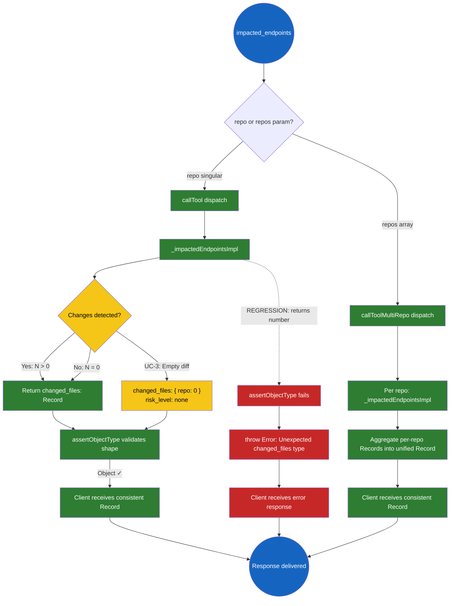
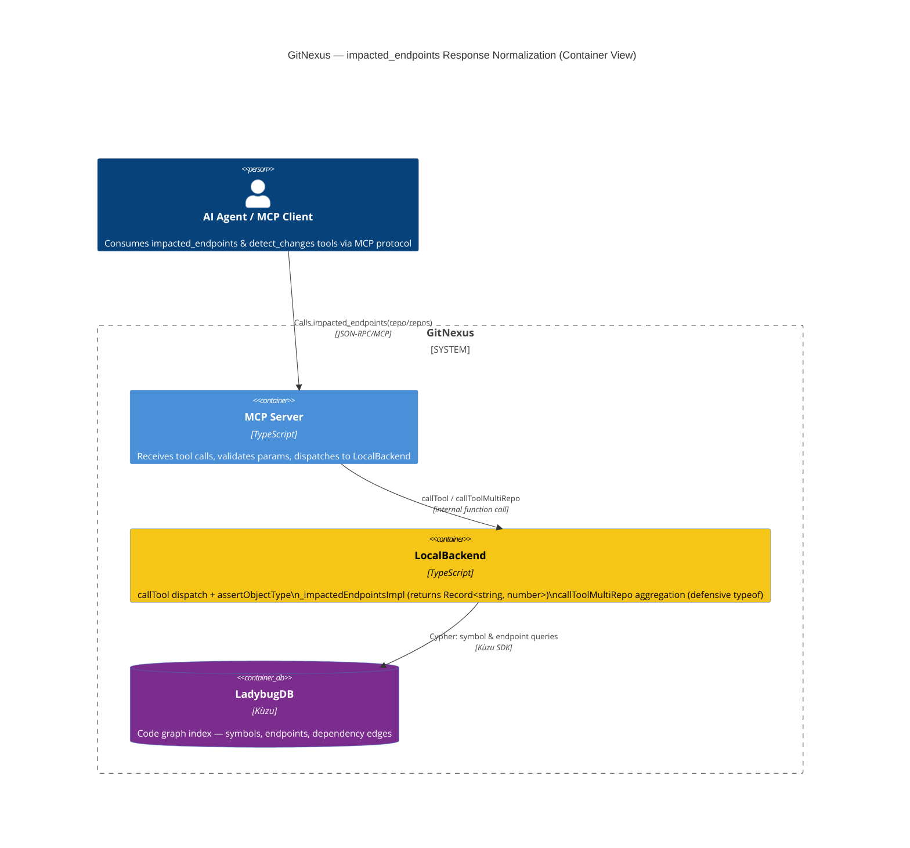
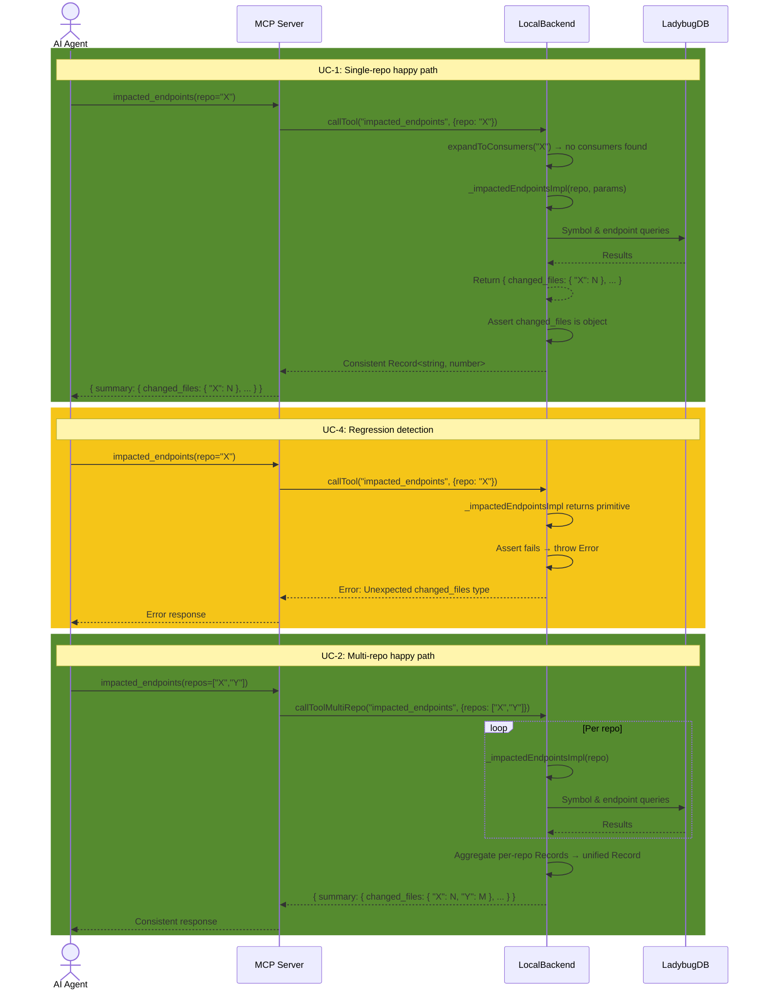
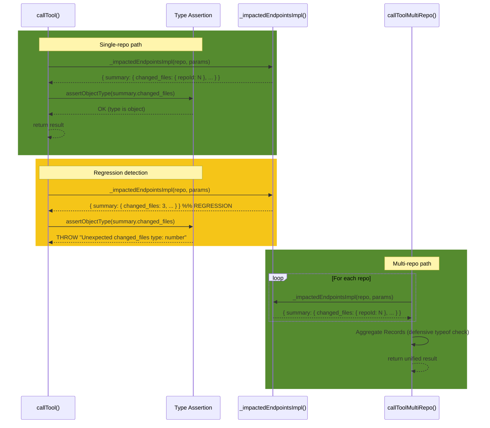
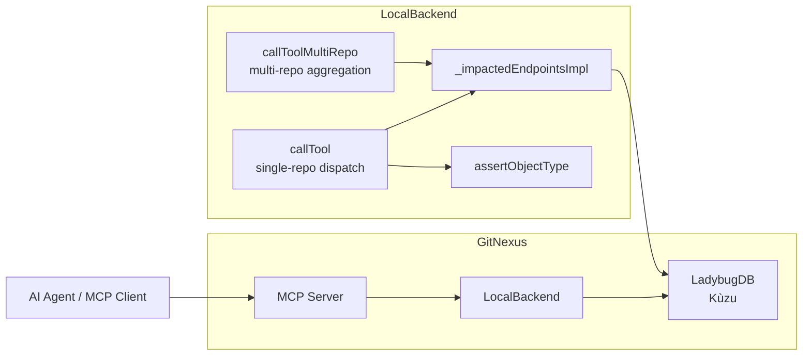

# Solution Design: Fix inconsistent `changed_files` response type in `impacted_endpoints`

## 0. GitNexus Analysis

### Affected Processes
| Process Name | Description | Entry Symbol |
|---|---|---|
| `impacted_endpoints` (single-repo) | Single-repo dispatch via `callTool` → `_impactedEndpointsImpl` | `LocalBackend.callTool` |
| `impacted_endpoints` (multi-repo) | Multi-repo dispatch via `callToolMultiRepo` → per-repo `_impactedEndpointsImpl` → aggregation | `LocalBackend.callToolMultiRepo` |
| `detect_changes` (single-repo) | Change detection returning `changed_files: number` | `LocalBackend.detectChanges` |

### Blast Radius
| Symbol | Depth | Risk | Status |
|---|---|---|---|
| `callTool` dispatch normalizer (L357–363) | d=1 | LOW | REDUNDANT — dead code, safety net only |
| `_impactedEndpointsImpl` return shape | d=1 | LOW | ALREADY FIXED — all 5 exit paths return `Record<string, number>` |
| `callToolMultiRepo` aggregation (L652–655) | d=2 | LOW | SAFE — defensive coercion handles both formats |
| `formatDetectChangesResult` (eval-server L223–225) | d=2 | LOW | SAFE — handles both formats at runtime |
| `detectChanges` return shape (L1704) | d=1 | MEDIUM | WILL BREAK — still returns `number`, same inconsistency pattern |

### Overall Risk Level
LOW — The `impacted_endpoints` fix is already applied and verified by tests. The remaining work is cleanup (remove dead normalizer, add type contract) and a follow-up for `detect_changes`.

## 1. Problem Statement & Root Cause

The `impacted_endpoints` tool returned `changed_files` and `impacted_endpoints` (count) as a bare `number` when invoked with the single `repo` parameter, but as `Record<string, number>` when invoked with the `repos` array parameter. This type inconsistency violated the API contract, forcing consumers to perform runtime `typeof` checks before parsing the response.

**Root cause:** `_impactedEndpointsImpl` was originally authored to return `changed_files: number` for single-repo calls. The multi-repo aggregation path (`callToolMultiRepo`) naturally produced `Record<string, number>` because it aggregates per-repo counts into a keyed object. No normalization existed at the dispatch boundary, so the two parameter variants produced different response shapes.

**Current state:** Two fixes were already applied:
1. **WI-1** — Dispatch-layer normalization in `callTool` (L357–363) coerces primitive `number` to `{ [repo.id]: number }`.
2. **WI-2** — All 5 exit paths in `_impactedEndpointsImpl` now return `Record<string, number>` directly.

This creates double-normalization: `_impactedEndpointsImpl` always returns object format, and the normalizer catches the (now-impossible) primitive case. The normalizer is dead code.

## 2. Recommended Solution

**The fix is already applied.** WI-1 (dispatch-layer normalization) and WI-2 (`_impactedEndpointsImpl` return-shape change) are in place and verified by tests. The remaining work is:

1. **Replace the dead-code normalizer with an explicit type assertion** — makes the contract self-documenting and fails loudly on regression instead of silently coercing.
2. **Add a TypeScript interface** for the `impacted_endpoints` summary shape — prevents future type drift at compile time.
3. **(Follow-up issue)** Apply the same normalization pattern to `detect_changes`.

### Trade-offs & Decision Records
| Decision | Alternatives Considered | Chosen | Why | Consequence |
|---|---|---|---|---|
| Replace `typeof` normalizer with assertion | Keep normalizer as-is; Remove normalizer entirely | Assertion | Dead code that can never fire is misleading; assertion documents intent and fails fast on regression | Slightly stricter — a regression in `_impactedEndpointsImpl` will throw instead of silently coercing |
| Add TypeScript interface for summary shape | Rely on inline types; Use zod runtime schema | TypeScript interface | Compile-time enforcement without runtime overhead; zod is overkill for an internal tool response | No runtime validation — but MCP consumers are AI agents that parse JSON dynamically |
| Defer `detect_changes` fix | Fix now; Defer | Defer to follow-up issue | `detect_changes` is a different tool with different consumers; scope discipline reduces blast radius | `detect_changes` remains inconsistent until follow-up is filed and addressed |
| Keep defensive `typeof` in `callToolMultiRepo` aggregation | Remove it since impl now returns Record | Keep as-is | Aggregation processes potentially heterogeneous sources; defensive coercion is appropriate at aggregation boundaries | Slightly redundant but harmless — protects against stale cached results or external sources |

## 3. Details

### 3.1 Use Cases



#### Use Case Summary
| # | Use Case | Type | Trigger | Expected Outcome |
|---|---|---|---|---|
| UC-1 | Single-repo call returns `Record<string, number>` | Happy path | `impacted_endpoints(repo="X")` | `changed_files: { "X": N }` |
| UC-2 | Multi-repo call returns aggregated `Record<string, number>` | Happy path | `impacted_endpoints(repos=["X","Y"])` | `changed_files: { "X": N, "Y": M }` |
| UC-3 | Single-repo call with empty diff | Edge case | No changes detected | `changed_files: { "X": 0 }`, `risk_level: "none"` |
| UC-4 | Single-repo call where `_impactedEndpointsImpl` regresses to returning `number` | Error case | Internal code change reverts return shape | Assertion throws `Error` with diagnostic message |

### 3.2 Container Level

#### C4 Container Diagram



##### Container Changes
| Container | Change | What | Why | How |
|---|---|---|---|---|
| LocalBackend | update | Replace `typeof` normalizer with assertion; add `ImpactedEndpointsSummary` interface | Dead-code removal + type contract enforcement | Edit `local-backend.ts` lines 357–363 |

#### Container Sequence Diagram



##### Sequence Explanation
| Step | Actor | Action | Error Handling |
|---|---|---|---|
| 1 | AI Agent | Calls `impacted_endpoints` with `repo` or `repos` param | — |
| 2 | MCP Server | Dispatches to `callTool` or `callToolMultiRepo` | — |
| 3 | LocalBackend | Runs `_impactedEndpointsImpl` per repo | Empty diff → returns `{ [repo.id]: 0 }` |
| 4 | LocalBackend | Asserts `changed_files` is `object` type | Throws `Error` if primitive (regression detected) |
| 5 | LocalBackend | Aggregates multi-repo results | Defensive `typeof` coercion in aggregation loop (L652–655) |

### 3.3 Component Level

#### LocalBackend

##### C4 Component Diagram

```mermaid
C4Component
  title LocalBackend — Component Changes for Issue #28

  UpdateElementStyle(callTool, $bgColor="#f5c518")
  UpdateElementStyle(impImpl, $bgColor="#2e7d32", $fontColor="#fff")
  UpdateElementStyle(callToolMultiRepo, $bgColor="#f5c518")

  Container(local_backend, "LocalBackend")

  UpdateRelStyle(callTool, assertion, $lineColor="#2e7d32")

  Component(callTool, "callTool()", "TypeScript", "Single-repo dispatch + assertion")
  Component(impImpl, "_impactedEndpointsImpl()", "TypeScript", "Core logic — already returns Record")
  Component(callToolMultiRepo, "callToolMultiRepo()", "TypeScript", "Multi-repo aggregation")
  Component(assertion, "Type Assertion", "TypeScript", "Compile-time contract enforcement")

  Rel(callTool, impImpl, "calls")
  Rel(callTool, assertion, "validates result shape")
  Rel(callToolMultiRepo, impImpl, "calls per repo")
```

###### Component Changes
| Component | Change | What | Why | How |
|---|---|---|---|---|
| `callTool` normalizer block (L357–363) | update | Replace `typeof === 'number'` coercion with explicit type assertion | Dead code is misleading; assertion documents intent and fails fast on regression | Replace `if (typeof ... === 'number') { ... }` with `assertObjectType()` helper |
| `ImpactedEndpointsSummary` interface | new | TypeScript interface for summary shape | Compile-time enforcement prevents type drift | Add to `local-backend.ts` or adjacent types file |

##### Component Sequence Diagram



###### Sequence Explanation
| Step | Actor | Action | Error Handling |
|---|---|---|---|
| 1 | `callTool` | Call `_impactedEndpointsImpl` | — |
| 2 | `callTool` | Assert `changed_files` is `object` | Throws on regression — prevents silent type coercion |
| 3 | `callToolMultiRepo` | Call `_impactedEndpointsImpl` per repo | — |
| 4 | `callToolMultiRepo` | Aggregate with defensive `typeof` check (L652–655) | Coerces `number` to `Record` if encountered — backward-compatible |

## 4. Cross-Cutting Concerns

### Performance
No performance impact. The assertion is a single `typeof` check — O(1), same cost as the existing normalizer it replaces. The interface is compile-time only with zero runtime overhead.

### Security
No security implications. This is an internal response-shape contract change. No user input is processed differently; no data exposure risk.

### Reliability
**Improved.** The assertion fails fast on regression instead of silently coercing. This makes bugs visible immediately rather than hiding them behind a silent normalizer. The `callToolMultiRepo` aggregation path retains its defensive `typeof` check because it processes results from potentially heterogeneous sources (cross-repo).

## Work Items

| # | Title | Layer | Container | Files Affected | Reuse |
|---|---|---|---|---|---|
| WI-1 | Replace dead-code normalizer with type assertion | Backend | LocalBackend | `gitnexus/src/mcp/local/local-backend.ts` (L357–363) | Existing `_impactedEndpointsImpl` return shape |
| WI-2 | Add `ImpactedEndpointsSummary` TypeScript interface | Backend | LocalBackend | `gitnexus/src/mcp/local/local-backend.ts` | — |
| WI-3 | Add `DetectChangesSummary` TypeScript interface (follow-up) | Backend | LocalBackend | `gitnexus/src/mcp/local/local-backend.ts` | Same pattern as WI-2 |
| WI-4 | Normalize `detect_changes` return shape (follow-up) | Backend | LocalBackend | `gitnexus/src/mcp/local/local-backend.ts` (L1704) | Same pattern as WI-1 |

## Risk Assessment
LOW — The `impacted_endpoints` fix is already in place and covered by tests. WI-1 and WI-2 are cleanup/refinements that cannot break runtime behavior. WI-3 and WI-4 are follow-up items for `detect_changes` (out of scope for this issue).

## Cross-Stack Completeness
- Backend changes: 1 file (`local-backend.ts`) — assertion replacement + interface definition
- Frontend changes: None
- Contract mismatches: None — MCP protocol is JSON-based; AI agents parse dynamically
- Safe deployment order: N/A — single file change, no deployment sequencing needed

## Autonomous Decisions
All gaps resolved without human input. Listed for post-hoc review.

| # | Ambiguity | Decision Made | Rationale |
|---|---|---|---|
| 1 | Whether to keep or remove the `typeof` normalizer in `callTool` | Replace with assertion | Dead normalizer is misleading; assertion documents intent and catches regressions |
| 2 | Whether to add runtime validation (zod) or compile-time only (TypeScript interface) | Compile-time only (TypeScript interface) | MCP consumers are AI agents parsing JSON dynamically; runtime schema adds overhead with no practical benefit |
| 3 | Whether to fix `detect_changes` in this issue or defer | Defer to follow-up issue | `detect_changes` is a different tool with different consumers; scope discipline reduces blast radius |
| 4 | Whether to keep defensive `typeof` in `callToolMultiRepo` aggregation | Keep as-is | Aggregation processes potentially heterogeneous sources; defensive coercion is appropriate at aggregation boundaries |

## Problem Statement

The `impacted_endpoints` tool returns an inconsistent `changed_files` type depending on invocation style: `number` for single-repo calls (`repo` param) vs. `Record<string, number>` for multi-repo calls (`repos` param). This forces consumers to perform runtime `typeof` checks before parsing. The same inconsistency pattern exists in `detect_changes` (out of scope for this issue). The root cause is that `_impactedEndpointsImpl` originally returned a bare `number` for single-repo calls, and no normalization existed at the dispatch boundary. Two fixes are already applied (dispatch normalizer + impl return-shape change), but the normalizer is now dead code that silently coerces instead of failing on regression.

## Solution Overview

Replace the dead-code `typeof` normalizer in `callTool` with an explicit type assertion that documents intent and fails fast on regression. Add a `ImpactedEndpointsSummary` TypeScript interface to enforce the `Record<string, number>` contract at compile time. Defer `detect_changes` normalization to a follow-up issue. The existing `callToolMultiRepo` defensive `typeof` check is retained as appropriate for aggregation boundaries.

## Architecture



- **MCP Server** — Receives `impacted_endpoints` tool calls, dispatches to `LocalBackend.callTool` (single-repo) or `LocalBackend.callToolMultiRepo` (multi-repo).
- **LocalBackend** — Contains `_impactedEndpointsImpl` (core logic, already returns `Record<string, number>`), the type assertion replacing the dead-code normalizer, and the multi-repo aggregation loop with its defensive `typeof` check.
- **LadybugDB (Kùzu)** — Code graph index queried by `_impactedEndpointsImpl` for symbol and endpoint data.

## Data Model

The `changed_files` field in `impacted_endpoints` responses uses a single shape:

```typescript
interface ImpactedEndpointsSummary {
  changed_files: Record<string, number>;  // repo id → file count
  impacted_endpoints: number;
  risk_level: "none" | "low" | "medium" | "high" | "critical";
  endpoints?: Array<{
    path: string;
    method: string;
    risk: string;
  }>;
}
```

Key constraint: `changed_files` is **always** `Record<string, number>` regardless of single-repo or multi-repo invocation. Single-repo calls produce `{ "repoId": N }`; multi-repo calls produce `{ "repoA": N, "repoB": M }`.

## API Design

### `impacted_endpoints` Tool

**Parameters:**

| Parameter | Type | Required | Description |
|-----------|------|----------|-------------|
| `repo` | `string` | Conditional* | Single repository identifier |
| `repos` | `string[]` | Conditional* | Array of repository identifiers |

\* Exactly one of `repo` or `repos` must be provided.

**Response shape (consistent across both invocation styles):**

```json
{
  "summary": {
    "changed_files": { "my-repo": 3 },
    "impacted_endpoints": 5,
    "risk_level": "medium",
    "endpoints": [
      { "path": "/api/users", "method": "GET", "risk": "medium" }
    ]
  }
}
```

**Before fix (single-repo):** `changed_files: 3` (bare `number`)  
**After fix (both):** `changed_files: { "my-repo": 3 }` (`Record<string, number>`)

## Implementation Plan

| Step | Work Item | Action | Verification |
|------|-----------|--------|-------------|
| 1 | WI-1 | Replace `typeof` normalizer block (L357–363) with `assertObjectType()` helper | Regression test: assertion throws when `_impactedEndpointsImpl` returns primitive |
| 2 | WI-2 | Add `ImpactedEndpointsSummary` interface; type all summary return paths | `tsc --noEmit` passes; existing tests unchanged |
| 3 | — | Run full test suite | `npm test` passes; no regressions |
| 4 | (Follow-up) | File issue for WI-3/WI-4 (`detect_changes` normalization) | Issue created, linked to #28 |

## Testing Strategy

| Category | Test | What It Verifies |
|----------|------|-------------------|
| **Unit** | `assertObjectType` throws on `number` input | Assertion catches regression |
| **Unit** | `assertObjectType` passes on `Record<string, number>` input | Happy path unchanged |
| **Unit** | `_impactedEndpointsImpl` returns `Record<string, number>` for all 5 exit paths | All branches conform to contract |
| **Integration** | Single-repo `impacted_endpoints` call returns `changed_files` as object | End-to-end consistency |
| **Integration** | Multi-repo `impacted_endpoints` call returns `changed_files` as aggregated object | End-to-end consistency |
| **Edge** | Empty diff → `changed_files: { "repo": 0 }` | Zero-count handled correctly |
| **Regression** | Revert `_impactedEndpointsImpl` to return `number` → assertion throws | Fail-fast on regression |

Existing E2E tests (22 passing) already cover the happy paths. New tests target the assertion and edge cases.

## Risks

| Risk | Likelihood | Impact | Mitigation |
|------|-----------|--------|------------|
| Assertion throws on legitimate single-repo call | LOW (impl already returns Record) | HIGH (caller receives error) | Covered by existing unit + E2E tests; assertion message identifies root cause |
| `callToolMultiRepo` aggregation encounters stale/cached primitive result | LOW (defensive coercion retained) | LOW (silently coerced to Record) | Defensive `typeof` check at L652–655 preserved |
| `detect_changes` remains inconsistent (deferred) | CERTAIN (out of scope) | MEDIUM (same inconsistency pattern in different tool) | Follow-up issue filed; documented in WI-3/WI-4 |
| TypeScript interface drift from actual runtime shape | LOW (interface mirrors existing return) | LOW (compile-time only) | Interface lives adjacent to implementation; any drift caught by `tsc` |