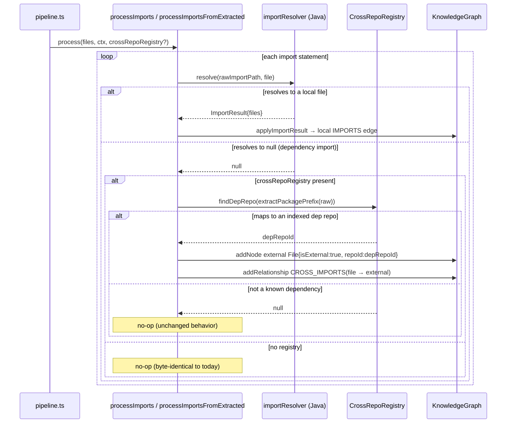
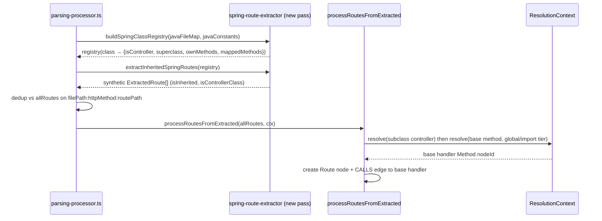

# Solution Design — #90 Cross-file Spring inheritance & #50 Cross-repo import edges

## AI-readers index
- [Problem & Approach](#problem--approach)
- [Autonomous Decisions](#autonomous-decisions)
- [WI-90 — Spring cross-file @RequestMapping inheritance](#wi-90)
- [WI-50 — Cross-repo IMPORTS edges / external File nodes](#wi-50)
- [Contracts](#contracts)
- [Invariants](#invariants)
- [Flows](#flows)
- [BlastRadius](#blastradius)
- [Downstream Docs](#downstream-docs)

## Problem & Approach

Two GitHub issues were marked "fixed" by merged PRs (#144, #148) but their root causes are untouched in current code (verified three times — pre-merge audit + dedicated fix-plan workflow + arch synthesis). Both are still OPEN. This design implements genuine, test-backed fixes, fully additive/gated so no existing behavior changes.

**EARS-lite**
- WI-90: WHEN a `@RestController` extends a base controller defined in another file, the ingestion pipeline SHALL emit Route nodes for the inherited `@RequestMapping`/`@*Mapping` handler methods, with the subclass as controller and `isInherited:true`.
- WI-50: WHERE a `CrossRepoRegistry` is provided to the pipeline, WHEN a file's import resolves to no local symbol but its package maps to an indexed dependency repo, the pipeline SHALL create an external `File` node (`isExternal:true`) and a `CROSS_IMPORTS` edge to it. WHERE no registry is provided, behavior SHALL be byte-identical to today.

**Acceptance criteria**
- WI-90: cross-file base+subclass → inherited Route nodes exist (correct combined path, `isInherited:true`, `isControllerClass:true`, CALLS edge to base handler). Override (subclass redeclares method) → no duplicate. `@RequestMapping(method={GET,POST})` inherited → fans out. The #144 single-tree negative test (spring-route-extractor.test.ts:1357) still passes unchanged.
- WI-50: consumer repo importing an indexed dependency (registry present) → external File node + `CROSS_IMPORTS` edge. Same ingestion WITHOUT a registry → zero external nodes/edges. tsc clean; full suite green.

**Non-Goals**
- WI-90: full Java type hierarchy / interface default-method routes / annotations on interfaces; deep method-name ambiguity resolution (uses existing global `candidates[0]` behavior).
- WI-50: persisting `isExternal` to LadybugDB (in-memory graph flag only — see Autonomous Decision 2); npm/Go cross-repo specialisation (registry already supports the lookups; this delivers the Java path + the generic gated mechanism).

## Autonomous Decisions

1. **Right-sized ceremony.** Two localized backend bug-fixes, no UI, no new architectural pattern → produced a focused markdown design + plan instead of full LikeC4/HTML/Gherkin. Rationale: proportionality; the load-bearing artifact is the plan doc consumed by implementation.

2. **WI-50 uses an in-memory `NodeProperties.isExternal` flag, NOT a schema column.** The File COPY/CSV persistence path is fixed-positional (`COPY File(id,name,filePath,content)`) and already omits `repoId` for File nodes; `runPipelineFromRepo` returns the in-memory graph and all integration tests read `result.graph` (never the DB). A schema column would need 5 fragile positional edits for zero test-visible benefit. The in-memory flag fully meets acceptance with one additive optional field. DB persistence is a clean follow-up.

3. **Reuse existing `CROSS_IMPORTS` rel type** (already in `RelationshipType` + `REL_TYPES`) rather than introducing a new edge type.

4. **WI-90: no `call-processor.ts` change.** Synthetic inherited routes ride the existing `isControllerClass:true` Route-creation path; cross-file method resolution already works (Tier-3 global / Tier-2a import-scoped) and is proven by the existing test `java-route-creation.test.ts:232-269`.

5. **WI-90: helper extraction is optional and risk-gated** — duplicating the per-method loop is the safer two-way door than risking the #144 negative test / WI-91 fan-out parity.

## WI-90

**Root cause (verified):** `extractRoutesFromClass` (spring-route-extractor.ts:613-740) iterates only the class's own `class_body` methods; base-class handlers in another file are never emitted. Base controllers without `@RestController`/`@Controller` emit `isControllerClass:false` routes, which `processRoutesFromExtracted` (call-processor.ts:1641) drops. #144 added only same-file prefix inheritance.

**Design — additive repo-wide pass (spring-route-extractor.ts):**
- `buildSpringClassRegistry(javaFiles: {filePath, tree}[], constants): Map<className, SpringClassRegistryEntry>`
- `extractInheritedSpringRoutes(registry): ExtractedRoute[]` — for each `isController` class, walk the superclass chain (visited-Set cycle guard, depth cap 10), emit one synthetic `ExtractedRoute` per inherited mapped method NOT in `ownMethodNames` (nearer-ancestor / own-method wins), with `controllerName=subclass`, `filePath=subclass file`, effective prefix (own else nearest ancestor), `isControllerClass:true`, `isInherited:true`, fanned out per HTTP method.
- Reuse module-private helpers (`getClassAnnotations`, `getClassRequestMappingPrefix`, `getSuperclassName`, `getMethodName`, `HTTP_METHOD_ANNOTATIONS`, `extractAnnotationPath`, `extractRequestMappingMethod`, `combinePaths`, `extractArrayOrString`).

**Wiring (parsing-processor.ts, after per-file loop ~line 717):** build the registry from the already-populated `javaFileMap` (`:252`, value `{content, tree}`) + `javaConstants` (`:251`) — no second parse — and push deduped (`filePath:httpMethod:routePath`) inherited routes into `allRoutes`. `extractSpringRoutes`/`extractRoutesFromClass` untouched.

## WI-50

**Root cause (verified):** ingestion never creates cross-repo edges/nodes. `applyImportResult` early-returns on `null` (dependency imports resolve to null). `CrossRepoRegistry` is never built in the pipeline (only at query-time in `local-backend.ts`).

**Design — minimal, gated, in-memory (import-processor.ts):**
- `applyCrossRepoImport(graph, filePath, rawImportPath, registry): boolean` — `prefix = extractPackagePrefix(rawImportPath) ?? rawImportPath`; `depRepoId = registry.findDepRepo(prefix)`; if null return false; else add external File node `{name:rawImportPath, filePath:`${depRepoId}::${rawImportPath}`, repoId:depRepoId, isExternal:true}` and a `CROSS_IMPORTS` edge from the source File. Reuse exported `extractPackagePrefix`.
- Optional trailing `crossRepoRegistry?: CrossRepoRegistry` on `processImports` (:243) and `processImportsFromExtracted` (:394); gated branch `if (!result && crossRepoRegistry) applyCrossRepoImport(...)` after each `applyImportResult`.
- Thread via new optional `PipelineOptions.crossRepoRegistry`; pass at both pipeline call sites (`:306` worker, `:393` sequential).
- `NodeProperties.isExternal?: boolean` (types.ts:42). No schema/CSV/COPY/adapter changes. `CROSS_IMPORTS` reused.

## Contracts

**WI-90 — new exported functions (spring-route-extractor.ts):**
| Symbol | Signature | Contract |
|---|---|---|
| `buildSpringClassRegistry` | `(javaFiles: {filePath:string; tree:Parser.Tree}[], constants: Map<string,string>) => Map<string, SpringClassRegistryEntry>` | Pure. One entry per `class_declaration` repo-wide. FeignClient classes contribute no `mappedMethods`. |
| `extractInheritedSpringRoutes` | `(registry: Map<string, SpringClassRegistryEntry>) => ExtractedRoute[]` | Pure. Emits synthetic routes only for `isController` classes' inherited mapped methods. Cycle-safe, depth-capped (10). |
| `SpringClassRegistryEntry` | `{className, filePath, classPrefix:string\|null, isController:boolean, superclassName:string\|null, ownMethodNames:Set<string>, mappedMethods:{methodName, httpMethods:string[], methodPath, rawConstantPath:boolean, produces?, consumes?, lineNumber}[]}` | Internal data shape. |

Unchanged contracts: `extractSpringRoutes`, `extractRoutesFromClass`, `processRoutesFromExtracted` — signatures and behavior byte-identical.

**WI-50 — new/changed symbols:**
| Symbol | Signature | Contract |
|---|---|---|
| `applyCrossRepoImport` | `(graph: KnowledgeGraph, filePath: string, rawImportPath: string, registry: CrossRepoRegistry) => boolean` | Idempotent node/edge add; returns true iff an external edge was created. |
| `processImports` | `(...existing, crossRepoRegistry?: CrossRepoRegistry) => Promise<...>` | New OPTIONAL trailing param; `undefined` ⇒ identical to today. |
| `processImportsFromExtracted` | `(...existing, crossRepoRegistry?: CrossRepoRegistry) => Promise<...>` | Same. |
| `PipelineOptions.crossRepoRegistry?` | `CrossRepoRegistry` | New optional option; absent ⇒ no cross-repo behavior. |
| `NodeProperties.isExternal?` | `boolean` | New optional in-memory flag; absent on all local nodes. |

## Invariants

- **INV-1 (HARD RULE):** with no `CrossRepoRegistry`, every node/edge produced by ingestion is identical to pre-change (the WI-50 branch requires `result===null && registry`).
- **INV-2:** `extractSpringRoutes` single-tree output is unchanged — the #144 cross-file negative test (spring-route-extractor.test.ts:1357) still passes.
- **INV-3:** no Route node is emitted twice — dedup on `filePath:httpMethod:routePath` (subclass vs inherited) and `ownMethodNames` (override vs inherited).
- **INV-4:** inherited routes only ever come from ancestor methods carrying an HTTP-mapping annotation (no plain inherited methods leak in).
- **INV-5:** superclass chain walking always terminates (visited-Set + depth cap 10).
- **INV-6:** external File node ids are namespaced (`${depRepoId}::${rawImportPath}`) so they never collide with a local File node id.

## Flows

WI-50 gated cross-repo import resolution during ingestion:

WI-90 cross-file inheritance pass (after the per-file Java loop):

## BlastRadius

- **WI-90 — LOW/MEDIUM.** New functions are additive; only `parsing-processor.ts` gains a post-loop block. d=1 dependents of `extractSpringRoutes`/`extractRoutesFromClass`: unchanged (untouched). Risk concentrated in route emission correctness, covered by new + existing route tests. Worst case: an extra/wrong inherited route for an ambiguous base method name (existing global-resolution behavior; flagged Non-Goal).
- **WI-50 — LOW (gated).** `processImports`/`processImportsFromExtracted` each have exactly ONE caller (`pipeline.ts`, verified). Optional params default `undefined`; `NodeProperties.isExternal?` optional. With no registry (all existing fixtures/tests), zero behavioral change. New behavior reachable only via `PipelineOptions.crossRepoRegistry`. No schema/persistence surface touched.
- **Validation gate:** `npx tsc -p gitnexus/tsconfig.json --noEmit` + full `vitest run` (≥5685 passing, 0 new failures) after each WI; pre-commit hook re-runs the suite.

## Downstream Docs
- Plan: `docs/plans/cross-file-spring-and-cross-repo-imports.md` (WI-90, WI-50, WI-V verification).
- No API doc / canonical architecture-doc updates required (no public MCP-tool contract change; both fixes are ingestion-internal).
