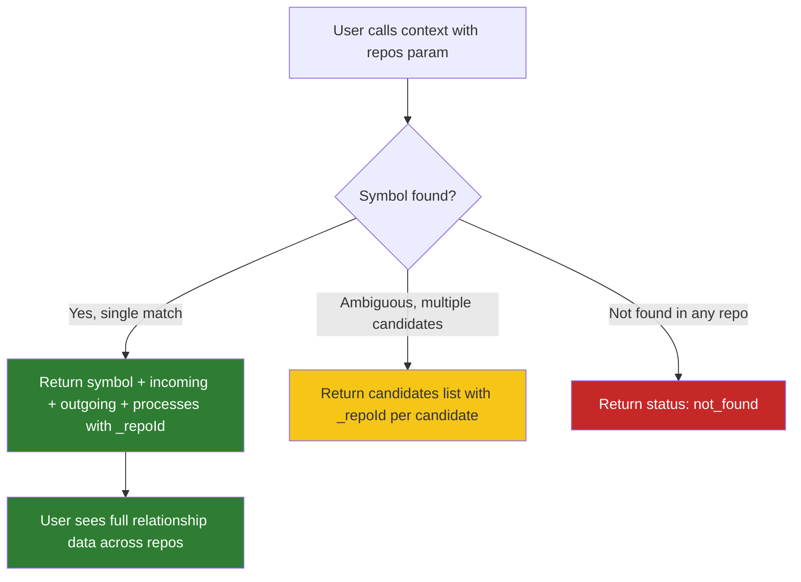
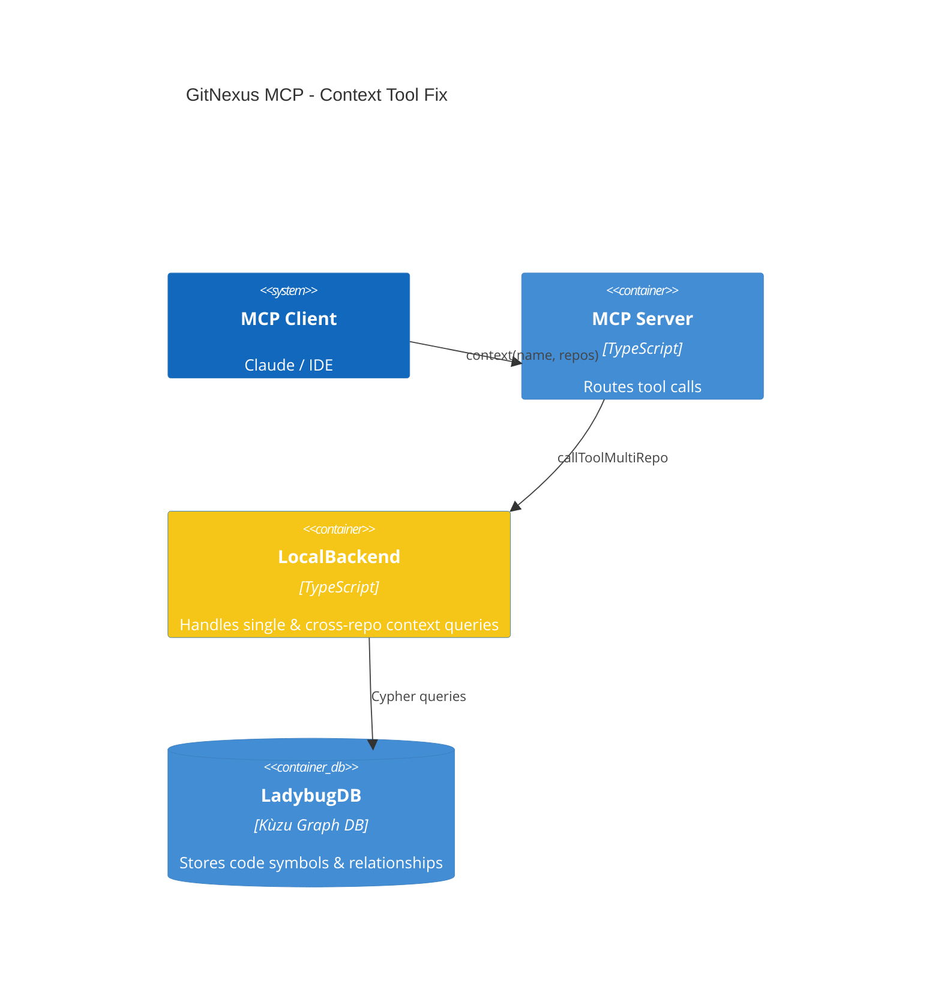
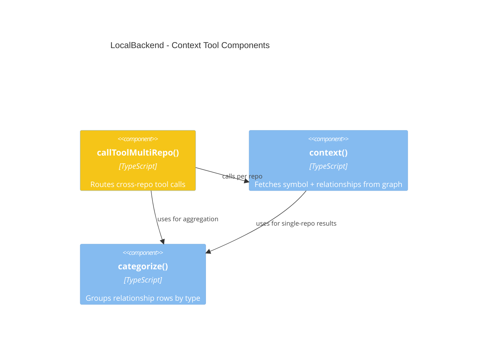

# Solution Design: cross-repo-context-relationships

## 1. Problem Statement & Root Cause

The `context` MCP tool's multi-repo handler (`callToolMultiRepo` case 'context' at `local-backend.ts:454-502`) calls the single-repo `this.context()` method which correctly returns `{status, symbol, incoming, outgoing, processes}`. However, the aggregation code only extracts `symbol` into the result object (lines 485-487) and only returns `symbol` in the response (line 492), completely discarding the `incoming`, `outgoing`, and `processes` fields. This makes cross-repo context queries return only metadata without any relationship data.

## 2. Recommended Solution

**Minimal passthrough fix**: Capture and return `incoming`, `outgoing`, and `processes` from the single-repo `context()` result in the cross-repo aggregation logic. Add `_repoId` attribution to each relationship entry for cross-repo traceability.

### Reuse Inventory
- Existing `this.context()` method — already returns full relationship data, no changes needed
- Existing `categorize()` function — already used by single-repo path, no changes needed
- No new utilities required

### Trade-offs & Decision Records
| Decision | Alternatives Considered | Chosen | Why | Consequence |
|---|---|---|---|---|
| Passthrough fix only | Refactor into shared utility | Passthrough | Simplest fix; relationship fetching already works in single-repo path | Minimal code change, no regression risk |
| First-repo wins for ambiguous matches | Merge relationships from all repos | First-repo wins | Consistent with current symbol selection behavior | Users querying same symbol across repos only get one repo's relationships |
| Add _repoId to relationship entries | No _repoId on relationships | Add _repoId | Enables cross-repo traceability; consistent with symbol _repoId pattern | Slightly larger response payloads |

## 3. Details

### 3.1 Use Cases



#### Use Case Summary
| # | Use Case | Type | Trigger | Expected Outcome |
|---|---|---|---|---|
| UC-1 | Cross-repo context with single match | Happy path | `context(name, repos=[...])` finds symbol in one repo | Returns full `incoming`, `outgoing`, `processes` with `_repoId` |
| UC-2 | Cross-repo context with ambiguous match | Edge case | Multiple symbols with same name across repos | Returns candidates with `_repoId`, no relationships (current behavior) |
| UC-3 | Cross-repo context with no match | Error case | Symbol not found in any repo | Returns `status: not_found` (unchanged) |

### 3.2 Container Level

#### C4 Container Diagram



##### Container Changes
| Container | Change | What | Why | How |
|---|---|---|---|---|
| LocalBackend | update | Cross-repo context aggregation (lines 485-492) | Relationships dropped in cross-repo path | Capture `incoming`, `outgoing`, `processes` from single-repo result and include in response |

#### Container Sequence Diagram

```mermaid
sequence
    participant Client as MCP Client
    participant Server as MCP Server
    participant Backend as LocalBackend
    participant DB as LadybugDB
    
    Client->>Server: context(name, repos=[A, B])
    Server->>Backend: callToolMultiRepo('context', params)
    
    par For each repo
        Backend->>DB: Query symbol + relationships (repo A)
        DB-->>Backend: {symbol, incoming, outgoing, processes}
    and
        Backend->>DB: Query symbol + relationships (repo B)
        DB-->>Backend: {symbol, incoming, outgoing, processes}
    end
    
    alt Symbol found in repo A
        Backend-->>Server: {status: 'found', symbol, incoming, outgoing, processes, _repoId}
        Server-->>Client: Full context with relationships
    else Symbol ambiguous
        Backend-->>Server: {status: 'ambiguous', candidates: [...]}
        Server-->>Client: Disambiguation candidates
    else Not found
        Backend-->>Server: {status: 'not_found'}
        Server-->>Client: Not found response
    end
```

##### Sequence Explanation
| Step | Actor | Action | Error Handling |
|---|---|---|---|
| 1 | MCP Client | Calls `context(name, repos=[A, B])` | N/A |
| 2 | LocalBackend | Dispatches parallel context calls per repo | If repo fails, capture error in `aggregated.errors` |
| 3 | LocalBackend | Aggregates results — captures `symbol`, `incoming`, `outgoing`, `processes` | If single repo errors, try remaining repos |
| 4 | LocalBackend | Returns full context with `_repoId` on each field | If ambiguous, return candidates for disambiguation |

### 3.3 Component Level

#### LocalBackend
##### C4 Component Diagram



###### Component Changes
| Component | Change | What | Why | How |
|---|---|---|---|---|
| `callToolMultiRepo` case 'context' | update | Lines 485-492: capture and return relationship fields | Currently only returns `symbol`, dropping `incoming`/`outgoing`/`processes` | Add `incoming`, `outgoing`, `processes` to aggregated result and return object, with `_repoId` on each entry |

## 4. Cross-Cutting Concerns

### Performance
No performance impact — the data is already being fetched by `this.context()`, just not captured in the response. Same number of Cypher queries.

### Security
No security impact — no new inputs, no new data exposure beyond what single-repo already returns.

### Reliability
Fix is passthrough-only — if `this.context()` fails, existing error handling in `callToolMultiRepo` already catches it. If `incoming`/`outgoing`/`processes` is undefined (shouldn't happen), the result simply omits those keys (TypeScript safe).

## Work Items
| # | Title | Layer | Container | Files Affected | Reuse |
|---|---|---|---|---|---|
| WI-1 | Fix cross-repo context to include relationships | Backend | LocalBackend | `gitnexus/src/mcp/local/local-backend.ts` → `callToolMultiRepo` case 'context' (lines 485-492) | Existing `this.context()`, `categorize()` |
| WI-2 | Add test coverage for cross-repo context relationships | Test | Test suite | `gitnexus/test/unit/calltool-dispatch.test.ts` (existing cross-repo tests at lines 837-900) | Existing test infrastructure |

## Risk Assessment
LOW — Minimal code change (2-3 lines in aggregation, 3-4 lines in return), well-understood root cause, no shared code affected, existing single-repo path untouched.

## Cross-Stack Completeness
- Backend changes: Yes — `local-backend.ts` cross-repo aggregation
- Frontend changes: None — MCP server response only
- Contract mismatches: None — adding fields to response (additive, non-breaking)
- Safe deployment order: N/A (single backend change)

## Autonomous Decisions
All gaps resolved without human input. Listed for post-hoc review.

| # | Ambiguity | Decision Made | Rationale |
|---|---|---|---|
| 1 | Scope of fix | Only `context` tool's multi-repo path | Other tools don't share this code path |
| 2 | Expected cross-repo behavior | Same as single-repo + `_repoId` attribution | Consistency with single-repo; `_repoId` for traceability |
| 3 | Symbol in multiple repos | First-repo wins (current behavior) | Matches existing symbol selection logic |
| 4 | Performance requirements | Match single-repo behavior | No new queries, same data already fetched |
| 5 | _repoId on relationship entries | Add `_repoId` to each entry in `incoming`/`outgoing` | Consistent with `symbol._repoId` pattern; enables cross-repo traceability |
| 6 | Test coverage | Add assertions to existing cross-repo tests | Extend existing tests rather than create new ones |