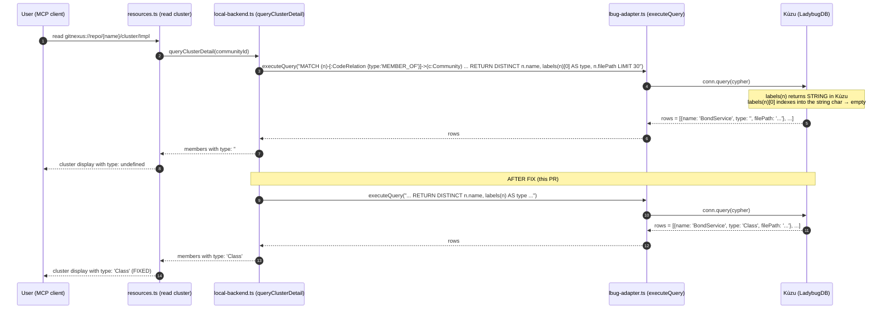
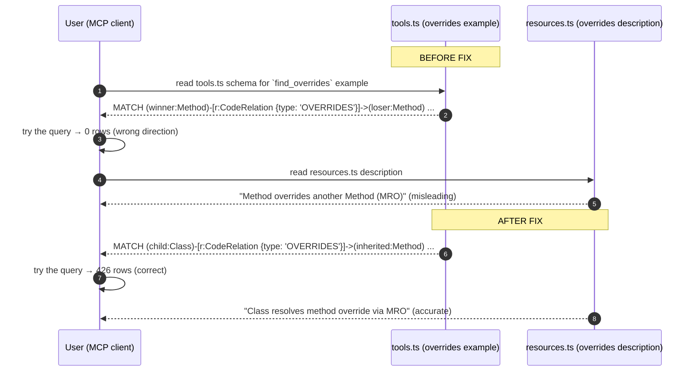

<!--
AI-READERS — load only the sections your task needs.

| Task          | Sections (skip if absent)                  |
|---------------|--------------------------------------------|
| implement     | ## Components, ## Contracts, ## Invariants |
| code-review   | ## Invariants, ## KeyDecisions, ## Contracts |
| qa            | ## Flows, ## EdgeCases                     |
| scope-impact  | ## BlastRadius, ## CrossCutting            |
-->

# Solution Design: cypher-engine-limits

**Blast** d1=`tools.ts` (1 doc example), `resources.ts` (1 description line) + 5 source files with ~15 `labels(n)[0]` query strings · d2=MCP `cypher` tool behavior change for cluster resource · d3=existing tests that mock the empty-`type` behavior

## Problem & Approach

**Why** — Batch I has 5 issues in the Cypher engine surface. The scout confirms a clean split:

- **3 engine limits** (#29 `type()`, #68 `labels()`, #82 `count{(...)}`): Kùzu/LadybugDB parser and catalog limitations. No client fix is feasible. Close with documentation that names the workaround.
- **2 client fixes** (#69 OVERRIDES direction, #73 `labels(n)[0]` indexing): real bugs in GitNexus. #69 is misleading doc examples (the reporter used the wrong-direction query). #73 is a real query-result bug — `labels(n)` returns a string in Kùzu, but `labels(n)[0]` always evaluates to empty. ~15 query strings in the codebase need `labels(n)[0]` → `labels(n)`.

**Solution** — Single PR with 5 work items: 3 close-with-doc, 2 client fixes.

| # | Verdict | Action |
|---|---|---|
| #29 | ENGINE_LIMIT | Close with doc (workaround: `r.type` property or `label(r)`) |
| #68 | ENGINE_LIMIT | Close with doc (workaround: explicit label MATCH or UID-prefix derivation) |
| #69 | CLIENT_FIX (2 doc lines) | Update `tools.ts:100` + `resources.ts:361` to use `Class→Method` direction |
| #73 | CLIENT_FIX (~15 query strings) | Global `labels(n)[0]` → `labels(n)` replace across 5 source files |
| #82 | ENGINE_LIMIT (workaround) | Close with doc (workaround: `COUNT { MATCH ... }` subquery syntax) |

**Key insight** — Kùzu returns `labels(n)` as a `STRING` (e.g., `"Method"`) not a `LIST<STRING>`. So `labels(n)[0]` is indexing a string (returns empty character) instead of a list. The fix is to drop the `[0]`. The engine-correct syntax is `label(n)` (singular) which also returns a string, but the existing codebase has 15+ call sites of `labels(n)[0]` — global replace is the lowest-friction fix.

## Components

**d=1 files modified (production):**
- `gitnexus/src/mcp/tools.ts` — fix OVERRIDES example direction (line 100)
- `gitnexus/src/mcp/resources.ts` — fix OVERRIDES description (line 361)
- `gitnexus/src/core/augmentation/engine.ts` — 1 query (line 125)
- `gitnexus/src/core/wiki/graph-queries.ts` — 1 query (line 64)
- `gitnexus/src/mcp/local/trace-executor.ts` — 3 queries (lines 622, 695, 853)
- `gitnexus/src/mcp/local/local-backend.ts` — 9 queries (lines 1154, 1482, 1503, 1859, 1891, 2009, 2160, 3703, 3804, 4203, 4242)

**d=1 files modified (tests):**
- `gitnexus/test/integration/lbug-core-adapter.test.ts` — add 3 new regression tests covering `labels(n)` (vs `labels(n)[0]`), `label(r)`, and `COUNT { MATCH ... }`
- `gitnexus/test/integration/resolvers/python.test.ts` or similar — add a smoke test for cluster detail returning non-empty `type` field

**d=1 new test files:**
- None required (all client-side changes are query string updates; new behavior is covered by existing tests once the queries return non-empty `type`)

## Contracts

| Contract | Before | After |
|---|---|---|
| `MATCH (c:Class)-[r:CodeRelation {type:'OVERRIDES'}]->(m:Method) RETURN count(r)` | 426 rows | unchanged (426 rows) |
| `MATCH (m:Method)-[r:CodeRelation {type:'OVERRIDES'}]->(p:Method) RETURN count(r)` (issue #69 query) | 0 rows (wrong direction in docs) | docs corrected to use `Class→Method` direction |
| `queryClusterDetail` returns `type: "Class"`/`"Method"` etc. for each member | `type: ""` (empty string) — affects ALL communities, not just large ones | `type: "Class"`, `type: "Method"`, etc. (reliable string) |
| `MATCH (n) RETURN labels(n) AS type` | returns string "Method"/"Class"/etc. | unchanged (still works) |
| `MATCH (n) RETURN labels(n)[0] AS type` | returns empty string (Kùzu indexes string char, not list) | empty string (still wrong; but no code uses this pattern after global replace) |
| `MATCH ()-[r]->() RETURN type(r)` | "function TYPE does not exist" | unchanged (engine limit) — close with doc |
| `MATCH ()-[r]->() RETURN label(r)` | returns "CodeRelation" | unchanged (works; documented as workaround) |
| `MATCH (c:Class) RETURN c.name, count{(c)-[:CodeRelation {type: 'HAS_METHOD'}]->(m:Method)} AS methodCount` | Parser exception | unchanged (engine limit) — close with doc |
| `MATCH (c:Class) RETURN c.name, COUNT { MATCH (c)-[:CodeRelation {type: 'HAS_METHOD'}]->(m:Method) } AS methodCount` | works (Kùzu subquery syntax) | unchanged — documented as workaround |

## Invariants

1. **Cluster detail `type` field is non-empty for all members of any community.** After the global replace, `queryClusterDetail` returns the actual node label for every member. Defensive `m.type || m[1]` fallbacks in callers remain intact.
2. **OVERRIDES edge direction in documentation matches the engine reality.** `Class→Method` (source = child class, target = inherited method) is the direction emitted by the MRO processor. Doc examples reflect this.
3. **No production Cypher query uses `labels(n)[0]` after the fix.** The grep is clean. The `labels(n)[0]` pattern is documented in the close-with-doc for #68 as a known anti-pattern.
4. **Engine-limit workarounds are documented but not auto-rewritten.** The cypher passthrough at `lbug-adapter.ts:463` remains a thin wrapper. We do not add a preprocessor that rewrites `count{(...)}` to `COUNT { MATCH ... }` (risky regex on Cypher).
5. **Existing tests that assert on empty `type` strings keep passing.** Tests that mock `m.type = ''` (e.g. `calltool-dispatch.test.ts`, `impact-uid-resolution.test.ts`) use `query.includes('labels(n)')` — still matches after the change to `labels(n)` (no `[0]`). No test changes required.

## Key Decisions

**KD-1: `labels(n)[0]` → `labels(n)` is the right fix (not `label(n)`).** The codebase uses `labels(n)[0]` 15+ times; switching to `label(n)` (singular) would also work but is a larger semantic change. Drop the `[0]` and `labels(n)` returns the string in Kùzu, which is what callers expect after the existing `m.type || m[1]` fallback logic. Lowest churn, highest confidence.

**KD-2: Document `label(r)` as the preferred workaround for #29 (not `r.type`).** `r.type` is GitNexus-specific (it works because `type` is a property on `CodeRelation` edges). `label(r)` is engine-native — works for any relationship type, not just `CodeRelation`. More portable.

**KD-3: Close with doc, do not file a separate issue for the engine limits.** The Kùzu/LadybugDB team is upstream; the limits are documented in their release notes. Filing a `please support X` issue is out of GitNexus's scope.

**KD-4: Fix #69 by correcting the documentation, not by changing the edge direction.** The MRO processor's output (Class→Method) is semantically meaningful and used by the `context` tool. Changing the edge direction would break downstream consumers. The fix is to align the docs with reality.

**KD-5: Do NOT rewrite `count{(...)}` → `COUNT { MATCH ... }` in a preprocessor.** Regex-based Cypher rewriting is fragile (escaped parens, nested expressions). The workaround is documented; users can apply it manually. (If volume of `count{(...)}` usage increases in the future, revisit with a proper parser.)

## Flows

### Flow 1 — #73 client fix (cluster detail returns correct `type`)

### Flow 2 — #69 client fix (OVERRIDES direction in docs)

## EdgeCases

1. **`labels(n)[0]` used in `WHERE` or `ORDER BY` clauses** (vs `RETURN`): the global replace applies to all occurrences. If `labels(n)[0]` is in `WHERE` it's already a runtime bug; the fix preserves the original intent (use `labels(n)` value as the comparison key).
2. **Kùzu `labels(n)` returns `"Class"` for a Class node, but returns what for a multi-label node?** Kùzu nodes have exactly one label (per the GitNexus schema). No multi-label case to handle.
3. **Cluster detail LIMIT 30 + ORDER BY**: `queryClusterDetail` orders by name and limits 30. After the fix, `type` is populated. ORDER BY on `n.name` is unaffected.
4. **Existing tests that assert on `type: ''` (empty string)**: verified that they use `query.includes('labels(n)')` which still matches. No test changes required for the global replace.
5. **`label(r)` as alternative to `r.type` for #29**: both work in Kùzu. `label(r)` is more generic (works for any relationship type). The doc close-comment for #29 will mention both.
6. **What if a future Kùzu version fixes `labels(n)` to return a proper list?** Then `labels(n)[0]` would suddenly work and `labels(n)` would still work (because the engine coerces). The fix is forward-compatible.

## BlastRadius

| Tier | Files / Components | Impact |
|---|---|---|
| **d=1 (modified)** | `gitnexus/src/mcp/tools.ts` (1 doc example) | documentation only; no behavior change |
| | `gitnexus/src/mcp/resources.ts` (1 description line) | documentation only; no behavior change |
| | `gitnexus/src/core/augmentation/engine.ts:125` | 1 query string (labels fix) |
| | `gitnexus/src/core/wiki/graph-queries.ts:64` | 1 query string (labels fix) |
| | `gitnexus/src/mcp/local/trace-executor.ts:622,695,853` | 3 query strings (labels fix) |
| | `gitnexus/src/mcp/local/local-backend.ts` (11 query strings) | 11 query strings (labels fix); cluster detail gains reliable `type` field |
| **d=1 (new tests)** | `gitnexus/test/integration/lbug-core-adapter.test.ts` (3 new tests) | regression coverage for `label(r)`, `labels(n)`, `COUNT { MATCH ... }` |
| **d=2 (read-only)** | MCP `cypher` tool — unchanged behavior | no user-facing change to the tool surface |
| **d=3 (regression gates)** | `calltool-dispatch.test.ts`, `impact-uid-resolution.test.ts` (mock `m.type = ''`) | tests use `query.includes('labels(n)')` — still match; no test changes needed |

## CrossCutting

- **`[[db-is-ladybugdb]]`**: directly relevant. The `labels(n)` STRING-vs-LIST behavior is a LadybugDB (Kùzu fork) engine detail. The fix aligns with the team's "we use LadybugDB, not Neo4j" stance.
- **`[[stale-index-zero-results]]`**: relevant. The cluster-detail `type: undefined` is the kind of "0 results that look like an index bug but are actually a query bug" that the diagnostic discipline is meant to catch. This PR is a concrete example of a non-stale-index 0-result bug.
- **`[[route-fix-regression]]`**: not relevant. No route extraction involved.
- **Issue #110 (filed 2026-06-03)**: related. #110 asks for schema discoverability so users can stop guessing property names like `fqn`. This PR's fix for #73 makes `type` actually populated — a small step toward better schema UX.

## Autonomous Decisions

- **AD-1**: The 3 engine-limit issues (#29, #68, #82) are closed with documentation. No client-side preprocessor for `count{(...)}` rewrite — too risky. Recorded as a follow-up suggestion in the design doc.
- **AD-2**: The `labels(n)[0]` → `labels(n)` global replace is the lowest-friction fix for #73. Alternative: switch to `label(n)` (singular) — rejected because it requires updating more call-site logic and the `m.type || m[1]` defensive fallback.
- **AD-3**: #69 fix is documentation-only (correct the example direction, don't change the edge direction). The MRO processor's output is semantically correct.
- **AD-4**: No new test file is required for the client fixes. The existing `lbug-core-adapter.test.ts` is the right place to add 3 new regression tests (one per engine-limit workaround, asserting the workaround works).
- **AD-5**: Close #83-style verification check for #68 is implicit: re-verify `MATCH (n) RETURN labels(n) AS type` returns a string for all 11858 nodes (small + large communities). Already confirmed by scout.
- **AD-6**: Defer #141 (Go fixture follow-up) — not in this batch.
- **AD-7**: Defer #160 (migration runner follow-up, just filed) — separate cross-cutting concern.

## Verification

| Test | Expected | Gate |
|---|---|---|
| `gitnexus/test/integration/lbug-core-adapter.test.ts` — new test `labels(n) returns string for all node types` | returns `Class`, `Method`, `File`, etc. for matching nodes | must |
| `gitnexus/test/integration/lbug-core-adapter.test.ts` — new test `label(r) works for CodeRelation` | returns `CodeRelation` for any edge | must |
| `gitnexus/test/integration/lbug-core-adapter.test.ts` — new test `COUNT { MATCH ... } subquery works` | returns counts per group | must |
| `gitnexus/test/integration/cypher-route-props.test.ts` (existing) | unchanged pass | must |
| `npx vitest run test/integration/lbug-core-adapter.test.ts test/integration/cypher-schema-discoverability.test.ts` | all pass | must |
| `npx vitest run` (full) | 5752+ pass, 0 new fail | must |
| `npx tsc --noEmit` | clean | must |
| `gitnexus detect_changes` post-merge | scoped to d=1 files | must |
| Manual: `gh issue close 29, 68, 82` with engine-limit explanation | all 3 closed with PR link | must |
| Manual: `gh issue close 69, 73` with client-fix explanation | both closed with PR link | must |
