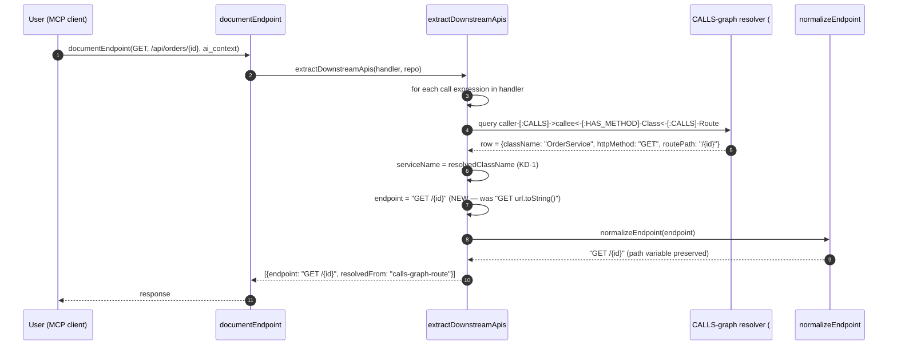
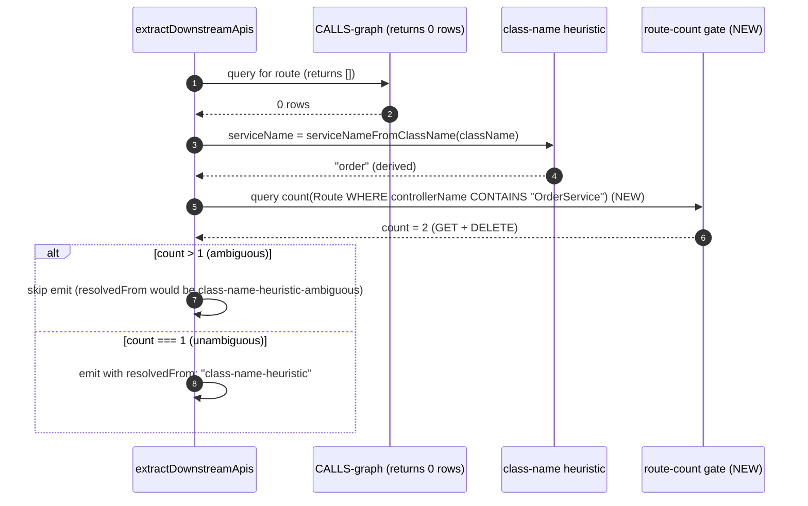
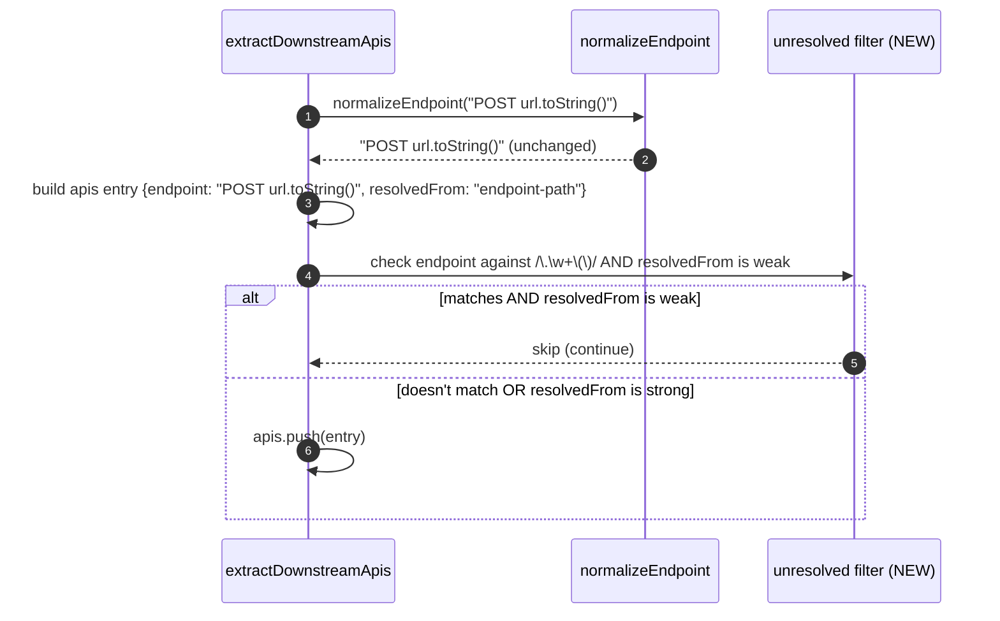

<!--
AI-READERS — load only the sections your task needs.

| Task          | Sections (skip if absent)                  |
|---------------|--------------------------------------------|
| implement     | ## Components, ## Contracts, ## Invariants |
| code-review   | ## Invariants, ## KeyDecisions, ## Contracts |
| qa            | ## Flows, ## EdgeCases                     |
| scope-impact  | ## BlastRadius, ## CrossCutting            |
-->

# Solution Design: document-endpoint-resolved-downstream

**Blast** d1=`document-endpoint.ts` (3 fixes in 1 file) · d2=downstream resolution consumers (`buildDocumentation`, `extractDownstreamApis`) · d3=existing tests (`document-endpoint-downstream.test.ts`, `downstream-self-reference.test.ts`, `document-endpoint-all.test.ts`)

## Problem & Approach

**Why** — Batch B has 3 remaining issues in the `document-endpoint` tool's downstream-resolution layer:

- **#45** (class-name-heuristic over-matches): when the CALLS graph returns 0 rows, the fallback `serviceNameFromClassName(className)` matches ALL routes in the same controller, not just the route whose handler calls the specific method. For `GET /api/orders/{id}`, it returns both `GET /{id}` and `DELETE /{id}` even though the handler only calls `orderService.getOrder(id)`.
- **#15** (unresolved code expressions in downstream APIs): entries like `POST url.toString()` and `GET targetUrl` are emitted as valid downstream dependencies. These are RestTemplate/WebClient builder patterns, not real endpoints.
- **#143** (CALLS-graph resolver doesn't populate endpoint from routePath): inside the CALLS-graph resolver block at `document-endpoint.ts:2250`, `row.httpMethod` and `row.routePath` are fetched by the Cypher query but discarded after service-name resolution. The `endpoint` field keeps the original `urlExpression`-derived value.

All 3 fixes are small, localized to the downstream-resolution layer in `document-endpoint.ts`. They share the same `extractDownstreamApis` function and can land in a single PR.

**Solution** — 3 targeted fixes in one PR:

1. **#45 fix (route-count gate):** Before falling back to the class-name heuristic, count how many Route nodes share the derived service name in this repo. If >1, mark `resolvedFrom` with `class-name-heuristic-ambiguous` and skip emitting the entry. This prevents the over-match while keeping the heuristic as a fallback for the rare case where the CALLS graph returns 0 rows AND the class is the unique owner of the route.

2. **#15 fix (unresolved-expression skip):** After all resolution passes, if `endpoint` matches a regex of known unresolved patterns (e.g., `/\.\w+\(\)/` for `.toString()`, `/\b(targetUrl|builder)\b/`) AND `resolvedFrom` is weak (undefined, `endpoint-path`, `variable-name-heuristic`, or `url-path-map`), `continue` to skip the entry. This is additive and safe.

3. **#143 fix (populate endpoint from resolved routePath):** Inside the CALLS-graph resolver block, after `serviceName = resolvedClassName`, also read `row.httpMethod` and `row.routePath` (already returned by the query), construct `resolvedEndpoint = \`${row.httpMethod} ${row.routePath}\``, and assign it to the local `endpoint` variable (which is `let` at line ~2076). The `normalizeEndpoint` call will pick up the resolved route path.

## Components

**d1 files (modified):**
- `gitnexus/src/mcp/local/document-endpoint.ts` — 3 small fixes in 1 file:
  - **#45**: add a route-count gate before the class-name heuristic emit (~15 LOC).
  - **#15**: add an unresolved-expression skip after endpoint resolution (~10 LOC).
  - **#143**: populate `endpoint` from `row.httpMethod` + `row.routePath` inside the CALLS-graph resolver block (~5 LOC).

**d1 files (new tests):**
- `gitnexus/test/unit/document-endpoint-resolved-downstream.test.ts` — 5+ tests covering all 3 fixes.

## Contracts

| Contract | Before | After |
|---|---|---|
| `document-endpoint(method=GET, path=/api/orders/{id}, mode=ai_context)` returns `downstreamApis` for `orderService.getOrder(id)` | `[{endpoint: "GET /{id}", resolvedFrom: "calls-graph-route"}, {endpoint: "DELETE /{id}", resolvedFrom: "class-name-heuristic"}]` | `[{endpoint: "GET /{id}", resolvedFrom: "calls-graph-route"}]` (DELETE filtered out) |
| `document-endpoint(method=POST, path=/i/v2/orders/ibond, mode=ai_context)` returns `downstreamApis` for `restTemplate.postForEntity(url.toString(), ...)` | `[{endpoint: "POST url.toString()", resolvedFrom: "endpoint-path"}, ...]` | `[]` (no entry — endpoint is unresolved) |
| CALLS-graph resolver: `endpoint` field | built from `detail.urlExpression` (e.g., `POST url.toString()`) | built from `${row.httpMethod} ${row.routePath}` (e.g., `POST /i/v2/orders/ibond`) |
| Class-name heuristic: when >1 Route shares the derived service name | emitted as resolved | skipped (or marked `class-name-heuristic-ambiguous`) |
| Self-reference guard (#21 from prior batch) | works | unchanged |
| Existing CALLS-graph success path | works | works (endpoint is now also populated) |

## Invariants

1. **The CALLS-graph resolver's `endpoint` always equals `${row.httpMethod} ${row.routePath}`** when `row` is non-empty. The class-name-heuristic never overrides this — once the graph resolves, the endpoint is the resolved route.
2. **The unresolved-expression filter only skips entries with WEAK `resolvedFrom`**. Strongly-resolved entries (e.g., `static-final` annotation lookup, `value-annotation` extraction) are preserved even if they contain `.toString()`.
3. **The route-count gate only fires for the class-name heuristic fallback**. CALLS-graph results are not affected — they already have a 1:1 mapping from method-call to route.
4. **No change to `DownstreamApi` interface shape.** The `endpoint`, `serviceName`, `resolvedFrom` fields are populated differently; no new fields added.
5. **No change to MCP tool signature.** `document-endpoint(method, path, repo, mode)` is unchanged.

## Key Decisions

**KD-1: Class-name heuristic is a fallback, not a primary path.** The CALLS-graph resolver (PR #93) is the primary path. The class-name heuristic is a last-resort for repos where the graph is sparse. The route-count gate reduces false positives in the fallback path; it does NOT remove the fallback. Per `[[route-fix-regression]]`, the fallback must be preserved.

**KD-2: Unresolved-expression filter is a v1 simplification.** The full resolution of RestTemplate/WebClient builder chains (variable-to-URL mapping) is a follow-up. The v1 filter is a regex-based skip that catches the reported cases. False-positive risk is low because the regex is narrow (`/\.\w+\(\)/` for `.toString()`) and the filter only fires for weak `resolvedFrom` values.

**KD-3: Route-count gate is a per-repo Cypher query, not a global cache.** The query is `MATCH (r:Route) WHERE r.controllerName CONTAINS $className RETURN count(r)`. Performance: O(1) per call (Route table is small per repo, and the query only runs when CALLS-graph returns 0 rows). The gate fires only on the fallback path, so the common case (CALLS-graph success) is unaffected.

**KD-4: The `endpoint` variable is `let` in the resolver block.** The fix for #143 is a single-line assignment: `endpoint = \`${row.httpMethod} ${row.routePath}\``. The `normalizeEndpoint` call that follows the resolver block will pick up the new value.

## Flows

### Flow 1 — CALLS-graph success (the common case, now with populated endpoint)

### Flow 2 — Class-name heuristic fallback (over-match prevention)

### Flow 3 — Unresolved expression filter

## EdgeCases

1. **CALLS-graph returns 0 rows AND route-count gate returns 0** (no routes in repo at all): the heuristic is skipped (count > 1 fails, count === 0 fails). The downstream entry is not emitted. This is correct — if there are no routes, there's nothing to match against.
2. **CALLS-graph returns 0 rows AND route-count gate returns 1** (unambiguous): the heuristic emits as before. No regression.
3. **Endpoint matches `/\.\w+\(\)/` AND resolvedFrom is `static-final`**: the entry is preserved (strong resolution). If a future test fixture has a `static-final` URL with `.toString()` that resolves correctly, the filter does not drop it.
4. **Endpoint is `/api/orders/{id}` (no member access) AND resolvedFrom is `endpoint-path`**: the filter does not drop it. The regex requires `.` followed by `(` (member-call pattern). Path variables are preserved.
5. **Multiple downstream entries from the same handler call**: each entry is filtered independently. If one is `.toString()` and the other is a clean URL, only the former is dropped.
6. **CALLS-graph returns multiple rows** (e.g., the called method is in a service that has multiple routes): the resolver iterates over all rows. Each row's `endpoint` is populated independently. The first row's `endpoint` wins (the `let` variable is reassigned). This is consistent with the existing iteration pattern.

## BlastRadius

| Tier | Files / Components | Impact |
|---|---|---|
| **d=1 (modified)** | `gitnexus/src/mcp/local/document-endpoint.ts` (3 fixes in 1 file, ~30 LOC total) | direct |
| **d=1 (new tests)** | `gitnexus/test/unit/document-endpoint-resolved-downstream.test.ts` | direct |
| **d=2 (read-only)** | `buildDocumentation`, `extractDownstreamApis` (internal callers, no change) | read-only |
| **d=3 (regression gates)** | `document-endpoint-downstream.test.ts` (5 tests), `downstream-self-reference.test.ts` (4 tests), `document-endpoint-all.test.ts` | must pass |

## CrossCutting

- **`[[route-fix-regression]]`**: relevant. The class-name heuristic fallback is preserved; only the over-match is mitigated by the route-count gate. No change to the fallback logic itself.
- **`[[db-is-ladybugdb]]`**: relevant. The route-count gate runs a Cypher query against LadybugDB. Standard pattern.
- **`[[stale-index-zero-results]]`**: relevant. The fixes depend on the index being fresh. Post-merge `npx gitnexus analyze` is required.
- **`[[project-issue-triage-2026-06-03]]`**: relevant. This batch is the B entries in the triage doc.

## Autonomous Decisions

- **AD-1**: For #45, add a route-count gate inside the class-name heuristic block. The gate runs a Cypher query `MATCH (r:Route) WHERE r.controllerName CONTAINS $className RETURN count(r)`. If count > 1, skip the emit (mark as `class-name-heuristic-ambiguous` and return). The gate only fires when the CALLS graph returns 0 rows AND the heuristic is about to emit.
- **AD-2**: For #15, the filter is a narrow regex check on the `endpoint` string. Patterns: `/\.\w+\(\)/` for `.toString()`-style member calls. The filter only skips when `resolvedFrom` is weak (undefined, `endpoint-path`, `variable-name-heuristic`, `url-path-map`). Strongly-resolved entries (e.g., `static-final`, `value-annotation`, `calls-graph-route`) are preserved.
- **AD-3**: For #143, the fix is a single-line assignment inside the existing CALLS-graph resolver block: `endpoint = \`${row.httpMethod} ${row.routePath}\``. The `let endpoint: string` declaration at line ~2076 makes this a clean change.
- **AD-4**: Defer full RestTemplate/WebClient variable resolution to a follow-up. The v1 filter is a simplification.
- **AD-5**: Defer #141 (Go source files in `go-handler-service-field` fixture) to a separate follow-up.
- **AD-6**: No change to MCP tool signature. The `document-endpoint` tool's input/output shape is preserved.

## Verification

| Test | Expected | Gate |
|---|---|---|
| `npx vitest run test/unit/document-endpoint-resolved-downstream.test.ts` (new) | all 5+ tests pass | must |
| `npx vitest run test/unit/document-endpoint-downstream.test.ts` | 5/5 pass (CALLS-graph regression) | must |
| `npx vitest run test/unit/downstream-self-reference.test.ts` | 4/4 pass (self-reference guard) | must |
| `npx vitest run test/integration/document-endpoint-all.test.ts` | passes | must |
| `npx vitest run` (full unit suite) | 0 fail | must |
| `npx tsc --noEmit` | clean | must |
| `npx gitnexus detect_changes` post-merge | scoped to d=1 files only | must |
| `gh issue view 45 --comments` post-merge | Append "Class-name heuristic now route-count-gated" comment; close | must |
| `gh issue view 15 --comments` post-merge | Append "Unresolved expressions filtered" comment; close | must |
| `gh issue view 143 --comments` post-merge | Append "endpoint now populated from resolved routePath" comment; close | must |
| `gh issue close 45, 15, 143` post-merge | all 3 closed with PR link | must |
