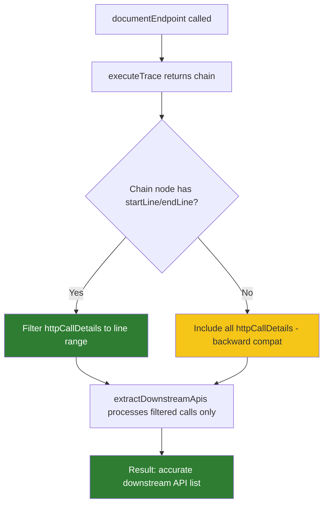
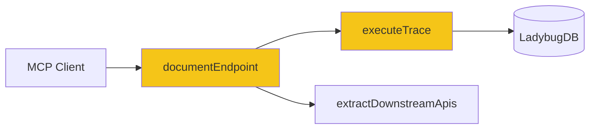
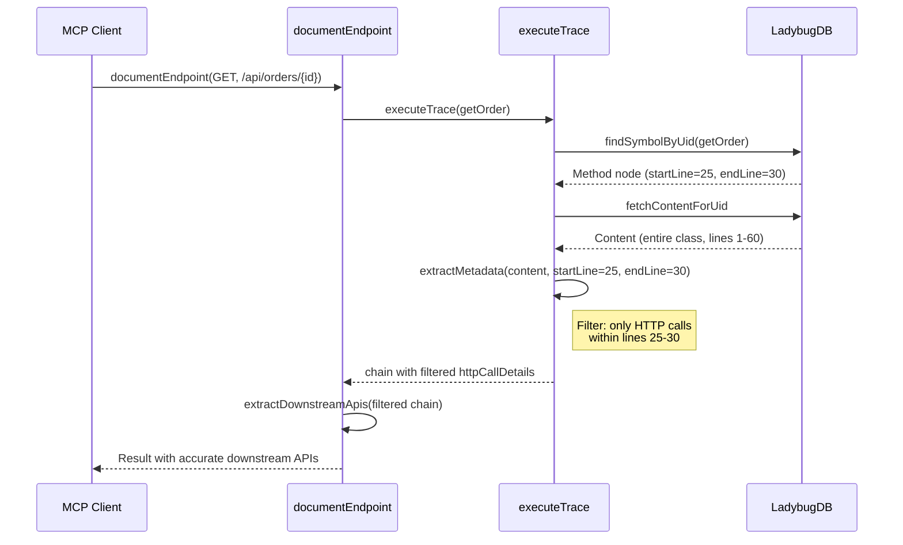

# Solution Design: downstream-apis-method-filter

## 1. Problem Statement & Root Cause

The `document-endpoint` tool lists all HTTP methods for a service path as downstream APIs, instead of only the methods actually called by the handler. For example, `GET /api/orders/{id}` which only calls `orderService.getOrder()` incorrectly shows both `GET /api/orders/{id}` and `DELETE /api/orders/{id}` as downstream dependencies.

**Root cause:** The trace executor's `extractMetadata` function scans the entire `content` field of a chain node for HTTP call patterns (`restTemplate.*`, `@GetMapping`, etc.). When the graph stores content at the class level (entire class body), the scan picks up HTTP calls from ALL methods in the class, not just the handler being documented.

## 2. Recommended Solution

Add line-range filtering to `extractMetadata` (or post-filter `httpCallDetails`) based on the chain node's `startLine`/`endLine` properties. After metadata extraction, filter out any `httpCallDetail` entries whose source line falls outside the handler's line range.

### Trade-offs & Decision Records
| Decision | Alternatives Considered | Chosen | Why | Consequence |
|---|---|---|---|---|
| Filter in `extractMetadata` vs. post-filter in `buildDocumentation` | A) Filter in `extractMetadata` using line range; B) Post-filter in `buildDocumentation` | A) Filter in `extractMetadata` | Keeps the filtering logic close to the extraction, making it self-contained. `buildDocumentation` doesn't need to know about line ranges. | Must pass line range info to `extractMetadata` |
| Line range source | A) Use chain node's `startLine`/`endLine`; B) Use regex to detect method boundaries | A) Chain node line range | Already available, deterministic, no regex fragility | Requires line numbers in graph DB nodes |

## 3. Details

### 3.1 Use Cases

#### Use Case Summary
| # | Use Case | Type | Trigger | Expected Outcome |
|---|---|---|---|---|
| UC-1 | Handler with single call | Happy path | Handler calls one service method | Only that call appears in downstreamApis |
| UC-2 | Handler with multiple calls | Happy path | Handler calls multiple service methods | All calls within line range appear |
| UC-3 | Content includes other methods | Edge case | Class content spans multiple methods | Calls outside handler line range are excluded |
| UC-4 | No line range available | Edge case | Graph node missing startLine/endLine | All calls included (backward compatible) |
| UC-5 | Self-referencing call | Error case | Handler calls its own service | Excluded by #35 fix (currentController) |

### 3.2 Container Level

#### Container Changes
| Container | Change | What | Why | How |
|---|---|---|---|---|
| GitNexus MCP | Update | `extractMetadata` in `trace-executor.ts` | Add line-range filtering of httpCallDetails | Pass chain node's startLine/endLine to extractMetadata; filter httpCallDetails after extraction |

#### Container Sequence Diagram

##### Sequence Explanation
| Step | Actor | Action | Error Handling |
|---|---|---|---|
| 1 | Client | Calls documentEndpoint | — |
| 2 | documentEndpoint | Traces handler method | Falls back to no-trace mode on error |
| 3 | executeTrace | Fetches node content from graph | Returns empty content on DB error |
| 4 | executeTrace | Extracts metadata with line-range filter | No line range → include all (backward compat) |
| 5 | documentEndpoint | Processes downstream APIs | Self-reference exclusion from #35 also applies |

## 4. Cross-Cutting Concerns

### Performance
Line-range filtering is O(n) where n = number of httpCallDetails, which is typically < 10. No performance concern.

### Security
No security implications — this is a data accuracy fix.

### Reliability
Backward compatible — when startLine/endLine are missing, current behavior is preserved.

## Work Items
| # | Title | Layer | Container | Files Affected | Reuse |
|---|---|---|---|---|---|
| WI-1 | Filter httpCallDetails to handler line range | Backend | GitNexus MCP | `trace-executor.ts` → `extractMetadata()` | Existing extractMetadata |
| WI-2 | Add unit tests for line-range filtering | Test | GitNexus MCP | `test/unit/trace-executor.test.ts` | Existing test infrastructure |

## Risk Assessment
MEDIUM — The fix touches the trace extraction pipeline which is used by multiple features. However, the change is additive (filtering, not replacing) and backward compatible.

## Cross-Stack Completeness
- Backend changes: Yes — `trace-executor.ts` extractMetadata, `document-endpoint.ts` buildDocumentation
- Frontend changes: None
- Contract mismatches: None — output shape unchanged
- Safe deployment order: N/A (single backend change)

## Autonomous Decisions
All gaps resolved without human input. Listed for post-hoc review.

| # | Ambiguity | Decision Made | Rationale |
|---|---|---|---|
| 1 | Where to apply the filter | In `extractMetadata` function | Keeps filtering logic close to extraction; `buildDocumentation` doesn't need line range awareness |
| 2 | How to handle missing line range | Include all calls (current behavior) | Backward compatible; avoids data loss for codebases without line info |
| 3 | Whether to also filter annotations, messaging, etc. | No — only filter httpCallDetails | HTTP calls are the only source of downstream API entries; other metadata types serve different purposes |