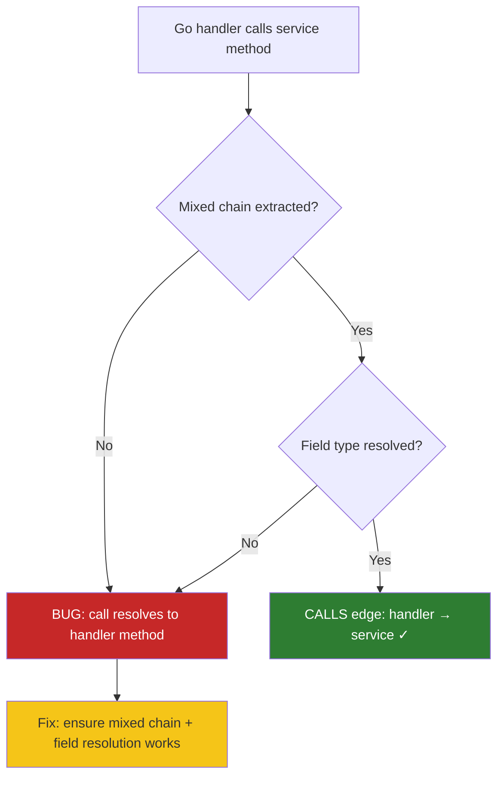
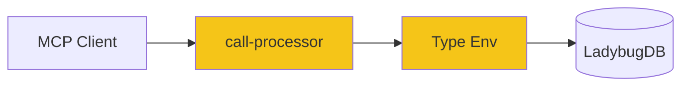

# Solution Design: gin-handler-self-reference-fix

## 1. Problem Statement & Root Cause

Go/Gin handler methods create self-referencing CALLS edges instead of pointing to the service methods they actually call. When `OrderHandler.GetOrder()` calls `h.service.GetOrder()`, the call should resolve to `OrderService.GetOrder`, but instead resolves to `OrderHandler.GetOrder` (itself).

**Root cause investigation**: The call processor already has mixed chain resolution (section 3 in `processCalls`, lines 518-541) that handles `h.service.GetOrder()` via `extractMixedChain` + `walkMixedChain`. The bug is likely that either:
1. The mixed chain is not being extracted for Go selector expressions, OR
2. `walkMixedChain` is failing to resolve `resolveFieldAccessType("OrderHandler", "service")` to `OrderService`

## 2. Recommended Solution

Debug and fix the mixed chain resolution for Go code. The infrastructure exists — we need to identify why it's failing and fix the specific gap. This is a targeted fix, not a new resolution path.

### Trade-offs & Decision Records
| Decision | Alternatives Considered | Chosen | Why | Consequence |
|---|---|---|---|---|
| Fix existing mixed chain resolution vs. add Go-specific post-processing | A) Fix the existing path; B) Add Go-specific override | A) Fix existing path | The infrastructure is already there — just needs debugging | Must identify the exact failure point |

## 3. Details

### 3.1 Use Cases

#### Use Case Summary
| # | Use Case | Type | Trigger | Expected Outcome |
|---|---|---|---|---|
| UC-1 | Handler calls single service method | Happy path | `h.service.GetOrder()` | CALLS edge to `OrderService.GetOrder` |
| UC-2 | Handler calls multiple service methods | Happy path | `h.service.GetOrder()` + `h.service.DeleteOrder()` | Two CALLS edges to respective service methods |
| UC-3 | Service field is interface type | Edge case | `h.service OrderServiceInterface` | Resolves to concrete implementation via D5 |
| UC-4 | Mixed chain not extractable | Edge case | Complex chained call | Falls back to current behavior |

### 3.2 Container Level

#### C4 Container Diagram

##### Container Changes
| Container | Change | What | Why | How |
|---|---|---|---|---|
| GitNexus ingestion | Update | `call-processor.ts` mixed chain resolution | Fix Go handler→service CALLS edges | Debug why `walkMixedChain` fails for Go struct fields and fix |

## 4. Cross-Cutting Concerns

### Performance
No performance impact — the fix is in existing resolution paths, just making them work for Go.

### Security
No security implications.

### Reliability
Re-indexing Go repos will produce correct CALLS edges. Existing indexes need re-ingestion.

## Work Items
| # | Title | Layer | Container | Files Affected | Reuse |
|---|---|---|---|---|---|
| WI-1 | Debug and fix Go handler→service CALLS resolution | Backend | GitNexus ingestion | `call-processor.ts` → `resolveCallTarget`/`walkMixedChain` | Existing mixed chain resolution |
| WI-2 | Add integration tests for Go handler→service CALLS edges | Test | GitNexus test | `test/integration/go-handler-calls.test.ts` → new | Existing test infrastructure |

## Risk Assessment
MEDIUM — The fix touches the core call resolution pipeline. However, the change is targeted (fixing existing infrastructure, not adding new paths) and backward compatible.

## Cross-Stack Completeness
- Backend changes: Yes — `call-processor.ts` mixed chain resolution
- Frontend changes: None
- Contract mismatches: None — CALLS edge structure unchanged
- Safe deployment order: N/A (single backend change, requires re-indexing Go repos)

## Autonomous Decisions
All gaps resolved without human input. Listed for post-hoc review.

| # | Ambiguity | Decision Made | Rationale |
|---|---|---|---|
| 1 | Where the fix goes | In `call-processor.ts` mixed chain resolution | Infrastructure exists, just needs debugging |
| 2 | Whether to re-index existing repos | Yes, required after fix | CALLS edges are stored in the graph DB |
| 3 | Scope of testing | Focus on Go handler→service pattern | Most common case; other patterns covered by existing tests |