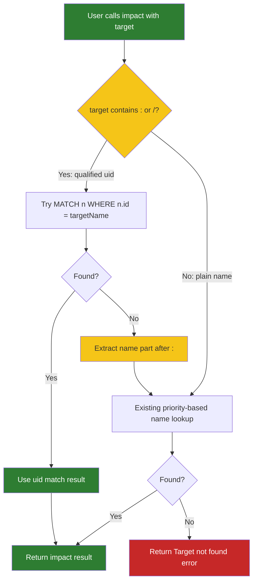

# Solution Design: impact-uid-fix

## 1. Problem Statement & Root Cause

The `impact` MCP tool fails with "Target not found" when given uid-format targets like `Class:UserController`, even though the `context` tool returns uids in this exact `Type:Name` format. The root cause is that `_impactImpl` only queries `n.name = $targetName`, never checking `n.id`. Since `n.name` is `UserController` (not `Class:UserController`), the query fails. The `context` tool correctly handles this via `isQualified` detection and `WHERE n.id = $symName OR n.name = $symName`.

## 2. Recommended Solution

Add uid-format detection to `_impactImpl` using the same `isQualified` pattern already proven in `context` and `findSymbolByName`. When a qualified target is detected, perform a direct uid match first (`WHERE n.id = $targetName`). If no match, extract the name part and fall back to the existing priority-based name lookup. Also update the tool schema description to document uid-format support.

### Reuse Inventory
- `findSymbolByName` in `gitnexus/src/mcp/local/trace-executor.ts:581-616` — already implements the exact `isQualified` pattern
- `context` method in `gitnexus/src/mcp/local/local-backend.ts:1214-1220` — proven `isQualified` detection

### Trade-offs & Decision Records
| Decision | Alternatives Considered | Chosen | Why | Consequence |
|---|---|---|---|---|
| Add uid detection to `_impactImpl` directly | (a) Extract shared `resolveTarget` helper, (b) Add `uid` param to impact tool | Add inline detection | Simplest fix; `findSymbolByName` has different params (filePath), and adding a new param would be a larger schema change | Minimal change, same pattern as context |
| Extract name part on fallback | Always use uid-only lookup | Extract name on fallback | Uid lookup is fast but might not match if graph is stale; name lookup is the existing proven path | Backward compatible; handles edge cases |
| Update tool description only | Also add `uid` param | Description only | Users already pass uid-format strings via `target`; adding a separate param creates confusion | Single param, same UX as context's `name` field |

## 3. Details

### 3.1 Use Cases

#### Use Case Summary
| # | Use Case | Type | Trigger | Expected Outcome |
|---|---|---|---|---|
| UC-1 | Impact with uid target | Happy path | `impact(target="Class:UserController")` | Finds node by uid, returns impact analysis |
| UC-2 | Impact with qualified name, uid miss | Edge case | Stale uid or typo | Falls back to name lookup, finds by name part |
| UC-3 | Impact with plain name | Happy path | `impact(target="UserController")` | Works exactly as before (no change) |
| UC-4 | Target not found by any method | Error | Invalid or non-existent target | Returns "Target not found" error (existing behavior) |

### 3.2 Container Level

Single-container change — no new containers.

#### Container Changes
| Container | Change | What | Why | How |
|---|---|---|---|---|
| GitNexus MCP Server | update | `_impactImpl` target resolution | Bug fix: uid-format targets | Add isQualified detection before existing name lookup |

### 3.3 Component Level

#### GitNexus MCP Server

##### Component Changes
| Component | Change | What | Why | How |
|---|---|---|---|---|
| `_impactImpl` | update | Target resolution logic (lines 3065-3122) | Bug fix | Add uid detection before priority-based query |
| `GITNEXUS_TOOLS` schema | update | `impact` tool description | Document uid support | Add "or uid (e.g., 'Class:UserController')" to target description |

## 4. Cross-Cutting Concerns

### Performance
Uid match is a single index lookup (`n.id` is the primary key), which is faster than the 5-UNION priority query. Adding uid-first detection actually improves performance for qualified targets.

### Security
No new attack surface — target parameter is already user-supplied string input, uid format is a subset of valid strings.

### Reliability
Fallback to name lookup ensures that even if uid format is incorrect (e.g., type prefix doesn't match), the tool still tries to find the symbol by name. This is the same fallback pattern used in `context`.

## Work Items
| # | Title | Layer | Container | Files Affected | Reuse |
|---|---|---|---|---|---|
| WI-1 | Add uid-format target resolution to impact | Backend | GitNexus MCP | `gitnexus/src/mcp/local/local-backend.ts` → `_impactImpl` | `isQualified` pattern from `context` and `findSymbolByName` |
| WI-2 | Update impact tool schema description | Backend | GitNexus MCP | `gitnexus/src/mcp/tools.ts` → `impact` definition | None |
| WI-3 | Add tests for uid-format target resolution | Test | GitNexus test | `gitnexus/test/unit/impact-uid-resolution.test.ts` → new | None — new test file required |

## Risk Assessment
LOW — Single-function bug fix with existing proven pattern. No API contract changes. Backward compatible (plain names work as before).

## Cross-Stack Completeness
- Backend changes: Yes — target resolution in `_impactImpl` + tool schema description
- Frontend changes: No
- Contract mismatches: No — response shape unchanged
- Safe deployment order: N/A (backend-only)

## Autonomous Decisions
| # | Ambiguity | Decision Made | Rationale |
|---|---|---|---|
| 1 | Should impact accept a separate `uid` param like context? | No — reuse the `target` param for both plain names and uids | Context uses `name` for both; adding a separate param would create confusing UX. Users already pass uid strings via target. |
| 2 | Should the uid lookup fail silently and fall back to name? | Yes — extract name part and fall back | Matches context tool behavior; handles edge cases like stale uids |
| 3 | Should we extract a shared `resolveTarget` utility? | No — inline the pattern in `_impactImpl` | `findSymbolByName` has different params (filePath) and different return shape. The pattern is 5 lines; extraction is premature. |
| 4 | Type prefix in uid — should we validate it matches a known node label? | No — just try `n.id = $targetName` | The graph will simply return no match for invalid uids; adding validation would require maintaining a label list |