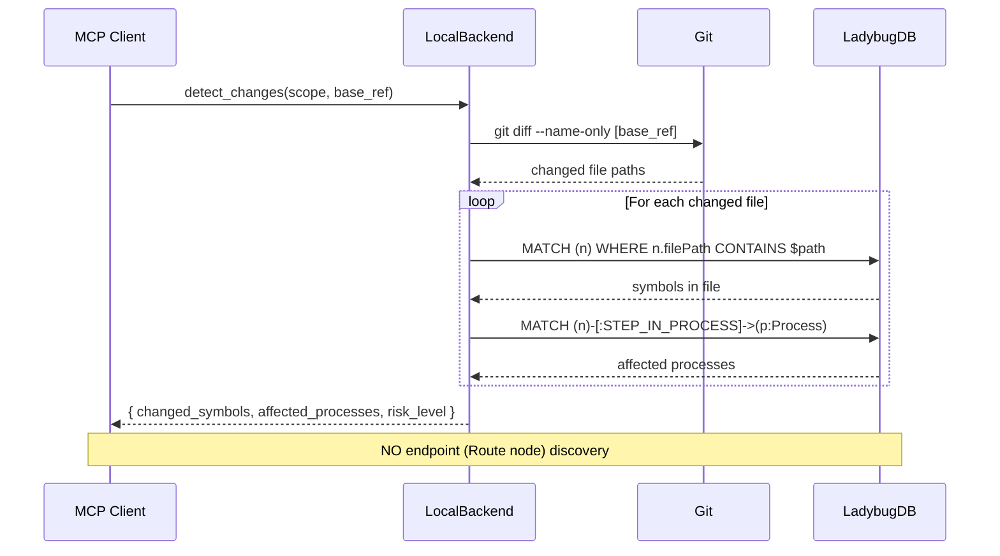
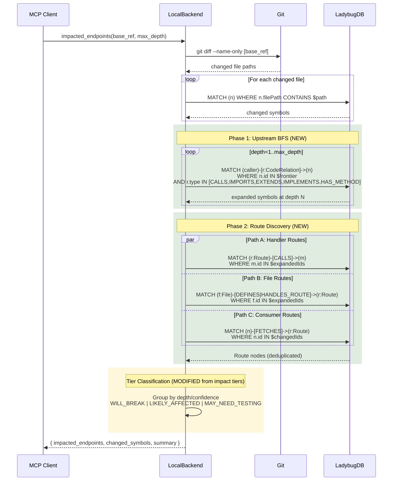
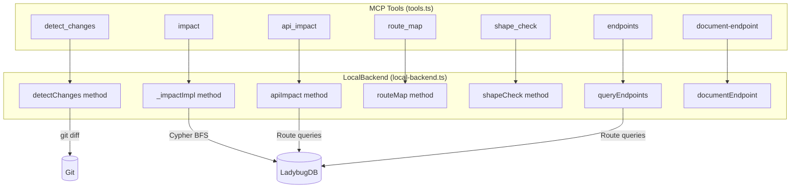
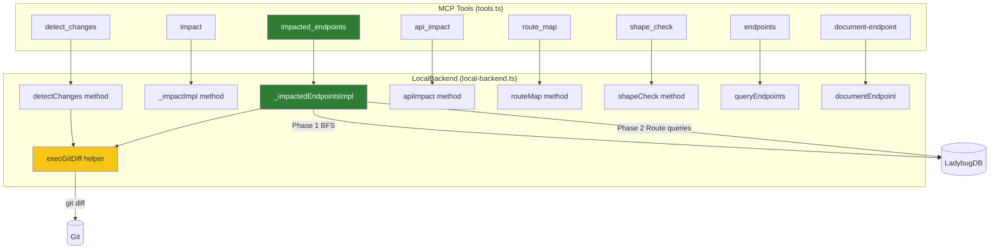
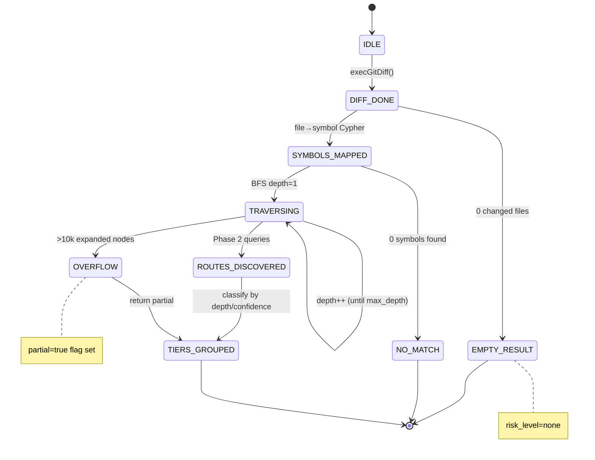
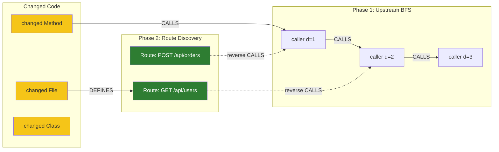
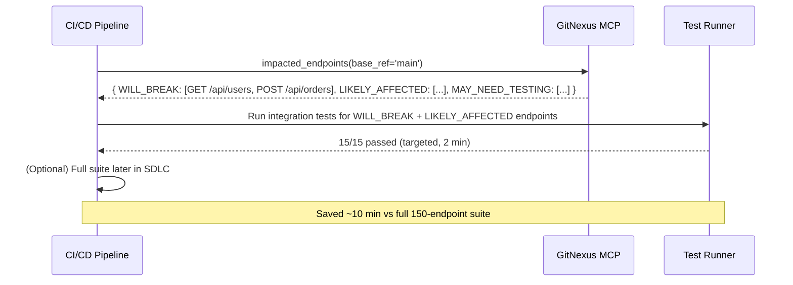
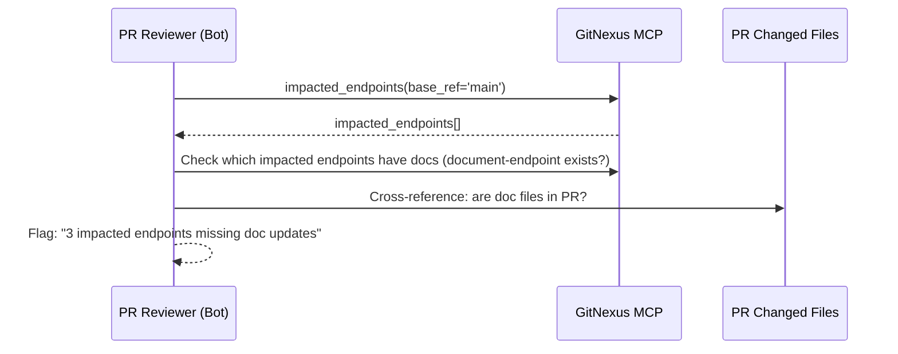
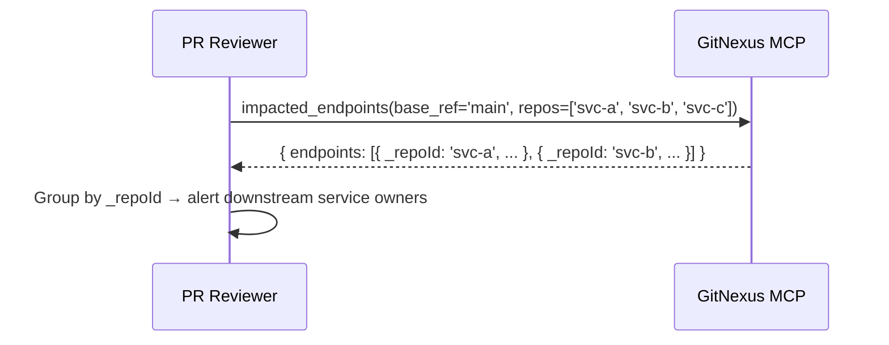

# Impacted Endpoints — Solution Design Diagrams

**Date:** 2026-04-29
**Feature:** `impacted_endpoints` MCP tool

---

## Data/Control Flow: As-Is (current detect_changes)

---

## Data/Control Flow: To-Be (new impacted_endpoints)

**Color key:** Green = new, Yellow = modified/reused from existing, No color = unchanged

---

## Component/Service Structure: As-Is

**Note:** No connection from `detect_changes` to Route/endpoint discovery.

---

## Component/Service Structure: To-Be

**Color key:** Green = new, Yellow = extracted from existing, No color = unchanged

---

## Traversal State Machine: To-Be

---

## Graph Traversal Paths: To-Be

**Color key:** Green = Route nodes (target output), Yellow = changed code (input), Dashed edges = reverse traversal

---

## Use Case Flows

### Use Case 1: Integration Test Re-Run

### Use Case 2: Documentation Enforcement

### Use Case 3: Cross-Service Impact

