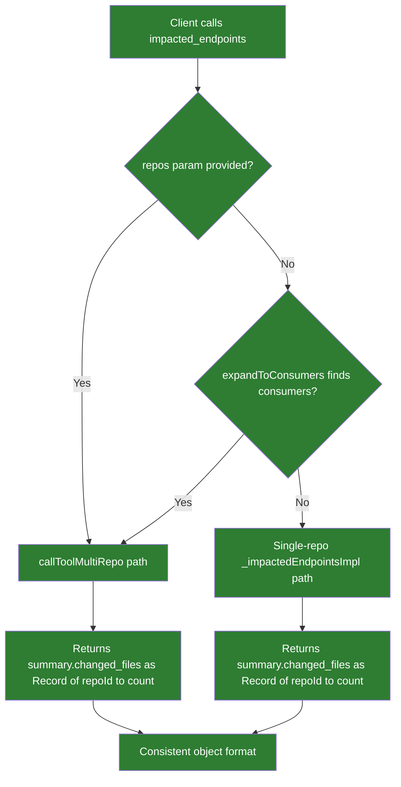
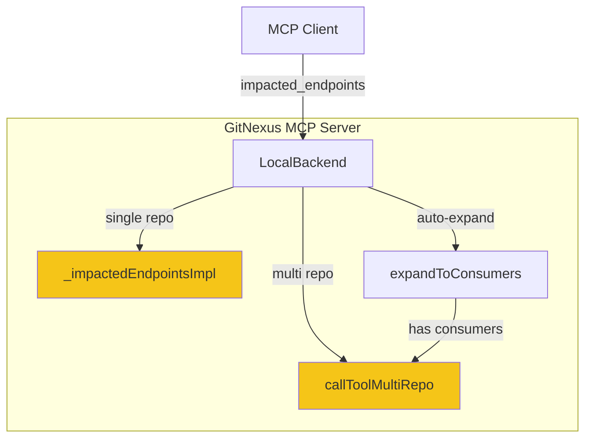

# Solution Design: impacted_endpoints Response Format Consistency

## 1. Problem Statement & Root Cause

The `impacted_endpoints` MCP tool returns inconsistent `changed_files` and `impacted_endpoints` summary field types depending on the call path: single-repo calls return a `number`, while multi-repo calls (explicit `repos[]` or auto-expanded via `expandToConsumers`) return an `object` keyed by repo ID. This makes client parsing fragile — callers must type-check the field at runtime. The root cause is that `_impactedEndpointsImpl()` returns scalar counts while `callToolMultiRepo()` aggregates them into per-repo objects.

## 2. Recommended Solution

Normalize `summary.changed_files` and `summary.impacted_endpoints` to **always** be `Record<string, number>` (object keyed by repo ID), regardless of single-repo or multi-repo call path. The single-repo implementation will wrap the count in `{ [repoId]: count }`. The multi-repo aggregator will merge these per-repo objects instead of building them from scalars.

**Reuse inventory:**
- Existing `_impactedEndpointsImpl()` — modify return shape (no new code paths needed)
- Existing `callToolMultiRepo()` aggregation block — update merge logic
- Existing `ImpactedEndpointsResult` interface — update type definition
- Existing E2E test helpers — reuse `withTestLbugDB`, `mockGitDiff`, seed data

### Trade-offs & Decision Records

| Decision | Alternatives Considered | Chosen | Why | Consequence |
|---|---|---|---|---|
| Always return object format | (a) Always return number (flatten multi-repo); (b) Add wrapper type with discriminated union; (c) Always return object | (c) Always return object | (a) loses per-repo granularity; (b) adds unnecessary complexity; (c) is consistent, extensible, matches multi-repo shape | Breaking change for single-repo callers that expect `number` — but the current inconsistency IS the bug |
| Include `impacted_endpoints` count in fix | Fix only `changed_files` | Fix both `changed_files` and `impacted_endpoints` counts | Both fields have the same number-vs-object inconsistency | Slightly larger change scope, but prevents a follow-up ticket for the identical bug |

## 3. Details

### 3.1 Use Cases

#### Use Case Summary

| # | Use Case | Type | Trigger | Expected Outcome |
|---|---|---|---|---|
| UC-1 | Single repo, no consumers | Happy path | `repo="sample-spring-minimal"` | `changed_files: {"sample-spring-minimal": 3}` |
| UC-2 | Single repo, with consumers | Edge case | `repo="tcbs-bond-trading"` with cross-repo consumers | Auto-expands to multi-repo; `changed_files: {"tcbs-bond-trading": 2, "matching-engine-client": 1}` |
| UC-3 | Multi-repo explicit | Happy path | `repos=["repo1","repo2"]` | `changed_files: {"repo1": 3, "repo2": 1}` |
| UC-4 | Empty repo list | Edge case | `repos=[]` | Returns error or empty `changed_files: {}` |
| UC-5 | No changes detected | Edge case | Clean working tree | `changed_files: {"repoName": 0}` |

### 3.2 Container Level

#### C4 Container Diagram

##### Container Changes

| Container | Change | What | Why | How |
|---|---|---|---|---|
| _impactedEndpointsImpl | update | Return `changed_files` and `impacted_endpoints` in summary as `Record<string, number>` instead of `number` | Consistency across call paths | Wrap scalar counts in `{ [repo.id]: count }` |
| callToolMultiRepo (impacted_endpoints case) | update | Merge per-repo objects instead of building them from scalars | Adapt to new single-repo return shape | Use `Object.assign()` or spread to merge `changed_files` objects |

### 3.3 Component Level

#### LocalBackend

##### Component Changes

| Component | Change | What | Why | How |
|---|---|---|---|---|
| `_impactedEndpointsImpl` return statement (line ~2288-2309) | update | `summary.changed_files` and `summary.impacted_endpoints` become `{ [repo.id]: count }` | Fix inconsistent type | Change `changedFiles.length` to `{ [repo.id]: changedFiles.length }` and `endpointCount` to `{ [repo.id]: endpointCount }` |
| `callToolMultiRepo` aggregation (line ~540-577) | update | Merge per-repo objects from `_impactedEndpointsImpl` instead of assigning scalars | Adapt to new single-repo shape | `Object.assign(aggregated.summary.changed_files, result.summary.changed_files)` |
| `ImpactedEndpointsResult` interface (test file) | update | Update `changed_files` and `impacted_endpoints` in summary from `number` to `Record<string, number>` | Match new contract | Change type definitions |
| `impacted-endpoints-contract.md` | update | Update Output Schema to reflect `Record<string, number>` | Document correct contract | Change field types in schema |

## 4. Cross-Cutting Concerns

### Performance
No performance impact. The change wraps two scalar values in single-key objects — this is negligible overhead. Multi-repo aggregation already uses object format.

### Security
No security implications. This is a response-format normalization with no change to auth, input validation, or data access.

### Reliability
Improves reliability by eliminating a type inconsistency that forces clients into runtime type checking. No new failure modes introduced.

## Work Items

| # | Title | Layer | Container | Files Affected | Reuse |
|---|---|---|---|---|---|
| WI-1 | Normalize single-repo response format | Backend | LocalBackend | `gitnexus/dist/mcp/local/local-backend.js → _impactedEndpointsImpl()` | Existing function — modify return shape |
| WI-2 | Update multi-repo aggregation merge | Backend | LocalBackend | `gitnexus/dist/mcp/local/local-backend.js → callToolMultiRepo()` | Existing aggregation — update merge logic |
| WI-3 | Update contract documentation | Docs | — | `docs/service-context/impacted-endpoints-contract.md` | Existing doc — update schema |
| WI-4 | Update test interface and add multi-repo tests | Test | — | `gitnexus/test/integration/impacted-endpoints-e2e.test.ts` | Existing test helpers — update type, add cases |

## Risk Assessment
LOW — The change is a response-format fix in a single module. The "breaking change" fixes an existing bug (inconsistent type). All call paths are internal to LocalBackend.

## Cross-Stack Completeness
- Backend changes: Yes — `_impactedEndpointsImpl` return shape and `callToolMultiRepo` aggregation
- Frontend changes: No
- Contract mismatches: Contract doc currently says `number` — will be updated to `Record<string, number>`
- Safe deployment order: Backend-only change, single deploy

## Autonomous Decisions

| # | Ambiguity | Decision Made | Rationale |
|---|---|---|---|
| 1 | Scope of `changed_files` fix | Fix both `changed_files` and `impacted_endpoints` counts in summary | Both have identical inconsistency — fixing only one would leave the same bug |
| 2 | Single-repo format choice | Always return `Record<string, number>` object | Consistency is the stated requirement; flattening multi-repo would lose per-repo granularity |
| 3 | Auto-expand path behavior | No change — already routes to multi-repo handler | Auto-expand already produces consistent object format; only single-repo fallback needs fixing |
| 4 | Backward compatibility | Accept breaking change for single-repo callers | The current inconsistent format IS the bug; maintaining `number` for single-repo perpetuates the problem |
| 5 | Empty repos list behavior | Return `{ changed_files: {}, impacted_endpoints: {} }` | Natural extension of object format — no repos means no entries |