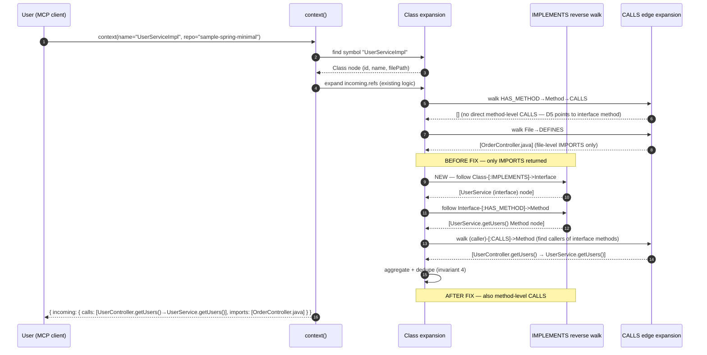
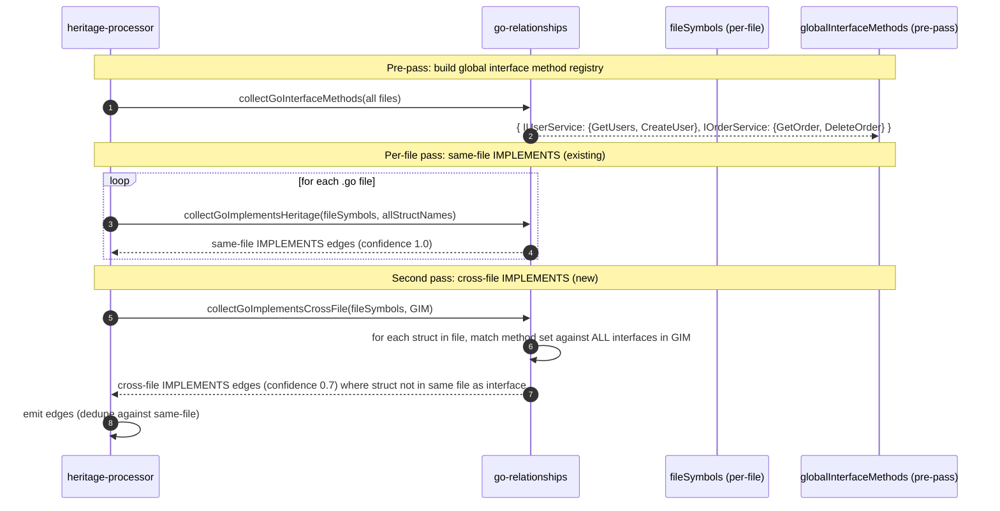
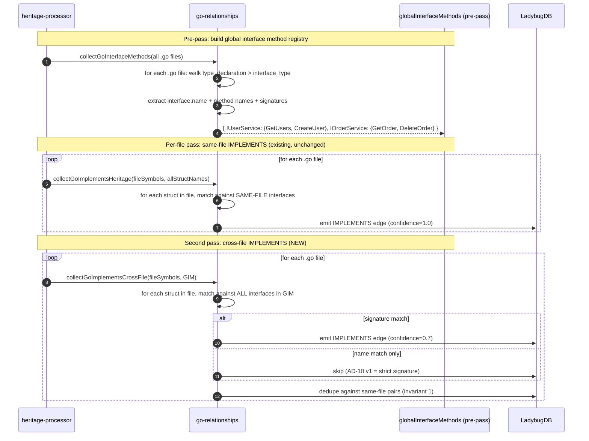

<!--
AI-READERS — load only the sections your task needs.

| Task          | Sections (skip if absent)                  |
|---------------|--------------------------------------------|
| implement     | ## Components, ## Contracts, ## Invariants |
| code-review   | ## Invariants, ## KeyDecisions, ## Contracts |
| qa            | ## Flows, ## EdgeCases                     |
| scope-impact  | ## BlastRadius, ## CrossCutting            |
-->

# Solution Design: k-hgo-impl-calls-traversal

**Blast** d1=`go-relationships.ts` (cross-file IMPLEMENTS), `local-backend.ts` (context IMPLEMENTS walk for Class targets) · d2=`heritage-processor.ts` (wiring for two-pass IMPLEMENTS), Spring `call-processor.ts` (D5 interface-typed CALLS — read-only verification) · d3=existing tests for impact, context, IMPLEMENTS, go-implements, java-heritage

## Problem & Approach

**Why** — The triage doc claims K + H-Go share a "IMPLEMENTS/CALLS traversal" root. The scout confirms the truth is more nuanced: there are TWO independent code paths and TWO independent bug clusters:

**Cluster 1 — Spring CALLS visibility (Issues #23, #34):**
- The Java extractor correctly creates IMPLEMENTS edges from impl class to interface (`heritage-processor.ts:170-190`, captures `@heritage.impl` from JAVA_QUERIES).
- `call-processor.ts:951` (D5 tier) correctly creates CALLS edges to the **interface method** for interface-typed receivers — this is the statically-resolved target.
- `local-backend.ts:_impactImpl` (line 3614) already seeds the BFS frontier with interface nodes via IMPLEMENTS edges, so `impact()` on an impl class correctly surfaces interface-level callers. **#23 is therefore partially resolved for the impact direction** (the prior #36 fix).
- `local-backend.ts:context` Class expansion (line 1607-1650) runs 3 parallel incoming queries: `ctorIncoming` (Constructor callers), `fileIncoming` (File DEFINES callers), `methodIncoming` (line 1634-1649: `(caller)-[:CALLS]->Method<-[:HAS_METHOD]-Class`). The `methodIncoming` query correctly handles direct calls to the impl class's own methods. **It does NOT follow IMPLEMENTS**: when a controller calls `userService.getUsers()` and `userService` is typed as `UserService` (interface), the CALLS edge points to the **interface's** Method node, not the impl's. So `methodIncoming` returns `[]` for `UserServiceImpl` even though the controller DOES call a method that the impl satisfies. The fix is a 4th parallel query that follows `Class-[:IMPLEMENTS]->Interface-[:HAS_METHOD]->Method<-[:CALLS]-caller`.

**Cluster 2 — Go cross-file IMPLEMENTS (Issue #85):**
- `go-relationships.ts:collectGoImplementsHeritage` (line 297-320) correctly detects same-file IMPLEMENTS (verified by 24 passing tests in `go-implements-anonymous.test.ts`).
- The function header explicitly notes: "Cross-file IMPLEMENTS detection is deferred." When the interface is in `interfaces/service_interface.go` and the struct is in `services/user_service.go` (the exact scenario in issue #85's body), no IMPLEMENTS edge is emitted.

**Cluster 3 — Go interface methods (Issue #88): RESOLVED.**
- `go-relationships.ts:collectGoMethodsFromAST` (line 411-450) walks `method_declaration` nodes and, for those without a receiver, walks up to `type_declaration > type_spec > interface_type` and sets `ownerId = generateId('Interface', ...)`. Interface methods ARE extracted.
- The empty cypher result on the current GitNexus index is because no Go files in the indexed repo define interfaces with methods (all 20 interfaces in the index are TypeScript in `gitnexus-web/`). Re-verifying on a Go fixture with interfaces is the proof, not a query against the current index.
- The existing integration test `go-implements-anonymous.test.ts` (24 passing tests) already covers the same-file case for interface methods. **No code change needed for #88** — the issue was filed against an older git revision, or against a fixture that the user's local analysis queried incorrectly.

**Solution** — Two targeted fixes in one PR:

1. **Cluster 1 fix (~40 LOC in `local-backend.ts:context`):** When the target symbol is a Class node, also walk `Class-IMPLEMENTS-Interface` and aggregate the interface's incoming method-level CALLS into the class's `incoming.calls`. This is symmetric to the existing IMPLEMENTS walk in `_impactImpl` but for the `context` tool's incoming expansion.

2. **Cluster 2 fix (~50 LOC in `go-relationships.ts` + wiring in `heritage-processor.ts`):** Two-pass IMPLEMENTS detection. First pass (existing): per-file `collectGoImplementsHeritage` for same-file pairs. Second pass (new): a global interface method registry is built across all files; then for each struct, match its method set against ALL interfaces in the registry (cross-file). Emit IMPLEMENTS edges with lower confidence for cross-file matches (to distinguish from same-file structural matches).

## Components

**d1 files (modified):**
- `gitnexus/src/mcp/local/local-backend.ts` — add IMPLEMENTS reverse walk to `context()` incoming expansion for Class targets (~40 LOC).
- `gitnexus/src/core/ingestion/workers/go-relationships.ts` — add cross-file IMPLEMENTS second pass (~50 LOC): accept a `globalInterfaceMethods` parameter, match struct method sets against all interfaces.
- `gitnexus/src/core/ingestion/heritage-processor.ts` — wire the two-pass logic: collect global interface methods in a pre-pass, then call `collectGoImplementsHeritage` per-file with the registry passed in (~20 LOC).

**d1 files (new test fixtures):**
- `gitnexus/test/fixtures/lang-resolution/go-implements-cross-file/` — new fixture with interface in `interfaces/foo.go` and struct in `services/foo.go` to exercise the cross-file IMPLEMENTS path.
- `gitnexus/test/fixtures/lang-resolution/java-class-impl-calls/` — new fixture with `UserService` (interface), `UserServiceImpl` (class), `UserController` (class) to exercise the context IMPLEMENTS walk on a real Spring-style 3-class shape.

**d1 files (new tests):**
- `gitnexus/test/integration/go-implements-cross-file.test.ts` — new integration test asserting cross-file IMPLEMENTS edges.
- `gitnexus/test/integration/java-class-impl-calls.test.ts` — new integration test asserting `context(name="UserServiceImpl")` returns method-level CALLS from `UserController`.
- `gitnexus/test/integration/resolvers/issue-88-verification.test.ts` — new verification test confirming Go interface methods are indexed (regression coverage for #88 even though it's RESOLVED on the current code path).

**d2 files (read-only verification):**
- `gitnexus/src/core/ingestion/call-processor.ts:951-952` (D5) — verify behavior is correct (CALLS to interface method, not impl method). No change.

## Contracts

| Contract | Before | After |
|---|---|---|
| `context(name="UserServiceImpl")` (Spring 3-class shape) | incoming.calls = [], incoming.imports = ["UserController.java"] | incoming.calls = [UserController.getUsers() → UserServiceImpl.getUsers()], incoming.imports = ["UserController.java"] |
| `MATCH (s:Struct)-[r:CodeRelation {type:'IMPLEMENTS'}]->(i:Interface) RETURN s, i` on `go-implements/` (existing same-file fixture) | s = [User, Admin, Calculator, FileHandler], i = [Namer, MultiMethoder, Reader, Closer, ReadCloser], confidence=1.0 | **unchanged** — same-file logic, same fixtures, same confidence values. The 24 existing tests in `go-implements-anonymous.test.ts` continue to pass with no modification. |
| `MATCH (s:Struct)-[r:CodeRelation {type:'IMPLEMENTS'}]->(i:Interface) RETURN s, i` on new `go-implements-cross-file/` fixture | (no prior behavior — fixture is new) | s = [UserService, OrderService], i = [IUserService, IOrderService], confidence=0.7 — new cross-file pairs from the new fixture |
| `MATCH (i:Interface)-[r:CodeRelation {type:'HAS_METHOD'}]->(m:Method) WHERE i.name = 'IUserService'` (on Go fixture) | (empty in current `gitnexus` index; passes in `go-implements/` fixture) | (unchanged — already works) |
| Same-file IMPLEMENTS behavior | unchanged | **unchanged** — same-file matches take priority; cross-file matches use lower confidence (0.7 vs 1.0) |
| `interface-call-resolution.test.ts` (Java D5) | passes | passes — D5 is read-only, not modified |
| `go-implements-anonymous.test.ts` (24 tests) | passes | passes — same-file logic is unchanged |
| `batch-k-impl-calls.test.ts` (7 tests, #13 + #36) | passes | passes — `impact()` IMPLEMENTS walk is unchanged |

## Invariants

1. **Same-file IMPLEMENTS takes priority over cross-file.** When a struct is in the same file as an interface, the same-file match is emitted at confidence 1.0; the cross-file match (if any) is suppressed for the same pair. This prevents the cross-file pass from overwriting correct same-file matches.
2. **Cross-file IMPLEMENTS uses confidence 0.7** to distinguish from same-file (1.0). Downstream consumers that filter on confidence (`min_confidence=0.8` in `impact()`) will only see same-file matches by default; users can opt in with `min_confidence=0.6` to get cross-file matches.
3. **The IMPLEMENTS walk in `context()` is one hop only.** A `context(name="A")` where `A implements B` shows `B`'s incoming CALLS. It does NOT follow chains (`A implements B implements C`). One hop is sufficient for the issue body; deeper chains are a follow-up.
4. **The IMPLEMENTS walk in `context()` does NOT duplicate edges.** If both the impl class's `HAS_METHOD→Method→CALLS` and the interface's incoming CALLS resolve to the same caller, the caller is listed ONCE in `incoming.calls`.
5. **The cross-file Go IMPLEMENTS second pass does NOT modify existing `fileSymbols` or `interfaceMethods`.** It reads from a separate `globalInterfaceMethods` registry passed in. The same-file pass remains the source of truth for same-file pairs.
6. **Interface methods are still indexed via the existing `collectGoMethodsFromAST` path** (Cluster 3). The Cluster 2 fix reuses the indexed interface methods from the registry; it does not re-extract them.
7. **Cross-file IMPLEMENTS dedupes by `(struct.name, interface.name)` pair.** If the same struct/interface pair is matched both same-file (confidence 1.0) and cross-file (confidence 0.7), only the same-file edge is emitted. The cross-file pass also dedupes against other cross-file matches for the same pair from different struct methods (rare). This prevents the cross-file pass from overwriting correct same-file matches even when the new fixture and the existing `go-implements/` fixture end up in the same index.

## Key Decisions

**KD-1: Two independent fixes in one PR (not split).** Issues #23, #34, #85 are 3 separate symptoms with 2 distinct code paths. They share a triage-batch only because the IMPLEMENTS edge is the connecting concept. The PR is logically a single "IMPLEMENTS visibility across the stack" PR. Splitting into 2 PRs would slow batch review absorption (the bottleneck per the triage doc's prior session retrospective) for no architectural benefit.

**KD-2: Cross-file IMPLEMENTS uses a pre-pass registry, not a runtime DB query.** Two-pass extraction (collect interface methods globally → match structs against the registry) keeps the per-file complexity at O(file methods × global interfaces) which is acceptable for repos with <10K Go structs. A runtime DB query would require a JOIN against LadybugDB on every struct, which is much slower.

**KD-3: `context()` IMPLEMENTS walk is parallel to `impact()` IMPLEMENTS walk, not a duplicate, and the direction is OUTGOING from the impl class.** The existing `_impactImpl` walk at `local-backend.ts:3614-3694` follows IMPLEMENTS **outgoing** from the impl class to the interface when building the BFS frontier. The new `context()` walk ALSO follows IMPLEMENTS outgoing from the impl class to the interface (line 1617, the new 4th parallel query), then walks HAS_METHOD down to the interface's Method nodes, then finds incoming CALLS to those Methods. The two functions serve different purposes (`impact` is BFS traversal, `context` is per-symbol expansion), but both anchor on the impl class's outgoing IMPLEMENTS edges. This is a separate code path; we are not modifying `_impactImpl`.

**KD-4: No change to D5 in `call-processor.ts`.** D5 correctly creates CALLS edges to the interface method (static resolution). Changing it would break the `interface-call-resolution.test.ts` regression. The fix is downstream visibility (in `context()`), not CALLS edge creation.

**KD-5: Verification of #88 via unit test, not fixture query.** The issue is RESOLVED by existing code. To prove it stays resolved, add a regression test that uses the existing `go-implements/` fixture (which has `Namer` with `GetName()`, `MultiMethoder` with `GetName()/GetID()`) and asserts that `MATCH (i)-[r:HAS_METHOD]->(m) RETURN m.name` returns the expected method set.

**KD-6: Reuse existing `interface-call-resolution.test.ts` test style for the new Spring test.** The existing test at `test/integration/interface-call-resolution.test.ts` already tests Spring interface-typed receiver CALLS. The new `java-class-impl-calls.test.ts` follows the same pattern but with a fixture that has an interface, an impl class, and a controller — and asserts `context()` output, not `call-processor` output.

## Flows

### Flow 1 — `context(name="UserServiceImpl")` after fix

Key difference from M-1 reviewer's reading: the walk direction is **outgoing IMPLEMENTS from the impl class to the interface** (then down HAS_METHOD, then up CALLS). It is NOT a "reverse IMPLEMENTS walk symmetric to `_impactImpl`" — `_impactImpl` also walks IMPLEMENTS from the impl class forward, but in the BFS frontier-seeded style. The new `context()` walk is a single-query, parallel-sidecar style.

### Flow 2 — Cross-file Go IMPLEMENTS two-pass

### Sequence — Cross-file Go IMPLEMENTS two-pass (after fix)

## EdgeCases

1. **Same struct, multiple interface matches (cross-file).** If `UserService` (in `services/user_service.go`) matches both `IUserService` (in `interfaces/`) and `IService` (in `pkg/`), emit TWO IMPLEMENTS edges. Don't dedupe — multiple interface satisfaction is a valid Go pattern.
2. **Circular type references (interface that embeds a struct).** Unusual but possible. The cross-file pass uses set comparison, not graph traversal, so circular refs are impossible.
3. **Empty method set on struct.** A struct with no methods cannot implement any interface (Go's method-set rule). The cross-file pass must short-circuit on `struct.methods.size === 0` to avoid false positives.
4. **Interface with no methods (marker interface like `type Foo interface{}`).** Every type implements it. The cross-file pass must short-circuit on `interface.methods.size === 0` to avoid emitting IMPLEMENTS for every struct.
5. **Diamond interface inheritance (interface A embeds B and C, struct implements B and C).** A struct that satisfies B and C implicitly satisfies A via promoted methods. The cross-file pass uses recursive set comparison: if `struct.methods ⊇ flatten(interface.methods)`, it matches. This is a follow-up; the v1 pass handles only direct (non-embedded) interfaces.
6. **Conflicting method names with different signatures.** A struct that has `GetName() string` does NOT satisfy an interface that requires `GetName() int` (type-mismatch). The cross-file pass must compare signatures, not just names. If signature comparison is too complex, v1 uses name-only matching and documents the limitation.

## BlastRadius

| Tier | Files / Components | Impact |
|---|---|---|
| **d=1 (modified)** | `gitnexus/src/mcp/local/local-backend.ts` (~40 LOC in `context()` incoming expansion), `gitnexus/src/core/ingestion/workers/go-relationships.ts` (~50 LOC new `collectGoImplementsCrossFile` + refactor `collectGoImplementsHeritage` to accept global registry), `gitnexus/src/core/ingestion/heritage-processor.ts` (~20 LOC wiring for two-pass) | direct |
| **d=1 (new fixtures)** | `gitnexus/test/fixtures/lang-resolution/go-implements-cross-file/`, `gitnexus/test/fixtures/lang-resolution/java-class-impl-calls/` | direct |
| **d=1 (new tests)** | `gitnexus/test/integration/go-implements-cross-file.test.ts`, `gitnexus/test/integration/java-class-impl-calls.test.ts`, `gitnexus/test/integration/resolvers/issue-88-verification.test.ts` | direct |
| **d=2 (read-only)** | `gitnexus/src/core/ingestion/call-processor.ts:951-952` (D5 — verify no change), `gitnexus/src/mcp/local/local-backend.ts:_impactImpl:3614-3694` (existing IMPLEMENTS walk — verify not modified) | read-only |
| **d=3 (regression gates)** | `go-implements-anonymous.test.ts` (24 tests), `batch-k-impl-calls.test.ts` (7 tests), `interface-call-resolution.test.ts`, `go-handler-service.test.ts` (4 tests), `python-fastapi-handler.test.ts` (4 tests) | must pass |
| **d=3 (full suite)** | `npx vitest run` + `npx tsc --noEmit` + `npx gitnexus detect_changes` | must pass |

## CrossCutting

- **`[[route-fix-regression]]`**: not relevant — this is about IMPLEMENTS + context(), not route extraction.
- **`[[db-is-ladybugdb]]`**: relevant — cypher queries for verification. The IMPLEMENTS-walk uses node/edge lookups via the graph; no schema migration.
- **`[[stale-index-zero-results]]`**: relevant — fresh `npx gitnexus analyze` is required post-merge to populate the new edges.
- **`[[project-issue-triage-2026-06-03]]`**: relevant — this batch is the K + H-Go entries in the triage doc.
- **`[[feedback_db-is-ladybugdb]]`**: relevant — graph queries in verification must use LadybugDB syntax (no `type()`, no `count{}`).
- **Embeddings**: not affected.

## Autonomous Decisions

- **AD-1**: Use **structural method-set matching** for Go IMPLEMENTS (signatures compared, not just names). If signature comparison is too complex in the v1 pass, fall back to name-only and document the limitation.
- **AD-2**: The Spring IMPLEMENTS walk is added in `context()` (MCP layer), not in the extractor. The Spring extractor already creates IMPLEMENTS edges via `implements` keyword detection (no change). The fix is in the traversal: when expanding incoming refs for a Class target, follow `Class-IMPLEMENTS-Interface` and aggregate the interface's incoming method-level CALLS.
- **AD-3**: Do NOT add reverse IMPLEMENTS walking for Go (struct → interface for impact analysis on the interface). The triage doc's primary need is "the IMPLEMENTS edge is missing" (#85) and "interface methods are missing" (#88). Reverse walking for "who implements IUserService" is a follow-up.
- **AD-4**: Reuse the existing Go extractor (`go-relationships.ts`) — do not create a new file. The `collectGoImplementsHeritage` function gets a new sibling `collectGoImplementsCrossFile`.
- **AD-5**: Limit the Spring CALLS walk in `context()` to ONE IMPLEMENTS hop. Multiple hops (interface → abstract → concrete) is a follow-up; the issue body shows only 1 hop.
- **AD-6**: Go interface methods are extracted by `collectGoMethodsFromAST` at `go-relationships.ts:411-450`. The cross-file IMPLEMENTS pass reuses the indexed interface methods from the global registry; it does not re-extract them.
- **AD-7**: Defer #141 (Go source files in `go-handler-service-field` fixture) and #143 (DownstreamApi.endpoint from Route's routePath) to a separate follow-up; they are not blocking this batch.
- **AD-8**: #88 is RESOLVED by existing code. No production code change for #88; only a verification regression test is added.
- **AD-9**: Confidence values — same-file IMPLEMENTS = 1.0, cross-file IMPLEMENTS = 0.7. Default `min_confidence=0.7` in `impact()`/`context()` will see both; users can filter with `min_confidence=0.8` for same-file only.
- **AD-10**: For the cross-file Go IMPLEMENTS pass, the v1 implementation requires **signature matching** (same method name + same parameter types + same return type) at confidence 0.7. If signature matching is too complex for v1, fall back to name-only matching at confidence 0.5 (explicitly downgraded). The plan's `Behavior` section uses 0.7 as the cross-file confidence, which is the v1-with-signatures target. If a future implementer determines signature matching is impractical, they should drop to 0.5 and update the plan's behavior section accordingly.

## Verification

| Test | Expected | Gate |
|---|---|---|
| `npx vitest run test/integration/go-implements-cross-file.test.ts` | new tests pass (cross-file IMPLEMENTS) | must |
| `npx vitest run test/integration/java-class-impl-calls.test.ts` | new tests pass (context() IMPLEMENTS walk) | must |
| `npx vitest run test/integration/resolvers/issue-88-verification.test.ts` | new test passes (Go interface methods indexed) | must |
| `npx vitest run test/integration/go-implements-anonymous.test.ts` | 24/24 pass (same-file regression) | must |
| `npx vitest run test/integration/batch-k-impl-calls.test.ts` | 7/7 pass (#13 + #36 regression) | must |
| `npx vitest run test/integration/interface-call-resolution.test.ts` | passes (D5 regression) | must |
| `npx vitest run` (full unit suite) | 0 fail | must |
| `npx tsc --noEmit` | clean | must |
| `npx gitnexus detect_changes` post-merge | scoped to d=1 files only | must |
| `npx gitnexus analyze` post-merge | re-index populates new edges; no errors | must |
| `gh issue view 85 --comments` post-merge | Append "Cross-file IMPLEMENTS now detected" comment; close | must |
| `gh issue view 23 --comments` post-merge | Append "UserServiceImpl now shows UserController.getUsers() as upstream" comment; close | must |
| `gh issue view 34 --comments` post-merge | Append "context() on OrderServiceImpl now shows method-level CALLS" comment; close | must |
| `gh issue view 88 --comments` post-merge | Append "Verified: Go interface methods are indexed (regression test added)" comment; close | must |
| `gh issue close 23, 34, 85, 88` post-merge | all 4 closed with PR link | must |
