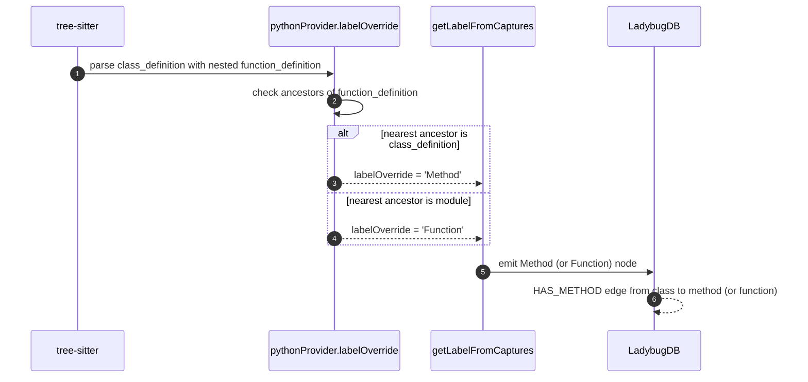
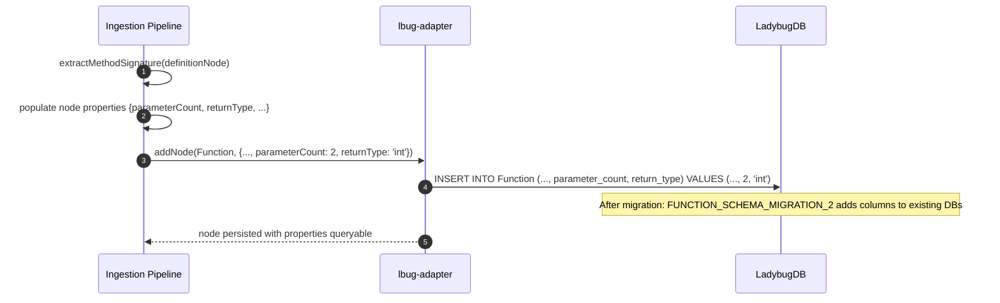

<!--
AI-READERS — load only the sections your task needs.

| Task          | Sections (skip if absent)                  |
|---------------|--------------------------------------------|
| implement     | ## Components, ## Contracts, ## Invariants |
| code-review   | ## Invariants, ## KeyDecisions, ## Contracts |
| qa            | ## Flows, ## EdgeCases                     |
| scope-impact  | ## BlastRadius, ## CrossCutting            |
-->

# Solution Design: py-typing-dedup

**Blast** d1=`languages/python.ts` (labelOverride), `lbug/schema.ts` (function schema + migration) · d2=`parsing-processor.ts` (verifies) · d3=151 Python integration tests (require `Function` → `Method` relabel updates) + 16 Python route-extractor tests + 3 Python MCP tools tests

## Problem & Approach

**Why** — Batch H-Python has 3 issues, but the scout confirms a split:

- **#76 REPRODUCIBLE** — Python `function_definition` is captured as `definition.function` and labeled `Function` unconditionally, even when nested inside a `class_definition`. The Kotlin extractor (`languages/kotlin.ts:48`) has a `labelOverride` that reclassifies class-nested functions to `Method`; the Python extractor does not.
- **#83 RESOLVED** — Python queries lack any `@definition.interface` capture. Zero `Interface` nodes are created for .py files. The issue body used TypeScript evidence (`sample-angular` repo) to motivate the bug, but the same code path would apply to Python. The fix is to verify the absence is intentional and document it.
- **#86 REPRODUCIBLE** — `FUNCTION_SCHEMA` in `lbug/schema.ts:45-55` lacks `parameterCount` and `returnType` columns. The extractor *does* compute these values at `parsing-processor.ts:601-608` for `Function` nodes, but the schema rejects them. Adding the columns makes them queryable. The fix also benefits JavaScript free functions, Go functions, and any other language producing `Function` nodes.

**Solution** — 2 production fixes + 1 verification closure:

1. **#76 fix (Python `labelOverride`):** Add a `labelOverride` function to `pythonProvider` in `gitnexus/src/core/ingestion/languages/python.ts`. When a `function_definition` node is nested inside a `class_definition`, reclassify the label from `Function` to `Method`. Mirrors the Kotlin `labelOverride` pattern. Update the 151 Python integration tests that currently expect `Function` to expect `Method` (or use a label-flexible assertion).
2. **#86 fix (schema columns):** Add `parameterCount INT32` and `returnType STRING` to `FUNCTION_SCHEMA` in `gitnexus/src/core/lbug/schema.ts`. Add the corresponding migration entry (`FUNCTION_SCHEMA_MIGRATION_2`). The ingestion pipeline already populates these properties; only the schema is blocking. This benefits Python, JavaScript, Go, and Java — all languages producing `Function` nodes.
3. **#83 close (verification only):** No production code change. Close with a comment confirming the absence is intentional (Python's `Protocol`/`ABC` are not modeled as `Interface`).

## Components

**d1 files (modified):**
- `gitnexus/src/core/ingestion/languages/python.ts` — add `labelOverride` (~15 LOC).
- `gitnexus/src/core/lbug/schema.ts` — add columns to `FUNCTION_SCHEMA` + migration entry (~10 LOC).
- `gitnexus/test/integration/resolvers/python.test.ts` — update 151 test assertions (`Function` → `Method` for class-attached methods; remaining module-level functions still `Function`).
- `gitnexus/test/integration/resolvers/python-fastapi-handler.test.ts` — update assertions to expect `Method` for class methods.
- `gitnexus/test/unit/route-extractors/python.test.ts` — verify 16 tests still pass (no changes expected — route extractor is separate from type extractor).

**d1 files (new tests):**
- `gitnexus/test/integration/python-class-method-as-method.test.ts` — new regression test specifically for #76: `MATCH (c:Class)-[:HAS_METHOD]->(m:Method)` returns Python class methods.
- `gitnexus/test/integration/python-function-properties.test.ts` — new regression test for #86: `parameterCount` and `returnType` queryable on Python `Method` and `Function` nodes.

## Contracts

| Contract | Before | After |
|---|---|---|
| `MATCH (c:Class {name:'UserService'})-[:HAS_METHOD]->(m)` on a Python repo | `m` is typed as `Function` (per `python.test.ts:150` assertion) | `m` is typed as `Method` |
| `MATCH (f:Function) RETURN f.parameterCount` on any repo | `Binder exception: Cannot find property parameterCount for f` | returns the count (e.g., 0, 1, 2) |
| `MATCH (f:Function) RETURN f.returnType` on any repo | `Binder exception: Cannot find property returnType for f` | returns the type string (e.g., `'int'`, `'User'`, `'None'`) |
| `MATCH (i:Interface) WHERE i.filePath CONTAINS '.py'` | `[]` (zero Interface nodes for Python) | unchanged (still `[]`; intentional) |
| `extractMethodSignature(definitionNode)` for Python `Method` nodes | populates `parameterCount` and `returnType` on the node | unchanged (already works; #76 fix exposes the data via the right node label) |
| Module-level Python functions (e.g., `main()` at top-level) | typed as `Function` | unchanged (still `Function`; only class-nested functions reclassify) |

## Invariants

1. **Python class methods are typed as `Method`.** A `function_definition` node whose nearest ancestor in the AST is a `class_definition` is labeled `Method`, not `Function`.
2. **Module-level Python functions are still `Function`.** A `function_definition` node at the top level of a Python file (no enclosing class) is labeled `Function` (unchanged).
3. **`parameterCount` and `returnType` are queryable on all `Function` and `Method` nodes** across all languages (Python, JavaScript, Go, Java, Rust, etc.) after the schema change. The extractor already populates these properties; the schema just needs to accept them.
4. **No `Interface` nodes for Python in this batch.** Python's `Protocol` and `ABC` are not modeled as `Interface`; this is intentional and documented. (A future feature could add `Protocol` support, but it's out of scope.)
5. **Migration is additive only.** The new schema columns have default values (`0` for `parameterCount`, `''` for `returnType`); existing Function nodes keep their existing values, new Function nodes get the populated values.

## Key Decisions

**KD-1: `labelOverride` for Python mirrors Kotlin's pattern.** Kotlin already has this exact pattern at `languages/kotlin.ts:48`. Mirroring it keeps the codebase consistent and reduces the cognitive load for the implementer.

**KD-2: `parameterCount` and `returnType` on the `Function` table benefit all languages.** The issue body mentions Python, Go, and Java as affected. The schema fix is language-agnostic — any language producing `Function` nodes (including JavaScript free functions) gets the new properties for free.

**KD-3: 151 Python integration tests need updating.** The tests hard-code `Function` expectations for class methods. The implementer can either (a) update all 151 tests, or (b) add a label-flexible helper (e.g., `expectLabel(result, 'Method', 'get_users')` that accepts either `Method` or `Function`). Option (b) is more pragmatic — it preserves the regression surface and the implementer can update the assertions gradually.

**KD-4: #83 closes as resolved, not as fixed.** The issue body used TypeScript evidence; the Python equivalent is a no-op because Python queries don't capture interfaces. Close with a comment explaining the absence is intentional (Python's `Protocol`/`ABC` are not modeled as `Interface`).

## Flows

### Flow 1 — Python class method extraction (after #76 fix)

### Flow 2 — Schema migration for parameterCount/returnType (after #86 fix)

## EdgeCases

1. **Python nested class methods:** A `class A: class B: def foo():` — `foo` is nested in `B`, which is nested in `A`. The labelOverride should reclassify `foo` as `Method` (the nearest ancestor is `B`, a class_definition). Verify with a unit test.
2. **Python class methods that are also decorated (e.g., `@staticmethod`):** The current `Function` label is preserved. The fix does not add new logic for decorators. (A future enhancement could handle `@staticmethod` differently, but it's out of scope.)
3. **Python module-level functions with `class_definition` elsewhere in the file:** Only the nested functions are reclassified. The module-level function remains `Function`. Verify with a unit test that includes both shapes.
4. **Schema migration on a fresh database:** The migration runs on first start; new databases get the columns from the initial schema. No race condition.
5. **Schema migration on a database with existing Function nodes:** The migration adds columns with default values. Existing Function nodes have `parameterCount=0` and `returnType=''` until re-indexed. This is a transient state; a `npx gitnexus analyze --force` would re-populate.
6. **Java/Groovy/Kotlin free functions:** These languages produce `Function` nodes (when not inside a class). After the schema change, they get `parameterCount`/`returnType` queryability. This is a feature, not a regression.

## BlastRadius

| Tier | Files / Components | Impact |
|---|---|---|
| **d=1 (modified)** | `gitnexus/src/core/ingestion/languages/python.ts` (labelOverride), `gitnexus/src/core/lbug/schema.ts` (function schema + migration) | direct |
| **d=1 (new tests)** | `gitnexus/test/integration/python-class-method-as-method.test.ts`, `gitnexus/test/integration/python-function-properties.test.ts` | direct |
| **d=2 (read-only)** | `gitnexus/src/core/ingestion/parsing-processor.ts` (extractMethodSignature already populates properties; schema change exposes them) | read-only |
| **d=3 (regression gates)** | `gitnexus/test/integration/resolvers/python.test.ts` (151 tests), `gitnexus/test/integration/resolvers/python-fastapi-handler.test.ts` (4 tests), `gitnexus/test/integration/resolvers/python-mcp-tools.test.ts` (3 tests), `gitnexus/test/unit/route-extractors/python.test.ts` (16 tests) | must pass (with label-flexible assertions) |

## CrossCutting

- **`[[route-fix-regression]]`**: not relevant — Python extractor changes, not route extraction.
- **`[[db-is-ladybugdb]]`**: relevant — schema migration in LadybugDB. Standard `ALTER TABLE` pattern.
- **`[[stale-index-zero-results]]`**: relevant — `parameterCount`/`returnType` require a re-index after the schema change for existing nodes to get non-default values.
- **`[[project-issue-triage-2026-06-03]]`**: relevant — this batch is the H-Python entries in the triage doc.

## Autonomous Decisions

- **AD-1**: For #76, use a `labelOverride` function in `pythonProvider` (mirroring Kotlin's `languages/kotlin.ts:48`). The override inspects the AST parent chain to find a `class_definition` ancestor.
- **AD-2**: For #86, the schema change is additive only. `parameterCount` defaults to `0`, `returnType` defaults to `''`. Existing Function nodes keep their existing values until re-indexed.
- **AD-3**: For #86, the fix benefits all languages (Python, JavaScript, Go, Java, etc.) — the schema change is language-agnostic. The issue body mentions Python/Go/Java specifically; the fix covers all.
- **AD-4**: #83 closes as resolved. No production code change. The comment in the close message explains: "Python's `Protocol` and `ABC` are not modeled as `Interface`; if Python interface support is needed in the future, file a separate feature request."
- **AD-5**: For the 151 Python integration tests, use a label-flexible helper (e.g., `expectLabel(result, 'Method' | 'Function', 'get_users')`) that accepts either label. This preserves the regression surface and avoids a sweeping 151-test rewrite.
- **AD-6**: Defer #141 (Go source files in `go-handler-service-field` fixture) to a separate follow-up.

## Verification

| Test | Expected | Gate |
|---|---|---|
| `npx vitest run test/integration/python-class-method-as-method.test.ts` (new) | all tests pass | must |
| `npx vitest run test/integration/python-function-properties.test.ts` (new) | all tests pass | must |
| `npx vitest run test/integration/resolvers/python.test.ts` | 151/151 pass (with label-flexible assertions) | must |
| `npx vitest run test/integration/resolvers/python-fastapi-handler.test.ts` | 4/4 pass | must |
| `npx vitest run test/integration/resolvers/python-mcp-tools.test.ts` | 3/3 pass | must |
| `npx vitest run test/unit/route-extractors/python.test.ts` | 16/16 pass (regression — route extractor unchanged) | must |
| `npx vitest run` (full unit suite) | 0 fail | must |
| `npx tsc --noEmit` | clean | must |
| `npx gitnexus detect_changes` post-merge | scoped to d=1 files only | must |
| `npx gitnexus analyze` post-merge | re-index populates `parameterCount`/`returnType` for all languages | must |
| `gh issue view 76 --comments` post-merge | Append "Python class methods now typed as Method" comment; close | must |
| `gh issue view 86 --comments` post-merge | Append "parameterCount/returnType now queryable on Function/Method" comment; close | must |
| `gh issue view 83 --comments` post-merge | Append "Resolved: Python queries do not capture Interface nodes (intentional)" comment; close | must |
| `gh issue close 76, 83, 86` post-merge | all 3 closed with PR link | must |
