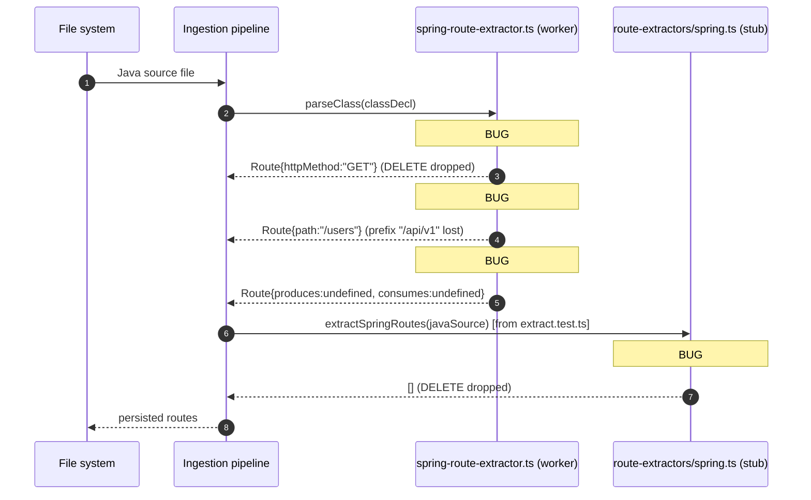
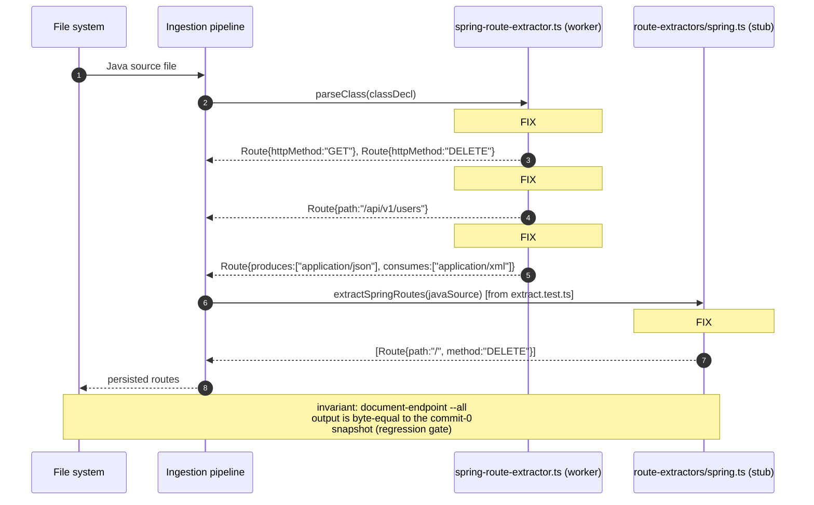
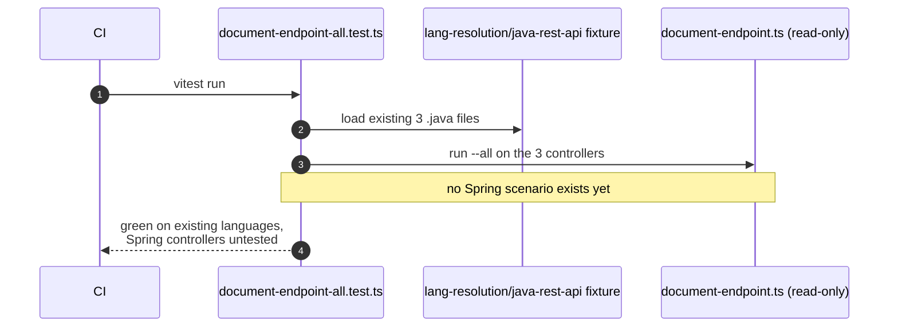

<!--
AI-READERS — load only the sections your task needs.

| Task          | Sections (skip if absent)                  |
|---------------|--------------------------------------------|
| implement     | ## Components, ## Contracts, ## Invariants |
| code-review   | ## Invariants, ## KeyDecisions, ## Contracts |
| qa            | ## Flows, ## EdgeCases                     |
| scope-impact  | ## BlastRadius, ## CrossCutting            |
-->

# Solution Design: spring-route-extractor-fixes

**Blast** d1=`spring-route-extractor.ts`, `route-extractors/spring.ts`, `parse-worker.ts` (3 files, 1 interface) · d2=`processRoutesFromExtracted` consumers + `document-endpoint.ts` (read-only) · d3=`document-endpoint-all.test.ts` regression gate

## Problem & Approach

**Why** — The Spring route extractor has 4 confirmed bugs that drop or mis-extract routes from
real Spring Boot code: #91 (array methods dropped), #90 (no superclass walk), #92 (`produces`/
`consumes` not stored), #81 (regex stub drops marker DELETE). A 5th, #93 (consumer side
class-name heuristic), is **out of scope** for this batch. The proximate cause for all 4 is
incomplete coverage of Spring's annotation grammar; the root cause is that the worker was
written against a happy-path subset of Spring annotations and has never been re-validated
against a real Spring Boot codebase.

**Solution** — Patch the worker (3 of 4) and the regex stub (1 of 4) with the minimal changes
needed to make each bug's repro pass. Land one regression-snapshot commit **before** any
production change so the `document-endpoint --all` output is captured at `main-afk` baseline
and every subsequent diff is attributable to a specific fix. Extend the shared `ExtractedRoute`
interface with **optional** `produces?: string[]; consumes?: string[];` to keep #92 backward-
compatible. Per the [[route-fix-regression]] memory, do **not** touch `document-endpoint.ts`
in this batch.

**Reuse** — Inline Java strings for unit tests (`spring-route-extractor.test.ts`,
`spring.extract.test.ts` already use this pattern). Reuse + augment the existing
`lang-resolution/java-rest-api/` fixture for the integration regression check (3 files exist;
add 2 more — `MultiMethodController.java`, `BaseApiController.java`).

## KeyDecisions

| Decision | Options considered | Choice | Rationale |
|----------|--------------------|--------|-----------|
| Where to fix #91, #90, #92 | (a) `spring-route-extractor.ts` worker; (b) `route-extractors/spring.ts` regex stub | (a) worker for all 3 | Worker is the production path; stub is documented as a future-replacement placeholder. Per "fix the production code, not the placeholder" principle. |
| Where to fix #81 | (a) `route-extractors/spring.ts` stub; (b) worker | (a) stub | Worker already handles DELETE correctly; the bug is stub-specific. |
| Commit order | (a) Triage #91→#90→#92→#81 with regression-baseline commit 0 first; (b) #92 first (interface); (c) single mega-commit | (a) | Pure-logic first, interface change third, stub fix last, doc-only at end. Baseline capture before interface change. (b) sets moving baseline; (c) breaks per-bug bisect. |
| Regression-check strategy | (a) Snapshot test in `document-endpoint-all.test.ts`; (b) unit-mock in `document-endpoint.test.ts`; (c) full CLI golden SHA; (d) none, rely on `route-node-e2e.test.ts` | (a) primary, (b) secondary | (a) exercises the real consumer path against a real fixture. (b) cheap, fast, but does not cover the real path. (c) high maintenance, no precedent. (d) different layer, would not have caught [[route-fix-regression]]. |
| Fixture for integration regression | (a) New `spring-route-extractor-cases/` dir; (b) inline strings; (c) restore `spring-demo/` from git history; (d) reuse + augment `lang-resolution/java-rest-api` | (b) for unit tests, (d) for integration | (c) is factually unavailable — no Java sources ever existed in `spring-demo/`. (a) duplicates the integration fixture. (b) and (d) match existing patterns. |
| `ExtractedRoute` field naming | (a) `produces` / `consumes` (Spring-mirror); (b) `requestMediaTypes` / `responseMediaTypes` (generic) | (a) | Consistent with the existing `ExtractedRoute.httpMethod` etc. Renaming is cheap later. |
| `ExtractedRoute` field optionality | (a) `?:` optional; (b) required | (a) | Optional = backward-compatible with every destructure pattern in the existing codebase. Required would force every consumer to update. |
| Superclass walk cap | (a) Unlimited; (b) 5 levels with cycle break | (b) | Defensive against cyclic inheritance (A extends B extends A) which Java allows via interfaces. 5 levels is generous for real Spring Boot code. |
| Where #93 lives | (a) Doc-only commit in this batch; (b) separate future batch | (a) | Keeps the cluster complete; a future-batch issue link is the right artifact. Doc-only commit has no blast risk. |
| When to capture the regression baseline | (a) At the end of the batch; (b) in a separate commit 0 first | (b) | The diff between commit 0 and the first interface change (#92) is then the *only* surface the reviewer has to assess. (a) would conflate the interface change with the test-harness additions. |

## Components

### Container: ingestion

#### Sequence: route extraction — As-is {#sd-route-extract-asis}


#### Sequence: route extraction — To-be {#sd-route-extract-tobe}


#### Sequence: regression baseline — As-is {#sd-regression-asis}


#### Sequence: regression baseline — To-be {#sd-regression-tobe}
```mermaid
sequenceDiagram
  autonumber
  participant CI
  participant T as document-endpoint-all.test.ts
  participant F as lang-resolution/java-rest-api fixture
  participant D as document-endpoint.ts (read-only)

  CI->>T: vitest run
  T->>F: load existing 3 + new 2 .java files<br/>(MultiMethodController.java, BaseApiController.java)
  T->>D: run --all on all 5 controllers
  D-->>T: response (captured to snapshot)
  T->>T: assert response byte-equals snapshot<br/>(snapshot taken at commit 0 baseline)
  T-->>CI: green; any diff in future PRs<br/>requires reviewer acknowledgment
```

## Contracts

*(API shapes, types, error codes — what implementers must honor.)*

- `ExtractedRoute` (`parse-worker.ts:355-368`) gains two **optional** fields:
  - `produces?: string[]` — values from the `produces = {...}` annotation attribute, e.g. `["application/json", "application/xml"]`. Empty if absent.
  - `consumes?: string[]` — values from the `consumes = {...}` annotation attribute, e.g. `["application/json"]`. Empty if absent.
- `extractRequestMappingMethod` (worker) return-type changes from `string` to `string[]`:
  - **Pre-#91 callers** that pass a single-method `@RequestMapping` get back a one-element array; downstream `extractRoutesFromClass` iterates and pushes one route.
  - **Post-#91 callers** that pass `{RequestMethod.GET, RequestMethod.DELETE}` get back `["GET", "DELETE"]`; downstream pushes two routes.
- `extractSpringRoutes` (regex stub) contract unchanged at the type level; for marker `@DeleteMapping` on a method with no class prefix, the function now returns a one-element array `[{path: "/", method: "DELETE", ...}]` instead of `[]`.
- `getClassRequestMappingPrefix` (worker) contract: returns the **concatenated** prefix of the class and its superclass chain, capped at 5 levels. Returns `null` only when no class in the chain has a `@RequestMapping`.
- **Public Route node schema** (`document-endpoint.ts` consumption surface) is unchanged in field names. Two new optional fields are added; no field is removed or renamed.

## Invariants

*(Rules that must always hold — what reviewers verify.)*

- **No field on the existing `ExtractedRoute` interface changes type or name.** New fields are strictly `?:` optional.
- **`tsc --noEmit` exits 0** on every commit. Hard gate (per CLAUDE.md project hooks).
- **`document-endpoint-all.test.ts` Spring scenario stays green** (snapshot byte-equal to commit-0 baseline) on every PR that touches `spring-route-extractor.ts`, `route-extractors/spring.ts`, `parse-worker.ts`, or `document-endpoint.ts`. A red flag is *any* unacknowledged snapshot change in a PR that didn't intend to alter `document-endpoint` output.
- **Per-commit rollback**: each of the 4 fix commits can be reverted independently and the rest of the suite stays green. (One-time post-merge confidence check, not a permanent test.)
- **Superclass walk cap is 5 levels; cycle breaks immediately** (no infinite loop on A extends B extends A).
- **No `document-endpoint.ts` is touched in this batch** ([[route-fix-regression]] invariant).
- **Route extraction coverage on the integration fixture** stays at or above the pre-batch count of routes emitted. Metric: count assertion in `java-route-creation.test.ts` (extend with a `routeCount` check for `MultiMethodController.java`). A drop = a route was lost.

## Flows

*(UC ↔ sequence-diagram map. For bug designs reference the To-be SDs.)*

| UC | Sequence |
|----|----------|
| #91 — multi-method `@RequestMapping` produces all routes | `#sd-route-extract-tobe` (worker step, FIX #91 branch) |
| #90 — child controller inherits base class prefix | `#sd-route-extract-tobe` (worker step, FIX #90 branch) |
| #92 — `produces`/`consumes` flow through to Route node | `#sd-route-extract-tobe` (worker step, FIX #92 branch) |
| #81 — marker `@DeleteMapping` on no-prefix class is emitted | `#sd-route-extract-tobe` (stub step, FIX #81 branch) |
| Regression baseline — `document-endpoint --all` snapshot stays stable | `#sd-regression-tobe` |

## EdgeCases

- **Cyclic superclass chain** (`A extends B extends A`): `getClassRequestMappingPrefix` returns the prefixes collected up to the cycle, never infinite-loops. Unit test covers this case.
- **Empty `produces = {}`**: `ExtractedRoute.produces === []` (empty array, not `undefined`). Distinguishes "no attribute" from "attribute with no values."
- **Single-element vs multi-element annotation arrays**: `#91` fix must handle both. Pre-#91 callers that passed a single-method `@RequestMapping` should still work.
- **`@RequestMapping` with no `method` attr** (defaults to GET): worker behavior unchanged.
- **`@RequestMapping` with no `value`/`path` attr** (defaults to "" or "/" depending on class prefix): worker behavior unchanged.
- **`spring-demo/` fixture left untouched.** The `.claude/skills/gitnexus/*` files there may be load-bearing for skill-discovery tests; do not add Java sources to that directory. New fixtures live in `lang-resolution/`.

## CrossCutting

- **Auth: not applicable.** Ingestion-pipeline code path.
- **Telemetry: not applicable.** No instrumentation in scope.
- **i18n / a11y: not applicable.** Internal tooling, no UI.
- **Performance:** no regression expected. The superclass walk is O(depth) with cap 5; the array-return is the same per-annotation cost as the old single-element return; `produces`/`consumes` reads are O(attribute count) bounded by Java's syntax. Existing `route-node-e2e.test.ts` is the implicit perf gate (it indexes a fixture and asserts route counts; a regression would show up as a count drop before a wall-clock increase).
- **Security: not applicable.** No untrusted input boundaries introduced. Java source parsing was already happening; no new parser entry points.

## BlastRadius

| Depth | Areas |
|-------|-------|
| d1    | `gitnexus/src/core/ingestion/workers/spring-route-extractor.ts` (3 of 4 in-scope bugs); `gitnexus/src/core/ingestion/route-extractors/spring.ts` (#81); `gitnexus/src/core/ingestion/workers/parse-worker.ts` (ExtractedRoute interface, #92) |
| d2    | `gitnexus/src/core/ingestion/workers/call-processor.ts` (`processRoutesFromExtracted`, reads `ExtractedRoute`); `gitnexus/src/mcp/local/document-endpoint.ts` (read-only consumer; must not change output) |
| d3    | `gitnexus/test/integration/document-endpoint-all.test.ts` (regression gate); `gitnexus/test/integration/java-route-creation.test.ts` (route-node assertions); `gitnexus/test/integration/route-node-e2e.test.ts` (CLI E2E) |

## DownstreamDocs

| Type | Path | Action |
|------|------|--------|
| design | `docs/designs/spring-route-extractor-fixes.md` | create (this file) |
| plan | `docs/plans/batch-c-spring-route-extractor.md` | create (Stage 5 deliverable) |
| architecture | `docs/architecture/ingestion/route-extraction.md` | not in scope — extraction logic is documented inline in worker comments |

## ADRs

### ADR: Spring route extractor fixes (Batch C)

**Status**: Proposed
**Date**: 2026-06-03
**Deciders**: arch (synthesis), backend-dev (impl), code-review (gate)

**Context** — 4 confirmed bugs in the Spring route extractor (#91, #90, #92, #81). A 5th (#93)
lives in the `document-endpoint` consumer and is out of scope for this batch. Prior route-fix
attempts broke `document-endpoint` output ([[route-fix-regression]]). The regex stub
(`route-extractors/spring.ts`) is not the production path but is reachable from
`spring.extract.test.ts` and must be aligned for #81.

**Decision** — Fix #91, #90, #92 in `spring-route-extractor.ts`; #81 in `route-extractors/spring.ts`.
Extend `ExtractedRoute` with **optional** `produces?: string[]; consumes?: string[];` fields.
Commit in order: commit 0 (regression baseline) → #91 → #90 → #92 → #81 → #93-doc-only.
Use inline Java strings for unit tests; reuse + augment `lang-resolution/java-rest-api` for the
integration regression snapshot. Land one Spring scenario in `document-endpoint-all.test.ts` as
the regression gate.

**Consequences** — Positive: 4 extractor bugs closed with minimal, reviewable diffs;
`ExtractedRoute` gains the metadata `document-endpoint` will eventually need for #93;
regression gate in place. Negative: 2 new optional interface fields → callers that destructure
loosely may silently drop them (mitigated by `?:`); snapshot will be updated once and reviewers
must read the diff carefully (no auto-merge on snapshot-only changes).

**Risks mitigated** — [[route-fix-regression]]: the snapshot test is the explicit gate.
TypeScript interface drift: `tsc --noEmit` is a pre-merge gate. Per-bug bisect broken: prevented
by per-commit ordering.

**Fitness Functions** —
1. `document-endpoint-all.test.ts` Spring scenario stays green (snapshot byte-equality or reviewer-acknowledged diff).
2. Route extraction coverage on the integration fixture stays at or above the pre-batch count.
3. `tsc --noEmit` exits 0 on every commit.
4. No new "production route was dropped" issue filed within 30 days of merge (ADR invalidation signal).
5. Per-commit revert test: each of the 4 fix commits can be reverted independently and the rest of the suite stays green (one-time post-merge confidence check).

<div class="callout"><b>Autonomous Decisions</b><br>

1. **Use `spring-route-extractor.ts` (tree-sitter worker) for #91, #90, #92.** The regex stub
   is documented as a future-replacement placeholder. Worker is the production path. *Why:*
   matches "fix the production code, not the placeholder" principle. *How to apply:* all three
   commits touch the worker only; stub stays frozen until #81.
2. **Capture the regression baseline in a separate commit 0, before #91.** *Why:* the snapshot
   taken after #92 could conflate the interface change with the test-harness additions. *How to
   apply:* commit 0 is small, ships alone if necessary, unblocks the rest of the batch.
3. **#93 is out of scope for Batch C, but a doc-only commit stays in the batch.** *Why:* keeps
   the cluster complete; a future-batch issue link is the right artifact. *How to apply:*
   commit 5 is a `docs/adr/*.md` file plus a follow-up issue link. No code.
4. **Make the new `ExtractedRoute` fields strictly optional** (`produces?: string[]; consumes?: string[];`).
   *Why:* optional = backward-compatible with every existing destructure pattern. *How to
   apply:* no existing field type changes; no consumer code is forced to update.
5. **Cap the superclass walk at 5 levels; break on cycle.** *Why:* defensive against cyclic
   inheritance (A extends B extends A) which Java allows via interfaces. *How to apply:* walk
   collects a prefix chain; on cycle, returns what was collected and skips the cycle.
6. **Add the regression snapshot at commit 0, not at the end of the batch.** *Why:* the
   snapshot's first occurrence is the baseline; capturing it after the fixes means the diff
   includes the test-harness additions. *How to apply:* commit 0 only adds the new `describe`
   block to `document-endpoint-all.test.ts` and the snapshot file. No production code change.

</div>
