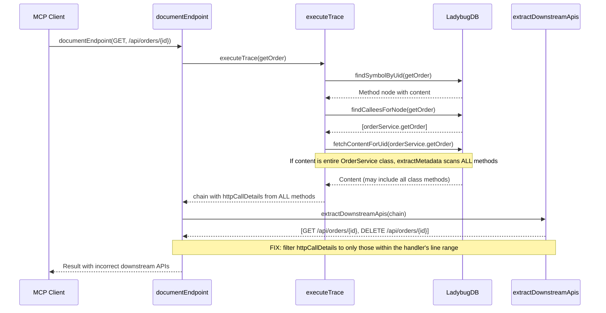

# Fix: document-endpoint wrong downstream APIs - lists all class methods instead of called ones

**Type:** Bug
**Risk:** MEDIUM

## Understanding

The `document-endpoint` tool lists all HTTP methods for a path as downstream APIs instead of only the methods actually called by the handler. When tracing `GET /api/orders/{id}`, which only calls `orderService.getOrder()`, the tool incorrectly includes `DELETE /api/orders/{id}` as well. Root cause: the trace executor fetches node content from the graph, and when the content spans the entire controller class (rather than just the handler method), `extractMetadata` picks up HTTP call patterns from ALL handler methods in the class, not just the one being traced.

## Diagram

## Cross-Stack Checklist
- [x] Backend changes? Yes — `trace-executor.ts` content extraction, `document-endpoint.ts` downstream filtering
- [x] Frontend changes? None
- [x] Contract mismatches? None — output shape unchanged, just more accurate data
- [x] Deployment order? N/A (single backend change)

## Specs
- Backend: `docs/context/downstream-apis-method-filter.md`

## Test Strategy

**Risk calibration:** This is a data accuracy bug in trace extraction. The fix is a targeted filter that removes HTTP calls from methods outside the handler's line range. Deep testing on the filter logic is critical. Error handling and edge cases need light verification.

| Test level | WIs owning this level | Key invariants |
|---|---|---|
| Unit | WI-1, WI-2 | httpCallDetails only includes calls within handler line range; methods outside range are excluded; empty line range falls back to current behavior |

**Anti-patterns to avoid:**
1. Testing with mock chains that don't include line numbers — must use realistic chain nodes with startLine/endLine
2. Only testing happy path — must verify edge cases where content spans entire class

## Work Items

### Layer: Backend

#### WI-1: Filter httpCallDetails to handler line range in extractMetadata [P0]
**Spec:** `docs/context/downstream-apis-method-filter.md` § Content Filtering
**What:** In `trace-executor.ts`, the `extractMetadata` function scans the full `content` field for HTTP call patterns, FeignClient annotations, and other metadata. When a chain node's content includes multiple methods from the same class (because the graph stores content at the class level), all HTTP calls from all methods are extracted. Fix by adding line-range filtering: after `extractMetadata` processes the content, filter the resulting `httpCallDetails` to only include calls whose line number falls within the chain node's `startLine`–`endLine` range. If `startLine`/`endLine` are not available, fall back to including all calls (current behavior).
**Reuse:** Existing `extractMetadata` function and `HttpCallDetail` interface
**Behavior:** Given a chain node for `getOrder()` at lines 25–30, with content containing both `getOrder()` (lines 25–30) and `deleteOrder()` (lines 35–40), `extractMetadata` currently produces `httpCallDetails` for both methods. After the fix, only calls within lines 25–30 are included. Edge case: chain node with no `startLine`/`endLine` → include all calls (backward compatible).
**Invariants:** Handler's own HTTP calls are always included; other methods' calls are excluded when line range is available
**Tests:** See WI-2
**Files:** `gitnexus/src/mcp/local/trace-executor.ts → extractMetadata()`, `gitnexus/src/mcp/local/trace-executor.ts → HttpCallDetail interface`

#### WI-2: Add test coverage for line-range filtering of httpCallDetails [P0]
**Spec:** `docs/context/downstream-apis-method-filter.md` § Business rules
**What:** Add unit tests in `test/unit/trace-executor.test.ts` (or new file `test/unit/metadata-filtering.test.ts`) to verify that `extractMetadata` filters HTTP call details to the handler's line range. Test cases: (1) Content with two methods, handler line range covers only one → only that method's calls appear, (2) Content with two methods, both calls within range → both included, (3) No line range available → all calls included (backward compat), (4) Content where HTTP call spans the boundary line (starts before, ends within range) → included.
**Reuse:** Existing test infrastructure
**Behavior:** Given content `class OrderController { @GetMapping("/{id}") public ResponseEntity<String> getOrder() {...} @DeleteMapping("/{id}") public ResponseEntity<Void> deleteOrder() {...} }` and startLine=5, endLine=8, only `@GetMapping("/{id}")` is extracted. Edge case: when `startLine`/`endLine` are undefined, all calls are included (backward compatible).
**Invariants:** Line-range filtering is additive (only removes calls, never adds); backward compatible when line range is missing
**Tests:** TC-1 through TC-4 (4 unit tests)
**Files:** `gitnexus/test/unit/trace-executor.test.ts → describe('extractMetadata line-range filtering')`

## Behavioral Contracts

### Backend → MCP Client
| Backend guarantees | Client expects |
|---|---|
| `downstreamApis` only includes calls made by the handler, not sibling methods | Client can trust the blast radius is accurate |
| When line range is unavailable, behavior is unchanged (all calls included) | No regression for codebases without line range info |
| Each `httpCallDetail` entry maps to exactly one actual call in the handler's source code | One-to-one correspondence between source code calls and downstream API entries |

## Acceptance Criteria

- [ ] Given `documentEndpoint(GET, /api/orders/{id})` where the handler only calls `orderService.getOrder()`, `downstreamApis` does NOT include `DELETE /api/orders/{id}`
- [ ] Given a handler that makes multiple HTTP calls (e.g., both GET and POST), all calls within the handler's line range are included
- [ ] When `startLine`/`endLine` are not available, all HTTP calls from the content are included (backward compatible)
- [ ] Regression suite green (`npm test`)

## Design Diagrams

See `docs/designs/downstream-apis-method-filter-solution-design.md` for full solution design with C4 and sequence diagrams.