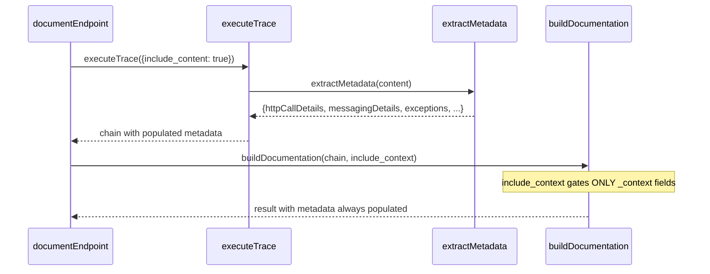

# document-endpoint — Metadata Population

**Service:** GitNexus CLI / MCP
**Status:** Draft

## Summary
The `document-endpoint` command generates API documentation JSON for HTTP endpoints by resolving call chains and extracting metadata from source code.

## Correct Behavior

### Metadata Extraction (always)
Regardless of the `--include-context` flag, the following metadata MUST be populated from call chain traversal:

| Field | Source | Description |
|-------|--------|-------------|
| `externalDependencies.downstreamApis` | `httpCallDetails` from `extractMetadata()` | HTTP calls to external services (restTemplate, WebClient, etc.) |
| `externalDependencies.messaging.outbound` | `messagingDetails` from `extractMetadata()` | Kafka/RabbitMQ publish calls |
| `externalDependencies.messaging.inbound` | `messagingDetails` from `extractMetadata()` | Event listener annotations |
| `externalDependencies.persistence` | `repositoryCallDetails` from `extractMetadata()` | Repository/DAO method calls |
| `response.codes` | `exceptions` from `extractMetadata()` | Exception types thrown (mapped to HTTP 400) |
| `annotations` | `node.annotations` JSON + `metadata.annotations` | Framework annotations (@Transactional, @Async, etc.) |

### Context Output (gated by --include-context)
The `--include-context` flag controls ONLY whether source code snippets are included in the output:

| Field | Gated by --include-context | Description |
|-------|---------------------------|-------------|
| `_context.summaryContext` | Yes | Aggregated source snippets |
| `downstreamApis[]._context` | Yes | Source snippet around HTTP call |
| `messaging.outbound[]._context` | Yes | Source snippet around publish call |

### Response Schema (relevant fields)
```json
{
  "externalDependencies": {
    "downstreamApis": [{"serviceName": "string", "endpoint": "string"}],
    "messaging": {"outbound": [], "inbound": []},
    "persistence": [{"database": "string", "tables": "string"}]
  },
  "response": {
    "codes": [{"code": "number", "description": "string"}]
  }
}
```

## Root Cause of Deviation
`document-endpoint.ts:373` passes `include_content: include_context` to `executeTrace()`, coupling metadata extraction to context output. When `include_context=false`, source content is not fetched, so `extractMetadata(undefined)` returns empty arrays.

The call chain is:
1. `documentEndpoint()` calls `executeTrace()` with `include_content: include_context` (line 373)
2. `executeTrace()` gates content fetching on `include_content` (trace-executor.ts lines 810-822)
3. `extractMetadata(content)` returns empty arrays when `content` is undefined (trace-executor.ts line 222)
4. `buildDocumentation()` reads metadata from chain nodes — all empty when content was never fetched

## Fix
Decouple by always passing `include_content: true` to `executeTrace()`. The `include_context` flag should only gate `_context` output fields in `buildDocumentation()`, which it already does correctly.



## Files
| File | Role |
|------|------|
| `src/mcp/local/document-endpoint.ts` | Orchestrator — contains the coupling defect at line 373 |
| `src/mcp/local/trace-executor.ts` | BFS traversal + metadata extraction |
| `src/mcp/local/endpoint-query.ts` | Route node queries |

## Notes
- Performance: always fetching content adds one DB read per chain node. Acceptable trade-off for correct output.
- The `buildDocumentation()` function already correctly separates metadata usage from `_context` output gating.
- The `extractMetadata()` function (trace-executor.ts:209) has a fast-return on `if (!content) return metadata` at line 222, which is correct defensive behavior — the fix must ensure content is always provided.
