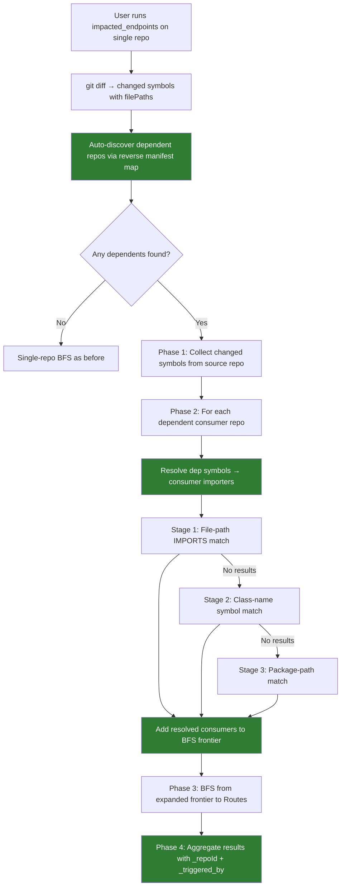
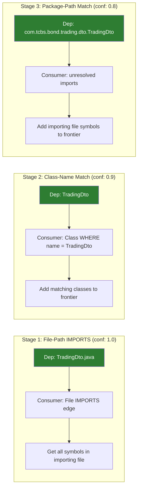

# Solution Design: Cross-Repo Dependency Tracing

## Problem Statement / Root Cause

Two problems:

1. **Cross-repo BFS bridging fails**: Step 3c (lines 1972-2023) queries dep repos for changed symbol IDs (e.g., `Class:src/.../TradingDto.java:TradingDto`), then searches the consumer repo for IMPORTS/CALLS edges targeting those exact IDs. This fails because IMPORTS edges are **File → File** (source: `File:Consumer.java`, target: `File:.../TradingDto.java`), not **File → Class**. The ID mismatch means `WHERE dep.id IN $depIds` never matches.

2. **User must manually specify `repos`**: The tool requires `repos: ["tcbs-bond-trading-core", "tcbs-bond-trading"]` to analyze cross-repo impact. In reality, a PR only touches one repo — the user expects the tool to **auto-discover** which other indexed repos depend on the changed repo. Example: changing a DTO in `tcbs-bond-trading-core` should automatically find that `tcbs-bond-trading` depends on it (via manifest) and trace impact to its endpoints.

## Recommended Solution

Two capabilities:
1. **Auto-discovery of dependent repos** — build reverse dependency map from existing repo manifests
2. **Three-stage cross-repo resolution** — resolve changed symbols from dep repo to consumer repo using the actual graph structure (File → File IMPORTS edges)

### Reuse Inventory

| Component | Location | Reuse |
|-----------|----------|-------|
| `CrossRepoContext` | `src/mcp/local/cross-repo-context.ts` | Extend with new `resolveDepConsumers` method |
| `CrossRepoRegistry` | `src/core/ingestion/cross-repo-registry.ts` | Reuse for package→repo mapping |
| `import-processor.ts` | `src/core/ingestion/import-processor.ts` | Reference only — understand File→File edge creation |
| `_impactedEndpointsImpl` | `src/mcp/local/local-backend.ts:1661-2413` | Modify step 3c |
| `callToolMultiRepo` | `src/mcp/local/local-backend.ts:388-633` | Modify orchestration flow |
| `withTestLbugDB` | `test/helpers/test-indexed-db.ts` | Reuse for E2E tests |
| `mockCrossRepo` | `test/unit/impacted-endpoints-impl.test.ts` | Extend for new resolution |

## Work Items

| # | Title | Layer | Files Affected | Reuse |
|---|-------|-------|---------------|-------|
| WI-1 | Reverse dependency map + auto-discovery | Backend | `src/core/ingestion/cross-repo-registry.ts` (MODIFY), `src/mcp/local/local-backend.ts` (MODIFY) | CrossRepoRegistry, repo_manifest.json |
| WI-2 | Cross-repo import resolver | Backend | `src/mcp/local/cross-repo-resolver.ts` (NEW), `src/mcp/local/cross-repo-context.ts` (MODIFY) | CrossRepoContext interface |
| WI-3 | Enhanced BFS step 3c | Backend | `src/mcp/local/local-backend.ts:1972-2023` | Existing BFS infrastructure |
| WI-4 | Auto-expand single-repo to dependents | Backend | `src/mcp/local/local-backend.ts:388-633` | callToolMultiRepo |
| WI-5 | Cross-repo impact attribution | Backend | `src/mcp/local/local-backend.ts` (step 4-6) | Existing tier logic |
| WI-6 | Cross-repo E2E + unit tests | Test | `test/integration/impacted-endpoints-cross-repo.test.ts`, `test/unit/cross-repo-resolution.test.ts` (extend) | withTestLbugDB, mockCrossRepo |

## Risk Assessment

MEDIUM — The solution modifies core BFS logic and adds a new resolution layer, but it's behind a feature flag (crossRepo context is only provided when `repos.length > 1`). Single-repo calls remain unchanged.

## Cross-Stack Completeness

- **Backend changes**: Yes — new resolver module, modified BFS step 3c, modified orchestration
- **Frontend changes**: No — MCP tool only
- **Contract mismatches**: N/A — single backend
- **Safe deployment order**: WI-1 (resolver) → WI-2 (BFS) → WI-3 (orchestration) → WI-4 (attribution) → WI-5/WI-6 (tests)

## Design Diagrams

### Data Flow: To-Be



### Auto-Discovery Flow: To-Be

```mermaid
flowchart LR
    A[tcbs-bond-trading-core manifest] -->|provides| B[com.tcbs.bond.trading:tcbs-bond-trading-core]
    C[tcbs-bond-trading manifest] -->|depends on| B
    B -->|reverse map| D[tcbs-bond-trading-core → consumers: [tcbs-bond-trading]]
    D --> E[impacted_endpoints on tcbs-bond-trading-core]
    E --> F[Auto-include tcbs-bond-trading in analysis]

    style D fill:#2e7d32,color:#fff
    style F fill:#2e7d32,color:#fff
```

### Resolution Stages: To-Be



### Changes

| Element | Change | What | Why | How |
|---------|--------|------|-----|-----|
| `cross-repo-registry.ts` | update | Add `reverseDepMap: Map<repoId, Set<consumerRepoId>>` and `findConsumers(repoId)` | User shouldn't need to manually list repos; tool must auto-discover dependents | Build reverse map during `initialize()` from all manifests' dependency lists |
| `local-backend.ts:impacted_endpoints` | update | Auto-expand single-repo call to include dependents | `impacted_endpoints` on `tcbs-bond-trading-core` should automatically analyze `tcbs-bond-trading` too | After git diff, call `registry.findConsumers(repoId)` and merge into repo list |
| `cross-repo-resolver.ts` | new | CrossRepoResolver class with 3-stage resolution | IMPORTS edges are File→File, not File→Class | Stage 1: filePath CONTAINS; Stage 2: class name =; Stage 3: package path |
| `local-backend.ts:1972-2023` | update | Replace ID-matching query with resolver calls | Current query fails because dep IDs don't match IMPORTS edge targets | Call resolver.resolveDepConsumers() for each consumer/dep pair |
| `cross-repo-context.ts` | update | Add resolveDepConsumers method | Interface needs to support the new resolution flow | Add method signature, implement in LocalBackend |
| E2E cross-repo tests | update | Replace placeholder with real cross-repo BFS tests | Current tests only test standalone repos, not cross-repo propagation | Create two DBs in same LocalBackend, seed with IMPORTS edges between them |

### WI-1 Detail: Reverse Dependency Map

**Current manifest data** (already available in `.gitnexus/repo_manifest.json`):
```json
// tcbs-bond-trading manifest
{
  "repoId": "tcbs-bond-trading",
  "dependencies": ["com.tcbs.bond.trading:tcbs-bond-trading-core", ...]
}
```

**Reverse map built during `CrossRepoRegistry.initialize()`**:
```
tcbs-bond-trading-core → consumers: [tcbs-bond-trading]
bond-exception-handler → consumers: [tcbs-bond-trading, tcbs-bond-trading-core]
matching-engine-client → consumers: [tcbs-bond-trading, tcbs-bond-trading-core]
```

**New method on CrossRepoRegistry**:
```typescript
findConsumers(repoId: string): string[] {
  return Array.from(this.reverseDepMap.get(repoId) ?? []);
}
```

**Integration in `impacted_endpoints` flow**:
```typescript
// Before: user must specify repos manually
const repoIds = params.repos || [defaultRepoId];

// After: auto-expand to include dependent repos
const baseRepoId = params.repo || this.defaultRepoId;
const consumerRepoIds = this.crossRepoRegistry?.findConsumers(baseRepoId) ?? [];
const allRepoIds = [baseRepoId, ...consumerRepoIds];
// Still support explicit repos param to override
const repoIds = params.repos?.length ? params.repos : allRepoIds;
```