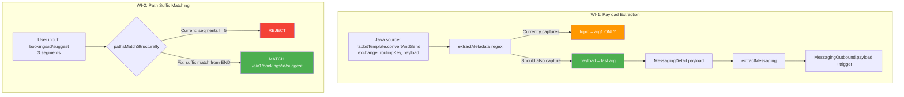

# Document-Endpoint Verification Fixes

**Type:** Bug
**Risk:** LOW

## Understanding

Post-route-fix verification revealed 3 issues in document-endpoint (4th — schema-strict identical output — confirmed as expected behavior; compact mode deferred to separate WI). Two bugs remain: (1) outbound message `payload` and `trigger` fields always show `TODO_AI_ENRICH` because `extractMetadata` regex only captures the first arg of `convertAndSend`/`kafkaTemplate.send`/`streamBridge.send`, never the payload arg, and trigger has zero extraction logic; (2) partial path input (e.g., `bookings/{id}/suggest` without version prefix) fails because `pathsMatchStructurally` requires exact segment count equality.

## Diagram

## Cross-Stack Checklist

- [x] Backend changes? Yes — trace-executor.ts (regex), document-endpoint.ts (trigger + path matching)
- [ ] Frontend changes? None — CLI/MCP tool, no frontend consumers
- [ ] Contract mismatches? None — fields go from placeholder to real values (additive)
- [ ] Deployment order? No special order needed

## Specs

- Bug doc: `docs/bug/route-fix-verification-issues.md`

## Deferred Items

- **Compact mode** (Issue 2): `compact` flag threaded but never acted on. `removeEmptyArrays()` at document-endpoint.ts:104-118 is dead code. Deferred pending design decision on schema compliance.
- **Schema-strict identical** (Issue 4): Not a bug — `--strict` is a post-processing validation gate; identical output when no errors is by design.

## Test Strategy

### Coverage Map

| Behavior | Owner Level | Rationale |
|---|---|---|
| Regex captures payload from convertAndSend/kafka/stream args | Unit | Deterministic, stateless function — full control |
| Trigger uses enclosing method name | Unit | Isolated assignment logic |
| Payload flows through extractMessaging to document output | Integration | Confirms wiring between trace-executor and document-endpoint |
| pathsMatchStructurally suffix matching | Unit | Pure function, no I/O |
| findHandlerByPathPattern uses suffix matching | Integration | Wiring verification |
| publishEvent payload still works | Unit (regression) | Must not break existing |
| Equal-length paths still work | Unit (regression) | Must not break existing |

### Techniques

| Technique | WI-1 | WI-2 |
|---|---|---|
| EP | 3 messaging patterns x {literal, variable} args | {equal, shorter, longer} x {match, no-match} |
| BVA | 1-arg, 2-arg, 3-arg calls | Empty, single-segment, diff-by-1 |
| Decision Table | trigger source x pattern type | segDiff x overlap x placeholders |
| Regression | publishEvent unchanged | Equal-length still works |

### Risk Calibration

- **Deep**: Payload regex capture (3 patterns x multiple overloads), suffix matching edge cases
- **Light**: Trigger extraction (simple fallback to method name), integration wiring
- **Skip**: Schema validation (not affected), compact mode (deferred)

### Anti-Patterns

- Do NOT test regex engine behavior — test patterns against representative Java snippets
- Do NOT create integration tests that duplicate unit coverage
- Do NOT over-parameterize — pick representatives from each partition

## Work Items

### Layer: Backend — Trace Executor

#### WI-1: Extract outbound message payload from convertAndSend/kafka/stream args [P1]
**Spec:** `docs/bug/route-fix-verification-issues.md` § Issue 1
**What:** In `trace-executor.ts`, enhance regex patterns for `convertAndSend` (~L348-371), `kafkaTemplate.send` (~L376-384), and `streamBridge.send` (~L449-457) to capture the payload argument (last/2nd arg). Set `payload` field on `MessagingDetail` for all three patterns. In `document-endpoint.ts` `extractMessaging` (~L2752), change trigger from hardcoded `TODO_AI_ENRICH` to `node.name || 'TODO_AI_ENRICH'` (enclosing method name as trigger context).
**Reuse:** Existing `MessagingDetail.payload` field — already populated for `publishEvent`, extend to other patterns. Existing `extractMessaging` consumer code reads `detail.payload` correctly — data just never arrives.
**Behavior:** Outbound messages in document-endpoint output show actual payload type (e.g., `"OrderDto"`) and trigger (e.g., `"processOrder"`) instead of `TODO_AI_ENRICH` for all messaging patterns.
**Invariants:** `publishEvent` payload extraction unchanged. `topic` field unchanged. Fields that cannot be extracted still fall back to `TODO_AI_ENRICH`. No schema contract change — fields are strings either way.
**Tests:** Level: unit + integration · Technique: EP + BVA + decision table · Cases: `convertAndSend_3args_captures_payload`, `convertAndSend_2args_captures_payload`, `convertAndSend_1arg_no_payload`, `kafka_send_captures_payload`, `stream_send_captures_payload`, `trigger_uses_method_name`, `publishEvent_regression`, `payload_flows_to_document_output` · File: `test/unit/trace-executor-messaging-payload.test.ts`, `test/unit/document-endpoint-messaging-trigger.test.ts`
**Files:** `src/mcp/local/trace-executor.ts` | `src/mcp/local/document-endpoint.ts` | tests

### Layer: Backend — Document Endpoint

#### WI-2: Add suffix matching to pathsMatchStructurally [P1]
**Spec:** `docs/bug/route-fix-verification-issues.md` § Issue 3
**What:** Modify `pathsMatchStructurally` (document-endpoint.ts:306-333) to support suffix matching when segment counts differ. When input is shorter than annotation, compare from the END of the annotation segments. When input is longer, compare from the END of the input segments. Preserve existing exact-count behavior as-is.
**Reuse:** Existing `pathsMatchStructurally` function modified in-place. No new abstractions. Existing scoring in `findHandlerByPathPattern` (L468-500) handles disambiguation when multiple candidates match.
**Behavior:** Partial path input `bookings/{id}/suggest` matches stored route `/e/v1/bookings/{id}/suggest`. Returns superset of current matches — previously-rejected partial paths now resolve.
**Invariants:** Equal-segment-count paths behave identically to current (regression guard). Completely unrelated suffixes still rejected. Case-insensitive comparison preserved. Placeholder segments (`{}`) still wildcard.
**Tests:** Level: unit + integration · Technique: EP + BVA + decision table · Cases: `equal_segments_exact_match`, `equal_segments_no_match`, `input_shorter_suffix_matches`, `input_shorter_no_match`, `input_longer_suffix_matches`, `single_segment_suffix`, `empty_input_false`, `case_insensitive_suffix`, `all_placeholders_suffix`, `regression_equal_length` · File: `test/unit/document-endpoint-path-matching.test.ts`
**Files:** `src/mcp/local/document-endpoint.ts` | tests

## Acceptance Criteria

- [ ] Given an endpoint with `rabbitTemplate.convertAndSend("exchange", "key", orderDto)`, when `document-endpoint` is called, then `outbound[].payload` shows `"orderDto"` (not `TODO_AI_ENRICH`)
- [ ] Given an endpoint with messaging calls, when `document-endpoint` is called, then `outbound[].trigger` shows the enclosing method name (not `TODO_AI_ENRICH`)
- [ ] Given `publishEvent(new FooEvent())`, when `document-endpoint` is called, then payload extraction unchanged (regression)
- [ ] Given path input `bookings/{id}/suggest`, when endpoint has stored route `/e/v1/bookings/{id}/suggest`, then endpoint resolves successfully with `downstreamApis > 0`
- [ ] Given full path `/e/v1/bookings/{id}/suggest`, when matching, then behavior unchanged (regression)
- [ ] Existing document-endpoint fields (downstreamApis=11, validation=24, params=1, inbound=1) unchanged for verified endpoint
- [ ] Regression suite green (`npm test`)
