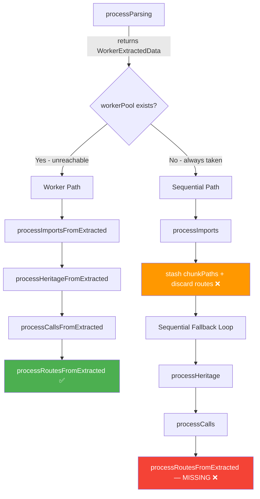

# Route Nodes Not Created During Ingestion

**Type:** Bug
**Risk:** MEDIUM

## Understanding

The sequential fallback path in `pipeline.ts` (lines 365-376) processes heritage and calls but **never calls `processRoutesFromExtracted`**. Routes are extracted during `processParsing` (returned in `chunkWorkerData.routes`) but silently discarded when `chunkWorkerData` goes out of scope. The worker path (line 284-345) does process routes correctly, but is unreachable because thresholds are set to 1M files / 1GB (lines 214-215). Additionally, once Route nodes start existing, `document-endpoint.ts` will take its Route-first code path — if Route node UIDs don't exactly match Method node IDs, `executeTrace` returns an empty chain, causing empty `downstreamApis`, `validation`, and `errorCodes`. Both fixes must ship together.

## Diagram

## Cross-Stack Checklist

- [x] Backend changes? Yes — pipeline.ts (wiring fix) + document-endpoint.ts (UID validation fallback)
- [ ] Frontend changes? None — Route nodes are additive graph data
- [ ] Contract mismatches? None — Route node schema unchanged, document-endpoint API shape unchanged
- [x] Deployment order? Both WI-1 and WI-2 must ship together in same release

## Specs

- Bug doc: `docs/bug/route-nodes-not-created.md`

## Test Strategy

### Coverage Map

| Behavior | Owner Level | Rationale |
|---|---|---|
| `processRoutesFromExtracted` creates Route nodes/edges | Unit (existing) | 20+ cases already covered |
| Sequential fallback loop calls `processRoutesFromExtracted` | Integration (WI-1) | Wiring defect — must test pipeline |
| Routes survive full sequential pipeline cycle | Integration (WI-3) | Data flow integrity |
| document-endpoint falls back when handlerUid has no Method | Unit (WI-2) | Isolated decision logic |
| E2E: index real Spring project, query routes | E2E (existing) | `route-node-e2e.test.ts` validates end-to-end |

### Techniques

| Technique | Where | Why |
|---|---|---|
| Decision Table | WI-2 (UID validation) | 5 rules covering Route exists / UID matches / fallback available |
| Equivalence Partitioning | WI-1 | Worker path vs sequential fallback vs zero-routes |
| State Transition | WI-1 | Route lifecycle: extracted → stored → processed → graph nodes |
| BVA | WI-1 | Zero routes, single route, multiple routes |

### Risk Calibration

- **Deep**: Sequential fallback wiring (P0 root cause), UID validation fallback (P0 regression guard)
- **Light**: `processRoutesFromExtracted` internals (already 20+ unit tests), E2E real-project indexing (existing coverage)
- **Skip**: Worker path (unaffected by change)

### Anti-Patterns

- Do NOT re-test Route node/edge creation logic in integration tests — unit tests own that
- Do NOT mock every collaborator for pipeline loop mechanics — use real parsing with synthetic fixtures
- Do NOT add new E2E tests — existing `route-node-e2e.test.ts` + manual `document-endpoint` verification suffices

## Work Items

### Layer: Backend — Ingestion Pipeline

#### WI-1: Wire processRoutesFromExtracted into sequential fallback path [P0]
**Spec:** `docs/bug/route-nodes-not-created.md` § Root Cause Analysis
**What:** In `pipeline.ts` sequential fallback loop (lines 365-376), after `processCalls`, add call to `processRoutesFromExtracted`. Capture routes from `chunkWorkerData` during initial parsing loop (line 266) into a `sequentialChunkRoutes: ExtractedRoute[][]` array alongside `sequentialChunkPaths`. In the fallback loop, pass chunk routes to `processRoutesFromExtracted`.
**Reuse:** `processRoutesFromExtracted` (call-processor.ts:1477) — already exists and works correctly
**Behavior:** After ingestion of Java Spring project via sequential path, Route nodes exist in graph with correct properties (`httpMethod`, `routePath`, `controllerName`, `methodName`, `filePath`) and CALLS edges to handler Method nodes.
**Invariants:** Zero routes extracted → no crash, no Route nodes, other graph elements unaffected. Multiple chunks → routes from all chunks processed. Existing CALLS/heritage processing unchanged.
**Tests:** Level: integration · Technique: EP + state transition + BVA · Cases: `sequential fallback creates Route nodes for Spring controller`, `handles zero extracted routes without error`, `routes survive into graph via sequential path` · File: `test/integration/pipeline-ordering.test.ts` (extend)
**Files:** `src/core/ingestion/pipeline.ts` | `test/integration/pipeline-ordering.test.ts`

### Layer: Backend — MCP Tools

#### WI-2: Add UID validation fallback in document-endpoint [P0]
**Spec:** `docs/bug/route-nodes-not-created.md` § Impact
**What:** After constructing `handlerUid` from Route data (document-endpoint.ts ~line 609-611), verify the Method node exists in the graph. If Method node not found, fall through to `findHandlerByPathPattern()` instead of proceeding with a bad UID. This prevents the regression where Route nodes with mismatched UIDs cause `executeTrace` to return an empty chain.
**Reuse:** `findHandlerByPathPattern` — already exists as the current fallback mechanism
**Behavior:** document-endpoint returns complete data (`downstreamApis`, `validation`, `errorCodes`) whether or not Route nodes exist, and whether Route node UIDs match Method nodes or not.
**Invariants:** No Route nodes → existing fallback behavior unchanged. Route with valid UID → uses Route-first path. Route with invalid UID → graceful fallback to pattern matching. All three output fields populated in all success paths.
**Tests:** Level: unit · Technique: decision table (5 rules) · Cases: `returns full docs when Route UID matches Method`, `falls back to findHandlerByPathPattern when UID has no Method`, `returns error when UID mismatch and no handler found`, `returns error when Route has no handler/filePath`, `existing pattern fallback unchanged` · File: `test/unit/document-endpoint-url-resolution.test.ts` (extend)
**Files:** `src/mcp/local/document-endpoint.ts` | `test/unit/document-endpoint-url-resolution.test.ts`

### Layer: Backend — Tests

#### WI-3: Integration test for route creation in sequential path [P1]
**Spec:** `docs/bug/route-nodes-not-created.md` § Test Case
**What:** Integration test ingesting a minimal Java Spring controller fixture via sequential pipeline path, asserting Route nodes created with correct properties and edges. Use existing test fixtures or create minimal fixture with `@RestController` + `@GetMapping`/`@PostMapping`.
**Reuse:** Existing test infrastructure in `test/integration/` — fixture patterns, graph setup/teardown
**Behavior:** Full pipeline run on synthetic fixture produces expected Route nodes, DEFINES edges (File→Route), and CALLS edges (Route→Method).
**Invariants:** Test must force sequential path (no worker pool). Fixture must be minimal — single controller, 2-3 endpoints.
**Tests:** Level: integration · Technique: EP + state transition · Cases: `sequential pipeline creates Route nodes for fixture Spring controller`, `creates routes across multiple controllers`, `class-level RequestMapping only creates no routes` · File: `test/integration/java-route-creation.test.ts` or `test/integration/sequential-route-creation.test.ts`
**Files:** `test/integration/` (new or extend existing)

## Acceptance Criteria

- [ ] Given a Java Spring project indexed via sequential path, when querying `MATCH (n:Route) RETURN COUNT(*)`, then count > 0
- [ ] Given Route nodes exist with valid UIDs, when `document-endpoint` is called, then `downstreamApis`, `validation`, `errorCodes` are populated
- [ ] Given Route nodes exist with invalid UIDs, when `document-endpoint` is called, then fallback to pattern matching fires and output fields are still populated
- [ ] Given no Route nodes exist, when `document-endpoint` is called, then existing fallback behavior is unchanged
- [ ] Regression suite green (`npm test`)
- [ ] E2E: index `tcbs-bond-trading`, verify Route node count > 0, verify `document-endpoint` output complete
