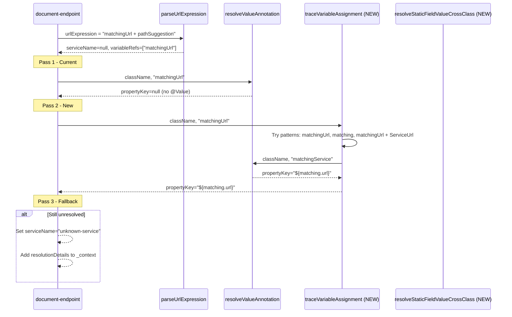

# Unresolved Service URLs — Implementation Plan

**Type:** Bug / Enhancement
**Risk:** MEDIUM
**Work Item:** `gitnexus/docs/bug/unresolved-service-urls.md`

## Understanding

The `document-endpoint` tool shows `unknown-service` for 7 external APIs when service URLs are constructed via inline concatenation (e.g., `String url = matchingUrl + pathSuggestion`). The current resolution logic only traces `@Value` annotations and `static final` fields in the same class, missing variable assignments and cross-class constants.

## Root Cause

`extractDownstreamApis()` resolves service names via `@Value` annotations and same-class `static final` fields, but does **not trace local variable assignments** back to their source field declarations. When developers use inline concatenation, the captured `urlExpression` contains the local variable name, not the underlying field reference.

## Solution: Multi-Pass Resolution

```
Pass 1: Current resolution (@Value + same-class static final) → ~70%
Pass 2: Variable trace (heuristics + cross-class constants) → +20%
Pass 3: Context enrichment (fallback for manual/AI review) → remaining 10%
```

## Diagram



## Cross-Stack Checklist

- [x] Backend changes? Yes — `document-endpoint.ts` resolution logic
- [x] Frontend changes? No — transparent to callers
- [x] Contract mismatches? No — `DownstreamApi` type unchanged
- [x] Deployment order? Safe sequential: WI-1/2 → WI-3 → WI-4

## Work Items

### WI-1: Add `traceVariableAssignment()` function [P0]

**Spec:** `gitnexus/src/mcp/local/document-endpoint.ts`
**What:** Add new function that tries variable name patterns to find `@Value` annotations
**Reuse:** Existing `resolveValueAnnotation()` graph query

**Behavior:**
- Input: `executeQuery`, `repoId`, `className`, `variableName`
- Tries patterns in order: exact match, strip suffix, add suffix
- Returns: `{ propertyKey, rawValue, fieldName }`

**Invariants:**
- Must not modify existing resolution (Pass 1)
- Must return `null` if no match found (fallback to `unknown-service`)

**Tests:**
- Level: Unit
- Technique: Equivalence Partitioning
- Cases: exact match, suffix strip, suffix add, no match
- File: `test/unit/document-endpoint.test.ts`

**Files:** `src/mcp/local/document-endpoint.ts`

---

### WI-2: Extend `resolveStaticFieldValue()` for cross-class [P0]

**Spec:** `gitnexus/src/mcp/local/document-endpoint.ts`
**What:** Add function to search for static final fields across all classes
**Reuse:** Existing `resolveStaticFieldValue()` for same-class lookup

**Behavior:**
- Input: `executeQuery`, `repoId`, `enclosingClassName`, `fieldName`
- First tries same class (existing behavior)
- If not found, queries all classes for matching static final field
- Prefers URL-like values when multiple matches exist

**Invariants:**
- Same-class resolution takes priority (backward compatibility)
- Cross-class only used as fallback

**Tests:**
- Level: Unit
- Technique: Equivalence Partitioning
- Cases: same-class found, cross-class found, both found, none found
- File: `test/unit/document-endpoint.test.ts`

**Files:** `src/mcp/local/document-endpoint.ts`

---

### WI-3: Integrate multi-pass into `extractDownstreamApis()` [P0]

**Spec:** `gitnexus/src/mcp/local/document-endpoint.ts`
**What:** Enhance `extractDownstreamApis()` to use Pass 2 and Pass 3

**Behavior:**
- After Pass 1 fails, iterate `parsed.variableRefs` and call `traceVariableAssignment()`
- For path constants, call `resolveStaticFieldValueCrossClass()`
- For still-unresolved, enhance `_context` with resolution attempt details

**Invariants:**
- Pass 1 unchanged (backward compatibility)
- Pass 2/3 are additive fallbacks

**Tests:**
- Level: Integration
- Technique: State Transition
- Cases: Pass 1 success, Pass 2 success, Pass 3 fallback, unknown-service
- File: `test/integration/document-endpoint.test.ts`

**Files:** `src/mcp/local/document-endpoint.ts`

---

### WI-4: Add resolution metrics [P2]

**Spec:** `gitnexus/src/mcp/local/document-endpoint.ts`
**What:** Add optional telemetry for resolution success rates
**Reuse:** None — new metrics

**Behavior:**
- Track counts: pass1_success, pass2_success, pass3_success, unknown
- Emit via optional callback (no-op if not provided)

**Tests:**
- Level: Unit
- Technique: Boundary Value Analysis
- Cases: all resolved, all unknown, mixed results
- File: `test/unit/document-endpoint.test.ts`

**Files:** `src/mcp/local/document-endpoint.ts`

## Behavioral Contracts

### Backend → Frontend

| Backend guarantees | Frontend expects |
|--------------------|-------------------|
| `serviceName` resolved or `unknown-service` | Fallback rendering works |
| `_context` includes resolution attempts | Debug info available |
| `resolutionDetails` populated when `include_context=true` | Enhanced debugging |

## Acceptance Criteria

- [ ] Given `matchingUrl + pathSuggestion` pattern, when trace runs, then service resolved to `${matching.url}`
- [ ] Given cross-class `PROFILE_URL` constant, when resolution runs, then value found in declaring class
- [ ] Given unresolved variable, when Pass 3 runs, then `_context` contains resolution attempt details
- [ ] Given existing `@Value` resolution, when multi-pass runs, then Pass 1 behavior unchanged
- [ ] Regression suite green: `npm run test:unit`
- [ ] E2E test: `document-endpoint` for PUT /e/v1/bookings/{productCode}/suggest resolves ≥5/7 services

## Verification

```bash
# Run unit tests
npm run test:unit

# E2E verification
node dist/cli/index.js document-endpoint \
  --method PUT \
  --path "/e/v1/bookings/{productCode}/suggest" \
  --repo tcbs-bond-trading \
  --include-context > test-output.json

# Check resolution count
cat test-output.json | jq '[.externalDependencies.downstreamApis[] | select(.serviceName != "unknown-service")] | length'
# Expect: ≥5 (up from 4)
```